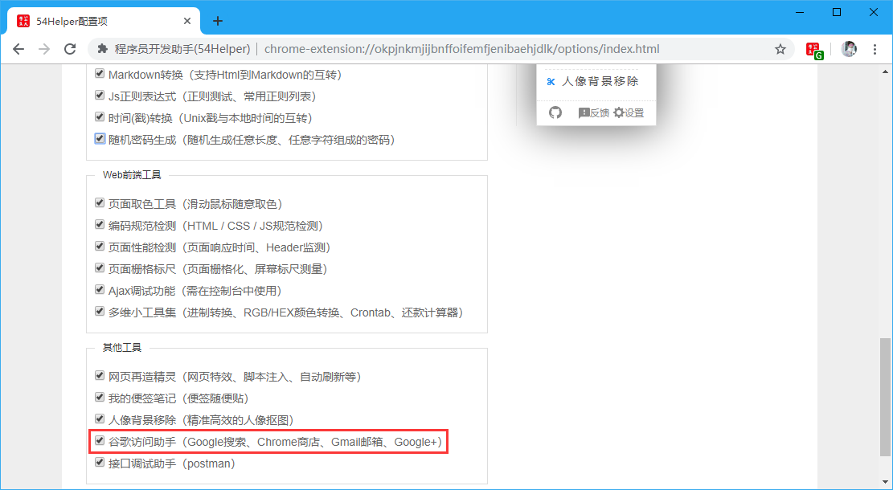
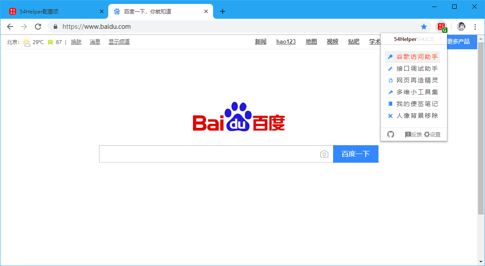
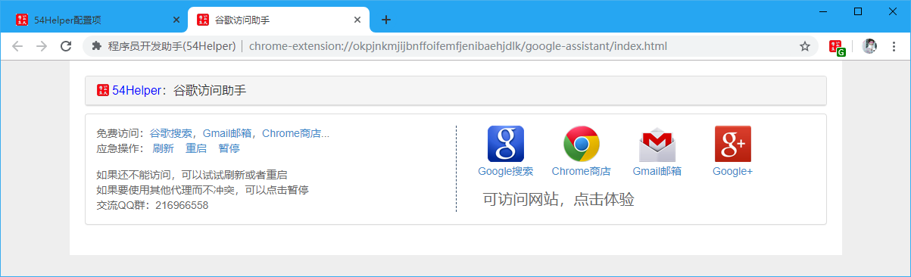
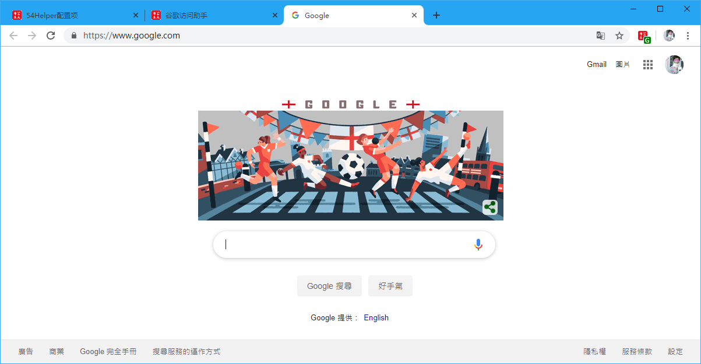
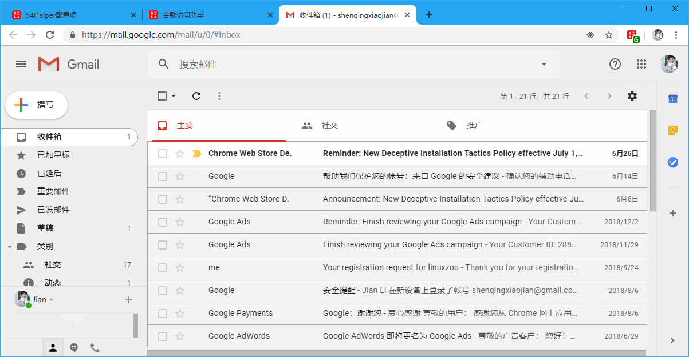
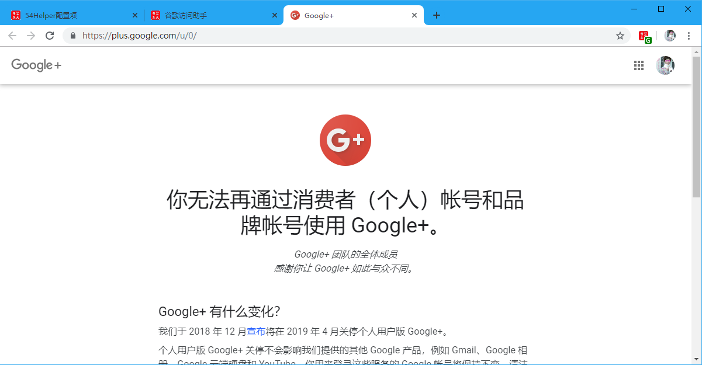

# 一、简介
1、`谷歌访问助手`是一个特殊版本的VPN，因为他不同于市面上的全网通VPN，他设定了可访问的目标网站  
2、`谷歌访问助手`旨在访问谷歌提供的相关服务，其他非中国🇨🇳官方允许的网站，一律不给予提供访问服务  
3、`谷歌访问助手`目前可以访问的谷歌服务有`Google搜索`、`Chrome商店`、`Gmail邮箱`、`Google+`  
4、`谷歌访问助手`提供访问的服务，只要符合规则(`*.google.com`)都可访问  

# 二、配置
## 2.1、popup菜单配置
在设置界面，** 配置功能菜单 **  
1、勾选“谷歌访问助手”  
2、popup菜单将出现“谷歌访问助手”  

👆配置功能菜单-谷歌访问助手开启

# 三、使用
## 3.1、开箱即用
1、点击“工具栏54Helper的popup”->“popup弹出”->“谷歌访问助手”->跳转至`谷歌访问助手`页面  

👆谷歌访问助手的使用-popup菜单

## 3.2、功能演示说明  
谷歌访问助手简单示例如下  

操作步骤：  
> 1、助手设置界面开启后默认会自动连接VPN，小图标显示`绿色G`代表连接成功，小图标显示`红色G`代表掉线  
> 2、当出现`红色G`掉线时，可以通过popup页面进入到`谷歌访问助手`点击`刷新`、`重启`、`暂停`、`启动`等按钮进行操作  
> 3、连接成功时，可以点击  `Google搜索`、`Chrome商店`、`Gmail邮箱`、`Google+` 图标按钮进入到相应功能页面  

👆谷歌访问助手-设置页面

👆谷歌访问助手-Google搜索

👆谷歌访问助手-Chrome商店

👆谷歌访问助手-Gmail邮箱

👆谷歌访问助手-Google+
