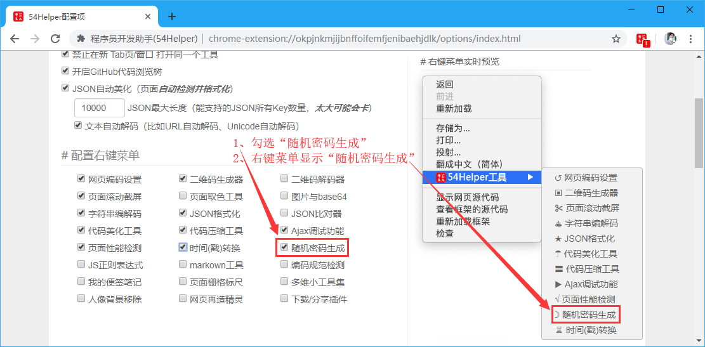
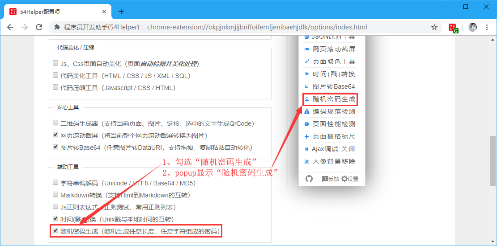
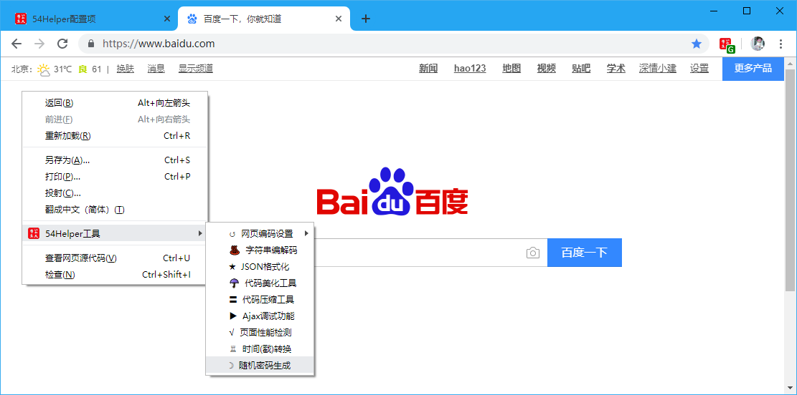
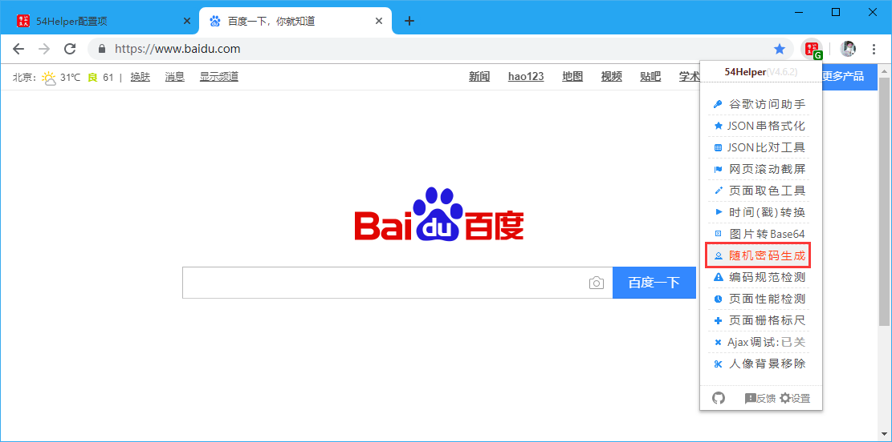
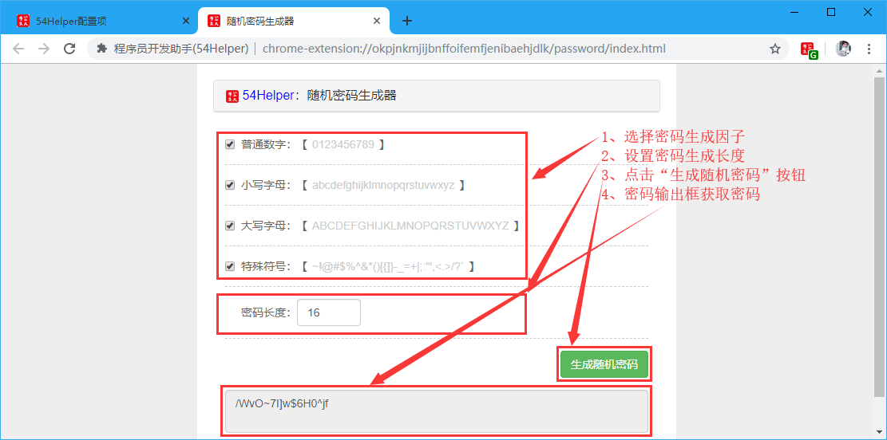

# 一、简介
1、本工具可以生成随机🔀密码  
2、可以指定生成密码的因子，密码因子有“普通数字🔢”、“小写字母🔠”、“大写字母🔠”、“特殊字符”  
3、可以指定生成密码的长度(1-无穷大)  
其中密码因子分别包含字符如下所示：  
- 普通数字：【0123456789】
- 小写字母：【abcdefghijklmnopqrstuvwxyz】
- 大写字母：【ABCDEFGHIJKLMNOPQRSTUVWXYZ】
- 特殊字符：【~!@#$%^&*()[{]}-_=+|;:'",<.>/?`】

# 二、配置
## 2.1、右键菜单配置
在设置界面，** 配置右键菜单 **  
1、勾选“随机密码生成”  
2、右键菜单将显示“随机密码生成”  

👆配置右键菜单-随机密码生成开启

## 2.2、popup菜单配置
在设置界面，** 配置功能菜单 **  
1、勾选“随机密码生成”  
2、popup菜单将出现“随机密码生成”  

👆配置功能菜单-随机密码生成开启

# 三、使用
## 3.1、开箱即用
1、点击“鼠标右键”->“54Helper工具”->“随机密码生成”->跳转至“随机密码生成”页面  

👆随机密码生成的使用-右键菜单

2、点击“工具栏54Helper的popup”->“popup弹出”->“随机密码生成”->跳转至“随机密码生成”页面  

👆随机密码生成的使用-popup菜单

## 3.2、功能演示说明  
随机密码生成简单示例如下  
操作步骤：  
> 1、选择密码生成因子  
> 2、设置密码生成长度  
> 3、点击“生成随机密码”按钮  
> 4、密码输出框获取密码  

👆随机密码生成
