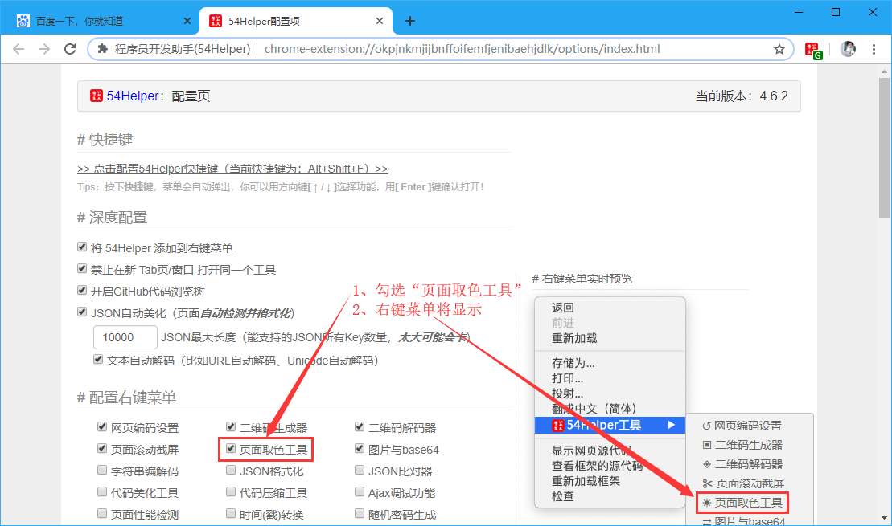
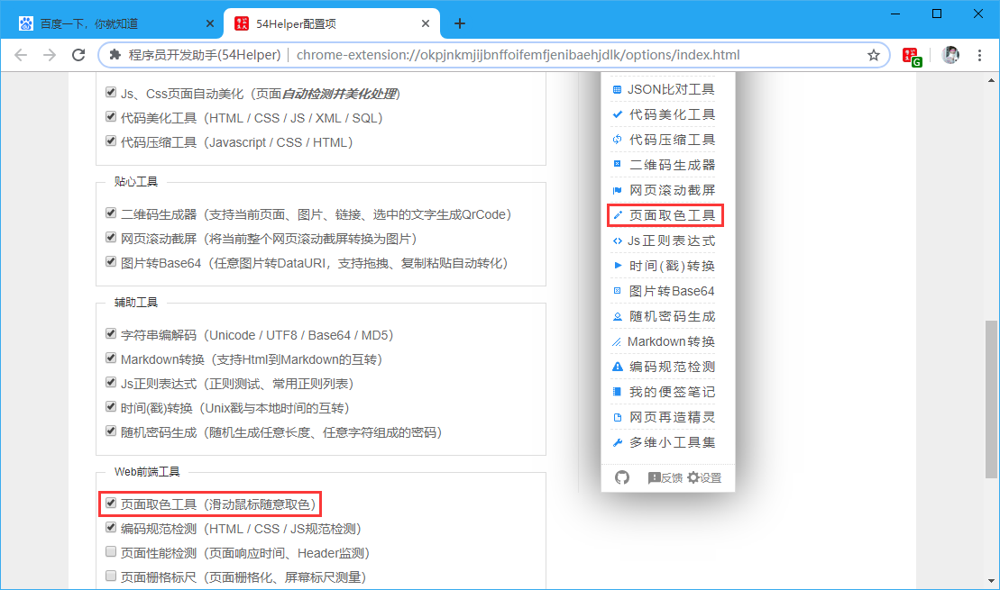
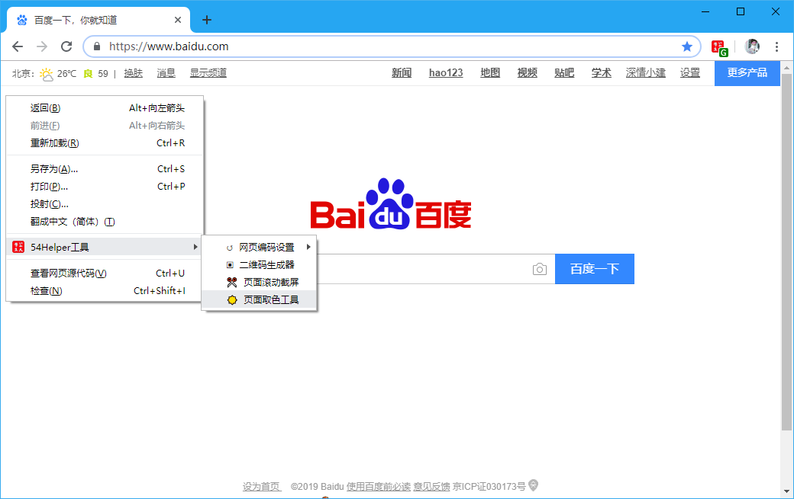
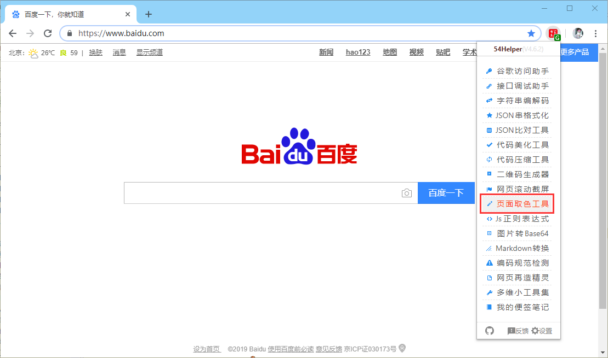
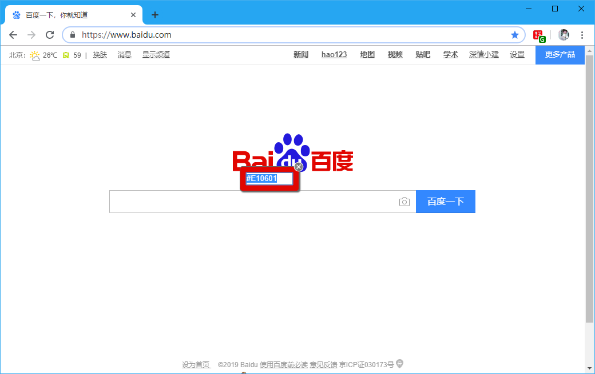

# 一、简介
1、当想对网页中的某个“目标色块”取色时，点开“页面取色工具”即可移动取色光标至“目标色块”进行取色  
2、取色后，浮动方框中会有获取到的十六进制色值，该十六进制色值即为获取到的“目标色块”色值  

# 二、配置
## 2.1、右键菜单配置
在设置界面，** 配置右键菜单 **  
1、勾选“页面取色工具”  
2、右键菜单将显示“页面取色工具”

👆配置右键菜单-页面取色工具开启

## 2.2、popup菜单配置
在设置界面，** 配置功能菜单 **  
1、勾选“页面取色工具”  
2、popup菜单将出现“页面取色工具”  
3、点击popup菜单中的“页面取色工具”将出现“页面取色工具”浮框  

👆配置功能菜单-页面取色工具开启

# 三、使用
## 3.1、开箱即用
1、目标网页中点击“鼠标右键”->“54Helper工具”->“页面取色工具”->取色浮框出现  

👆页面取色工具的使用-右键菜单

2、目标网页中点击“工具栏54Helper的popup”->“popup弹出”->“页面取色工具”->取色浮框出现  

👆页面取色工具的使用-popup菜单

👆页面取色工具的使用-取色框

