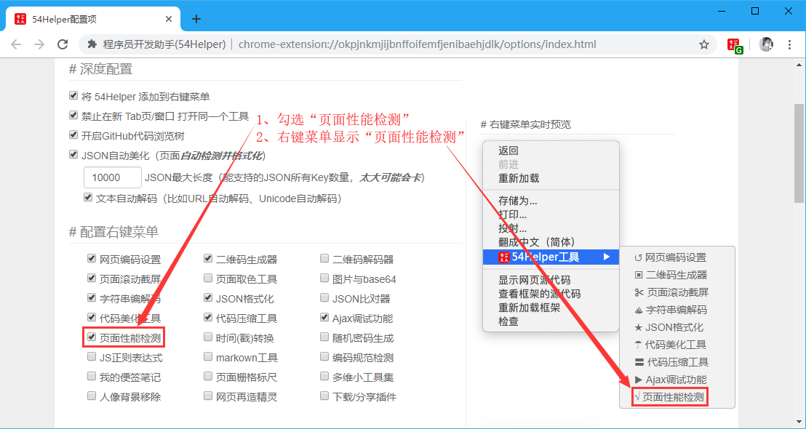
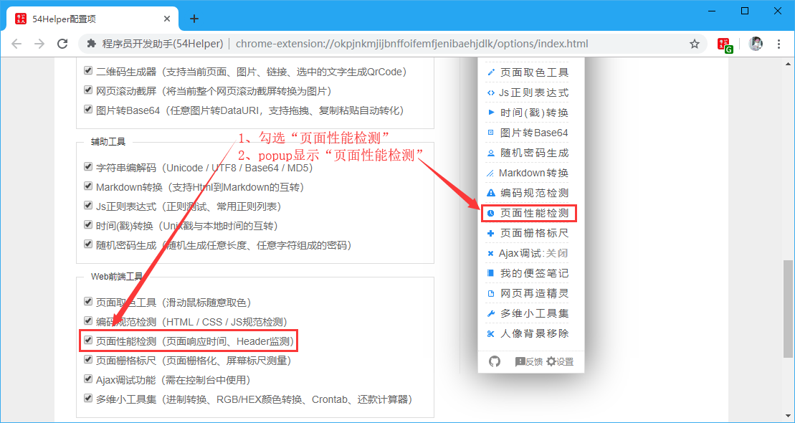
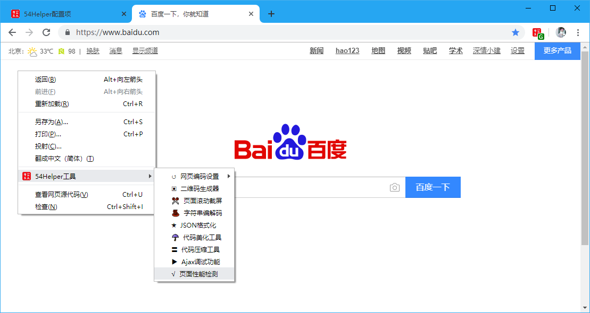
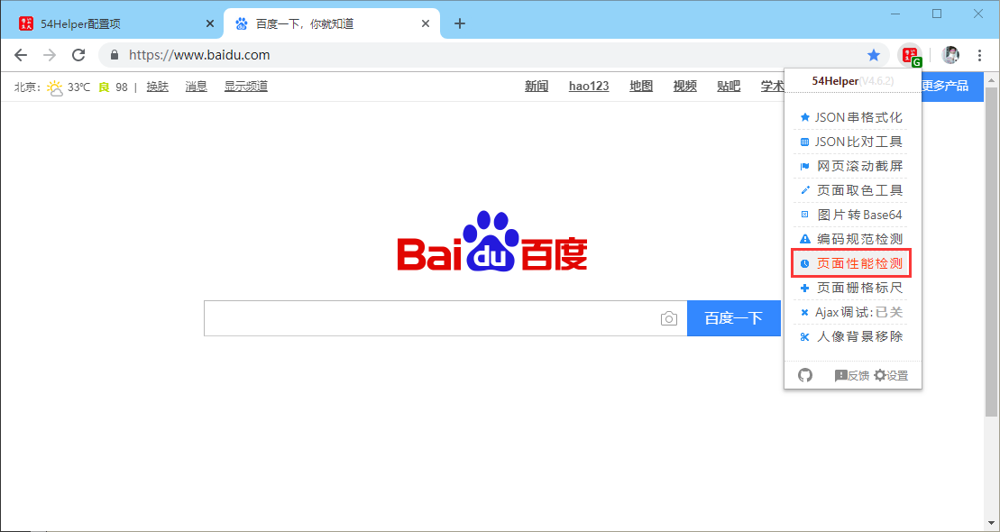
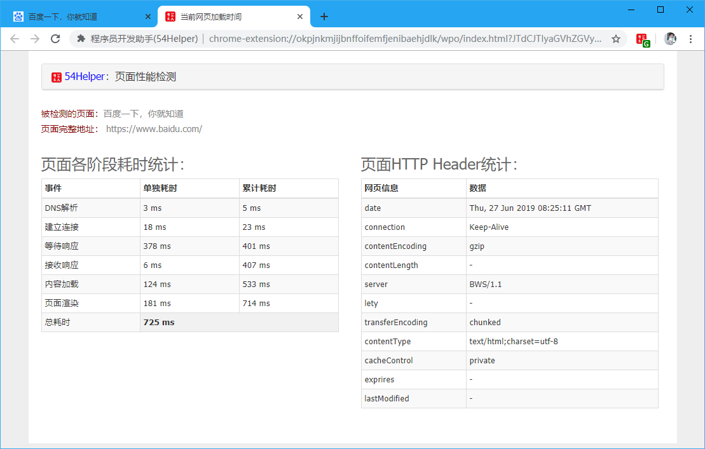

# 一、简介
1、本工具可以简单评估一个网页性能  
2、页面各阶段耗时统计  

事件 | 单独耗时 | 累计耗时
---|---|---
DNS解析 | 2ms | 6ms
建立连接 | 22ms | 30ms
等待响应 | 459ms | 489ms
接收响应 | 6ms | 495ms
内容加载 | 122ms | 616ms
页面渲染 | 154ms | 770ms
总耗时 | 772ms  | 

3、页面HTTP Header统计

网页信息 | 数据
---|---
date | Thu, 27 Jun 2019 09:12:34 GMT
connection | Keep-Alive
contentEncoding | gzip
contentLength | -
server | BWS/1.1
lety | -
transferEncoding | chunked
contentType | text/html;charset=utf-8
cacheControl | private
exprires | -
lastModified | -

# 二、配置
## 2.1、右键菜单配置
在设置界面，** 配置右键菜单 **  
1、勾选“页面性能检测功能”  
2、右键菜单将显示“页面性能检测功能”  

👆配置右键菜单-页面性能检测功能开启

## 2.2、popup菜单配置
在设置界面，** 配置功能菜单 **  
1、勾选“页面性能检测功能”  
2、popup菜单将出现“页面性能检测功能”  

👆配置功能菜单-页面性能检测功能开启

# 三、使用
## 3.1、开箱即用
1、在目标页面点击“鼠标右键”->“54Helper工具”->“页面性能检测”->跳转至“页面性能检测”页面  

👆页面性能检测功能的使用-右键菜单

2、在目标页面点击“工具栏54Helper的popup”->“popup弹出”->“页面性能检测”->跳转至“页面性能检测”页面  

👆页面性能检测功能的使用-popup菜单

3、功能演示说明  
页面性能检测简单示例如下  

👆页面性能检测

