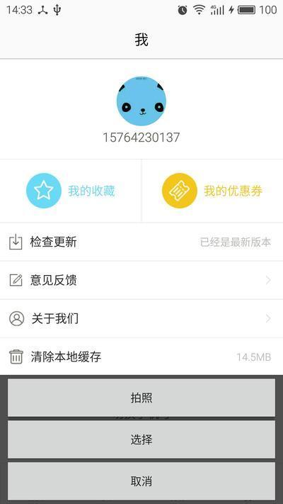
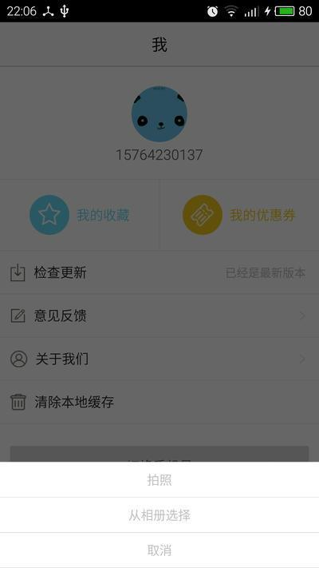

## 从底部弹出的选择框





## 使用popupWindow完成:

### 定义popupWindow类

```Java
/**
 * 选择照片的PopupWindow
 * Created by chenlijin on 2016/4/12.
 */
public class SelectPicPopupWindow extends PopupWindow implements View.OnTouchListener, View.OnKeyListener {
    private Context mContext;
    private View rootView;

    public SelectPicPopupWindow(Context context) {
        mContext = context;
        LayoutInflater inflater = LayoutInflater.from(context);
        rootView = inflater.inflate(R.layout.popupwindow_selectpic, null);
        setContentView(rootView);
        ButterKnife.bind(this, rootView);
        //设置高度和宽度。
        this.setHeight(ViewGroup.LayoutParams.WRAP_CONTENT);
        this.setWidth(ViewGroup.LayoutParams.MATCH_PARENT);
        this.setFocusable(true);

        //设置动画效果
        this.setAnimationStyle(R.style.mypopwindow_anim_style);

        //当单击Back键或者其他地方使其消失、需要设置这个属性。
        rootView.setOnTouchListener(this);
        rootView.setOnKeyListener(this);
        rootView.setFocusable(true);
        rootView.setFocusableInTouchMode(true);

        //实例化一个ColorDrawable颜色为半透明
        ColorDrawable dw = new ColorDrawable(0xb0000000);
        //设置SelectPicPopupWindow弹出窗体的背景
        this.setBackgroundDrawable(dw);
    }


    //点击外部popup消失
    @Override
    public boolean onTouch(View v, MotionEvent event) {
        int height = rootView.findViewById(R.id.linearlayout_window).getTop();
        int y = (int) event.getY();
        if (event.getAction() == MotionEvent.ACTION_UP) {
            if (y < height) {
                dismiss();
            }
        }
        return true;
    }

    //点back键消失
    @Override
    public boolean onKey(View v, int keyCode, KeyEvent event) {
        if (keyCode == KeyEvent.KEYCODE_BACK && this.isShowing()) {
            this.dismiss();
            return true;
        }
        return false;
    }


    @OnClick({R.id.button_take_photo, R.id.button_select_pic, R.id.button_cancal})
    public void onClick(View view) {
        switch (view.getId()) {
            case R.id.button_take_photo:
                listener.onClickTakePhoto();
                this.dismiss();
                break;
            case R.id.button_select_pic:
                listener.onClickSelectPic();
                this.dismiss();
                break;
            case R.id.button_cancal:
                this.dismiss();
                break;
        }
    }

    private OnWindowItemClickListener listener;

    public void setOnWindowItemClickListener(OnWindowItemClickListener listener) {
        this.listener = listener;
    }

    public interface OnWindowItemClickListener {
        void onClickTakePhoto();

        void onClickSelectPic();
    }
}
```

### 自定义Style

```xml
<style name="MyPopup" parent="android:style/Theme.Dialog">
        <item name="android:windowFrame">@null</item>
        <item name="android:windowNoTitle">true</item>
        <item name="android:windowBackground">@color/popup</item>
        <item name="android:windowIsFloating">true</item>
        <item name="android:windowContentOverlay">@null</item>
    </style>
```

### 定义进入和退出的动画:

```xml
进入:
<?xml version="1.0" encoding="utf-8"?>
<set xmlns:android="http://schemas.android.com/apk/res/android">
    <translate 
        android:duration="200"
        android:fromYDelta="100.0%"
        android:toYDelta="0.0"/>
</set>
退出
<?xml version="1.0" encoding="utf-8"?>
<set xmlns:android="http://schemas.android.com/apk/res/android">
    <translate 
        android:duration="200"
        android:fromYDelta="0.0"
        android:toYDelta="100.0%"/>
</set>
动画的style
<style name="mypopwindow_anim_style">
        <item name="android:windowEnterAnimation">@anim/popup_in</item>
        <!-- 指定显示的动画xml -->
        <item name="android:windowExitAnimation">@anim/popup_out</item>
        <!-- 指定消失的动画xml -->
    </style>
```

在指定的位置显示

```java
//显示窗口  
window.showAtLocation(MainActivity.this.findViewById(R.id.main), Gravity.BOTTOM|Gravity.CENTER_HORIZONTAL, 0, 0); //设置layout在PopupWindow中显示的位置
```

## 使用Dialog完成:

### 定义style

```Xml
<!--自定义布局的dialog-->
    <style name="MyDialog" parent="android:style/Theme.Dialog">
        <!-- 背景颜色及透明程度 -->
        <item name="android:windowBackground">@android:color/transparent</item>
        <!-- 是否有标题 -->
        <item name="android:windowNoTitle">true</item>
        <!-- 是否浮现在activity之上,会造成macth_parent失效-->
        <item name="android:windowIsFloating">false</item>
        <!-- 是否模糊 -->
        <item name="android:backgroundDimEnabled">true</item>
        <item name="android:windowFrame">@null</item>
    </style>
```

### 动画: 和popupwindow一致

### 自定义Dialog:

```java
/**
 * 选择图片对话框
 * Created by chenlijin on 2016/4/12.
 */
public class SelectPicDialog extends Dialog {
    public SelectPicDialog(Context context, int themeResId) {
        super(context, themeResId);
    }

    @Override
    protected void onCreate(Bundle savedInstanceState) {
        super.onCreate(savedInstanceState);
        setContentView(R.layout.dialog_select_pic);
        ButterKnife.bind(this);

    }

    @OnClick({R.id.linearlayout_out,R.id.textview_take_photo, R.id.textview_select_photo, R.id.textview_cancal})
    public void onClick(View view) {
        switch (view.getId()) {
            case R.id.textview_take_photo:
                if(listener!=null){
                    listener.onClickTakePhoto();
                }
                this.cancel();
                break;
            case R.id.textview_select_photo:
                if(listener!=null){
                    listener.onClickSelectPic();
                }
                this.cancel();
                break;
            case R.id.linearlayout_out:
            case R.id.textview_cancal:
                this.cancel();
                break;
        }
    }

    private OnWindowItemClickListener listener;

    public void setOnWindowItemClickListener(OnWindowItemClickListener listener) {
        this.listener = listener;
    }

    public interface OnWindowItemClickListener {
        void onClickTakePhoto();
        void onClickSelectPic();
    }
}
```

### 在Activity中调用:

```java
SelectPicDialog dialog = new SelectPicDialog(mContext,R.style.MyDialog);
        Window window = dialog.getWindow();
        window.setGravity(Gravity.BOTTOM);  //此处可以设置dialog显示的位置
        window.setWindowAnimations(R.style.mypopwindow_anim_style);  //添加动画
        dialog.show();
        dialog.setOnWindowItemClickListener(new SelectPicDialog.OnWindowItemClickListener(){

            @Override
            public void onClickTakePhoto() {
                startActivityForResult(createCameraIntent(), CREATE_CAMERA);   //选择拍照
            }

            @Override
            public void onClickSelectPic() {
                startActivityForResult(createPickIntent(), CREATE_PICK);   //选择启用系统的选择图片
            }
        });
```

## 详细的区别

（1）Popupwindow在显示之前一定要设置宽高，Dialog无此限制。

（2）Popupwindow默认不会响应物理键盘的back，除非显示设置了popup.setFocusable(true);而在点击back的时候，Dialog会消失。

（3）Popupwindow不会给页面其他的部分添加蒙层，而Dialog会。

（4）Popupwindow没有标题，Dialog默认有标题，可以通过dialog.requestWindowFeature(Window.FEATURE_NO_TITLE);取消标题

（5）二者显示的时候都要设置Gravity。如果不设置，Dialog默认是Gravity.CENTER。

（6）二者都有默认的背景，都可以通过setBackgroundDrawable(new ColorDrawable(android.R.color.transparent));去掉。

其中最本质的差别就是：AlertDialog是非阻塞式对话框：AlertDialog弹出时，后台还可以做事情；而PopupWindow是阻塞式对话框：PopupWindow弹出时，程序会等待，在PopupWindow退出前，程序一直等待，只有当我们调用了dismiss方法的后，PopupWindow退出，程序才会向下执行。这两种区别的表现是：AlertDialog弹出时，背景是黑色的，但是当我们点击背景，AlertDialog会消失，证明程序不仅响应AlertDialog的操作，还响应其他操作，其他程序没有被阻塞，这说明了AlertDialog是非阻塞式对话框；PopupWindow弹出时，背景没有什么变化，但是当我们点击背景的时候，程序没有响应，只允许我们操作PopupWindow，其他操作被阻塞。

**注意：** 这里讲的阻塞并非线程阻塞，而是阻塞了其他UI操作，详情见：[PopupWindow的"阻塞"问题](http://www.cnblogs.com/zhengxiaoyao0716/p/5914934.html)