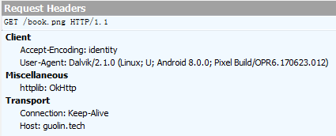

不知不觉中，我们的Glide系列教程已经到了第六篇了，距离第一篇Glide的基本用法发布已经过去了半年的时间。在这半年中，我们通过用法讲解和源码分析配合学习的方式，将Glide的方方面面都研究了个遍，相信一直能看到这里的朋友现在已经是一位Glide高手了。

整个Glide系列预计总共会有八篇文章，现在也是逐步进入尾声了。不过，越是到后面，我们探究的内容也越是更加深入。那么今天，我们就来一起探究一下Glide中一个比较深入，但同时也是非常重要的一个功能——自定义模块。


## 自定义模块的基本用法
学到这里相信你已经知道，Glide的用法是非常非常简单的，大多数情况下，我们想要实现的图片加载效果只需要一行代码就能解决了。但是Glide过于简洁的API也造成了一个问题，就是如果我们想要更改Glide的某些默认配置项应该怎么操作呢？很难想象如何将更改Glide配置项的操作串联到一行经典的Glide图片加载语句中当中吧？没错，这个时候就需要用到自定义模块功能了。

自定义模块功能可以将更改Glide配置，替换Glide组件等操作独立出来，使得我们能轻松地对Glide的各种配置进行自定义，并且又和Glide的图片加载逻辑没有任何交集，这也是一种低耦合编程方式的体现。那么接下来我们就学习一下自定义模块的基本用法。

首先需要定义一个我们自己的模块类，并让它实现GlideModule接口，如下所示：
```java
public class MyGlideModule implements GlideModule {
    @Override
    public void applyOptions(Context context, GlideBuilder builder) {
    }

    @Override
    public void registerComponents(Context context, Glide glide) {
    }
}
```

可以看到，在MyGlideModule类当中，我们重写了applyOptions()和registerComponents()方法，这两个方法分别就是用来更改Glide和配置以及替换Glide组件的。我们待会儿只需要在这两个方法中加入具体的逻辑，就能实现更改Glide配置或者替换Glide组件的功能了。

不过，目前Glide还无法识别我们自定义的MyGlideModule，如果想要让它生效，还得在AndroidManifest.xml文件当中加入如下配置才行：
```xml
<manifest>

    ...

    <application>

        <meta-data
            android:name="com.example.glidetest.MyGlideModule"
            android:value="GlideModule" />

        ...

    </application>
</manifest>  
```
在<application>标签中加入一个meta-data配置项，其中android:name指定成我们自定义的MyGlideModule的完整路径，android:value必须指定成GlideModule，这个是固定值。

这样的话，我们就将Glide自定义模块的功能完成了，是不是非常简单？现在Glide已经能够识别我们自定义的这个MyGlideModule了，但是在编写具体的功能之前，我们还是按照老规矩阅读一下源码，从源码的层面上来分析一下，Glide到底是如何识别出这个自定义的MyGlideModule的。


## 自定义模块的原理
这里我不会带着大家从Glide代码执行的第一步一行行重头去解析Glide的源码，而是只分析和自定义模块相关的部分。如果你想将Glide的源码通读一遍的话，可以去看本系列的第二篇文章 [Android图片加载框架最全解析（二），从源码的角度理解Glide的执行流程](Glide-2.html) 。

显然我们已经用惯了`Glide.with(context).load(url).into(imageView)`这样一行简洁的Glide图片加载语句，但是我们好像从来没有注意过Glide这个类本身的实例。然而事实上，Glide类确实是有创建实例的，只不过是在内部由Glide自动帮我们创建和管理了，对于开发者而言，大多数情况下是不用关心它的，只需要调用它的静态方法就可以了。

那么Glide的实例到底是在哪里创建的呢？我们来看下Glide类中的get()方法的源码，如下所示：
```java
public class Glide {

    private static volatile Glide glide;

    ...

    public static Glide get(Context context) {
        if (glide == null) {
            synchronized (Glide.class) {
                if (glide == null) {
                    Context applicationContext = context.getApplicationContext();
                    List<GlideModule> modules = new ManifestParser(applicationContext).parse();
                    GlideBuilder builder = new GlideBuilder(applicationContext);
                    for (GlideModule module : modules) {
                        module.applyOptions(applicationContext, builder);
                    }
                    glide = builder.createGlide();
                    for (GlideModule module : modules) {
                        module.registerComponents(applicationContext, glide);
                    }
                }
            }
        }
        return glide;
    }

    ...
}
```

我们来仔细看一下上面这段代码。首先这里使用了一个单例模式来获取Glide对象的实例，可以看到，这是一个非常典型的双重锁模式。然后在第12行，调用ManifestParser的parse()方法去解析AndroidManifest.xml文件中的配置，实际上就是将AndroidManifest中所有值为GlideModule的meta-data配置读取出来，并将相应的自定义模块实例化。由于你可以自定义任意多个模块，因此这里我们将会得到一个GlideModule的List集合。

接下来在第13行创建了一个GlideBuilder对象，并通过一个循环调用了每一个GlideModule的applyOptions()方法，同时也把GlideBuilder对象作为参数传入到这个方法中。而applyOptions()方法就是我们可以加入自己的逻辑的地方了，虽然目前为止我们还没有编写任何逻辑。

再往下的一步就非常关键了，这里调用了GlideBuilder的createGlide()方法，并返回了一个Glide对象。也就是说，Glide对象的实例就是在这里创建的了，那么我们跟到这个方法当中瞧一瞧：
```java
public class GlideBuilder {
    private final Context context;

    private Engine engine;
    private BitmapPool bitmapPool;
    private MemoryCache memoryCache;
    private ExecutorService sourceService;
    private ExecutorService diskCacheService;
    private DecodeFormat decodeFormat;
    private DiskCache.Factory diskCacheFactory;

    ...

    Glide createGlide() {
        if (sourceService == null) {
            final int cores = Math.max(1, Runtime.getRuntime().availableProcessors());
            sourceService = new FifoPriorityThreadPoolExecutor(cores);
        }
        if (diskCacheService == null) {
            diskCacheService = new FifoPriorityThreadPoolExecutor(1);
        }
        MemorySizeCalculator calculator = new MemorySizeCalculator(context);
        if (bitmapPool == null) {
            if (Build.VERSION.SDK_INT >= Build.VERSION_CODES.HONEYCOMB) {
                int size = calculator.getBitmapPoolSize();
                bitmapPool = new LruBitmapPool(size);
            } else {
                bitmapPool = new BitmapPoolAdapter();
            }
        }
        if (memoryCache == null) {
            memoryCache = new LruResourceCache(calculator.getMemoryCacheSize());
        }
        if (diskCacheFactory == null) {
            diskCacheFactory = new InternalCacheDiskCacheFactory(context);
        }
        if (engine == null) {
            engine = new Engine(memoryCache, diskCacheFactory, diskCacheService, sourceService);
        }
        if (decodeFormat == null) {
            decodeFormat = DecodeFormat.DEFAULT;
        }
        return new Glide(engine, memoryCache, bitmapPool, context, decodeFormat);
    }
}
```

这个方法中会创建BitmapPool、MemoryCache、DiskCache、DecodeFormat等对象的实例，并在最后一行创建一个Glide对象的实例，然后将前面创建的这些实例传入到Glide对象当中，以供后续的图片加载操作使用。

但是大家有没有注意到一个细节，createGlide()方法中创建任何对象的时候都做了一个空检查，只有在对象为空的时候才会去创建它的实例。也就是说，如果我们可以在applyOptions()方法中提前就给这些对象初始化并赋值，那么在createGlide()方法中就不会再去重新创建它们的实例了，从而也就实现了更改Glide配置的功能。关于这个功能我们待会儿会进行具体的演示。

现在继续回到Glide的get()方法中，得到了Glide对象的实例之后，接下来又通过一个循环调用了每一个GlideModule的registerComponents()方法，在这里我们可以加入替换Glide的组件的逻辑。

好了，这就是Glide自定义模块的全部工作原理。了解了它的工作原理之后，接下来所有的问题就集中在我们到底如何在applyOptions()和registerComponents()这两个方法中加入具体的逻辑了，下面我们马上就来学习一下。

## 更改Glide配置
刚才在分析自定义模式工作原理的时候其实就已经提到了，如果想要更改Glide的默认配置，其实只需要在applyOptions()方法中提前将Glide的配置项进行初始化就可以了。那么Glide一共有哪些配置项呢？这里我给大家做了一个列举：

- setMemoryCache()
用于配置Glide的内存缓存策略，默认配置是LruResourceCache。

- setBitmapPool()
用于配置Glide的Bitmap缓存池，默认配置是LruBitmapPool。

- setDiskCache()
用于配置Glide的硬盘缓存策略，默认配置是InternalCacheDiskCacheFactory。

- setDiskCacheService()
用于配置Glide读取缓存中图片的异步执行器，默认配置是FifoPriorityThreadPoolExecutor，也就是先入先出原则。

- setResizeService()
用于配置Glide读取非缓存中图片的异步执行器，默认配置也是FifoPriorityThreadPoolExecutor。

- setDecodeFormat()
用于配置Glide加载图片的解码模式，默认配置是RGB_565。

其实Glide的这些默认配置都非常科学且合理，使用的缓存算法也都是效率极高的，因此在绝大多数情况下我们并不需要去修改这些默认配置，这也是Glide用法能如此简洁的一个原因。

但是Glide科学的默认配置并不影响我们去学习自定义Glide模块的功能，因此总有某些情况下，默认的配置可能将无法满足你，这个时候就需要我们自己动手来修改默认配置了。

下面就通过具体的实例来看一下吧。刚才说到，Glide默认的硬盘缓存策略使用的是InternalCacheDiskCacheFactory，这种缓存会将所有Glide加载的图片都存储到当前应用的私有目录下。这是一种非常安全的做法，但同时这种做法也造成了一些不便，因为私有目录下即使是开发者自己也是无法查看的，如果我想要去验证一下图片到底有没有成功缓存下来，这就有点不太好办了。

这种情况下，就非常适合使用自定义模块来更改Glide的默认配置。我们完全可以自己去实现DiskCache.Factory接口来自定义一个硬盘缓存策略，不过却大大没有必要这么做，因为Glide本身就内置了一个ExternalCacheDiskCacheFactory，可以允许将加载的图片都缓存到SD卡。

那么接下来，我们就尝试使用这个ExternalCacheDiskCacheFactory来替换默认的InternalCacheDiskCacheFactory，从而将所有Glide加载的图片都缓存到SD卡上。

由于在前面我们已经创建好了一个自定义模块MyGlideModule，那么现在就可以直接在这里编写逻辑了，代码如下所示：
```java
public class MyGlideModule implements GlideModule {

    @Override
    public void applyOptions(Context context, GlideBuilder builder) {
        builder.setDiskCache(new ExternalCacheDiskCacheFactory(context));
    }

    @Override
    public void registerComponents(Context context, Glide glide) {

    }

}
```

没错，就是这么简单，现在所有Glide加载的图片都会缓存到SD卡上了。

另外，InternalCacheDiskCacheFactory和ExternalCacheDiskCacheFactory的默认硬盘缓存大小都是250M。也就是说，如果你的应用缓存的图片总大小超出了250M，那么Glide就会按照DiskLruCache算法的原则来清理缓存的图片。

当然，我们是可以对这个默认的缓存大小进行修改的，而且修改方式非常简单，如下所示：
```java
public class MyGlideModule implements GlideModule {

    public static final int DISK_CACHE_SIZE = 500 * 1024 * 1024;

    @Override
    public void applyOptions(Context context, GlideBuilder builder) {
        builder.setDiskCache(new ExternalCacheDiskCacheFactory(context, DISK_CACHE_SIZE));
    }

    @Override
    public void registerComponents(Context context, Glide glide) {

    }

}
```

只需要向ExternalCacheDiskCacheFactory或者InternalCacheDiskCacheFactory再传入一个参数就可以了，现在我们就将Glide硬盘缓存的大小调整成了500M。

好了，更改Glide配置的功能就是这么简单，那么接下来我们就来验证一下更改的配置到底有没有生效吧。

这里还是使用最基本的Glide加载语句来去加载一张网络图片：
```java
String url = "http://guolin.tech/book.png";
Glide.with(this)
     .load(url)
     .into(imageView);
```

运行一下程序，效果如下图所示：


OK，现在图片已经加载出现了，那么我们去找一找它的缓存吧。

ExternalCacheDiskCacheFactory的默认缓存路径是在`sdcard/Android/包名/cache/image_manager_disk_cache`目录当中，我们使用文件浏览器进入到这个目录，结果如下图所示。


可以看到，这里有两个文件，其中journal文件是DiskLruCache算法的日志文件，这个文件必不可少，且只会有一个。想了解更多关于DiskLruCache算法的朋友，可以去阅读我的这篇博客 [Android DiskLruCache完全解析，硬盘缓存的最佳方案](http://blog.csdn.net/guolin_blog/article/details/28863651) 。

而另外一个文件就是那张缓存的图片了，它的文件名虽然看上去很奇怪，但是我们只需要把这个文件的后缀改成.png，然后用图片浏览器打开，结果就一目了然了，如下图所示。


由此证明，我们已经成功将Glide的硬盘缓存路径修改到SD卡上了。

另外这里再提一点，我们都知道Glide和Picasso的用法是非常相似的，但是有一点差别却很大。Glide加载图片的默认格式是RGB_565，而Picasso加载图片的默认格式是ARGB_8888。ARGB_8888格式的图片效果会更加细腻，但是内存开销会比较大。而RGB_565格式的图片则更加节省内存，但是图片效果上会差一些。

Glide和Picasso各自采取的默认图片格式谈不上熟优熟劣，只能说各自的取舍不一样。但是如果你希望Glide也能使用ARGB_8888的图片格式，这当然也是可以的。我们只需要在MyGlideModule中更改一下默认配置即可，如下所示：
```java
public class MyGlideModule implements GlideModule {

    public static final int DISK_CACHE_SIZE = 500 * 1024 * 1024;

    @Override
    public void applyOptions(Context context, GlideBuilder builder) {
        builder.setDiskCache(new ExternalCacheDiskCacheFactory(context, DISK_CACHE_SIZE));
        builder.setDecodeFormat(DecodeFormat.PREFER_ARGB_8888);
    }

    @Override
    public void registerComponents(Context context, Glide glide) {

    }

}
```

通过这样配置之后，使用Glide加载的所有图片都将会使用ARGB_8888的格式，虽然图片质量变好了，但同时内存开销也会明显增大，所以你要做好心理准备哦。

好了，关于更改Glide配置的内容就介绍这么多，接下来就让我们进入到下一个非常重要的主题，替换Glide组件。


## 替换Glide组件
替换Glide组件功能需要在自定义模块的registerComponents()方法中加入具体的替换逻辑。相比于更改Glide配置，替换Glide组件这个功能的难度就明显大了不少。Glide中的组件非常繁多，也非常复杂，但其实大多数情况下并不需要我们去做什么替换。不过，有一个组件却有着比较大的替换需求，那就是Glide的HTTP通讯组件。

默认情况下，Glide使用的是基于原生HttpURLConnection进行订制的HTTP通讯组件，但是现在大多数的Android开发者都更喜欢使用OkHttp，因此将Glide中的HTTP通讯组件修改成OkHttp的这个需求比较常见，那么今天我们也会以这个功能来作为例子进行讲解。

首先来看一下Glide中目前有哪些组件吧，在Glide类的构造方法当中，如下所示：
```java
public class Glide {

    Glide(Engine engine, MemoryCache memoryCache, BitmapPool bitmapPool, Context context, DecodeFormat decodeFormat) {
        ...

        register(File.class, ParcelFileDescriptor.class, new FileDescriptorFileLoader.Factory());
        register(File.class, InputStream.class, new StreamFileLoader.Factory());
        register(int.class, ParcelFileDescriptor.class, new FileDescriptorResourceLoader.Factory());
        register(int.class, InputStream.class, new StreamResourceLoader.Factory());
        register(Integer.class, ParcelFileDescriptor.class, new FileDescriptorResourceLoader.Factory());
        register(Integer.class, InputStream.class, new StreamResourceLoader.Factory());
        register(String.class, ParcelFileDescriptor.class, new FileDescriptorStringLoader.Factory());
        register(String.class, InputStream.class, new StreamStringLoader.Factory());
        register(Uri.class, ParcelFileDescriptor.class, new FileDescriptorUriLoader.Factory());
        register(Uri.class, InputStream.class, new StreamUriLoader.Factory());
        register(URL.class, InputStream.class, new StreamUrlLoader.Factory());
        register(GlideUrl.class, InputStream.class, new HttpUrlGlideUrlLoader.Factory());
        register(byte[].class, InputStream.class, new StreamByteArrayLoader.Factory());

        ...
    }

}
```

可以看到，这里都是以调用register()方法的方式来注册一个组件，register()方法中传入的参数表示Glide支持使用哪种参数类型来加载图片，以及如何去处理这种类型的图片加载。举个例子：
```java
register(GlideUrl.class, InputStream.class, new HttpUrlGlideUrlLoader.Factory());
```

这句代码就表示，我们可以使用`Glide.with(context).load(new GlideUrl("url...")).into(imageView)`的方式来加载图片，而HttpUrlGlideUrlLoader.Factory则是要负责处理具体的网络通讯逻辑。如果我们想要将Glide的HTTP通讯组件替换成OkHttp的话，那么只需要在自定义模块当中重新注册一个GlideUrl类型的组件就行了。

说到这里有的朋友可能会疑问了，我们平时使用Glide加载图片时，大多数情况下都是直接将图片的URL字符串传入到load()方法当中的，很少会将它封装成GlideUrl对象之后再传入到load()方法当中，那为什么只需要重新注册一个GlideUrl类型的组件，而不需要去重新注册一个String类型的组件呢？其实道理很简单，因为load(String)方法只是Glide给我们提供一种简易的API封装而已，它的底层仍然还是调用的GlideUrl组件，因此我们在替换组件的时候只需要直接替换最底层的，这样就一步到位了。

那么接下来我们就开始学习到底如何将Glide的HTTP通讯组件替换成OkHttp。

首先第一步，不用多说，肯定是要先将OkHttp的库引入到当前项目中，如下所示：
```java
dependencies {
    compile 'com.squareup.okhttp3:okhttp:3.9.0'
}
```

然后接下来该怎么做呢？我们只要依葫芦画瓢就可以了。刚才不是说Glide的网络通讯逻辑是由HttpUrlGlideUrlLoader.Factory来负责的吗，那么我们就来看一下它的源码：
```java
public class HttpUrlGlideUrlLoader implements ModelLoader<GlideUrl, InputStream> {

    private final ModelCache<GlideUrl, GlideUrl> modelCache;

    public static class Factory implements ModelLoaderFactory<GlideUrl, InputStream> {
        private final ModelCache<GlideUrl, GlideUrl> modelCache = new ModelCache<GlideUrl, GlideUrl>(500);

        @Override
        public ModelLoader<GlideUrl, InputStream> build(Context context, GenericLoaderFactory factories) {
            return new HttpUrlGlideUrlLoader(modelCache);
        }

        @Override
        public void teardown() {
        }
    }

    public HttpUrlGlideUrlLoader() {
        this(null);
    }

    public HttpUrlGlideUrlLoader(ModelCache<GlideUrl, GlideUrl> modelCache) {
        this.modelCache = modelCache;
    }

    @Override
    public DataFetcher<InputStream> getResourceFetcher(GlideUrl model, int width, int height) {
        GlideUrl url = model;
        if (modelCache != null) {
            url = modelCache.get(model, 0, 0);
            if (url == null) {
                modelCache.put(model, 0, 0, model);
                url = model;
            }
        }
        return new HttpUrlFetcher(url);
    }
}
```

可以看到，HttpUrlGlideUrlLoader.Factory是一个内部类，外层的HttpUrlGlideUrlLoader类实现了ModelLoader<GlideUrl, InputStream>这个接口，并重写了getResourceFetcher()方法。而在getResourceFetcher()方法中，又创建了一个HttpUrlFetcher的实例，在这里才是真正处理具体网络通讯逻辑的地方，代码如下所示：
```java
public class HttpUrlFetcher implements DataFetcher<InputStream> {
    private static final String TAG = "HttpUrlFetcher";
    private static final int MAXIMUM_REDIRECTS = 5;
    private static final HttpUrlConnectionFactory DEFAULT_CONNECTION_FACTORY = new DefaultHttpUrlConnectionFactory();

    private final GlideUrl glideUrl;
    private final HttpUrlConnectionFactory connectionFactory;

    private HttpURLConnection urlConnection;
    private InputStream stream;
    private volatile boolean isCancelled;

    public HttpUrlFetcher(GlideUrl glideUrl) {
        this(glideUrl, DEFAULT_CONNECTION_FACTORY);
    }

    HttpUrlFetcher(GlideUrl glideUrl, HttpUrlConnectionFactory connectionFactory) {
        this.glideUrl = glideUrl;
        this.connectionFactory = connectionFactory;
    }

    @Override
    public InputStream loadData(Priority priority) throws Exception {
        return loadDataWithRedirects(glideUrl.toURL(), 0 , null , glideUrl.getHeaders());
    }

    private InputStream loadDataWithRedirects(URL url, int redirects, URL lastUrl, Map<String, String> headers)
            throws IOException {
        if (redirects >= MAXIMUM_REDIRECTS) {
            throw new IOException("Too many (> " + MAXIMUM_REDIRECTS + ") redirects!");
        } else {
            try {
                if (lastUrl != null && url.toURI().equals(lastUrl.toURI())) {
                    throw new IOException("In re-direct loop");
                }
            } catch (URISyntaxException e) {
            }
        }
        urlConnection = connectionFactory.build(url);
        for (Map.Entry<String, String> headerEntry : headers.entrySet()) {
          urlConnection.addRequestProperty(headerEntry.getKey(), headerEntry.getValue());
        }
        urlConnection.setConnectTimeout(2500);
        urlConnection.setReadTimeout(2500);
        urlConnection.setUseCaches(false);
        urlConnection.connect();
        if (isCancelled) {
            return null;
        }
        final int statusCode = urlConnection.getResponseCode();
        if (statusCode / 100 == 2) {
            return getStreamForSuccessfulRequest(urlConnection);
        } else if (statusCode / 100 == 3) {
            String redirectUrlString = urlConnection.getHeaderField("Location");
            if (TextUtils.isEmpty(redirectUrlString)) {
                throw new IOException("Received empty or null redirect url");
            }
            URL redirectUrl = new URL(url, redirectUrlString);
            return loadDataWithRedirects(redirectUrl, redirects + 1, url, headers);
        } else {
            if (statusCode == -1) {
                throw new IOException("Unable to retrieve response code from HttpUrlConnection.");
            }
            throw new IOException("Request failed " + statusCode + ": " + urlConnection.getResponseMessage());
        }
    }

    private InputStream getStreamForSuccessfulRequest(HttpURLConnection urlConnection)
            throws IOException {
        if (TextUtils.isEmpty(urlConnection.getContentEncoding())) {
            int contentLength = urlConnection.getContentLength();
            stream = ContentLengthInputStream.obtain(urlConnection.getInputStream(), contentLength);
        } else {
            stream = urlConnection.getInputStream();
        }
        return stream;
    }

    @Override
    public void cleanup() {
        if (stream != null) {
            try {
                stream.close();
            } catch (IOException e) {
            }
        }
        if (urlConnection != null) {
            urlConnection.disconnect();
        }
    }

    @Override
    public String getId() {
        return glideUrl.getCacheKey();
    }

    @Override
    public void cancel() {
        isCancelled = true;
    }

    interface HttpUrlConnectionFactory {
        HttpURLConnection build(URL url) throws IOException;
    }

    private static class DefaultHttpUrlConnectionFactory implements HttpUrlConnectionFactory {
        @Override
        public HttpURLConnection build(URL url) throws IOException {
            return (HttpURLConnection) url.openConnection();
        }
    }
}
```

上面这段代码看上去应该不费力吧？其实就是一些HttpURLConnection的用法而已。那么我们只需要仿照着HttpUrlFetcher的代码来写，并且把HTTP的通讯组件替换成OkHttp就可以了。

现在新建一个OkHttpFetcher类，并且同样实现DataFetcher<InputStream>接口，代码如下所示：
```java
public class OkHttpFetcher implements DataFetcher<InputStream> {

    private final OkHttpClient client;
    private final GlideUrl url;
    private InputStream stream;
    private ResponseBody responseBody;
    private volatile boolean isCancelled;

    public OkHttpFetcher(OkHttpClient client, GlideUrl url) {
        this.client = client;
        this.url = url;
    }

    @Override
    public InputStream loadData(Priority priority) throws Exception {
        Request.Builder requestBuilder = new Request.Builder()
                .url(url.toStringUrl());
        for (Map.Entry<String, String> headerEntry : url.getHeaders().entrySet()) {
            String key = headerEntry.getKey();
            requestBuilder.addHeader(key, headerEntry.getValue());
        }
        requestBuilder.addHeader("httplib", "OkHttp");
        Request request = requestBuilder.build();
        if (isCancelled) {
            return null;
        }
        Response response = client.newCall(request).execute();
        responseBody = response.body();
        if (!response.isSuccessful() || responseBody == null) {
            throw new IOException("Request failed with code: " + response.code());
        }
        stream = ContentLengthInputStream.obtain(responseBody.byteStream(),
                responseBody.contentLength());
        return stream;
    }

    @Override
    public void cleanup() {
        try {
            if (stream != null) {
                stream.close();
            }
            if (responseBody != null) {
                responseBody.close();
            }
        } catch (IOException e) {
            e.printStackTrace();
        }
    }

    @Override
    public String getId() {
        return url.getCacheKey();
    }

    @Override
    public void cancel() {
        isCancelled = true;
    }
}
```

上面这段代码完全就是我照着HttpUrlFetcher依葫芦画瓢写出来的，用的也都是一些OkHttp的基本用法，相信不需要再做什么解释了吧。可以看到，使用OkHttp来编写网络通讯的代码要比使用HttpURLConnection简单很多，代码行数也少了很多。注意在第22行，我添加了一个httplib: OkHttp的请求头，这个是待会儿我们用来进行测试验证的，大家实际项目中的代码无须添加这个请求头。

那么我们就继续发挥依葫芦画瓢的精神，仿照着HttpUrlGlideUrlLoader再写一个OkHttpGlideUrlLoader吧。新建一个OkHttpGlideUrlLoader类，并且实现ModelLoader<GlideUrl, InputStream>接口，代码如下所示：
```java
public class OkHttpGlideUrlLoader implements ModelLoader<GlideUrl, InputStream> {

    private OkHttpClient okHttpClient;

    public static class Factory implements ModelLoaderFactory<GlideUrl, InputStream> {

        private OkHttpClient client;

        public Factory() {
        }

        public Factory(OkHttpClient client) {
            this.client = client;
        }

        private synchronized OkHttpClient getOkHttpClient() {
            if (client == null) {
                client = new OkHttpClient();
            }
            return client;
        }

        @Override
        public ModelLoader<GlideUrl, InputStream> build(Context context, GenericLoaderFactory factories) {
            return new OkHttpGlideUrlLoader(getOkHttpClient());
        }

        @Override
        public void teardown() {
        }
    }

    public OkHttpGlideUrlLoader(OkHttpClient client) {
        this.okHttpClient = client;
    }

    @Override
    public DataFetcher<InputStream> getResourceFetcher(GlideUrl model, int width, int height) {
        return new OkHttpFetcher(okHttpClient, model);
    }
}
```

注意这里的Factory我提供了两个构造方法，一个是不带任何参数的，一个是带OkHttpClient参数的。如果对OkHttp不需要进行任何自定义的配置，那么就调用无参的Factory构造函数即可，这样会在内部自动创建一个OkHttpClient实例。但如果你需要想添加拦截器，或者修改OkHttp的默认超时等等配置，那么就自己创建一个OkHttpClient的实例，然后传入到Factory的构造方法当中就行了。

好了，现在就只差最后一步，将我们刚刚创建的OkHttpGlideUrlLoader和OkHttpFetcher注册到Glide当中，将原来的HTTP通讯组件给替换掉，如下所示：
```java
public class MyGlideModule implements GlideModule {

    ...

    @Override
    public void registerComponents(Context context, Glide glide) {
        glide.register(GlideUrl.class, InputStream.class, new OkHttpGlideUrlLoader.Factory());
    }

}
```

可以看到，这里也是调用了Glide的register()方法来注册组件的。register()方法中使用的Map类型来存储已注册的组件，因此我们这里重新注册了一遍GlideUrl.class类型的组件，就把原来的组件给替换掉了。

理论上来说，现在我们已经成功将Glide的HTTP通讯组件替换成OkHttp了，现在唯一的问题就是我们该如何去验证一下到底有没有替换成功呢？

验证的方式我倒是想了很多种，比如添加OkHttp拦截器，或者自己架设一个测试用的服务器都是可以的。不过为了让大家最直接地看到验证结果，这里我准备使用Fiddler这个抓包工具来进行验证。这个工具的用法非常简单，但是限于篇幅我就不在本篇文章中介绍这个工具的用法了，还没用过这个工具的朋友们可以通过 [这篇文章](http://blog.csdn.net/chaoyu168/article/details/51065644) 了解一下。

在开始验证之前，我们还得要再修改一下Glide加载图片的代码才行，如下所示：
```java
String url = "http://guolin.tech/book.png";
Glide.with(this)
     .load(url)
     .skipMemoryCache(true)
     .diskCacheStrategy(DiskCacheStrategy.NONE)
     .into(imageView);
```

这里我把Glide的内存缓存和硬盘缓存都禁用掉了，不然的话，Glide可能会直接读取刚才缓存的图片，而不会再重新发起网终请求。

好的，现在我们重新使用Glide加载一下图片，然后观察Fiddler中的抓包情况，如下图所示。



可以看到，在HTTP请求头中确实有我们刚才自己添加的httplib: OkHttp。也就说明，Glide的HTTP通讯组件的确被替换成功了。


## 更简单的组件替换
上述方法是我们纯手工地将Glide的HTTP通讯组件进行了替换，如果你不想这么麻烦也是可以的，Glide官方给我们提供了非常简便的HTTP组件替换方式。并且除了支持OkHttp3之外，还支持OkHttp2和Volley。

我们只需要在gradle当中添加几行库的配置就行了。比如使用OkHttp3来作为HTTP通讯组件的配置如下：
```java
dependencies {
    compile 'com.squareup.okhttp3:okhttp:3.9.0'
    compile 'com.github.bumptech.glide:okhttp3-integration:1.5.0@aar'
}
```

使用OkHttp2来作为HTTP通讯组件的配置如下：
```java
dependencies {
    compile 'com.github.bumptech.glide:okhttp-integration:1.5.0@aar'
    compile 'com.squareup.okhttp:okhttp:2.7.5'
}
```

使用Volley来作为HTTP通讯组件的配置如下：
```java
dependencies {
    compile 'com.github.bumptech.glide:volley-integration:1.5.0@aar'  
    compile 'com.mcxiaoke.volley:library:1.0.19'  
}
```

当然了，这些库背后的工作原理和我们刚才自己手动实现替换HTTP组件的原理是一模一样的。而学会了手动替换组件的原理我们就能更加轻松地扩展更多丰富的功能，因此掌握这一技能还是非常重要的。

好了，那么今天的文章就到这里了。下篇文章中，我们将会利用本篇文章中学到的知识，对Glide进行一个高级的功能扩展，感兴趣的朋友请继续阅读 [Android图片加载框架最全解析（七），实现带进度的Glide图片加载功能](Glide-7.html) 。
