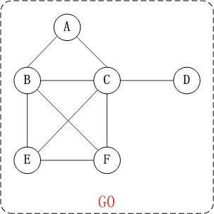
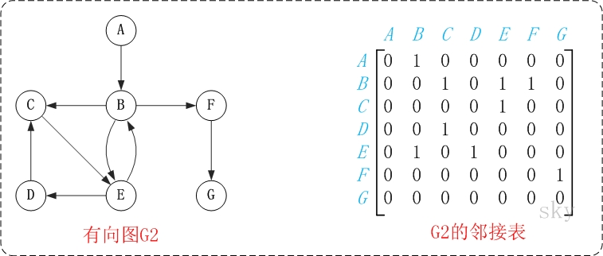
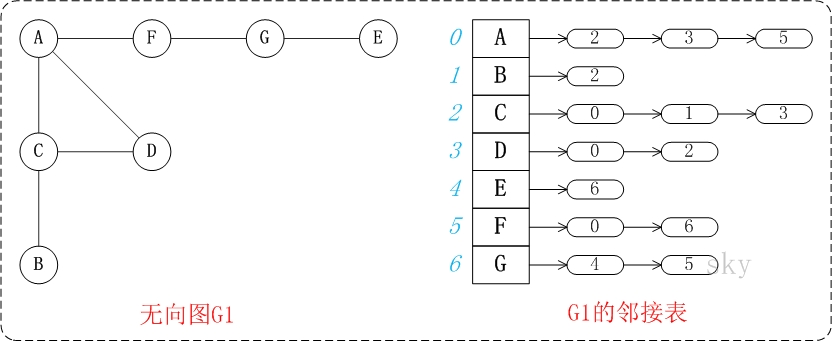
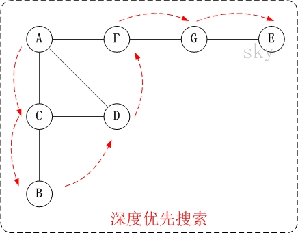

## 一、图的基本概念

### 1. 图的定义

定义：图(graph)是由一些点(vertex)和这些点之间的连线(edge)所组成的；其中，点通常被成为"顶点(vertex)"，而点与点之间的连线则被成为"边或弧"(edege)。通常记为，G=(V,E)。

### 2. 图的种类

根据边是否有方向，将图可以划分为：**无向图**和**有向图**。

**2.1 无向图**

上面的图G0是无向图，无向图的所有的边都是不区分方向的。G0=(V1,{E1})。其中，

**(01)** V1={A,B,C,D,E,F}。 V1表示由"A,B,C,D,E,F"几个顶点组成的集合。 

**(02)** E1={(A,B),(A,C),(B,C),(B,E),(B,F),(C,F), (C,D),(E,F),(C,E)}。 E1是由边(A,B),边(A,C)...等等组成的集合。其中，(A,C)表示由顶点A和顶点C连接成的边。

**2.2 有向图**

上面的图G2是有向图。和无向图不同，有向图的所有的边都是有方向的！ G2=(V2,{A2})。其中，

**(01)** V2={A,C,B,F,D,E,G}。 V2表示由"A,B,C,D,E,F,G"几个顶点组成的集合。

 
**(02)** A2={<A,B>,<B,C>,<B,F>,<B,E>,<C,E>,<E,D>,<D,C>,<E,B>,<F,G>}。 E1是由矢量<A,B>,矢量<B,C>...等等组成的集合。其中，矢量<A,B)表示由"顶点A"指向"顶点B"的有向边。

### 3. 邻接点和度

**3.1 邻接点**

一条边上的两个顶点叫做邻接点。 

*例如，上面无向图G0中的顶点A和顶点C就是邻接点。*

在有向图中，除了邻接点之外；还有"入边"和"出边"的概念。 

顶点的入边，是指以该顶点为终点的边。而顶点的出边，则是指以该顶点为起点的边。 

*例如，上面有向图G2中的B和E是邻接点；<B,E>是B的出边，还是E的入边。*

**3.2 度**

在无向图中，某个顶点的度是邻接到该顶点的边(或弧)的数目。 

*例如，上面无向图G0中顶点A的度是2。*

在有向图中，度还有"入度"和"出度"之分。 

某个顶点的入度，是指以该顶点为终点的边的数目。而顶点的出度，则是指以该顶点为起点的边的数目。 
顶点的度=入度+出度。 

*例如，上面有向图G2中，顶点B的入度是2，出度是3；顶点B的度=2+3=5。*

### 4. 路径和回路

**路径**：如果顶点(Vm)到顶点(Vn)之间存在一个顶点序列。则表示Vm到Vn是一条路径。 

**路径长度**：路径中"边的数量"。 

**简单路径**：若一条路径上顶点不重复出现，则是简单路径。 

**回路**：若路径的第一个顶点和最后一个顶点相同，则是回路。 

**简单回路**：第一个顶点和最后一个顶点相同，其它各顶点都不重复的回路则是简单回路。

### 5. 连通图和连通分量

**连通图**：对无向图而言，任意两个顶点之间都存在一条无向路径，则称该无向图为连通图。 对有向图而言，若图中任意两个顶点之间都存在一条有向路径，则称该有向图为强连通图。

**连通分量**：非连通图中的各个连通子图称为该图的连通分量。

### 6. 权

在学习"哈夫曼树"的时候，了解过"权"的概念。图中权的概念与此类似。

上面就是一个带权的图。

## 二、图的存储结构

上面了解了"图的基本概念"，下面开始介绍图的存储结构。图的存储结构，常用的是"**邻接矩阵**"和"**邻接表**"。

### 1. 邻接矩阵

邻接矩阵是指用矩阵来表示图。它是采用矩阵来描述图中顶点之间的关系(及弧或边的权)。 
假设图中顶点数为n，则邻接矩阵定义为：

下面通过示意图来进行解释。

图中的G1是无向图和它对应的邻接矩阵。

图中的G2是无向图和它对应的邻接矩阵。

通常采用两个数组来实现邻接矩阵：一个一维数组用来保存顶点信息，一个二维数组来用保存边的信息。 
邻接矩阵的缺点就是比较耗费空间。

### 2. 邻接表

邻接表是图的一种链式存储表示方法。它是改进后的"邻接矩阵"，它的缺点是不方便判断两个顶点之间是否有边，但是相对邻接矩阵来说更省空间。

图中的G1是无向图和它对应的邻接矩阵。

图中的G2是有向图和它对应的邻接矩阵。

## 三、图的深度/广度优先遍历

### 1. 深度优先搜索介绍

图的深度优先搜索(Depth First Search)，和树的先序遍历比较类似。

它的思想：假设初始状态是图中所有顶点均未被访问，则从某个顶点v出发，首先访问该顶点，然后依次从它的各个未被访问的邻接点出发深度优先搜索遍历图，直至图中所有和v有路径相通的顶点都被访问到。 若此时尚有其他顶点未被访问到，则另选一个未被访问的顶点作起始点，重复上述过程，直至图中所有顶点都被访问到为止。

显然，深度优先搜索是一个递归的过程。

### 2. 深度优先搜索图解

**2.1 无向图的深度优先搜索**

下面以"无向图"为例，来对深度优先搜索进行演示。

对上面的图G1进行深度优先遍历，从顶点A开始。

**第1步**：访问A。 

**第2步**：访问(A的邻接点)C。 

​    在第1步访问A之后，接下来应该访问的是A的邻接点，即"C,D,F"中的一个。但在本文的实现中，顶点ABCDEFG是按照顺序存储，C在"D和F"的前面，因此，先访问C。 

**第3步**：访问(C的邻接点)B。 

​    在第2步访问C之后，接下来应该访问C的邻接点，即"B和D"中一个(A已经被访问过，就不算在内)。而由于B在D之前，先访问B。 

**第4步**：访问(C的邻接点)D。 

​    在第3步访问了C的邻接点B之后，B没有未被访问的邻接点；因此，返回到访问C的另一个邻接点D。 

**第5步**：访问(A的邻接点)F。 

​    前面已经访问了A，并且访问完了"A的邻接点B的所有邻接点(包括递归的邻接点在内)"；因此，此时返回到访问A的另一个邻接点F。 

**第6步**：访问(F的邻接点)G。 

**第7步**：访问(G的邻接点)E。

因此访问顺序是：**A -> C -> B -> D -> F -> G -> E**

 **2.2 有向图的深度优先搜索**

下面以"有向图"为例，来对深度优先搜索进行演示。

对上面的图G2进行深度优先遍历，从顶点A开始。

**第1步**：访问A。 

**第2步**：访问B。 

​    在访问了A之后，接下来应该访问的是A的出边的另一个顶点，即顶点B。 

**第3步**：访问C。 

​    在访问了B之后，接下来应该访问的是B的出边的另一个顶点，即顶点C,E,F。在本文实现的图中，顶点ABCDEFG按照顺序存储，因此先访问C。 

**第4步**：访问E。 

​    接下来访问C的出边的另一个顶点，即顶点E。 

**第5步**：访问D。 

​    接下来访问E的出边的另一个顶点，即顶点B,D。顶点B已经被访问过，因此访问顶点D。 

**第6步**：访问F。 

​    接下应该回溯"访问A的出边的另一个顶点F"。 

**第7步**：访问G。

因此访问顺序是：**A -> B -> C -> E -> D -> F -> G**

### 3. 广度优先搜索介绍

广度优先搜索算法(Breadth First Search)，又称为"宽度优先搜索"或"横向优先搜索"，简称BFS。

它的思想是：从图中某顶点v出发，在访问了v之后依次访问v的各个未曾访问过的邻接点，然后分别从这些邻接点出发依次访问它们的邻接点，并使得“先被访问的顶点的邻接点先于后被访问的顶点的邻接点被访问，直至图中所有已被访问的顶点的邻接点都被访问到。如果此时图中尚有顶点未被访问，则需要另选一个未曾被访问过的顶点作为新的起始点，重复上述过程，直至图中所有顶点都被访问到为止。

换句话说，广度优先搜索遍历图的过程是以v为起点，由近至远，依次访问和v有路径相通且路径长度为1,2...的顶点。

### 4. 广度优先搜索图解

**4.1 无向图的广度优先搜索**

下面以"无向图"为例，来对广度优先搜索进行演示。还是以上面的图G1为例进行说明。

**第1步**：访问A。 

**第2步**：依次访问C,D,F。 

​    在访问了A之后，接下来访问A的邻接点。前面已经说过，在本文实现中，顶点ABCDEFG按照顺序存储的，C在"D和F"的前面，因此，先访问C。再访问完C之后，再依次访问D,F。 

**第3步**：依次访问B,G。 

​    在第2步访问完C,D,F之后，再依次访问它们的邻接点。首先访问C的邻接点B，再访问F的邻接点G。 

**第4步**：访问E。 
​    在第3步访问完B,G之后，再依次访问它们的邻接点。只有G有邻接点E，因此访问G的邻接点E。

因此访问顺序是：**A -> C -> D -> F -> B -> G -> E**

**4.2 有向图的广度优先搜索**

下面以"有向图"为例，来对广度优先搜索进行演示。还是以上面的图G2为例进行说明。

**第1步**：访问A。 

**第2步**：访问B。 

**第3步**：依次访问C,E,F。 

​    在访问了B之后，接下来访问B的出边的另一个顶点，即C,E,F。前面已经说过，在本文实现中，顶点ABCDEFG按照顺序存储的，因此会先访问C，再依次访问E,F。 

**第4步**：依次访问D,G。 
​    在访问完C,E,F之后，再依次访问它们的出边的另一个顶点。还是按照C,E,F的顺序访问，C的已经全部访问过了，那么就只剩下E,F；先访问E的邻接点D，再访问F的邻接点G。

因此访问顺序是：**A -> B -> C -> E -> F -> D -> G**