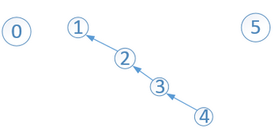
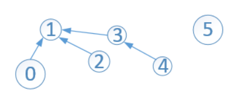
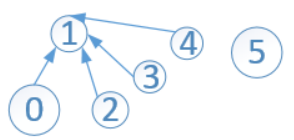

## 一、并查集的介绍

 并查集（Union/Find）从名字可以看出，主要涉及两种基本操作:合并和查找。这说明，初始时并查集中的元素是不相交的，经过一系列的基本操作(Union)，最终合并成一个大的集合。

而在某次合并之后，有一种合理的需求：某两个元素是否已经处在同一个集合中了？因此就需要Find操作。

并查集是一种 不相交集合 的数据结构，设有一个**动态集合**S={s1，s2，s3，.....sn}，每个集合通过一个代表来标识，该代表中集合中的某个元素。

比如，若某个元素 x 是否在集合 s1 中(Find操作)，返回集合 s1 的代表元素即可。这样，判断两个元素是否在同一个集合中也是很方便的，只要看find(x) 和 find(y) 是否返回同一个代表即可。

为什么是动态集合S呢？因为随着Union操作，动态集合S中的子集合个数越来越少。

数据结构的基本操作决定了它的应用范围，对并查集而言，一个简单的应用就是判断无向图的连通分量个数，或者判断无向图中任何两个顶点是否连通。

## 二、并查集的存储结构及实现分析

**①存储结构**

并查集(大S)由若干子集合si构成，并查集的逻辑结构就是一个森林。si表示森林中的一棵子树。一般以子树的根作为该子树的代表。

而对于并查集的存储结构，可用一维数组和链表来实现。这里主要介绍一维数组的实现。

根据前面介绍的基本操作再加上存储结构，并查集类的实现架构如下：

```java
public class DisjSets {
    private int[] s;
    private int count;//记录并查集中子集合的个数(子树的个数)

       public DisjSets(int numElements) {
       //构造函数，负责初始化并查集
       }

        public void unionByHeight(int root1, int root2){    
        //union操作
       }

       public int find(int x){
       //find 操作
      }
}
```

由于Find操作需要找到该子集合的代表元素，而代表元素是树根，因此需要保存树中结点的父亲，对于每一个结点，如果知道了父亲，沿着父结点链就可以最终找到树根。

为了简单起见，假设一维数组s中的每个元素 s[i] 表示该元素 i 的父亲。这里有两个需要注意的地方：①我们用一维数组来存储并查集，数组的元素s[i]表示的是结点的父亲的位置。②数组元素的下标 i 则是结点的标识。如：s[5]=4，节点5 在数组的第4号位置处。

假设有并查集中6个元素，初始时，所有的元素都相互独立，处在不同的集合中：


对应的一维数组初始化如下：


因为，初始时每个元素代表一个集合，该元素本身就是树根。树根的父结点用 -1 来表示。代码实现如下：

```java
public DisjSets(int numElements) {
        s = new int[numElements];
        count = numElements;
        //初始化并查集,相当于新建了s.length 个互不相交的集合
        for(int i = 0; i < s.length; i++)
            s[i] = -1;//s[i]存储的是高度(秩)信息
    }
```

**②基本操作实现**

Union操作就是将两个不相交的子集合合并成一个大集合。简单的Union操作是非常容易实现的，因为只需要把一棵子树的根结点指向另一棵子树即可完成合并。

比如合并 节点3 和节点4：


这里的合并很随意，把任意一棵子树的结点指向另一棵子树结点就完成了合并。

```java
public void union(int root1, int root2){
  s[root2] = root1;//将root1作为root2的新树根
}
```

但是，这只是一个简单的情况，如果待合并的两棵子树很大，而且高度不一样时，如何使得合并操作生成的新的子树的高度最小？因为高度越小的子树Find操作越快。

后面会介绍一种更好的合并策略，以支持Quick Union/Find。

Find操作就是查找某个元素所在的集合，返回该集合的代表元素。在union(3,4) 和 union(1,2)后，并查集如下：


此时的一维数组如下：


此时一共有4个子集合。第一个集合的代表元素为0，第二个集合的代表元素为1，第三个集合的代表元素为3，第四个集合的代表元素为5，故：

find(2)返回1，find(0)返回0。因为 结点3 和 结点4 在同一个集合内，find(4)返回3，find(3)返回3。

```java
 public int find(int x){
  if(s[x] < 0)
    return x;
  else
    return find(s[x]);
 }
```

这里find(int x)返回的是最里层递归执行后，得到的值。由于只有树根的父结点位置小于0，故返回的是树根结点的标识。

（数组中索引 i 处的元素 s[i] 小于0，表示 结点i 是根结点.....）

 

## 三、Union/Find的改进----Quick Union/Find

 上面介绍的Union操作很随意：任选一棵子树，将另一棵子树的根指向它即完成了合并。如果一直按照上述方式合并，很可能产生一棵非常不平衡的子树。

比如在上面的基础上union(2,3)后



树越来越高了，此时会影响到Find操作的效率。比如，find(4)时，会一直沿着父结点遍历直到根，4-->3-->2-->1

这里引入一种新的合并策略，这是一种启发式策略，称之为**按秩合并：将秩小的子树的根指向秩大的子树的根。**

秩的定义：对每个结点，用秩表示结点高度的一个上界。为什么是上界？

因为路径压缩不完全与按高度求并兼容。路径压缩会改变树的高度，这样在Union操作之前，我们就无法获得子树的高度的精确值，因此就不计算高度的精确值，而是存储每棵树的高度的估计值，这个值称之为秩。

说了这么多，按秩求并就是在合并之前，先判断下哪棵子树更高，让矮的子树的根指向高的子树的根。

 除了按高度求并之外，还可以按大小求并，即先判断下哪棵子树含有的结点数目多，让较小的子树的根指向较大的子树的根。

 对于按高度求并，需要解释下数组中存储的元素：是高度的负值再减去1。这样，初始时，所有元素都是-1，而树根节点的高度为0，s[i]=-1。

按高度求并的代码如下：

```java
/**
     * 
     * @param root1 并查集中以root1为代表的某个子集
     * @param roo2 并查集中以root2为代表的某个子集
     * 按高度(秩)合并以root1 和 root2为代表的两个集合
     */
    public void unionByHeight(int root1, int root2){
        if(find(root1) == find(root2))
            return;//root1 与 root2已经连通了
        
        if(s[root2] < s[root1])//root2 is deeper
            s[root1] = root2;
        else{
            if(s[root1] == s[root2])//root1 and root2 is the same deeper
                s[root1]--;//将root1的高度加1
            s[root2] = root1;//将root2的根(指向)更新为root1
        }
        
        count--;//每union一次,子树数目减1
    }
```

#### 使用了路径压缩的Find的操作

上面程序代码find方法只是简单地把待查找的元素所在的根返回。路径压缩是指，在find操作进行时，**使find查找路径中的顶点(的父亲)都直接指向为树根（这很明显地改变了子树的高度）**

如何使find查找路径中经过的每个顶点都直接指向树根呢？只需要小小改动一下就可以了，这里用到了非常神奇的递归。修改后的find代码如下：

```java
public int find(int x){
        if(s[x] < 0)//s[x]为负数时,说明 x 为该子集合的代表(也即树根), 且s[x]的值表示树的高度
            return x;
        else 
            return s[x] = find(s[x]);//使用了路径压缩,让查找路径上的所有顶点都指向了树根(代表节点)
            //return find(s[x]); 没有使用 路径压缩
    }
```

因为递归最终得到的返回值是根元素。第5行将根元素直接赋值给s[x]，s[x]在每次递归过程中相当于结点x的父结点指针。 

#### 关于路径压缩对按”秩“求并的兼容性问题

上面的unionByHeight(int , int)是按照两棵树的高度来进行合并的。但是find操作中的路径压缩会对树的高度产生影响。使用了路径压缩后，树的高度变化了，但是数组并没有更新这个变化。因为无法更新！！（我们没有在Find操作中去计算原来的树的高度，然后再计算新的树的高度，这样不现实，复杂度太大了）

举个例子：

依次高度unionByHeight(3, 4)、unionByHeight(1, 3)、unionByHeight(1, 0)后，并查集如下：



此时，数组中的元素如下：


可以看出，此时只有两棵子树，一棵根结点为1，另一棵只有一个结点5。结点1的s[1]=-3，它所表示是该子树的高度为2，如果此时执行find(4)，会改变这棵树的高度！但是，数组s中存储的根的高度却没有更新，只会更新查找路径上的顶点的高度。执行完find(4)后，变成：


**查找路径为 4-->3-->1，find(4)使得查找路径上的所有顶点的父结点指向了根。如，将结点4 指向了根。但是没有根结点的高度（没有影响树根的秩），因为s[1]的值仍为-3**

**-3表示的高度为2，但是树的高度实际上已经变成了1**

执行find(4)之后，树实际上是这样的：



 

*（关于路径压缩对按秩合并有影响，我一直有个疑问，希望有大神指点啊）。。。。*

*路径压缩改变了子树的高度，而这个高度是按秩求的依据。，而且当高度改变之后，我们是无法更新这个变化了的高度的。那这会不会影响按秩求并的正确性？或者说使按秩求并达不到减小新生成的子树的高度的效果？*

## 四、并查集的应用

 并查集数据结构非常简单，基本操作也很简单。但是用途感觉很大。比如，求解无向图中连通分量的个数，生成迷宫……

 这些应用本质上就是：初始时都是一个个不连通的对象，经过一步步处理，变成连通的了。。。。。

如迷宫，初始时，起点和终点不连通，随机地打开起点到终点路径上的一个方向，直至起点和终点连通了，就生成了一个迷宫。

如，无向图的连通分量个数，初始时，将无向图中各个顶点视为不连通的子集合，对图中每一条边，相当于union这条边对应的两个顶点分别所在的集合，直至所有的边都处理完后，还剩下的集合的个数即为连通分量的个数。

## 五、完整代码

```java

public class DisjSets {
    private int[] s;
    private int count;//记录并查集中子集合的个数(子树的个数)
    
    
    public DisjSets(int numElements) {
        s = new int[numElements];
        count = numElements;
        //初始化并查集,相当于新建了s.length 个互不相交的集合
        for(int i = 0; i < s.length; i++)
            s[i] = -1;//s[i]存储的是高度(秩)信息
    }
    
    /**
     * 
     * @param root1 并查集中以root1为代表的某个子集
     * @param roo2 并查集中以root2为代表的某个子集
     * 按高度(秩)合并以root1 和 root2为代表的两个集合
     */
    public void unionByHeight(int root1, int root2){
        if(find(root1) == find(root2))
            return;//root1 与 root2已经连通了
        
        if(s[root2] < s[root1])//root2 is deeper
            s[root1] = root2;
        else{
            if(s[root1] == s[root2])//root1 and root2 is the same deeper
                s[root1]--;//将root1的高度加1
            s[root2] = root1;//将root2的根(指向)更新为root1
        }
        
        count--;//每union一次,子树数目减1
    }
    
    public void union(int root1, int root2){
        s[root2] = root1;//将root1作为root2的新树根
    }
    
    
    public void unionBySize(int root1, int root2){
        
        if(find(root1) == find(root2))
            return;//root1 与 root2已经连通了
        
        if(s[root2] < s[root1])//root2 is deeper
            s[root1] = root2;
        else{
            if(s[root1] == s[root2])//root1 and root2 is the same deeper
                s[root1]--;//将root1的高度加1
            s[root2] = root1;//将root2的根(指向)更新为root1
        }
        
        count--;//每union一次,子树数目减1
    }
    
    
    public int find(int x){
        if(s[x] < 0)//s[x]为负数时,说明 x 为该子集合的代表(也即树根), 且s[x]的值表示树的高度
            return x;
        else 
            return s[x] = find(s[x]);//使用了路径压缩,让查找路径上的所有顶点都指向了树根(代表节点)
            //return find(s[x]); 没有使用 路径压缩
    }
    
    public int find0(int x){
        if(s[x] < 0)
            return x;
        else 
            return find0(s[x]);
    }
    
    
    public int size(){
        return count;
    }
}
```

