## 一、本节引言：
前面我们花了13小节详细地讲解了Android中Paint类大部分常用的API，本节开始我们来讲解 Canvas(画板)的一些常用API，我们在

[9.3.1 三个绘图工具类详解](../custom/drawable-tool.html)
中已经列出了我们可供调用的一些方法，我们分下类：
- drawXxx方法族：以一定的坐标值在当前画图区域画图，另外图层会叠加， 即后面绘画的图层会覆盖前面绘画的图层。
- clipXXX方法族：在当前的画图区域裁剪(clip)出一个新的画图区域，这个 画图区域就是canvas对象的当前画图区域了。比如：clipRect(new Rect())， 那么该矩形区域就是canvas的当前画图区域
- getXxx方法族：获得与Canvas相关一些值，比如宽高，屏幕密度等。
- save()，restore()，saveLayer()，restoreToCount()等保存恢复图层的方法
- translate(平移)，scale(缩放)，rotate(旋转)，skew(倾斜)

当然还有其他一些零散的方法，嗯，从本节开始我会挑一些感觉有点意思的API来进行学习~

而本节先给大家带来的是translate(平移)，scale(缩放)，rotate(旋转)，skew(倾斜) 以及save()，restore()的详解！

官方API文档：Canvas

另外我们先要明确Canvas中X轴与Y轴的方向：

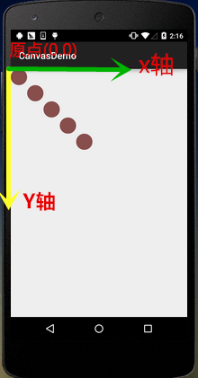


## 二、translate(平移)
方法：translate(float dx, float dy)

解析：平移，将画布的坐标原点向左右方向移动x，向上下方向移动y，canvas默认位置在(0,0)

参数：dx为水平方向的移动距离，dy为垂直方向的移动距离

使用示例：
```java
for(int i=0; i < 5; i++) {
    canvas.drawCircle(50, 50, 50, mPaint);
    canvas.translate(100, 100);
}
```

运行效果：

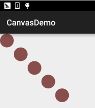


## 三、rotate(旋转)
方法：rotate(float degrees) / rotate(float degrees, float px, float py)

解析：围绕坐标原点旋转degrees度，值为正顺时针

参数：degrees为旋转角度，px和py为指定旋转的中心点坐标(px,py)

使用示例：
```java
Rect rect = new Rect(50,0,150,50);
canvas.translate(200, 200);
for(int i = 0; i < 36;i++){
    canvas.rotate(10);
    canvas.drawRect(rect, mPaint);
}
```

运行效果：

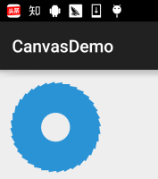

代码分析：

这里我们先调用了translate(200，200)将canvas的坐标原点移向了(200,200)，再进行绘制，所以我们 绘制的结果可以完整的在画布上显示出来，假如我们是为rotate设置了(10,200,200)，会是这样一个 结果：


有疑问是吧，这个涉及到Canvas多图层的概念，等等会讲~


## 四、scale(缩放)
方法：scale(float sx, float sy) / scale(float sx, float sy, float px, float py)

解析：对画布进行缩放

参数：sx为水平方向缩放比例，sy为竖直方向的缩放比例，px和py我也不知道，小数为缩小， 整数为放大

使用示例：
```java
canvas.drawBitmap(bmp,0,0,mPaint);
canvas.scale(0.8f, 0.8f);
canvas.drawBitmap(bmp, 0, 0, mPaint);
canvas.scale(0.8f, 0.8f);
canvas.drawBitmap(bmp,0,0,mPaint);
```

运行效果：


## 五、skew(倾斜)
方法：skew(float sx, float sy)

解析：倾斜，也可以译作斜切，扭曲

参数：sx为x轴方向上倾斜的对应角度，sy为y轴方向上倾斜的对应角度，两个值都是tan值哦！ 都是tan值！都是tan值！比如要在x轴方向上倾斜60度，那么小数值对应:tan 60 = 根号3 = 1.732！

使用示例：
```java
canvas.drawBitmap(bmp,0,0,mPaint);
canvas.translate(200, 200);
canvas.skew(0.2f,-0.8f);
canvas.drawBitmap(bmp,0,0,mPaint);
```

运行效果：


## 六、Canvas图层的概念以及save()和restore()详解
我们一般喜欢称呼Canvas为画布，童鞋们一直觉得Canvas就是一张简单的画纸，那么我想 问下多层的动画是怎么用canvas来完成的？上面那个translate平移的例子，为什么 drawCircle(50, 50, 50, mPaint); 参考坐标一直是(50,50)那为何会出现这样的效果？ 有疑惑的童鞋可能是一直将屏幕的概念与Canvas的概念混淆了，下面我们来还原下 调用translate的案发现场：

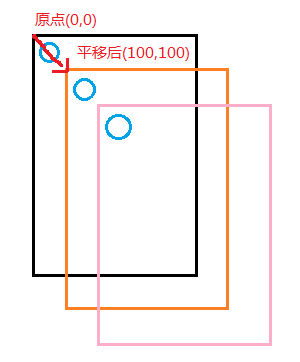

如图，是画布坐标原点的每次分别在x，y轴上移动100；那么假如我们要重新回到(0,0) 点处绘制新的图形呢？怎么破，translate(-100,-100)的慢慢地平移回去？不会真的这么 纠结吧...

好吧，不卖关子了，我们可以在做平移变换之前将当前canvas的状态进行保存，其实Canvas为 我们提供了图层(Layer)的支持，而这些Layer(图层)是按"栈结构"来进行管理的

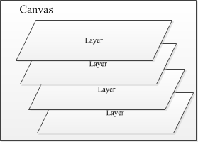

当我们调用save()方法，会保存当前Canvas的状态然后作为一个Layer(图层)，添加到Canvas栈中， 另外，这个Layer(图层)不是一个具体的类，就是一个概念性的东西而已！

而当我们调用restore()方法的时候，会恢复之前Canvas的状态，而此时Canvas的图层栈 会弹出栈顶的那个Layer，后继的Layer来到栈顶，此时的Canvas回复到此栈顶时保存的Canvas状态！

简单说就是：save()往栈压入一个Layer，restore()弹出栈顶的一个Layer，这个Layer代表Canvas的 状态！也就是说可以save()多次，也可以restore()多次，但是restore的调用次数不能大于save 否则会引发错误！这是网上大部分的说法，不过实际测试中并没有出现这样的问题，即使我restore的 次数多于save，也没有出现错误~目测是系统改了，等下测给大家看~  来来来，写个例子验证下save和restore的作用！

写个例子：

例子代码：
```java
canvas.save();  //保存当前canvas的状态

canvas.translate(100, 100);
canvas.drawCircle(50, 50, 50, mPaint);

canvas.restore();  //恢复保存的Canvas的状态
canvas.drawCircle(50, 50, 50, mPaint);
```

运行结果：

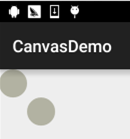

不用说什么了吧，代码和结果已经说明了一切，接着我们搞得复杂点，来一发 多个save()和restore()！

例子代码：
```java
canvas.save();

canvas.translate(300, 300);
canvas.drawBitmap(bmp, 0, 0, mPaint);
canvas.save();

canvas.rotate(45);
canvas.drawBitmap(bmp, 0, 0, mPaint);
canvas.save();

canvas.rotate(45);
canvas.drawBitmap(bmp, 0, 0, mPaint);
canvas.save();

canvas.translate(0, 200);
canvas.drawBitmap(bmp, 0, 0, mPaint);
```

运行结果：

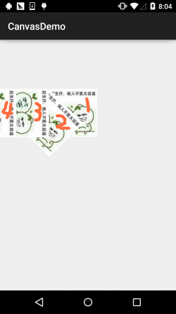

结果分析：

首先平移(300,300)画图，然后旋转45度画图，再接着旋转45度画图，接着平移(0,200)， 期间每次画图前都save()一下，看到这里你可能有个疑问，最后这个平移不是y移动200 么，怎么变成向左了？嘿嘿，我会告诉你rotate()旋转的是整个坐标轴么？坐标轴的 变化：

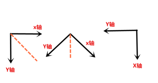

嗯，rotate()弄懂了是吧，那就行，接着我们来试试restore咯~我们在最后绘图的前面 加两个restore()！
```java
canvas.restore();
canvas.restore();
canvas.translate(0, 200);
canvas.drawBitmap(bmp, 0, 0, mPaint);
```

运行结果：

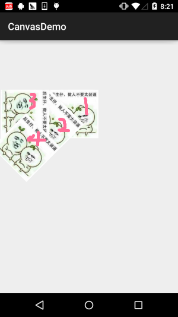

不说什么，自己体会，再加多个restore()！

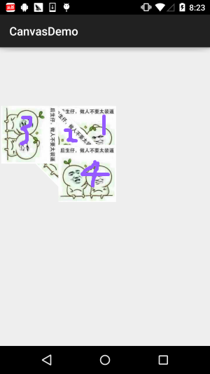

有点意思，再来，继续加restore()

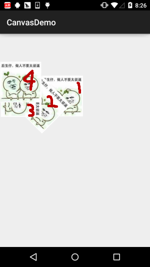

嗯，好像不可以再写restore了是吧，因为我们只save了四次，按照网上的说法， 这会报错的，真的是这样吗？这里我们调用Canvas给我们提供的一个获得当前栈中 有多少个Layer的方法：getSaveCount()；然后在save()和restore()的前后都 加一个Log将栈中Layer的层数打印出来：

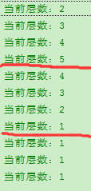

结果真是喜闻乐见，毕竟实践出真知，可能是Canvas改过吧，或者其他原因，这里 要看源码才知道了，时间关系，这里我们知道下restore的次数可以比save多就好了， 但是还是建议restore的次数还是少于save，以避免造成不必要的问题~ 至于进栈和出栈的流程我就不话了，笔者自己动笔画画，非常容易理解！


## 七、saveLayer()与restoreToCount()讲解
其实这两个方法和save以及restore大同小异，只是在后者的基础上多了一些东东而已， 比如saveLayer()，有下面多个重载方法：

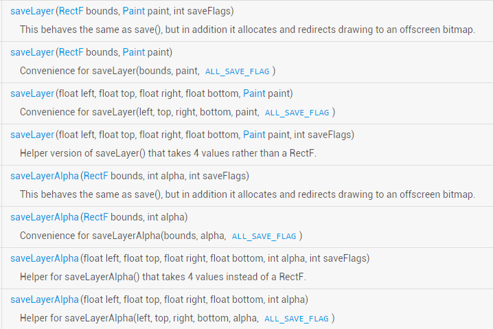

你可以理解为save()方法保存的是整个Canvas，而saveLayer()则可以选择性的保存某个区域的状态， 另外，我们看到餐宿和中有个:int saveFlags，这个是设置改保存那个对象的！可选值有：

|标记	|说明 |
|-------|----|
|ALL_SAVE_FLAG	| 保存全部的状态|
|CLIP_SAVE_FLAG	| 保存裁剪的某个区域的状态|
|CLIP_TO_LAYER_SAVE_FLAG	| 保存预先设置的范围里的状态|
|FULL_COLOR_LAYER_SAVE_FLAG	| 保存彩色涂层|
|HAS_ALPHA_LAYER_SAVE_FLAG	| 不透明图层保存|
|MATRIX_SAVE_FLAG	| Matrix信息(translate，rotate，scale，skew)的状态保存|

PS:上述说明有点问题，笔者英语水平低，可能说错，如果有知道的，请务必指正提出，谢谢~

这里我们写个例子来验证下：我们选用CLIP_TO_LAYER_SAVE_FLAG模式来写个例子

实现代码：
```java
RectF bounds = new RectF(0, 0, 400, 400);
canvas.saveLayer(bounds, mPaint, Canvas.CLIP_TO_LAYER_SAVE_FLAG);
canvas.drawColor(getResources().getColor(R.color.moss_tide));
canvas.drawBitmap(bmp, 200, 200, mPaint);
canvas.restoreToCount(1);
canvas.drawBitmap(bmp, 300, 200, mPaint);
```

运行结果：


关于saveLayer()后面用到再详解研究吧~这里先知道个大概~

接着到这个restoreToCount(int)，这个更简单，直接传入要恢复到的Layer层数， 直接就跳到对应的那一层，同时会将该层上面所有的Layer踢出栈，让该层 成为栈顶~！比起你写多个restore()方便快捷多了~


## 八、本节代码示例下载：
嗯，代码是写着测试的，要来也没多大意思，不过可能读者还是想要，就贴下链接吧！

代码下载：[CanvasDemo.zip](../img/CanvasDemo.zip) 可能你们要的是这个图吧！哈哈~


## 九、本节小结：
本节是纠结了几天才写出来的，因为笔者一开始对这个Canvas图层的概念也不是很清晰， 今天下午做完事捋了捋思路，晚上再加加班终于把这篇东西写出来了，相信应该能帮助 大家更清楚的理解Canvas，进阶自定义控件时也不会一头雾水~嘿嘿，本节就到这里， 如果有写错的地方欢迎提出，万分感谢~

参考文献： [AndroidのCanvasを使いこなす！ – 基本的な描画](http://tech.recruit-mp.co.jp/mobile/remember_canvas1/)
