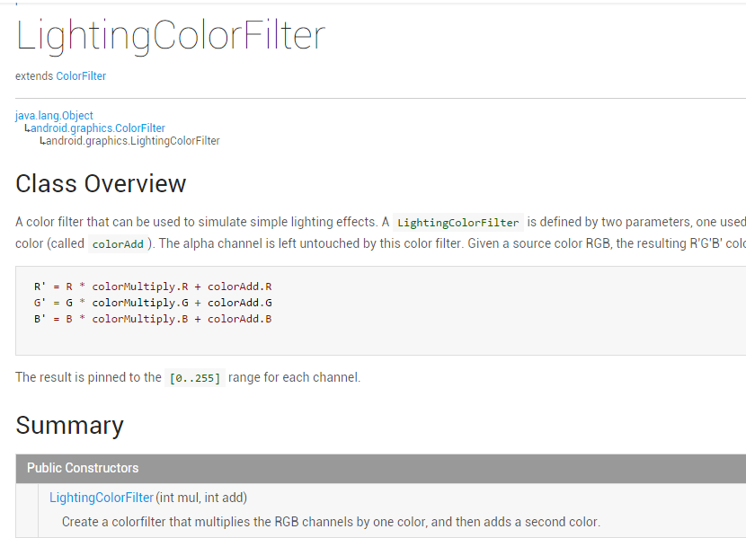
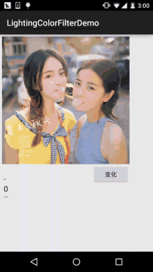

## 一、本节引言：
上一节中我们讲解了Android中Paint API中的ColorFilter(颜色过滤器)的第一个子类： ColorMatrixColorFilter(颜色矩阵颜色过滤器)，相信又开阔了大家的Android图像处理视野， 而本节我们来研究它的第二个子类：LightingColorFilter(光照色彩颜色过滤器)，先上一发 官方API文档：LightingColorFilter，文档里的东西也不多，关键的在这里：



大概意思就是：一个颜色过滤器，可以用来模拟简单的灯光效果，构造方法的参数有两个，一个 用来乘以原图的RPG值，一个添加到前面得出的结果上！其实计算方法无非： (RGB值 * mul + Add) % 255，从而得到新的RPG值，这里的%是求余，另外，整个过程中Alpha不 参与改变！下面我们写个示例来验证验证！


## 二、代码示例：
运行效果图：



实现代码：

先是一个简单的布局：activity_main.xml：
```xml
<RelativeLayout xmlns:android="http://schemas.android.com/apk/res/android"
    xmlns:tools="http://schemas.android.com/tools"
    android:layout_width="match_parent"
    android:layout_height="match_parent"
    android:padding="5dp"
    tools:context=".MainActivity">

    <ImageView
        android:id="@+id/img_meizi"
        android:layout_width="300dp"
        android:layout_height="300dp"
        android:src="@mipmap/img_meizi" />

    <EditText
        android:id="@+id/edit_mul"
        android:layout_width="wrap_content"
        android:layout_height="wrap_content"
        android:layout_below="@id/img_meizi"
        android:text="0" />

    <EditText
        android:id="@+id/edit_add"
        android:layout_width="wrap_content"
        android:layout_height="wrap_content"
        android:layout_below="@id/edit_mul"
        android:text="0" />

    <Button
        android:id="@+id/btn_change"
        android:layout_width="wrap_content"
        android:layout_height="wrap_content"
        android:layout_alignRight="@id/img_meizi"
        android:layout_below="@id/img_meizi"
        android:text="变化" />
</RelativeLayout>
```

接着是我们的MainActiivty.java，同样很简单：
```java
public class MainActivity extends AppCompatActivity implements View.OnClickListener{

    private ImageView img_meizi;
    private EditText edit_mul;
    private EditText edit_add;
    private Button btn_change;
    private Bitmap mBitmap;
    
    @Override
    protected void onCreate(Bundle savedInstanceState) {
        super.onCreate(savedInstanceState);
        setContentView(R.layout.activity_main);
        mBitmap = BitmapFactory.decodeResource(getResources(), R.mipmap.img_meizi);
        bindViews();
    }

    private void bindViews() {
        img_meizi = (ImageView) findViewById(R.id.img_meizi);
        edit_mul = (EditText) findViewById(R.id.edit_mul);
        edit_add = (EditText) findViewById(R.id.edit_add);
        btn_change = (Button) findViewById(R.id.btn_change);

        btn_change.setOnClickListener(this);

    }


    private Bitmap ProcessImage(Bitmap bp,int mul,int add){
        Bitmap bitmap = Bitmap.createBitmap(bp.getWidth(),bp.getHeight(), Bitmap.Config.ARGB_8888);
        Canvas canvas = new Canvas(bitmap);
        Paint paint = new Paint(Paint.ANTI_ALIAS_FLAG);
        paint.setColorFilter(new LightingColorFilter(mul,add));
        canvas.drawBitmap(bp,0,0,paint);
        return bitmap;
    }

    @Override
    public void onClick(View v) {
        switch (v.getId()){
            case R.id.btn_change:
                int mul = Integer.parseInt(edit_mul.getText().toString());
                int add = Integer.parseInt(edit_add.getText().toString());
                img_meizi.setImageBitmap(ProcessImage(mBitmap,mul,add));
                break;
        }
    }
}
```

好了，LightingColorFilter的使用演示完毕~


## 三、本节代码下载
[LightingColorFilterDemo.zip](../img/LightingColorFilterDemo.zip)


## 四、本节小结：
嗯，本节演示了一下LightingColorFilter的一个基本用法，用来模拟简单的灯光效果， 实现简单的图片处理效果，好的，本节就到这里，谢谢~