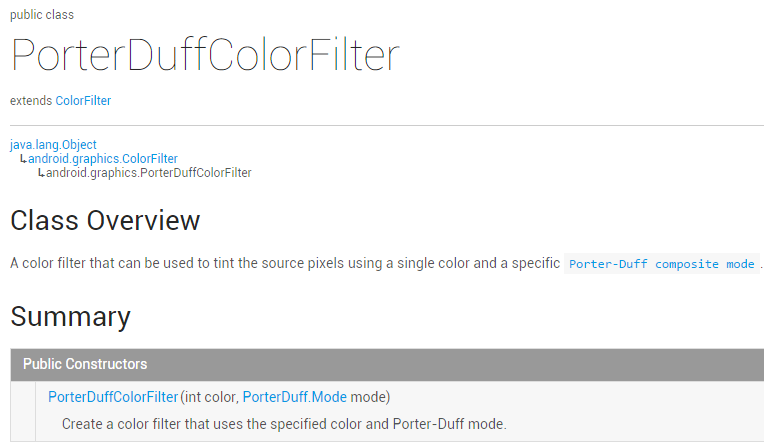
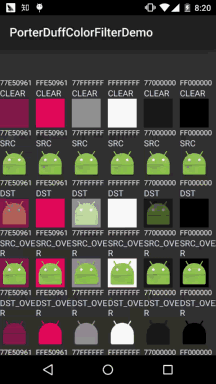
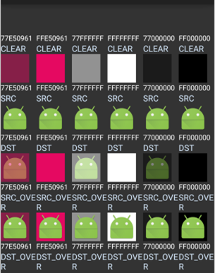
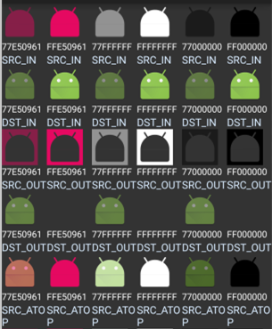
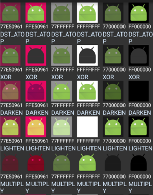
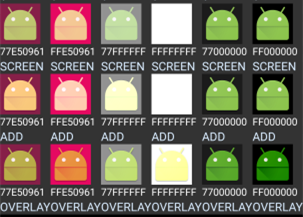

## 一、本节引言：
嗯，本来说好今天不写的，还是写吧，毕竟难得空闲哈~，本节给大家带来的是 ColorFilter的第三个子类：PorterDuffColorFilter，看到PorterDuff大家一定不会 陌生吧，假如你看过前面的 [9.3.5、Paint API之Xfermode与PorterDuff详解(2)](../custom/xfermode-porterduff2.html) 其实效果都是一样的，只是这里用的是颜色，而且直接设置就好，下面我们来写个简单的 例子，我们取6种不同的颜色，对18种模式进行测试！ 官方API文档：PorterDuffColorFilter 我们可以看到关键也是在于他的构造方法：



前面是颜色，后面是模式~，来来来，写例子：


## 二、测试代码示例：
运行效果图：



代码实现：

这里的话我们用一个GridView来装他们，我们先来写下每个item的布局：view_item.xml：
```xml
<?xml version="1.0" encoding="utf-8"?>
<LinearLayout xmlns:android="http://schemas.android.com/apk/res/android"
    android:layout_width="match_parent"
    android:layout_height="match_parent"
    android:orientation="vertical">

    <ImageView
        android:id="@+id/img_show"
        android:layout_width="wrap_content"
        android:layout_height="wrap_content"
        android:src="@mipmap/ic_launcher" />

    <TextView
        android:id="@+id/tv_color"
        android:layout_width="wrap_content"
        android:layout_height="wrap_content"
        android:gravity="center_vertical"
        android:textSize="12sp"
        android:text="颜色"
        android:textColor="#FFFFFFFF" />

    <TextView
        android:id="@+id/tv_mode"
        android:layout_width="wrap_content"
        android:layout_height="wrap_content"
        android:textColor="#FFD9ECFF"
        android:text="模式"/>

</LinearLayout>
```

接着我们编写一个POJO业务类：Data.java：
```java
/**
 * Created by Jay on 2015/10/29 0029.
 */
public class Data {
    private int color;
    private PorterDuff.Mode mode;

    public Data() {
    }

    public Data(int color, PorterDuff.Mode mode) {
        this.color = color;
        this.mode = mode;
    }

    public int getColor() {
        return color;
    }

    public PorterDuff.Mode getMode() {
        return mode;
    }

    public void setColor(int color) {
        this.color = color;
    }

    public void setMode(PorterDuff.Mode mode) {
        this.mode = mode;
    }
}
```

至于Adapter类的话我们用回以前写的可复用的自定义BaseAdapter类，这里就不贴了，不过要加 多个方法：
```java
/**
 * 设置ColorFilter
 * */
public ViewHolder setColorFilter(int id,int color,PorterDuff.Mode mode){
    View view = getView(id);
    if (view instanceof ImageView) {
        ((ImageView) view).setColorFilter(color,mode);
    }
    return this;
}
```

接着是我们的主布局文件:activity_main.xml：
```xml
<LinearLayout xmlns:android="http://schemas.android.com/apk/res/android"
    android:layout_width="match_parent"
    android:layout_height="match_parent"
    android:orientation="vertical">

    <GridView
        android:id="@+id/gd_show"
        android:background="#FF333333"
        android:numColumns="6"
        android:layout_width="match_parent"
        android:layout_height="wrap_content"/>

</LinearLayout>
```

最后是我们的MainActivity.java类，填充数据，设置Adapter，非常简单：
```java
public class MainActivity extends AppCompatActivity {

    private GridView gd_show;
    private ArrayList<Data> items = null;
    private MyAdapter<Data> myAdapter = null;

    @Override
    protected void onCreate(Bundle savedInstanceState) {
        super.onCreate(savedInstanceState);
        setContentView(R.layout.activity_main);
        gd_show = (GridView) findViewById(R.id.gd_show);

        //填充数据，遍历Mode模式：
        items = new ArrayList<Data>();
        for (PorterDuff.Mode mode : PorterDuff.Mode.class.getEnumConstants()) {
            items.add(new Data(0x77E50961, mode));
            items.add(new Data(0xFFE50961, mode));
            items.add(new Data(0x77FFFFFF, mode));
            items.add(new Data(0xFFFFFFFF, mode));
            items.add(new Data(0x77000000, mode));
            items.add(new Data(0xFF000000, mode));
        }
        myAdapter = new MyAdapter<Data>(items, R.layout.view_item) {
            @Override
            public void bindView(ViewHolder holder, Data obj) {
                holder.setColorFilter(R.id.img_show, obj.getColor(), obj.getMode());
                holder.setText(R.id.tv_color, String.format("%08X", obj.getColor()));
                holder.setText(R.id.tv_mode, obj.getMode().toString());
            }
        };
        gd_show.setAdapter(myAdapter);
    }
}
```

上面的动图可能太快，有时读者相查下，这里分开图截，因为没找到好用的截全屏工具， 所以这里只能分段截...







## 三、本节示例代码下载：
[PorterDuffColorFilterDemo2.zip](../img/PorterDuffColorFilterDemo2.zip)


## 四、本节小结：
本节非常简短，API文档里就那么个用法，这里也把18种情况也列举出来了，相信 会对大家学习图像混排带来帮助~谢谢，今天请了一天假，会学校又感受了下学生的 感觉，去了一趟图书馆，看了一大波的美女，然后心情就nice了，决定还是暂时先 在这个公司好好滴做一个实习生，换了环境不一定能改变什么，先从改变自己开始吧~

PS：例子摘自Github：[ColorFilterTest](https://github.com/gaeeyo/ColorFilterTest)
