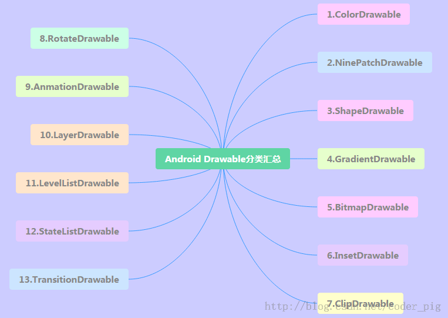

## 一、本节引言：
本节我们来把剩下的四种Drawable也学完，他们分别是： LayerDrawable,TransitionDrawable,LevelListDrawable和StateListDrawable, 依旧贴下13种Drawable的导图：




## 二、LayerDrawable
层图形对象，包含一个Drawable数组，然后按照数组对应的顺序来绘制他们，索引 值最大的Drawable会被绘制在最上层！虽然这些Drawable会有交叉或者重叠的区域，但 他们位于不同的层，所以并不会相互影响，以<layer-list>作为根节点！

相关属性如下：

- `drawable`:引用的位图资源,如果为空徐璈有一个Drawable类型的子节点
- `left`:层相对于容器的左边距
- `right`:层相对于容器的右边距
- `top`:层相对于容器的上边距
- `bottom`:层相对于容器的下边距
- `id`:层的id

使用示例：

运行效果图：


代码实现：

非常简单，结合前面学习的shapeDrawable和ClipDrawable：

`layerList_one.xml`
```xml
<?xml version="1.0" encoding="utf-8"?>
<layer-list xmlns:android="http://schemas.android.com/apk/res/android">
    <item android:id="@android:id/background">
        <shape android:shape="rectangle">
            <solid android:color="#C2C2C1" />
            <corners android:radius="50dp" />
        </shape>
    </item>
    <item android:id="@android:id/progress">
        <clip>
            <shape android:shape="rectangle">
                <solid android:color="#BCDA73" />
                <corners android:radius="50dp" />
            </shape>
        </clip>
    </item>
</layer-list>
```
 
然后在布局文件中添加一个Seekbar，内容如下：
```xml
<SeekBar
        android:layout_width="match_parent"
        android:layout_height="wrap_content"
        android:indeterminateDrawable="@android:drawable/progress_indeterminate_horizontal"
        android:indeterminateOnly="false"
        android:maxHeight="10dp"
        android:minHeight="5dp"
        android:progressDrawable="@drawable/layerlist_one"
        android:thumb="@drawable/shape_slider" />
```

卧槽，没了？对的，就是这么点东西~说了是层图形对象，我们还可以弄个层叠图片的效果：

运行效果图：


实现代码：

层叠图片的layerlist_two.xml:
```xml
<?xml version="1.0" encoding="utf-8"?>
<layer-list xmlns:android="http://schemas.android.com/apk/res/android">
    <item>
        <bitmap
            android:gravity="center"
            android:src="@mipmap/ic_bg_ciwei" />
    </item>
    <item
        android:left="25dp"
        android:top="25dp">
        <bitmap
            android:gravity="center"
            android:src="@mipmap/ic_bg_ciwei" />
    </item>
    <item
        android:left="50dp"
        android:top="50dp">
        <bitmap
            android:gravity="center"
            android:src="@mipmap/ic_bg_ciwei" />
    </item>
</layer-list> 
```

然后在activity_main.xml里加个ImageView，内容如下：
```xml
<ImageView
        android:layout_width="wrap_content"
        android:layout_height="wrap_content"
        android:src="@drawable/layerlist_two"/>
```

简单好用，还等什么，快快应用到你的项目中吧~


## 三、TransitionDrawable
LayerDrawable的一个子类，TransitionDrawable只管理两层的Drawable！两层！两层！ 并且提供了透明度变化的动画，可以控制一层Drawable过度到另一层Drawable的动画效果。 根节点为<transition>，记住只有两个Item，多了也没用，属性和LayerDrawable差不多， 我们需要调用startTransition方法才能启动两层间的切换动画； 也可以调用reverseTransition()方法反过来播放：

使用示例：

运行效果图：


实现代码：

在res/drawable创建一个TransitionDrawable的xml文件
```xml
<?xml version="1.0" encoding="utf-8"?>
<transition xmlns:android="http://schemas.android.com/apk/res/android" >
    <item android:drawable="@mipmap/ic_bg_meizi1"/>
    <item android:drawable="@mipmap/ic_bg_meizi2"/>
</transition>
```

然后布局文件里加个ImageView，然后把src设置成上面的这个drawable 然后MainActivity.java内容如下：
```java
public class MainActivity extends AppCompatActivity {
    private ImageView img_show;
    @Override
    protected void onCreate(Bundle savedInstanceState) {
        super.onCreate(savedInstanceState);
        setContentView(R.layout.activity_main);
        img_show = (ImageView) findViewById(R.id.img_show);
        TransitionDrawable td = (TransitionDrawable) img_show.getDrawable();
        td.startTransition(3000);
        //你可以可以反过来播放，使用reverseTransition即可~
        //td.reverseTransition(3000);
    }
}
```

另外，如果你想实现：多张图片循环的淡入淡出的效果 可参考：[Android Drawable Resource学习（七）、TransitionDrawable](http://blog.csdn.net/lonelyroamer/article/details/8243606)中的示例 很简单，核心原理就是：handler定时修改Transition中两个图片！


## 四、LevelListDrawable
用来管理一组Drawable的,我们可以为里面的drawable设置不同的level， 当他们绘制的时候，会根据level属性值获取对应的drawable绘制到画布上，根节点 为:<level-list>他并没有可以设置的属性，我们能做的只是设置每个<item> 的属性！

item可供设置的属性如下：

- `drawable`:引用的位图资源,如果为空徐璈有一个Drawable类型的子节点
- `minlevel`:level对应的最小值
- `maxlevel`:level对应的最大值
使用示例：

运行效果图：


代码实现：

通过shapeDrawable画圆，一式五份，改下宽高即可：

`shape_cir1.xml：`
```xml
<?xml version="1.0" encoding="utf-8"?>
<shape xmlns:android="http://schemas.android.com/apk/res/android"
    android:shape="oval">
    <solid android:color="#2C96ED"/>
    <size android:height="20dp" android:width="20dp"/>
</shape>
```

接着到LevelListDrawable，这里我们设置五层：

`level_cir.xml：`
```xml
<?xml version="1.0" encoding="utf-8"?>
<level-list xmlns:android="http://schemas.android.com/apk/res/android" >
    <item android:drawable="@drawable/shape_cir1" android:maxLevel="2000"/>
    <item android:drawable="@drawable/shape_cir2" android:maxLevel="4000"/>
    <item android:drawable="@drawable/shape_cir3" android:maxLevel="6000"/>
    <item android:drawable="@drawable/shape_cir4" android:maxLevel="8000"/>
    <item android:drawable="@drawable/shape_cir5" android:maxLevel="10000"/>
</level-list> 
```

最后MainActivity写如下代码：
```java
public class MainActivity extends AppCompatActivity {

    private ImageView img_show;

    private LevelListDrawable ld;
    private Handler handler = new Handler() {
        public void handleMessage(Message msg) {
            if (msg.what == 0x123) {
                if (ld.getLevel() > 10000) ld.setLevel(0);
                img_show.setImageLevel(ld.getLevel() + 2000);
            }
        }
    };

    @Override
    protected void onCreate(Bundle savedInstanceState) {
        super.onCreate(savedInstanceState);
        setContentView(R.layout.activity_main);
        img_show = (ImageView) findViewById(R.id.img_show);
        ld = (LevelListDrawable) img_show.getDrawable();
        img_show.setImageLevel(0);
        new Timer().schedule(new TimerTask() {
            @Override
            public void run() {
                handler.sendEmptyMessage(0x123);
            }
        }, 0, 100);
    }
}
```

也很简单，一个Timer定时器,handler修改level值~


## 五、StateListDrawable
好了终于迎来了最后一个drawable：StateListDrawable，这个名字看上去模式，其实我们 以前就用到了，还记得为按钮设置不同状态的drawable的<selctor>吗？没错，用到的 就是这个StateListDrawable！

可供设置的属性如下：

- `drawable`:引用的Drawable位图,我们可以把他放到最前面,就表示组件的正常状态~
- `state_focused`:是否获得焦点
- `state_window_focused`:是否获得窗口焦点
- `state_enabled`:控件是否可用
- `state_checkable`:控件可否被勾选,eg:checkbox
- `state_checked`:控件是否被勾选
- `state_selected`:控件是否被选择,针对有滚轮的情况
- `state_pressed`:控件是否被按下
- `state_active`:控件是否处于活动状态,eg:slidingTab
- `state_single`:控件包含多个子控件时,确定是否只显示一个子控件
- `state_first`:控件包含多个子控件时,确定第一个子控件是否处于显示状态
- `state_middle`:控件包含多个子控件时,确定中间一个子控件是否处于显示状态
- `state_last`:控件包含多个子控件时,确定最后一个子控件是否处于显示状态

使用示例：

那就来写个简单的圆角按钮吧！

运行效果图：


代码实现：

那就先通过shapeDrawable来画两个圆角矩形，只是颜色不一样而已：

shape_btn_normal.xml：
```xml
<?xml version="1.0" encoding="utf-8"?>
<shape xmlns:android="http://schemas.android.com/apk/res/android"
    android:shape="rectangle">
    <solid android:color="#DD788A"/>
    <corners android:radius="5dp"/>
    <padding android:top="2dp" android:bottom="2dp"/>
</shape>
```

接着我们来写个selctor：selctor_btn.xml：
```xml
<?xml version="1.0" encoding="utf-8"?>
<selector xmlns:android="http://schemas.android.com/apk/res/android">
    <item android:state_pressed="true" android:drawable="@drawable/shape_btn_pressed"/>
    <item android:drawable="@drawable/shape_btn_normal"/>
</selector>
```

然后按钮设置android:background="@drawable/selctor_btn"就可以了~ 你可以根据自己需求改成矩形或者椭圆，圆形等！


## 六、本节小结：
好的，关于Android中的13种不同类型的Drawable已经讲解完毕了，当然，这只是基础，实际 开发中肯定还有各种高逼格的用法，这就要靠大家去扩展了，这里只是给大家一个引导！

嗯，时间关系，上述的例子都是一个个试的，所以最后的demo乱七八糟哈，可能 你对这些素材又需要，还是贴下，有需要的自行下载：[DrawableDemo.zip](../img/DrawableDemo.zip) 嗯，谢谢~祝周末愉快