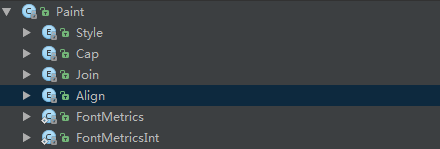
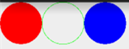
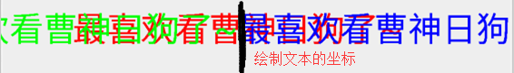
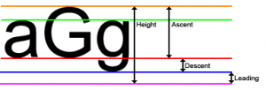
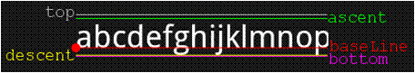
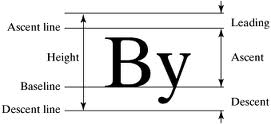
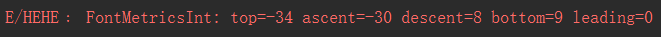
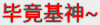

## 一、本节引言：
在[9.3.1、三个绘图工具类详解](../custom/drawable-tool.html)Paint的方法参数那里我们就接触到 了这样几个东西：Paint.Style，Paint.Cap，Paint.Join等，这些都是Paint中的一些枚举值，相关 方法我们可以通过设置这些枚举值来设置特定效果比如：Style：画笔样式，Join图形结合方式等， 本节我们走进Paint的源码，我们来一一介绍这些枚举值，另外我们也顺道讲下这个ShadowLayer 设置带阴影效果的Paint！打开Paint类的源码，我们可以看到下述这些枚举值：



好了，不BB，开始本节内容！


## 二、get枚举用法：
不知大家对枚举陌生还是熟悉，这里把贴下Paint.Style相关的调用代码(带有参构造方法的枚举) ，让大家体会体会：
```java
public enum Style {
    //定义枚举,通过括号赋值
    FILL            (0),
    STROKE          (1),
    FILL_AND_STROKE (2);
    //有参构造方法
    Style(int nativeInt) {
        this.nativeInt = nativeInt;
    }
    final int nativeInt;
}
//设置画笔Style的方法
public void setStyle(Style style) {
    native_setStyle(mNativePaint, style.nativeInt);
}
//JNI设置画笔风格的方法，这里我们无需关注
private static native void native_setStyle(long native_object, int style);
```

下面我们一一来解释这些枚举值的作用！


## 三、Paint.Style
作用：画笔的样式 可选值：

- FILL：填充内部(默认)
- STROKE：只描边
- FILL_AND_STROKE：填充内部与描边

方法调用：`setStyle(Paint.Style style)` 对应效果：




## 四、Paint.Cap
作用：笔触风格，设置画笔始末端的图形(画笔开始画的第一点与最后一点) 可选值：

- BUTT：笔触是长方形且不超过路径(默认)
- ROUND：笔触是圆形
- SQUARE：笔触是正方形

方法调用：`setStrokeCap(Paint.Cap cap)`

对应效果：平时我们直接画的是第一个，其他两个会比普通的多一点而外的区域，第二个 是圆角，第三个是矩形！


## 五、Paint.Join
作用：设置接合处的状态，比如你的线是由多条小线拼接而成，拼接处的形状 可选值：

- MITER：接合处为锐角(默认)
- ROUND：接合处为圆弧
- BEVEL：接合处为直线

方法调用：`setStrokeJoin(Paint.Join join)`

一般圆弧用得多，可参见之前的[擦掉美女衣服Demo的显示](../custom/xfermode-porterduff4.html)

另外还有个setStrokeMiter(float miter)是设置笔画的倾斜度，miter > = 0； 如：小时候用的铅笔，削的时候斜与垂直削出来的笔尖效果是不一样的。 主要是用来设置笔触的连接处的样式。可以和setStrokeJoin()来比较比较。


## 六、Paint.Align
作用：设置绘制文本的对其方式，就是相对于绘制文字的[x,y]起始坐标 可选值：

- LEFT：在起始坐标的左边绘制文本
- RIGHT：在起始坐标的右边绘制文本
- CENTER：以其实坐标为中心绘制文本

方法调用：setTextAlign(Paint.Align align)

对应效果：另外可调用setTextSize()设置绘制文本的大小~




## 七、Paint.FontMetrics和Paint.FontMetricsInt
字体属性及测量，另外这两个方法是一样的，只是后者取到的值是一个整形， 这里我们选FontMetricsInt来给大家讲解下，有下面这五个常量值，这里参考的基准点是： 下划线的位置(Baseline)

- top：最高字符到baseline的距离，即ascent的最大值
- ascent：字符最高处的距离到baseline的值
- descent：下划线到字符最低处的距离
- bottom：下划线到最低字符的距离，即descent的最大值
- leading：上一行字符的descent到下一行的ascent之间的距离

我们看几个图帮助理解下：








然后我们随意画一串字母，把这些值打印出来： canvas.drawText("abcdefghijklnmopqrstuvwxyz", 400, 400, mPaint1);
Log.e("HEHE", mPaint1.getFontMetricsInt().toString());
运行下，我们可以看到，打印出来的Log如下：



看完思考思考，画一画，应该不难理解！这里我们知道下就好，如果你想更 深入研究，可以参考下这篇：[Android字符串进阶之三：字体属性及测量（FontMetrics）](http://mikewang.blog.51cto.com/3826268/871765/)


## 八、ShadowLayer设置阴影效果
我们在TextView那一节就教过大家为TextView的文本设置阴影效果，而Paint其实也提供了设置 阴影效果的API：setShadowLayer(float radius, float dx, float dy, int shadowColor)

参数：radius为阴影的角度，dx和dy为阴影在x轴和y轴上的距离，shadowColor为阴影的颜色 我们可以写个非常简单的句子验证下：
```java
mPaint1.setShadowLayer(5,0,0,Color.BLACK);
canvas.drawText("毕竟基神~", 400, 400, mPaint1);    //绘制文字
```

效果如下：



另外我们还可以调用clearShadowLayer()来清除这个阴影层~


## 九、本节小结：
好的，本节给大家讲解了下Paint里面的几个枚举值以及静态常量，以及ShadowLayer为画笔 设置阴影效果或调用clearShadowLayer()清除阴影层~其实这些东西都可以自己去看源码以及 文档，有疑惑就动手写个Demo，很多东西就自然一清二楚的了，嗯，就说这么多，谢谢~

另外，可能你不知道在哪看到了我的QQ，但是可以的话尽量加群好么，平时也要上班， 一个两个还好，一堆人，有心无力，有时帮忙解决问题，结果一天什么都没做，望各位体谅， 有问题加请加小猪群，群管理都是非常热心的：421858269~