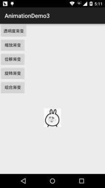
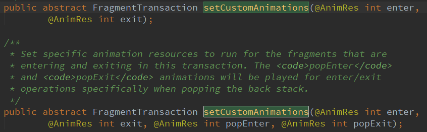
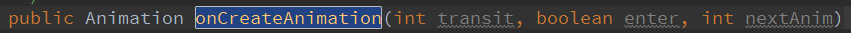
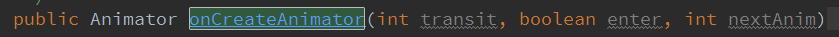
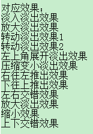
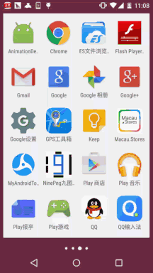

## 一、本节引言：
本节带来的是Android三种动画中的第二种——补间动画(Tween)，和前面学的帧动画不同，帧动画 是通过连续播放图片来模拟动画效果，而补间动画开发者只需指定动画开始，以及动画结束"关键帧"， 而动画变化的"中间帧"则由系统计算并补齐！好了，开始本节学习~


## 二、补间动画的分类和Interpolator
Andoird所支持的补间动画效果有如下这五种，或者说四种吧，第五种是前面几种的组合而已~

- AlphaAnimation：透明度渐变效果，创建时许指定开始以及结束透明度，还有动画的持续 时间，透明度的变化范围(0,1)，0是完全透明，1是完全不透明；对应<alpha/>标签！
- ScaleAnimation：缩放渐变效果，创建时需指定开始以及结束的缩放比，以及缩放参考点， 还有动画的持续时间；对应<scale/>标签！
- TranslateAnimation：位移渐变效果，创建时指定起始以及结束位置，并指定动画的持续 时间即可；对应<translate/>标签！
- RotateAnimation：旋转渐变效果，创建时指定动画起始以及结束的旋转角度，以及动画 持续时间和旋转的轴心；对应<rotate/>标签
- AnimationSet：组合渐变，就是前面多种渐变的组合，对应<set/>标签

在开始讲解各种动画的用法之前，我们先要来讲解一个东西：Interpolator

用来控制动画的变化速度，可以理解成动画渲染器，当然我们也可以自己实现Interpolator 接口，自行来控制动画的变化速度，而Android中已经为我们提供了五个可供选择的实现类：

- LinearInterpolator：动画以均匀的速度改变
- AccelerateInterpolator：在动画开始的地方改变速度较慢，然后开始加速
- AccelerateDecelerateInterpolator：在动画开始、结束的地方改变速度较慢，中间时加速
- CycleInterpolator：动画循环播放特定次数，变化速度按正弦曲线改变： Math.sin(2 * mCycles * Math.PI * input)
- DecelerateInterpolator：在动画开始的地方改变速度较快，然后开始减速
- AnticipateInterpolator：反向，先向相反方向改变一段再加速播放
- AnticipateOvershootInterpolator：开始的时候向后然后向前甩一定值后返回最后的值
- BounceInterpolator： 跳跃，快到目的值时值会跳跃，如目的值100，后面的值可能依次为85，77，70，80，90，100
- OvershottInterpolator：回弹，最后超出目的值然后缓慢改变到目的值

而这个东东，我们一般是在写动画xml文件时会用到，属性是：android:interpolator， 而上面对应的值是：@android:anim/linear_interpolator，其实就是驼峰命名法变下划线而已 AccelerateDecelerateInterpolator对应：@android:anim/accelerate_decelerate_interpolator！


## 三、各种动画的详细讲解
这里的android:duration都是动画的持续时间，单位是毫秒~

### 1）AlphaAnimation(透明度渐变)
anim_alpha.xml：
```xml
<alpha xmlns:android="http://schemas.android.com/apk/res/android"  
    android:interpolator="@android:anim/accelerate_decelerate_interpolator"  
    android:fromAlpha="1.0"  
    android:toAlpha="0.1"  
    android:duration="2000"/>
```

属性解释：

`fromAlpha` :起始透明度
`toAlpha`:结束透明度

透明度的范围为：0-1，完全透明-完全不透明

### 2）ScaleAnimation(缩放渐变)
anim_scale.xml：
```xml
<scale xmlns:android="http://schemas.android.com/apk/res/android"  
    android:interpolator="@android:anim/accelerate_interpolator"  
    android:fromXScale="0.2"  
    android:toXScale="1.5"  
    android:fromYScale="0.2"  
    android:toYScale="1.5"  
    android:pivotX="50%"  
    android:pivotY="50%"  
    android:duration="2000"/>
```

属性解释：

`fromXScale/fromYScale`：沿着X轴/Y轴缩放的起始比例
`toXScale/toYScale`：沿着X轴/Y轴缩放的结束比例
`pivotX/pivotY`：缩放的中轴点X/Y坐标，即距离自身左边缘的位置，比如50%就是以图像的 中心为中轴点


### 3）TranslateAnimation(位移渐变)
anim_translate.xml：
```xml
<translate xmlns:android="http://schemas.android.com/apk/res/android"  
    android:interpolator="@android:anim/accelerate_decelerate_interpolator"  
    android:fromXDelta="0"  
    android:toXDelta="320"  
    android:fromYDelta="0"  
    android:toYDelta="0"  
    android:duration="2000"/>
```

属性解释：

`fromXDelta/fromYDelta`：动画起始位置的X/Y坐标
`toXDelta/toYDelta`：动画结束位置的X/Y坐标


### 4）RotateAnimation(旋转渐变)
anim_rotate.xml：
```xml
<rotate xmlns:android="http://schemas.android.com/apk/res/android"  
    android:interpolator="@android:anim/accelerate_decelerate_interpolator"  
    android:fromDegrees="0"  
    android:toDegrees="360"  
    android:duration="1000"  
    android:repeatCount="1"  
    android:repeatMode="reverse"/> 
```

属性解释：

- `fromDegrees/toDegrees`：旋转的起始/结束角度
- `repeatCount`：旋转的次数，默认值为0，代表一次，假如是其他值，比如3，则旋转4次 另外，值为-1或者infinite时，表示动画永不停止
- `repeatMode`：设置重复模式，默认restart，但只有当repeatCount大于0或者infinite或-1时 才有效。还可以设置成reverse，表示偶数次显示动画时会做方向相反的运动！


### 5）AnimationSet(组合渐变)
非常简单，就是前面几个动画组合到一起而已~

anim_set.xml：
```xml
<set xmlns:android="http://schemas.android.com/apk/res/android"  
    android:interpolator="@android:anim/decelerate_interpolator"  
    android:shareInterpolator="true" >  
  
    <scale  
        android:duration="2000"  
        android:fromXScale="0.2"  
        android:fromYScale="0.2"  
        android:pivotX="50%"  
        android:pivotY="50%"  
        android:toXScale="1.5"  
        android:toYScale="1.5" />  
  
    <rotate  
        android:duration="1000"  
        android:fromDegrees="0"  
        android:repeatCount="1"  
        android:repeatMode="reverse"  
        android:toDegrees="360" />  
  
    <translate  
        android:duration="2000"  
        android:fromXDelta="0"  
        android:fromYDelta="0"  
        android:toXDelta="320"  
        android:toYDelta="0" />  
  
    <alpha  
        android:duration="2000"  
        android:fromAlpha="1.0"  
        android:toAlpha="0.1" />  
</set>  
```


## 四、写个例子来体验下
好的，下面我们就用上面写的动画来写一个例子，让我们体会体会何为补间动画： 首先来个简单的布局：activity_main.xml：
```xml
<LinearLayout xmlns:android="http://schemas.android.com/apk/res/android"
    android:layout_width="match_parent"
    android:layout_height="match_parent"
    android:orientation="vertical">

    <Button
        android:id="@+id/btn_alpha"
        android:layout_width="wrap_content"
        android:layout_height="wrap_content"
        android:text="透明度渐变" />

    <Button
        android:id="@+id/btn_scale"
        android:layout_width="wrap_content"
        android:layout_height="wrap_content"
        android:text="缩放渐变" />

    <Button
        android:id="@+id/btn_tran"
        android:layout_width="wrap_content"
        android:layout_height="wrap_content"
        android:text="位移渐变" />

    <Button
        android:id="@+id/btn_rotate"
        android:layout_width="wrap_content"
        android:layout_height="wrap_content"
        android:text="旋转渐变" />

    <Button
        android:id="@+id/btn_set"
        android:layout_width="wrap_content"
        android:layout_height="wrap_content"
        android:text="组合渐变" />

    <ImageView
        android:id="@+id/img_show"
        android:layout_width="wrap_content"
        android:layout_height="wrap_content"
        android:layout_gravity="center"
        android:layout_marginTop="48dp"
        android:src="@mipmap/img_face" />
    
</LinearLayout>
```

好哒，接着到我们的MainActivity.java，同样非常简单，只需调用AnimationUtils.loadAnimation() 加载动画，然后我们的View控件调用startAnimation开启动画即可~
```java
public class MainActivity extends AppCompatActivity implements View.OnClickListener{

    private Button btn_alpha;
    private Button btn_scale;
    private Button btn_tran;
    private Button btn_rotate;
    private Button btn_set;
    private ImageView img_show;
    private Animation animation = null;

    @Override
    protected void onCreate(Bundle savedInstanceState) {
        super.onCreate(savedInstanceState);
        setContentView(R.layout.activity_main);
        bindViews();
    }

    private void bindViews() {
        btn_alpha = (Button) findViewById(R.id.btn_alpha);
        btn_scale = (Button) findViewById(R.id.btn_scale);
        btn_tran = (Button) findViewById(R.id.btn_tran);
        btn_rotate = (Button) findViewById(R.id.btn_rotate);
        btn_set = (Button) findViewById(R.id.btn_set);
        img_show = (ImageView) findViewById(R.id.img_show);

        btn_alpha.setOnClickListener(this);
        btn_scale.setOnClickListener(this);
        btn_tran.setOnClickListener(this);
        btn_rotate.setOnClickListener(this);
        btn_set.setOnClickListener(this);

    }

    @Override
    public void onClick(View v) {
        switch (v.getId()){
            case R.id.btn_alpha:
                animation = AnimationUtils.loadAnimation(this,
                        R.anim.anim_alpha);
                img_show.startAnimation(animation);
                break;
            case R.id.btn_scale:
                animation = AnimationUtils.loadAnimation(this,
                        R.anim.anim_scale);
                img_show.startAnimation(animation);
                break;
            case R.id.btn_tran:
                animation = AnimationUtils.loadAnimation(this,
                        R.anim.anim_translate);
                img_show.startAnimation(animation);
                break;
            case R.id.btn_rotate:
                animation = AnimationUtils.loadAnimation(this,
                        R.anim.anim_rotate);
                img_show.startAnimation(animation);
                break;
            case R.id.btn_set:
                animation = AnimationUtils.loadAnimation(this,
                        R.anim.anim_set);
                img_show.startAnimation(animation);
                break;
        }
    }
}
```

运行效果图：



嘿嘿，有点意思是吧，还不动手试试，改点东西，或者自由组合动画，做出酷炫的效果吧~


## 五、动画状态的监听
我们可以对动画的执行状态进行监听，调用动画对象的：

- setAnimationListener(new AnimationListener())方法，重写下面的三个方法：
- onAnimationStart()：动画开始
- onAnimtaionRepeat()：动画重复
- onAnimationEnd()：动画结束

即可完成动画执行状态的监听~


## 六、为View动态设置动画效果
先调用AnimationUtils.loadAnimation(动画xml文件)，然后View控件调用startAnimation(anim) 开始动画~这是静态加载的方式，当然你也可以直接创建一个动画对象，用Java代码完成设置，再调用 startAnimation开启动画~


## 七、为Fragment设置过渡动画
这里要注意一点，就是Fragment是使用的v4包还是app包下的Fragment！ 我们可以调用FragmentTransaction对象的setTransition(int transit) 为Fragment指定标准的过场动画，transit的可选值如下：

- TRANSIT_NONE：无动画
- TRANSIT_FRAGMENT_OPEN：打开形式的动画
- TRANSIT_FRAGMENT_CLOSE：关闭形式的动画

上面的标准过程动画是两个都可以调用的，而不同的地方则在于自定义转场动画

setCustomAnimations()方法！

- app包下的Fragment： setCustomAnimations(int enter, int exit, int popEnter, int popExit) 分别是添加，移除，入栈，以及出栈时的动画！ 另外要注意一点的是，对应的动画类型是：属性动画(Property)，就是动画文件 的根标签要是：<objectAnimator>，<valueAnimator>或者是前面两者放到一个<set>里；

- v4包下的Fragment： v4包下的则支持两种setCustomAnimations()



另外要注意一点的是，对应的动画类型是：补间动画(Tween)，和上面的View一样~

可能你会有疑惑，你怎么知道对应的动画类型，其实只要你到Fragment源码那里找下：

onCreateAnimation()方法的一个返回值就知道了：

v4包：



app包：




## 八、为Activity设置过场动画
Activty设置过场动画非常简单，调用的方法是：overridePendingTransition(int enterAnim, int exitAnim)

用法很简单：在startActivity(intent)或者finish()后添加

参数依次是：新Activity进场时的动画，以及旧Activity退场时的动画

下面提供几种比较简单而且常用的过场动画供大家使用~



下载传送门：Activity常用过渡动画.zip


## 九、写个进入APP后登陆注册按钮从底部弹出动画效果的例子：
运行效果图：



代码实现：

首先是我们的布局文件：activity_main.xml：
```xml
<RelativeLayout xmlns:android="http://schemas.android.com/apk/res/android"
    xmlns:tools="http://schemas.android.com/tools"
    android:layout_width="match_parent"
    android:layout_height="match_parent"
    android:background="#DDE2E3"
    tools:context=".MainActivity">

    <LinearLayout
        android:id="@+id/start_ctrl"
        android:layout_width="match_parent"
        android:layout_height="wrap_content"
        android:layout_alignParentBottom="true"
        android:orientation="vertical"
        android:visibility="gone">

        <Button
            android:id="@+id/start_login"
            android:layout_width="match_parent"
            android:layout_height="wrap_content"
            android:background="#F26968"
            android:gravity="center"
            android:paddingBottom="15dp"
            android:paddingTop="15dp"
            android:text="登陆"
            android:textColor="#FFFFFF"
            android:textSize="18sp" />

        <Button
            android:id="@+id/start_register"
            android:layout_width="match_parent"
            android:layout_height="wrap_content"
            android:background="#323339"
            android:gravity="center"
            android:paddingBottom="15dp"
            android:paddingTop="15dp"
            android:text="注册"
            android:textColor="#FFFFFF"
            android:textSize="18sp" />
    </LinearLayout>

</RelativeLayout>
```

接着是MainActivity.java：
```java
public class MainActivity extends AppCompatActivity {
    private LinearLayout start_ctrl;
    @Override
    protected void onCreate(Bundle savedInstanceState) {
        super.onCreate(savedInstanceState);
        setContentView(R.layout.activity_main);
        start_ctrl = (LinearLayout) findViewById(R.id.start_ctrl);
        //设置动画，从自身位置的最下端向上滑动了自身的高度，持续时间为500ms
        final TranslateAnimation ctrlAnimation = new TranslateAnimation(
                TranslateAnimation.RELATIVE_TO_SELF, 0, TranslateAnimation.RELATIVE_TO_SELF, 0,
                TranslateAnimation.RELATIVE_TO_SELF, 1, TranslateAnimation.RELATIVE_TO_SELF, 0);
        ctrlAnimation.setDuration(500l);     //设置动画的过渡时间
        start_ctrl.postDelayed(new Runnable() {
            @Override
            public void run() {
                start_ctrl.setVisibility(View.VISIBLE);
                start_ctrl.startAnimation(ctrlAnimation);
            }
        }, 2000);
    }
}
```

注释写得很清楚了，这里就不BB解释了，如果你对TranslateAnimation.RELATIVE_TO_SELF这个有疑惑， 请自己谷歌或者百度，限于篇幅(我懒)，这里就不写了，蛮简单的~


## 十、本节代码示例下载
[AnimationDemo3.zip](../img/AnimationDemo3.zip)

[AnimationDemo4.zip](../img/AnimationDemo4.zip)


## 十一、本节小结：
本节给大家细细地讲解了下Android中的第二种动画(渐变动画)，四种动画的详解，以及 设置动画监听器，还有如何为View，Fragment和Activity设置动画，最后还写了一个进入后 从APP底部弹出登陆按钮和注册按钮的例子，篇幅可能有点长，不过都非常容易理解，相信 大家看完都能够收获满满~!好的，本节就到这里，谢谢~