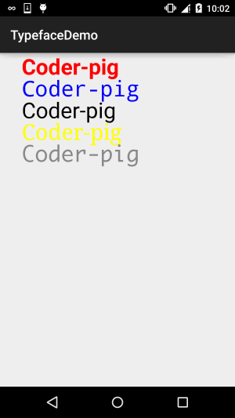

## 一、本节前言
本节带来Paint API系列的最后一个API，Typeface(字型)，由字义，我们大概可以猜到，这个 API是用来设置字体以及字体风格的，使用起来也非常的简单！下面我们来学习下Typeface的一些相关 的用法！

官方API文档：Typeface~


## 二、字体的可选风格
四个整型常量：

- BOLD：加粗
- ITALIC：斜体
- BOLD_ITALIC：粗斜体
- NORMAL：正常


## 三、可选字体对象(Typeface)
Android系统默认支持三种字体，分别为：sans，serif，monospace 而提供的可选静态对象值有五个：

- DEFAULT：默认正常字体对象
- DEFAULT_BOLD：默认的字体对象，注意:这实际上不可能是粗体的,这取决于字体设置。 由getStyle()来确定
- MONOSPACE：monospace 字体风格
- SANS_SERIF：sans serif字体风格
- SERIF：serif字体风格


## 四、自定义创建字型
可能默认的三种字体并不能满足你，可能你喜欢MAC的字体——Monaco字体，你想让你APP 里的文字可以用这种字体，首先准备好我们的TTF文件，然后丢到assets/font/目录下 然后创建对应对象，关键代码如下：

Typeface typeFace =Typeface.createFromAsset(getAssets(),"font/MONACO.ttf");


## 五、使用代码示例：
运行效果图：



自定义的View类：MyView.java：
```java
/**
 * Created by Jay on 2015/11/5 0005.
 */
public class MyView extends View{

    private Paint mPaint1,mPaint2,mPaint3,mPaint4,mPaint5;
    private Context mContext;

    public MyView(Context context) {
        this(context,null);
    }

    public MyView(Context context, AttributeSet attrs) {
        super(context, attrs);
        mContext = context;
        init();
    }

    public MyView(Context context, AttributeSet attrs, int defStyleAttr) {
        super(context, attrs, defStyleAttr);
    }

    private void init(){
        mPaint1 = new Paint();
        mPaint2 = new Paint();
        mPaint3 = new Paint();
        mPaint4 = new Paint();
        mPaint5 = new Paint();

        mPaint1.setColor(Color.RED);
        mPaint2.setColor(Color.BLUE);
        mPaint3.setColor(Color.BLACK);
        mPaint4.setColor(Color.YELLOW);
        mPaint5.setColor(Color.GRAY);


        mPaint1.setTextSize(100);
        mPaint2.setTextSize(100);
        mPaint3.setTextSize(100);
        mPaint4.setTextSize(100);
        mPaint5.setTextSize(100);


        mPaint1.setTypeface(Typeface.DEFAULT_BOLD);
        mPaint2.setTypeface(Typeface.MONOSPACE);
        mPaint3.setTypeface(Typeface.SANS_SERIF);
        mPaint4.setTypeface(Typeface.SERIF);
        mPaint5.setTypeface(Typeface.createFromAsset(mContext.getAssets(), "font/MONACO.ttf"));

    }

    @Override
    protected void onDraw(Canvas canvas) {
        canvas.drawText("Coder-pig", 100, 100, mPaint1);
        canvas.drawText("Coder-pig", 100, 200, mPaint2);
        canvas.drawText("Coder-pig", 100, 300, mPaint3);
        canvas.drawText("Coder-pig", 100, 400, mPaint4);
        canvas.drawText("Coder-pig", 100, 500, mPaint5);
    }
}
```

恩呢，非常简单~就不解释了，要字体的可以自己百度或者下载示例代码~


## 六、本节示例代码下载：
[TypefaceDemo.zip](../img/TypefaceDemo.zip)


## 七、本节小结：
好的，一连十几节的Paint API详解就到这里了，应该已经涵盖大部分的可能会用到的API了， 不知道你都Get了没，这些都是为我们进阶部分的自定义控件做铺垫~嗯，就说这么多，谢谢~