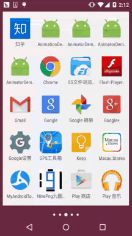
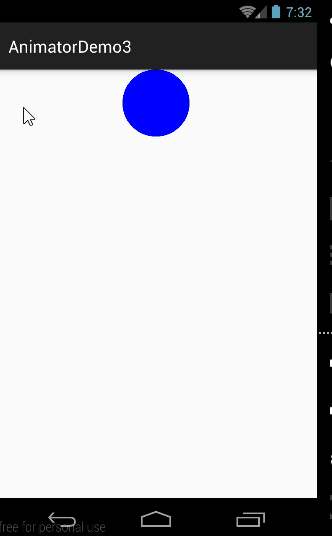
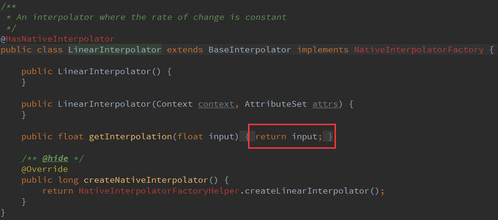
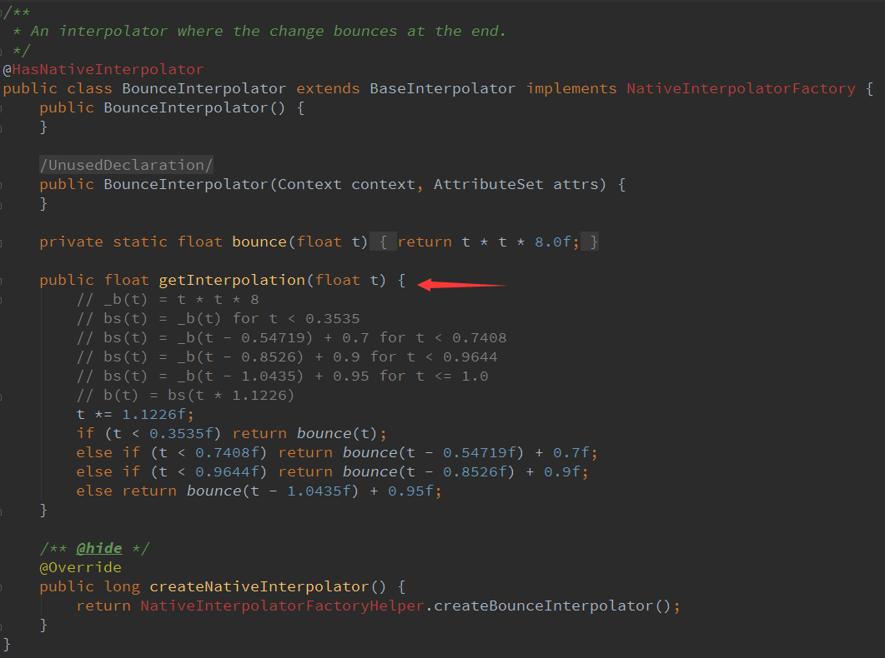

## 一、本节引言：
上节我们对Android的属性动画进行了初步的学习，相信大家对于属性动画已经不再是 一知半解的状态了，本节我们继续来探究Android属性动画的一些更高级的用法！ 依旧贴下郭神的三篇文章~

[Android属性动画完全解析(上)，初识属性动画的基本用法](http://blog.csdn.net/guolin_blog/article/details/43536355)

[Android属性动画完全解析(中)，ValueAnimator和ObjectAnimator的高级用法](http://blog.csdn.net/guolin_blog/article/details/43816093)

[Android属性动画完全解析(下)，Interpolator和ViewPropertyAnimator的用法](http://blog.csdn.net/guolin_blog/article/details/44171115)

内容依旧是参考的上述三篇文章，好的，开始本节内容~


## 二、Evaluator自定义
### 1）Evaluator介绍
上一节中的[9.4.3 Android动画合集之属性动画-初见](valueanimator1.html)，使用动画的第一步都是：

调用ValueAnimator的ofInt()，ofFloat()或ofObject()静态方法创建ValueAnimator实例！

在例子中，ofInt和ofFloat我们都用到了，分别用于对浮点型和整型的数据进行动画操作！

那么ofObject()？初始对象和结束对象？如何过渡法？或者说这玩意怎么用？

好的，带着疑问，我们先来了解一个东西：Evaluator，在属性动画概念叨叨逼处其实我们就说到了这个东西：


用来告诉动画系统如何从初始值过渡到结束值！好的，我们的入手点没错！ 我们进去IntEvaluator的源码，看下里面写了些什么？


嗯，实现了TypeEvaluator接口，然后重写了evaluate()方法，参数有三个，依次是：

- fraction：动画的完成度，我们根据他来计算动画的值应该是多少
- startValue：动画的起始值
- endValue：动画的结束值

动画的值 = 初始值 + 完成度 * (结束值 - 初始值)

同样的还有FloatEvaluator，我们想告诉系统如何从初始对象过度到结束对象，那么我们就要 自己来实现TypeEvaluator接口，即自定义Evaluator了，说多无益，写个例子来看看：


### 2）使用示例
运行效果图：



代码实现：

定义一个对象Point.java，对象中只有x，y两个属性以及get，set方法~
```java
/**
 * Created by Jay on 2015/11/18 0018.
 */
public class Point {

    private float x;
    private float y;

    public Point() {
    }

    public Point(float x, float y) {
        this.x = x;
        this.y = y;
    }

    public float getX() {
        return x;
    }

    public float getY() {
        return y;
    }

    public void setX(float x) {
        this.x = x;
    }

    public void setY(float y) {
        this.y = y;
    }
}
```

接着自定义Evaluator类：PointEvaluator.java，实现接口重写evaluate方法~
```java
/**
 * Created by Jay on 2015/11/18 0018.
 */
public class PointEvaluator implements TypeEvaluator<Point>{
    @Override
    public Point evaluate(float fraction, Point startValue, Point endValue) {
        float x = startValue.getX() + fraction * (endValue.getX() - startValue.getX());
        float y = startValue.getY() + fraction * (endValue.getY() - startValue.getY());
        Point point = new Point(x, y);
        return point;
    }
}
```

然后自定义一个View类：AnimView.java，很简单~
```java
/**
 * Created by Jay on 2015/11/18 0018.
 */
public class AnimView extends View {

    public static final float RADIUS = 80.0f;
    private Point currentPoint;
    private Paint mPaint;

    public AnimView(Context context) {
        this(context, null);
    }

    public AnimView(Context context, AttributeSet attrs) {
        super(context, attrs);
        init();
    }

    public AnimView(Context context, AttributeSet attrs, int defStyleAttr) {
        super(context, attrs, defStyleAttr);
    }

    private void init() {
        mPaint = new Paint(Paint.ANTI_ALIAS_FLAG);
        mPaint.setColor(Color.BLUE);
    }

    private void drawCircle(Canvas canvas){
        float x = currentPoint.getX();
        float y = currentPoint.getY();
        canvas.drawCircle(x, y, RADIUS, mPaint);
    }

    private void startAnimation() {
        Point startPoint = new Point(RADIUS, RADIUS);
        Point endPoint = new Point(getWidth() - RADIUS, getHeight() - RADIUS);
        ValueAnimator anim = ValueAnimator.ofObject(new PointEvaluator(), startPoint, endPoint);
        anim.addUpdateListener(new ValueAnimator.AnimatorUpdateListener() {
            @Override
            public void onAnimationUpdate(ValueAnimator animation) {
                currentPoint = (Point) animation.getAnimatedValue();
                invalidate();
            }
        });
        anim.setDuration(3000l);
        anim.start();
    }

    @Override
    protected void onDraw(Canvas canvas) {
        if (currentPoint == null) {
            currentPoint = new Point(RADIUS, RADIUS);
            drawCircle(canvas);
            startAnimation();
        } else {
            drawCircle(canvas);
        }
    }
}
```

最后MainActivity.java处实例化这个View即可~
```java
public class MainActivity extends AppCompatActivity {
    @Override
    protected void onCreate(Bundle savedInstanceState) {
        super.onCreate(savedInstanceState);
        setContentView(new AnimView(this));
    }
}
```


### 3)示例增强版
我们上面示例的基础上加上圆移动时的颜色变化~ 这里我们另外用一个ObjectAnimator来加载颜色变化的动画，我们在View中加多个 int color来控制颜色，另外写上getColor()和setColor()的方法，我们先来自定义个Evaluator吧~

运行效果图：


实现代码：

`ColorEvaluator.java：`
```java
/**
 * Created by Jay on 2015/11/18 0018.
 */
public class ColorEvaluator implements TypeEvaluator<Integer>{
    @Override
    public Integer evaluate(float fraction, Integer startValue, Integer endValue) {
        int alpha = (int) (Color.alpha(startValue) + fraction *
                (Color.alpha(endValue) - Color.alpha(startValue)));
        int red = (int) (Color.red(startValue) + fraction *
                (Color.red(endValue) - Color.red(startValue)));
        int green = (int) (Color.green(startValue) + fraction *
                (Color.green(endValue) - Color.green(startValue)));
        int blue = (int) (Color.blue(startValue) + fraction *
                (Color.blue(endValue) - Color.blue(startValue)));
        return Color.argb(alpha, red, green, blue);
    }
}
```

然后自定义View那里加个color，get和set方法；创建一个ObjectAnimator， 和AnimatorSet，接着把动画组合到一起就到，这里就加点东西而已，怕读者有问题， 直接另外建个View吧~

`AnimView2.java：`
```java
/**
 * Created by Jay on 2015/11/18 0018.
 */
public class AnimView2 extends View {

    public static final float RADIUS = 80.0f;
    private Point currentPoint;
    private Paint mPaint;
    private int mColor;

    public AnimView2(Context context) {
        this(context, null);
    }

    public AnimView2(Context context, AttributeSet attrs) {
        super(context, attrs);
        init();
    }

    public AnimView2(Context context, AttributeSet attrs, int defStyleAttr) {
        super(context, attrs, defStyleAttr);
    }

    private void init() {
        mPaint = new Paint(Paint.ANTI_ALIAS_FLAG);
        mPaint.setColor(Color.BLUE);
    }


    private void drawCircle(Canvas canvas){
        float x = currentPoint.getX();
        float y = currentPoint.getY();
        canvas.drawCircle(x, y, RADIUS, mPaint);
    }

    private void startAnimation() {
        Point startPoint = new Point(RADIUS, RADIUS);
        Point endPoint = new Point(getWidth() - RADIUS, getHeight() - RADIUS);
        ValueAnimator anim = ValueAnimator.ofObject(new PointEvaluator(), startPoint, endPoint);
        anim.addUpdateListener(new ValueAnimator.AnimatorUpdateListener() {
            @Override
            public void onAnimationUpdate(ValueAnimator animation) {
                currentPoint = (Point) animation.getAnimatedValue();
                invalidate();
            }
        });

        ObjectAnimator objectAnimator = ObjectAnimator.ofObject(this, "color", new ColorEvaluator(),
                Color.BLUE, Color.RED);
        //动画集合将前面两个动画加到一起，with同时播放
        AnimatorSet animatorSet = new AnimatorSet();
        animatorSet.play(anim).with(objectAnimator);
        animatorSet.setStartDelay(1000l);
        animatorSet.setDuration(3000l);
        animatorSet.start();
    }

    @Override
    protected void onDraw(Canvas canvas) {
        if (currentPoint == null) {
            currentPoint = new Point(RADIUS, RADIUS);
            drawCircle(canvas);
            startAnimation();
        } else {
            drawCircle(canvas);
        }
    }

    //color的get和set方法~
    public int getColor() {
        return mColor;
    }

    public void setColor(int color) {
        mColor = color;
        mPaint.setColor(color);
        invalidate();
    }
}
```

然后MainActivity，setContentView那里把AnimView改成AnimView2就好~


## 三、Interpolator(补间器)
嗯，在讲补间动画的时候我们就讲过这个东东了~不知道你还有印象没？


上面的补间器补间动画和属性动画都可用，而且补间动画还新增了一个TimeInterpolator接口 该接口是用于兼容之前的Interpolator的，这使得所有过去的Interpolator实现类都可以直接拿过来 放到属性动画当中使用！我们可以调用动画对象的setInterpolator()方法设置不同的Interpolator！ 我们先该点东西，让小球从屏幕正中央的顶部掉落到底部~ 然后我们会我们为我们的集合动画调用下述语句： animatorSet.setInterpolator(new AccelerateInterpolator(2f)); 括号里的值用于控制加速度~

运行效果：



好像有点不和常理，正常应该是会弹起来的吧，我们换成BounceInterpolator试试~


嘿嘿，效果蛮赞的，当然还有N多个系统提供好的Interpolator，大家可以自己一一尝试，这里就 不慢慢跟大家纠结了~

下面我们来看看：


### 1）Interpolator的内部实现机制
我们先到TimeInterpolator接口的源码，发现这里只有一个getInterpolation()方法；


简单的解释： getInterpolation()方法中接收一个input参数，这个参数的值会随着动画的运行而不断变化， 不过它的变化是非常有规律的，就是根据设定的动画时长匀速增加，变化范围是0到1。 也就是说当动画一开始的时候input的值是0，到动画结束的时候input的值是1，而中间的值则 是随着动画运行的时长在0到1之间变化的。

这里的input值决定了我们TypeEvaluator接口里的fraction的值。 input的值是由系统经过计算后传入到getInterpolation()方法中的，然后我们可以自己实现 getInterpolation()方法中的算法，根据input的值来计算出一个返回值，而这个返回值就是fraction了。

我们可以看看LinearInterpolator里的代码：



这里没有处理过直接返回input值，即fraction的值就是等于input的值，这就是匀速运动的 Interpolator的实现方式！其实无非就是算法不同，这就涉及到一些数学的东西了，又一次 体会到数学的重要性了，这里再贴个BounceInterpolator的源码吧：



别问我这里的算法，我也不知道哈，我们再找个容易理解点的：AccelerateDecelerateInterpolator


这个Interpolator是先加速后减速效果的： (float)(Math.cos((input + 1) * Math.PI) / 2.0f) + 0.5f 的算法理解：

解：由input的取值范围为[0,1]，可以得出cos中的值的取值范围为[π,2π]，对应的值为-1和1； 再用这个值来除以2加上0.5之后，getInterpolation()方法最终返回的结果值范围还是[0,1]， 对应的曲线图如下：


所以是一个先加速后减速的过程！

嗯，学渣没法玩了...，上面全是郭大叔文章里搬过来的...我想静静...


### 2）自定义Interpolator
好吧，还是等会儿再忧伤吧，写个自定义的Interpolator示例先： 非常简单，实现TimeInterpolator接口，重写getInterpolation方法

示例代码如下
```java
private class DecelerateAccelerateInterpolator implements TimeInterpolator {
    @Override
    public float getInterpolation(float input) {
        if (input < 0.5) {
            return (float) (Math.sin(input * Math.PI) / 2);
        } else {
            return 1 - (float) (Math.sin(input * Math.PI) / 2);
        }
    }
}
```

调用setInterpolator(new DecelerateAccelerateInterpolator())设置下即可~ 限于篇幅就不贴图了~


## 四、ViewPropertyAnimator
3.1后系统当中附增的一个新的功能，为View的动画操作提供一种更加便捷的用法！ 假如是以前，让一个TextView从正常状态变成透明状态，会这样写：
```java
ObjectAnimator animator = ObjectAnimator.ofFloat(textview, "alpha", 0f);  
animator.start();
```

而使用ViewPropertyAnimator来实现同样的效果则显得更加易懂：
```java
textview.animate().alpha(0f); 
```

还支持连缀用法，组合多个动画，设定时长，设置Interpolator等~
```java
textview.animate().x(500).y(500).setDuration(5000)  
        .setInterpolator(new BounceInterpolator());
```

用法很简单，使用的时候查下文档就好~，另外下面有几个细节的地方要注意一下！

- 整个ViewPropertyAnimator的功能都是建立在View类新增的animate()方法之上的， 这个方法会创建并返回一个ViewPropertyAnimator的实例，之后的调用的所有方法， 设置的所有属性都是通过这个实例完成的。
- 使用ViewPropertyAnimator将动画定义完成之后，动画就会自动启动。 并且这个机制对于组合动画也同样有效，只要我们不断地连缀新的方法， 那么动画就不会立刻执行，等到所有在ViewPropertyAnimator上设置的方法都执行完毕后， 动画就会自动启动。当然如果不想使用这一默认机制的话，我们也可以显式地调用 start()方法来启动动画。
- ViewPropertyAnimator的所有接口都是使用连缀的语法来设计的，每个方法的返回值都是 它自身的实例，因此调用完一个方法之后可以直接连缀调用它的另一个方法，这样把所有的 功能都串接起来，我们甚至可以仅通过一行代码就完成任意复杂度的动画功能。


## 五、本节示例代码下载
[AnimatorDemo3.zip](../img/AnimatorDemo3.zip)

在Github上找到一个动画合集的项目，很多动画效果都有，下面贴下地址：

[BaseAnimation 动画合集](https://github.com/z56402344/BaseAnimation)

想研究各种动画是如何实现的可自行查看源码~


## 六、本节小结
嗯，本节我们讲了一些稍微高深一点的东西Evaluator啊，Interpolator啊，还有 ViewPropertyAnimator，是不是又拓展了大家的见识~本节也是Android基础入门绘图 与的最后一小节了，如果大家把这一章节的内容都掌握了，再去学自定义控件， 或者看别人写的自定义控件，应该不会再那么地不知道从何入手，遇到一堆新面孔了吧！

嗯，还是谢谢郭神的文章，属性动画部分的内容很都是直接在郭神那里搬过来的 嘿嘿~本节就到这里，谢谢~

PS:后面的示意图换模拟器是因为的N5秀逗了...