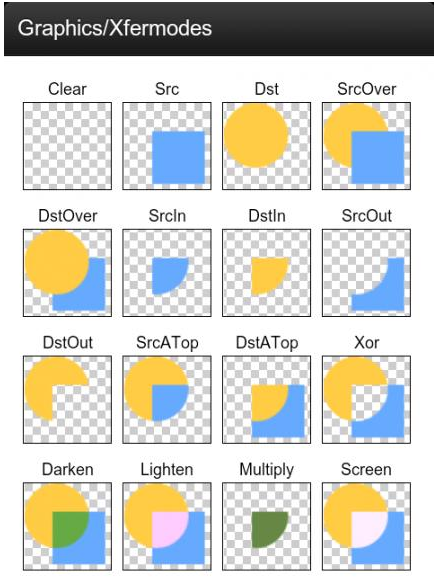
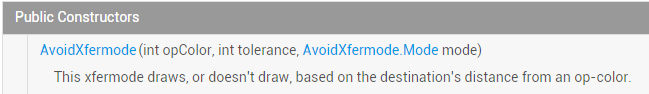
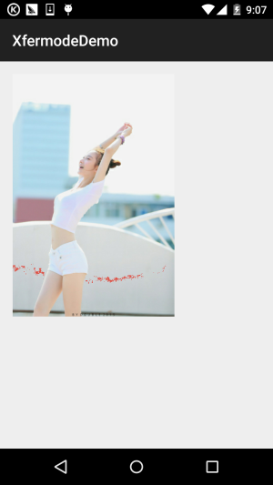
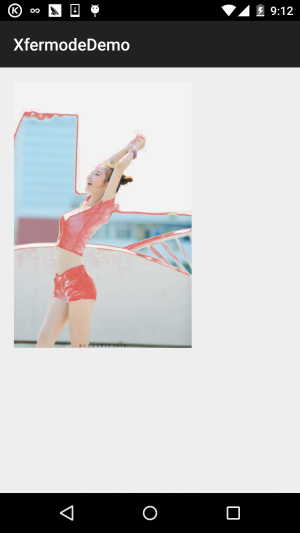
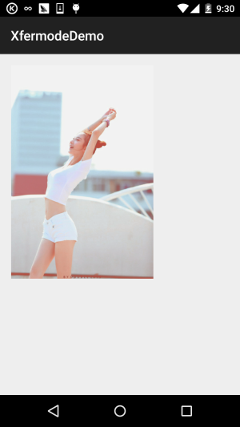
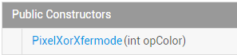
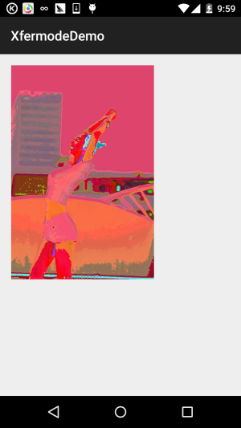

## 一、本节引言：
不知道标题这两个玩意你熟不熟悉啦，如果自己实现过圆角或者圆形图片，相信对这两个名词 并不模式，一时半伙没想起来？没关系，下面这个图你可曾见过？




PS：网上都说在：\samples\android-XX\legacy\ApiDemos\src\com\example\android\apis\graphics 下能找到这个图片- -，然而并没有，不知道是不是因为我的sample是android-22的，只在这里找到一个 Xfermodes.java的Java文件！这里直接贴下网上找到的~

嗯，说回来，这图相信大部分朋友都见过吧，没见过也没关系，本节我们带大家来一点点的学习 这个东西~，看回我们前面的[Android基础入门教程——9.3.1、三个绘图工具类详解](../custom/drawable-tool.html)

setXfermode(Xfermode xfermode)：设置图形重叠时的处理方式，如合并，取交集或并集， 经常用来制作橡皮的擦除效果！

我们来到官方文档：Xfermode，我们发现他有三个儿子：


本节我们来学习他的前两个儿子~


## 二、大儿子：AvoidXfermode
嗯，和前面学的MaskFilter的两个子类一样，不支持硬件加速，所以如果是API 14以上的版本， 需要关闭硬件加速才会有效果！怎么关自己看上一节哈~

我们来看看他给我们提供的构造方法！官方API文档：AvoidXfermode



参数有三个，依次是：

- opColor：一个十六进制的带透明度的颜色值，比如0x00C4C4;

- tolerance：容差值，如果你学过PS可能用过魔棒工具，就是设置选取颜色值的范围，比如 容差为0，你选的是纯黑的小点，当容差调为40的时候，范围已经扩大到大块黑色这样！如果 还不是很明白，等下我们写写代码就知道了！

- mode：AvoidXfermode模式，有两种：TARGET与AVOID


## 三、模式1：AvoidXfermode.Mode.TARGET
该模式会判断画布上是否有与我们设置颜色值不一样的颜色，如果有的话，会把这些区域 染上一层画笔定义的颜色，其他地方不染色！下面我们写代码演示下，顺便让大家感觉下 这个容差值！

使用代码示例：

运行效果图：

嗯，先上下原图，素材来自gank.io：


接下来我们随便把墙上某个地方的颜色用颜色取色器取下，然后写一个简单的View!

PS:需要在AndroidManifest.xml中的appliction节点添加关闭硬件加速： android:hardwareAccelerated="false"
```java
/**
 * Created by Jay on 2015/10/22 0022.
 */
public class AvoidXfermodeView1 extends View {

    private Paint mPaint;
    private Bitmap mBitmap;
    private AvoidXfermode avoidXfermode;

    public AvoidXfermodeView1(Context context) {
        super(context);
        init();
    }

    public AvoidXfermodeView1(Context context, AttributeSet attrs) {
        super(context, attrs);
        init();
    }

    public AvoidXfermodeView1(Context context, AttributeSet attrs, int defStyleAttr) {
        super(context, attrs, defStyleAttr);
        init();
    }

    private void init() {
        mPaint = new Paint(Paint.ANTI_ALIAS_FLAG);  //抗锯齿
        avoidXfermode = new AvoidXfermode(0XFFCCD1D4, 0, AvoidXfermode.Mode.TARGET);
        mBitmap = BitmapFactory.decodeResource(getResources(), R.mipmap.iv_meizi);

    }

    @Override
    protected void onDraw(Canvas canvas) {
        canvas.drawBitmap(mBitmap, 50, 50, mPaint);
        mPaint.setARGB(255, 222, 83, 71);
        mPaint.setXfermode(avoidXfermode);
        canvas.drawRect(50, 50, 690, 1010, mPaint);
    }
}
```

运行后的效果：



看到墙上那堆姨妈红了没，效果杠杠的，这里我们的容差值并没有发挥作用，我们改一改，把 妹子的白衣服变成姨妈红！

我们把上面构造AvoidXfermode的内容改成：

avoidXfermode = new AvoidXfermode(0XFFD9E5F3, 25, AvoidXfermode.Mode.TARGET);
然后，妹子身上的白衣服就变成姨妈红了...，满满的罪恶感...




## 四、模式2：AvoidXfermode.Mode.AVOID
和上面的TARGET模式相反，上面是颜色一样才改变颜色，这里是颜色不一样反而改变颜色， 而容差值同样带来相反的结果，容差值为0时，只有当图片中的像素颜色值与设置的颜色值完全不一样 的时候才会被染色，而当容差值达到最大值255的时候，稍微有一点颜色不一样就会被染色！ 我们只需简单的修改上面的例子就可以了，同一是修改下构造AvoidXfermode的内容！ 我们改成下面这句：
```java
avoidXfermode = new AvoidXfermode(0XFFD9E5F3,230, AvoidXfermode.Mode.AVOID);
```

运行效果图：




## 五、二儿子：PixelXorXfermode
这个则是另一种图像混排模式，比起大儿子更简单，他的构造方法如下：

官方API文档：PixelXorXfermode



参数解析：

就一个16进制带透明值得颜色值，至于这个值的作用，是有一个算法的： PixelXorXfermode内部是按照" opColor ^ src ^ dst "这个异或算法运算的， 得到一个不透明的(alpha = 255)的色彩值，设置到图像中！好吧，这是网上搜的 具体我也不知道，写个例子试试效果呗~

代码示例：

运行效果图：



实现代码：
```java
/**
 * Created by Jay on 2015/10/22 0022.
 */
public class PixelXorXfermodeView1 extends View{

    private Paint mPaint;
    private Bitmap mBitmap;
    private PixelXorXfermode pixelxorXfermode;

    public PixelXorXfermodeView1(Context context) {
        super(context);
        init();

    }

    public PixelXorXfermodeView1(Context context, AttributeSet attrs) {
        super(context, attrs);
        init();
    }

    public PixelXorXfermodeView1(Context context, AttributeSet attrs, int defStyleAttr) {
        super(context, attrs, defStyleAttr);
        init();
    }

    private void init() {
        mPaint = new Paint(Paint.ANTI_ALIAS_FLAG);  //抗锯齿
        pixelxorXfermode = new PixelXorXfermode(0XFFD9E5F3);
        mBitmap = BitmapFactory.decodeResource(getResources(), R.mipmap.iv_meizi);
    }

    @Override
    protected void onDraw(Canvas canvas) {
        canvas.drawBitmap(mBitmap, 50, 50, mPaint);
        mPaint.setARGB(255, 222, 83, 71);
        mPaint.setXfermode(pixelxorXfermode);
        canvas.drawRect(50, 50, 690, 1010, mPaint);
    }
}
```


## 六、本节示例代码下载：
[XfermodeDemo.zip](../img/XfermodeDemo.zip)


## 七、本节小结：
好吧，满满的罪恶感，很漂亮的一个妹子，结果给我写demo写成了这个样子，别怪我，  嗯，对了，忘记说，Xfermode的大儿子和二儿子已经过世(过期)，在API 16后的版本，就 过期了，也就说本节并没什么卵用...

也不能这样说，Apache在4.4后的版本都给阉割了，但是还是有人用着HttpClient，或者 由这个库写的HTTP请求框架哈~当然，这种人基本很少很少！不过学多点总没坏处，是吧， 下节的三儿子PorterDuffXfermode就没过时啦，也很重要，嗯，放心，不会又会毁照片！ 嗯，就说这么多，谢谢~