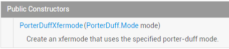
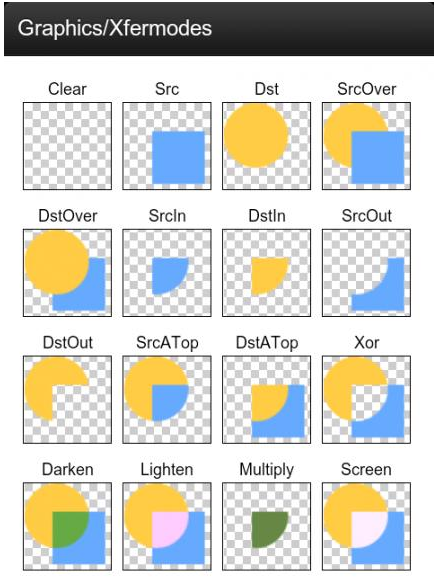

## 一、本节引言：
上一节，我们学习了Xfermode两个已经过世(过时)的儿子：AvoidXfermode， PixelXorXfermode， 虽然说有点用，但是终归是被淘汰的了，本节我们来学习Xfermode还健在的三儿子：PorterDuffXfermode；

先祭上官方API文档：PorterDuffXfermode！文档内容很少，我们可以看到他的构造方法：



参数只有一个：PorterDuff.Mode mode，而Android给我们提供了16种图片混排模式，简单点可以 理解为两个图层按照不同模式，可以组合成不同的结果显示出来！16种混排模式的结果图如下：



这里两个图层：先绘制的图是目标图(DST)，后绘制的图是源图(SRC)！

当然，在文档中我们发现可供使用的模式并不是16种，而是18种，新增了ADD和OVERLAY两种模式!

嗯，说多也白说，代码最实际，本节我们写下代码来验证下这18种模式吧！

PS:这个PorterDuff的命名其实是两个人名的组合：Tomas Proter和 Tom Duff组成的，他们是最早在 最早在SIGGRAPH上提出图形混合概念的大神级人物，有兴趣的自行百度~


## 二、写个例子来验证上面的这个图：
好的，我们来写个例子验证下上面这个图，通过修改不同的模式，来对结果进行对比分析！

代码实现：

Step 1：我们先写个获取屏幕宽高的工具类吧！ScreenUtil.java：
```java
/**
 * Created by Jay on 2015/10/23 0023.
 */
public class ScreenUtil {
    /**
     * 获取屏幕宽高，sdk17后不建议采用
     *
     * @param context
     */
    public static int[] getScreenHW(Context context) {
        WindowManager manager = (WindowManager) context.getSystemService(Context.WINDOW_SERVICE);
        Display display = manager.getDefaultDisplay();
        int width = display.getWidth();
        int height = display.getHeight();
        int[] HW = new int[] { width, height };
        return HW;
    }

    /**
     * 获取屏幕宽高，建议采用
     *
     * @param context
     */
    public static int[] getScreenHW2(Context context) {
        WindowManager manager = (WindowManager) context.getSystemService(Context.WINDOW_SERVICE);
        DisplayMetrics dm = new DisplayMetrics();
        manager.getDefaultDisplay().getMetrics(dm);
        int width = dm.widthPixels;
        int height = dm.heightPixels;
        int[] HW = new int[] { width, height };
        return HW;
    }

    /**
     * 获取屏幕的宽度
     *
     * @param context
     * @return
     */
    public static int getScreenW(Context context) {
        return getScreenHW2(context)[0];
    }

    /**
     * 获取屏幕的高度
     *
     * @param context
     * @return
     */
    public static int getScreenH(Context context) {
        return getScreenHW2(context)[1];
    }
}
```

Step 2：编写我们的自定义View类，在这里做试验！XfermodeView.java：
```java
/**
 * Created by Jay on 2015/10/23 0023.
 */
public class XfermodeView extends View {

    private PorterDuffXfermode pdXfermode;   //定义PorterDuffXfermode变量
    //定义MODE常量，等下直接改这里即可进行测试
    private static PorterDuff.Mode PD_MODE = PorterDuff.Mode.ADD;
    private int screenW, screenH; //屏幕宽高
    private int width = 200;      //绘制的图片宽高
    private int height = 200;
    private Bitmap srcBitmap, dstBitmap;     //上层SRC的Bitmap和下层Dst的Bitmap

    public XfermodeView(Context context) {
        this(context, null);
    }

    public XfermodeView(Context context, AttributeSet attrs) {
        super(context, attrs);
        screenW = ScreenUtil.getScreenW(context);
        screenH = ScreenUtil.getScreenH(context);
        //创建一个PorterDuffXfermode对象
        pdXfermode = new PorterDuffXfermode(PD_MODE);
        //实例化两个Bitmap
        srcBitmap = makeSrc(width, height);
        dstBitmap = makeDst(width, height);
    }

    public XfermodeView(Context context, AttributeSet attrs, int defStyleAttr) {
        super(context, attrs, defStyleAttr);
    }


    //定义一个绘制圆形Bitmap的方法
    private Bitmap makeDst(int w, int h) {
        Bitmap bm = Bitmap.createBitmap(w, h, Bitmap.Config.ARGB_8888);
        Canvas c = new Canvas(bm);
        Paint p = new Paint(Paint.ANTI_ALIAS_FLAG);
        p.setColor(0xFF26AAD1);
        c.drawOval(new RectF(0, 0, w * 3 / 4, h * 3 / 4), p);
        return bm;
    }

    //定义一个绘制矩形的Bitmap的方法
    private Bitmap makeSrc(int w, int h) {
        Bitmap bm = Bitmap.createBitmap(w, h, Bitmap.Config.ARGB_8888);
        Canvas c = new Canvas(bm);
        Paint p = new Paint(Paint.ANTI_ALIAS_FLAG);
        p.setColor(0xFFFFCE43);
        c.drawRect(w / 3, h / 3, w * 19 / 20, h * 19 / 20, p);
        return bm;
    }

    @Override
    protected void onDraw(Canvas canvas) {
        Paint paint = new Paint();
        paint.setFilterBitmap(false);
        paint.setStyle(Paint.Style.FILL);
        canvas.drawBitmap(srcBitmap, (screenW / 3 - width) / 2, (screenH / 2 - height) / 2, paint);
        canvas.drawBitmap(dstBitmap, (screenW / 3 - width) / 2 + screenW / 3, (screenH / 2 - height) / 2, paint);

        //创建一个图层，在图层上演示图形混合后的效果
        int sc = canvas.saveLayer(0, 0, screenW, screenH, null, Canvas.MATRIX_SAVE_FLAG |
                Canvas.CLIP_SAVE_FLAG |
                Canvas.HAS_ALPHA_LAYER_SAVE_FLAG |
                Canvas.FULL_COLOR_LAYER_SAVE_FLAG |
                Canvas.CLIP_TO_LAYER_SAVE_FLAG);

        canvas.drawBitmap(dstBitmap, (screenW / 3 - width) / 2 + screenW / 3 * 2,
                (screenH / 2 - height) / 2, paint);     //绘制i
        //设置Paint的Xfermode
        paint.setXfermode(pdXfermode);
        canvas.drawBitmap(srcBitmap, (screenW / 3 - width) / 2 + screenW / 3 * 2,
                (screenH / 2 - height) / 2, paint);
        paint.setXfermode(null);
        // 还原画布
        canvas.restoreToCount(sc);
    }
}
```

代码看起来好复杂是吧，其实不然，无非就是获取了屏幕宽高，然后画了一个矩形一个圆形， 计算了一下他们的位置，然后设置下图层(固定写法)，接着设下下画笔setXfermode，接着 绘制到canvas上而已，你看不懂的可能是绘制位置的计算吧，其实不然，位置你喜欢怎么定 都可以！那么接下来我们来一个个看下解果咯，你只需修改PD_MODE的值设置为不同模式即可！

运行效果图：

### 1）PorterDuff.Mode.ADD：
饱和度叠加


### 2）PorterDuff.Mode.CLEAR：
 所绘制不会提交到画布上，嗯结果...不知道是为什么了，正常是没东西的..


### 3）PorterDuff.Mode.DARKEN：
 取两图层全部区域，交集部分颜色加深


### 4）PorterDuff.Mode.DST：
 只保留目标图的alpha和color，所以绘制出来只有目标图


### 5）PorterDuff.Mode.DST_ATOP：
 源图和目标图相交处绘制目标图，不相交的地方绘制源图


### 6）PorterDuff.Mode.DST_IN：
 两者相交的地方绘制目标图，绘制的效果会受到原图处的透明度影响


### 7）PorterDuff.Mode.DST_OUT：
 在不相交的地方绘制目标图


### 8）PorterDuff.Mode.DST_OVER：
 目标图绘制在上方


### 9）PorterDuff.Mode.LIGHTEN：
 取两图层全部区域，点亮交集部分颜色


### 10）PorterDuff.Mode.MULTIPLY：
 取两图层交集部分叠加后颜色


### 11）PorterDuff.Mode.OVERLAY：
 叠加


### 12）PorterDuff.Mode.SCREEN：
 取两图层全部区域，交集部分变为透明色


### 13）PorterDuff.Mode.SRC：
 只保留源图像的alpha和color，所以绘制出来只有源图


### 14）PorterDuff.Mode.SRC_ATOP：
 源图和目标图相交处绘制源图，不相交的地方绘制目标图


### 15）PorterDuff.Mode.SRC_IN：
 两者相交的地方绘制源图


### 16）PorterDuff.Mode.SRC_OUT：
 不相交的地方绘制源图


### 17）PorterDuff.Mode.SRC_OVER：
 把源图绘制在上方


### 18）PorterDuff.Mode.XOR：
 不相交的地方按原样绘制源图和目标图


## 三、本节示例代码下载：
[PorterDuffXfermodeDemo.zip](../img/PorterDuffXfermodeDemo.zip)


## 四、本节小结：
嗯，本节就写了一个简单的View来验证这18种不同PorterDuff.Mode下的不同效果， 嘿嘿，蛮耗时间的，不过，读者看起来肯定清晰多了是吧~当然，这只是一些初步的见解！

PorterDuffXfermode的PorterDuff.Mode对于我们自定义控件是非常重要的！ 本节我们初步了解，下节我们挑几个例子来练练手！

如果你想看关于PorterDuff.Mode更加详细的介绍可见： [Android Paint之 setXfermode PorterDuffXfermode 讲解](http://blog.csdn.net/tianjian4592/article/details/44783283)，别人写的不错的一篇文章！ 嗯，就到这里，明早体检，今天就写这么多~