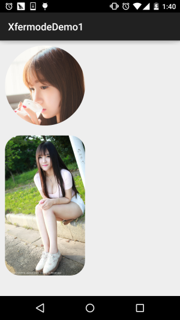

## 一、本节引言：
上一节，我们学习了Xfermode中的三儿子：PorterDuffXfermode构造方法中的为一个参数： PorterDuff.Mode，我们在观看了16种图片混排模式后，又自己写代码来验证了一下文档中 18种不同的混排模式，18种是新增了ADD和OVERLAY两种模式！当然，仅仅验证知道是不够的， 本节我们来写个例子，帮助我们熟悉下实际当中我们如何去使用PorterDuff.Mode为我们提供的 这些混排模式！本节带来的例子是：圆形&圆角图形的实现！

在[3.3.4、ImageView(图像视图)](../widget/imageview.html)我们最后就讲解了一个最简单 绘制圆形ImageView的实现，原理是在图片上调用clipPath切出一个圆形！

而这节则是利用PorterDuff.Mode中的DST_IN模式来实现,话不多说，开始本节内容！ PS：本节例子采自弘洋大神的——[Android Xfermode 实战 实现圆形、圆角图片](http://blog.csdn.net/lmj623565791/article/details/42094215) 另外，还是要贴下PorterDuff.Mode的效果图：


## 二、要实现的效果图以及实现流程分析：
运行后的效果图：



嗯，上述就是我们要实现的一个效果，通过这个PorterDuff.Mode.DST_IN模式来实现！ 我们来分析分析实现流程：

- Step 1： Xfermode无非是两层图构成，先绘制的叫DST图(目标图)，后绘制的叫SRC图(原图)，我们要实现 圆形或者圆角，我们可以先把要显示的图片绘制出来(DST)，这里我们通过src的属性进行了设置； 接着再绘制出圆形和圆角(SRC)，我们想显示的部分是他们相交的地方，而且是图片部分的内容， 所以选择：DST_IN模式！
- Step 2： 嗯，知道了原理，接下来我们要考虑自定义ImageView相关的问题了：
- 我们是想绘制的View是圆角或者圆形，那就需要加个属性来判断，而圆角也需要一个圆角半径的 参数，于是乎我们可以通过自定义属性(attrs.xml)的方式，然后再自定义View的构造方法中，将 这些参数取出来！
- 接着到图片大小的计算了： 首先假如我们设置的是圆形的话，则需要让宽高一致，以最小值为准，我们可以在onMesure()方法 调用getMeasuredXxx()获得宽高，看谁小一点，调用setMeasuredDimension(x, x)；设置宽高！ 然后，我们在onDraw()方法中获取图片宽高，接着按照图片宽高，以及View宽高，计算缩放比例， 假如图片宽高与View的宽高不匹配，所犯后的图片宽高一定要大于View的宽高，so，取大值！
- 再接着就到图片的绘制了，定义一个绘制图形的方法，接着初始化画笔后，设置setXfermode为 PorterDuff.Mode.DST_IN，先绘制图片，再绘制图形
- 最后是图片缓存的一些东西，这里用了WeakReference来缓存图片，避免每次onDraw都分配内存 与重绘，最后在invalidate中清楚缓存！

大体的实现流程如上述，知道流程再看代码就简单很多了！


## 三、代码实现：
自定义控件属性：res/attrs.xml：
```xml
<?xml version="1.0" encoding="utf-8"?>
<resources>
    <declare-styleable name="CircleImageView">
        <attr name="Radius" format="dimension"/>
        <attr name="type">
            <enum name="circle" value="0"/>
            <enum name="round" value="1"/>
        </attr>
    </declare-styleable>
</resources>
```

接着是自定义ImageView：CircleImageView.java：
```java
/**
 * Created by Jay on 2015/10/25 0025.
 */
public class CircleImageView extends ImageView {

    private Paint mPaint;
    private Xfermode mXfermode = new PorterDuffXfermode(PorterDuff.Mode.DST_IN);
    private Bitmap mMaskBitmap;
    private WeakReference<Bitmap> mWeakBitmap;

    //图片相关的属性
    private int type;                           //类型，圆形或者圆角
    public static final int TYPE_CIRCLE = 0;
    public static final int TYPE_ROUND = 1;
    private static final int BODER_RADIUS_DEFAULT = 10;     //圆角默认大小值
    private int mBorderRadius;                  //圆角大小


    public CircleImageView(Context context) {
        this(context, null);
    }

    public CircleImageView(Context context, AttributeSet attrs) {
        super(context, attrs);
        mPaint = new Paint();
        mPaint.setAntiAlias(true);
        //取出attrs中我们为View设置的相关值
        TypedArray tArray = context.obtainStyledAttributes(attrs, R.styleable.CircleImageView);
        mBorderRadius = tArray.getDimensionPixelSize(R.styleable.CircleImageView_Radius, BODER_RADIUS_DEFAULT);
        type = tArray.getInt(R.styleable.CircleImageView_type, TYPE_CIRCLE);
        tArray.recycle();
    }

    public CircleImageView(Context context, AttributeSet attrs, int defStyleAttr) {
        super(context, attrs, defStyleAttr);
    }


    @Override
    protected void onMeasure(int widthMeasureSpec, int heightMeasureSpec) {
        super.onMeasure(widthMeasureSpec, heightMeasureSpec);
        if (type == TYPE_CIRCLE) {
            int width = Math.min(getMeasuredWidth(), getMeasuredHeight());
            setMeasuredDimension(width, width);    //设置当前View的大小
        }
    }

    @Override
    protected void onDraw(Canvas canvas) {

        //在缓存中取出bitmap
        Bitmap bitmap = mWeakBitmap == null ? null : mWeakBitmap.get();
        if (bitmap == null || bitmap.isRecycled()) {
            //获取图片宽高
            Drawable drawable = getDrawable();
            int width = drawable.getIntrinsicWidth();
            int height = drawable.getIntrinsicHeight();

            if (drawable != null) {
                bitmap = Bitmap.createBitmap(getWidth(), getHeight(), Bitmap.Config.ARGB_8888);
                Canvas drawCanvas = new Canvas(bitmap);
                float scale = 1.0f;
                if (type == TYPE_ROUND) {
                    scale = Math.max(getWidth() * 1.0f / width, getHeight()
                            * 1.0f / height);
                } else {
                    scale = getWidth() * 1.0F / Math.min(width, height);
                }
                //根据缩放比例，设置bounds，相当于缩放图片了
                drawable.setBounds(0, 0, (int) (scale * width),
                        (int) (scale * height));

                drawable.draw(drawCanvas);
                if (mMaskBitmap == null || mMaskBitmap.isRecycled()) {
                    mMaskBitmap = getBitmap();
                }

                mPaint.reset();
                mPaint.setFilterBitmap(false);
                mPaint.setXfermode(mXfermode);

                //绘制形状
                drawCanvas.drawBitmap(mMaskBitmap, 0, 0, mPaint);

                //bitmap缓存起来，避免每次调用onDraw，分配内存
                mWeakBitmap = new WeakReference<Bitmap>(bitmap);

                //绘制图片
                canvas.drawBitmap(bitmap, 0, 0, null);
                mPaint.setXfermode(null);

            }
        }
        if (bitmap != null) {
            mPaint.setXfermode(null);
            canvas.drawBitmap(bitmap, 0.0f, 0.0f, mPaint);
            return;
        }
    }

    //缓存Bitmap，避免每次OnDraw都重新分配内存与绘图
    @Override
    public void invalidate() {
        mWeakBitmap = null;
        if (mWeakBitmap != null) {
            mMaskBitmap.recycle();
            mMaskBitmap = null;
        }
        super.invalidate();
    }

    //定义一个绘制形状的方法

    private Bitmap getBitmap() {
        Bitmap bitmap = Bitmap.createBitmap(getWidth(), getHeight(),
                Bitmap.Config.ARGB_8888);

        Canvas canvas = new Canvas(bitmap);
        Paint paint = new Paint(Paint.ANTI_ALIAS_FLAG);   //抗锯齿
        paint.setColor(Color.BLACK);
        if (type == TYPE_ROUND) {
            canvas.drawRoundRect(new RectF(0, 0, getWidth(), getHeight()),
                    mBorderRadius, mBorderRadius, paint);
        } else {
            canvas.drawCircle(getWidth() / 2, getWidth() / 2, getWidth() / 2, paint);
        }
        return bitmap;
    }
}
```

最后在布局文件那里调用下:activity_main.xml：
```xml
<LinearLayout xmlns:android="http://schemas.android.com/apk/res/android"
    xmlns:app="http://schemas.android.com/apk/res-auto"
    android:layout_width="match_parent"
    android:layout_height="match_parent"
    android:orientation="vertical">

    <com.jay.xfermodedemo1.CircleImageView
        android:layout_width="160dp"
        android:layout_height="240dp"
        android:layout_margin="10dp"
        android:src="@mipmap/ic_bg_meizi2"
        app:type="circle" />

    <com.jay.xfermodedemo1.CircleImageView
        android:layout_width="160dp"
        android:layout_height="280dp"
        android:layout_margin="10dp"
        android:src="@mipmap/ic_bg_meizi1"
        app:Radius="30dp"
        app:type="round" />
    
</LinearLayout>
```

好的，代码一次看不懂，看多两次就懂的了~


## 四、本节代码示例下载：
[XfermodeDemo1.zip](../img/XfermodeDemo1.zip)


## 五、本节小结：
本节我们讲解了Xfermode与PorterDuff的第一个应用例子，设置DST_IN模式来实现 圆形和圆角图片ImageView的定制，相信大家对PorterDuff的简单应用已经有些眉目了， 打铁趁热，下一节我们同一会写个例子练练手~好的，就说这么多，谢谢~