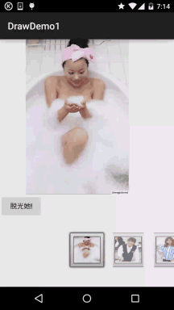

## 一、本节引言：
上节我们写了关于Xfermode与PorterDuff使用的第一个例子：圆角&圆形图片ImageView的实现， 我们体会到了PorterDuff.Mode.DST_IN给我们带来的好处，本节我们继续来写例子练练手， 还记得[9.3.2、绘图类实战示例](../custom/bitmap-demo.html)给大家带来的拔掉美女衣服的实现吗？

当时我们的实现方案是，将手指触碰区域附近的20*20个像素点设置为透明，效果图是这样的：



不知道你有没有发现一个问题，我们擦美女衣服的时候，擦拭的时候都是方块的，但是我们画图板 画图的时候，划线都是很平滑的，有没有办法将两者结合起来，我们擦衣服时也是圆滑的呢？ 答案肯定是有的，就是使用Xfermode咯！本节我们使用另一个模式，DST_OUT模式！ 在不相交的地方绘制目标图


如果你忘记了某个模式或者连18种模式都没见过的话，那么请移步： [Android基础入门教程——9.3.5、Paint API之Xfermode与PorterDuff详解(2)](../custom/xfermode-porterduff2.html) 另外，还是要贴下PorterDuff.Mode的效果图：


嗯，话不多说，开始本节内容~


## 二、要实现的效果图以及实现流程分析：
要实现的效果图：


嗯，不知道你看了那个Gif图多少次了呢？不知道图中是否适合大家的口味，小猪 是从别人的APP上扒下来的，别问我番号或者留邮箱什么的，我什么都不知道~找番什么的， 问群里的老司机——基神吧，好的，我们来分析下实现流程吧~

- 我们来说说原理，其实就是两个Bitmap，一前一后，前面的是穿着衣服的，后面的是没穿衣服的， 然后通过一个Path来记录用户绘制出来的图形，然后为我们的画笔设置DST_OUT的模式，那么 与Path重叠部分的DST(目标图)，就是穿着衣服的图，会变成透明！好哒，很简单！ 我们再慢慢细化！
- 首先我们需要两个Bitmap，用来存储前后两张图片，这里我们让两个Bitmap都全屏！
- 接着设置下画笔，圆角，笔宽，抗锯齿等！
- 再接着定义一个画Path，即用户绘制区域的方法，设置Xfermode后画区域而已！
- 然后重写onTouchEvent方法，这部分和之前的自定义画图板是一样的！
- 最后重写onDraw()方法，先绘制背景图片，调用用户绘制区域的方法，再绘制前景图片！

可能看上去有点复杂，其实不然，代码超简单的说~


## 三、代码实现：
直接就一个自定义View——StripMeiZi.java
```java
/**
 * Created by Jay on 2015/10/25 0025.
 */
public class StripMeiZi extends View{

    private Paint mPaint = new Paint();
    private Path mPath = new Path();
    private Canvas mCanvas;
    private Bitmap mBeforeBitmap;
    private Bitmap mBackBitmap;
    private int mLastX,mLastY;
    private int screenW, screenH; //屏幕宽高
    private Xfermode mXfermode = new PorterDuffXfermode(PorterDuff.Mode.DST_OUT);


    public StripMeiZi(Context context) {
        this(context, null);
    }

    public StripMeiZi(Context context, AttributeSet attrs) {
        super(context, attrs);
        screenW = ScreenUtil.getScreenW(context);
        screenH = ScreenUtil.getScreenH(context);
        init();
    }


    public StripMeiZi(Context context, AttributeSet attrs, int defStyleAttr) {
        super(context, attrs, defStyleAttr);
    }

    private void init() {
        //背后图片，这里让它全屏
        mBackBitmap = BitmapFactory.decodeResource(getResources(), R.mipmap.meizi_back);
        mBackBitmap = Bitmap.createScaledBitmap(mBackBitmap, screenW, screenH, false);
        //前面的图片，并绘制到Canvas上
        mBeforeBitmap = Bitmap.createBitmap(screenW, screenH, Bitmap.Config.ARGB_8888);
        mCanvas = new Canvas(mBeforeBitmap);
        mCanvas.drawBitmap(BitmapFactory.decodeResource(getResources(),
                R.mipmap.meizi_before), null, new RectF(0, 0, screenW, screenH), null);
        //画笔相关的设置
        mPaint.setAntiAlias(true);
        mPaint.setDither(true);
        mPaint.setStyle(Paint.Style.STROKE);
        mPaint.setStrokeJoin(Paint.Join.ROUND); // 圆角
        mPaint.setStrokeCap(Paint.Cap.ROUND); // 圆角
        mPaint.setStrokeWidth(80);    // 设置画笔宽
    }

    private void drawPath() {
        mPaint.setXfermode(mXfermode);
        mCanvas.drawPath(mPath, mPaint);
    }

    @Override
    protected void onDraw(Canvas canvas) {
        canvas.drawBitmap(mBackBitmap, 0, 0, null);
        drawPath();
        canvas.drawBitmap(mBeforeBitmap, 0, 0, null);
    }

    @Override
    public boolean onTouchEvent(MotionEvent event) {
        int action = event.getAction();
        int x = (int) event.getX();
        int y = (int) event.getY();
        switch (action)
        {
            case MotionEvent.ACTION_DOWN:
                mLastX = x;
                mLastY = y;
                mPath.moveTo(mLastX, mLastY);
                break;
            case MotionEvent.ACTION_MOVE:

                int dx = Math.abs(x - mLastX);
                int dy = Math.abs(y - mLastY);

                if (dx > 3 || dy > 3)
                    mPath.lineTo(x, y);

                mLastX = x;
                mLastY = y;
                break;
        }
        invalidate();
        return true;
    }
}
```

布局代码activity_main.xml：
```xml
<RelativeLayout xmlns:android="http://schemas.android.com/apk/res/android"
    xmlns:tools="http://schemas.android.com/tools"
    android:layout_width="match_parent"
    android:layout_height="match_parent"
    tools:context=".MainActivity">

    <com.jay.xfermodedemo2.StripMeiZi
        android:layout_width="match_parent"
        android:layout_height="match_parent"/>

</RelativeLayout>
```


## 四、代码示例下载：
[XfermodeDemo2.zip](../img/XfermodeDemo2.zip)


## 五、本节小结：
好的，本节我们写了Xfermode与PorterDuff的另一个实战例子——手撕美女衣服的Demo，相比起我们之前 那种撕美女衣服(让触摸点附近20*20的像素点变成透明)的方式斯文多了~代码也简单很多是吧，有没有 体会到Android图像混排Xfermode给我们带来的好处，或者对于自定义控件的重要性！嗯，还等什么， 打开你的IDE，把代码撸一遍，尝尝手撕美女衣服的快感吧~