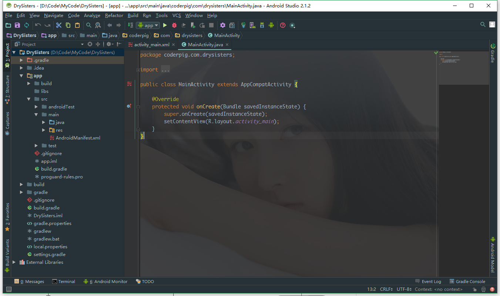
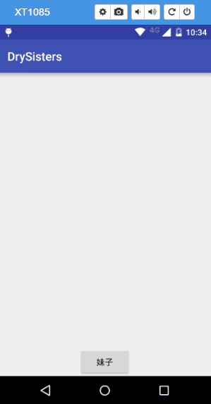

(本节过于简单，只是为了包吃连贯性，非小小白建议跳过！)

## 一、一些BB：
入门教程在上一年的11月份就写完了，到现在也有差不多9个多月了， 当时由于自己工作上的一些原因，没有写一个实战的项目，很是遗憾。 最近项目终于也差不多快收尾了，可能会稍微有一些时间，所以还是 决定把这个遗憾给填补上。毕竟入门教程学了那么多东西，肯定要写 个实战项目整合下，鉴于看入门系列的都是初学者和自己时间的关系， 这个项目就设定为一个简单的看妹子的应用：DrySister(干妹子) 之所以叫这个名字，请听我娓娓道来： 妹子图片来源于[Gank.io](http://gank.io/)，Gank发音有"干客"，简称干，本来想直接 叫GanMeizi的，后来看到Github上已经有人用了，后来手多谷歌翻译了下： 干妹子，然后翻译的结果是：DrySister，索性就用这个名字吧！ 没什么不对，是吧！

另外选这个作为实战项目的原因是看妹子养眼，比如我的AS：



背景插件是：Sexy Editor

右面和Subline Text预览相似的插件是：CodeGlance

AS的MD主题插件是：Material Theme UI

别问我怎么装插件这种问题。

好的，说回来这个实战项目我想怎么搞法，关于用Gank.io接口做接口的 小项目，在Github上面可以找到很多个，然后都是用很酷炫的框架Rx，Retrofit ，Glide，Butterknife等等。我也可以直接写一个： MVP模式，BufferKnife + Dagger2 + Retrofit + Rx + retrolambda + Glide + Relam的项目，但是没太大意义，我想从最简单的Handler开始，然后慢慢加东西， 一点点优化，就好像一个项目迭代一样，而不是写完就把这个项目丢到一边，这样就 完了，其实优化和重构项目的时候会学到更多，真的。好吧，那我们就从Hello world！开始吧！

 就问你嗨不嗨？

好吧，说笑，不过本节还是比较简单的，就写一个简单的显示网络图片的雏形， 后面再一点点迭代优化，什么乱七八糟的都会加上去的！ 另外，项目所有的代码都会托管到Github上，引入分支管理，master分支作为正式的 大版本，develop作为日常的开发分支，加新东西在develop分支上开辟功能分支，编写 完毕后合并回develop分支。大概就这样吧，具体的自己慢慢看！


## 二、创建github仓库
在AS上创建一个新的项目，命名为：DrySister，包名：com.coderpig.drysister 来到项目根目录下打开git bash，键入下述命令创建Git仓库： git init Github上创建一个新的仓库，命名为：DrySister，接着配置下远程仓库， 键入命令： git remote add origin git@github.com:coder-pig/DrySister.git pull下master分支，然后add，commit，push到github仓库，在接着，我对 .gitignore文件进行了修改，我创建了一个新的develop分支，然后在该分支 上提交，然后合并到master分支，好的，关于Git的准备工作就差不多了。


## 三、开始编写程序
我们在本地开辟一个develop分支，然后开始编写代码，布局很简单，一个 显示妹子图的ImageView和Button，activity_main.xml 接着编写一个简单的下载加载图片的类，PictureLoader.java 逻辑很简单，线程将输入流转成字节数组，转换完毕 handler 里 decodeByteArray 将字节数组解码成bitmap，然后显示~
```java
public class PictureLoader {
    private ImageView loadImg;
    private String imgUrl;
    private byte[] picByte;

    Handler handler = new Handler() {
        @Override
        public void handleMessage(Message msg) {
            super.handleMessage(msg);
            if (msg.what == 0x123) {
                if (picByte != null) {
                    Bitmap bitmap = BitmapFactory.decodeByteArray(picByte, 0, picByte.length);
                    loadImg.setImageBitmap(bitmap);
                }
            }
        }
    };

    public void load(ImageView loadImg, String imgUrl) {
        this.loadImg = loadImg;
        this.imgUrl = imgUrl;
        Drawable drawable = loadImg.getDrawable();
        if(drawable != null && drawable instanceof BitmapDrawable) {
            Bitmap bitmap = ((BitmapDrawable)drawable).getBitmap();
            if(bitmap != null && !bitmap.isRecycled()) {
                bitmap.recycle();
            }
        }
        new Thread(runnable).start();
    }

    Runnable runnable = new Runnable() {
        @Override
        public void run() {
            try {
                URL url = new URL(imgUrl);
                HttpURLConnection conn = (HttpURLConnection) url.openConnection();
                conn.setRequestMethod("GET");
                conn.setReadTimeout(10000);
                if (conn.getResponseCode() == 200) {
                    InputStream in = conn.getInputStream();
                    ByteArrayOutputStream out = new ByteArrayOutputStream();
                    byte[] bytes = new byte[1024];
                    int length = -1;
                    while ((length = in.read(bytes)) != -1) {
                        out.write(bytes, 0, length);
                    }
                    picByte = out.toByteArray();
                    in.close();
                    out.close();
                    handler.sendEmptyMessage(0x123);
                }

            } catch (IOException e) {
                e.printStackTrace();
            }
        }
    };
}
```

然后是`MainActivity.java`，也很简单，就不解释了
```java
public class MainActivity extends AppCompatActivity implements View.OnClickListener {
    private Button showBtn;
    private ImageView showImg;
    private ArrayList<String> urls;
    private int curPos = 0;
    private PictureLoader loader;

    @Override protected void onCreate(Bundle savedInstanceState) {
        super.onCreate(savedInstanceState);
        setContentView(R.layout.activity_main);
        loader = new PictureLoader();
        initData();
        initUI();
    }

    private void initData() {
        urls = new ArrayList<>();
        urls.add("http://ww4.sinaimg.cn/large/610dc034jw1f6ipaai7wgj20dw0kugp4.jpg");
        urls.add("http://ww3.sinaimg.cn/large/610dc034jw1f6gcxc1t7vj20hs0hsgo1.jpg");
        urls.add("http://ww4.sinaimg.cn/large/610dc034jw1f6f5ktcyk0j20u011hacg.jpg");
        urls.add("http://ww1.sinaimg.cn/large/610dc034jw1f6e1f1qmg3j20u00u0djp.jpg");
        urls.add("http://ww3.sinaimg.cn/large/610dc034jw1f6aipo68yvj20qo0qoaee.jpg");
        urls.add("http://ww3.sinaimg.cn/large/610dc034jw1f69c9e22xjj20u011hjuu.jpg");
        urls.add("http://ww3.sinaimg.cn/large/610dc034jw1f689lmaf7qj20u00u00v7.jpg");
        urls.add("http://ww3.sinaimg.cn/large/c85e4a5cjw1f671i8gt1rj20vy0vydsz.jpg");
        urls.add("http://ww2.sinaimg.cn/large/610dc034jw1f65f0oqodoj20qo0hntc9.jpg");
        urls.add("http://ww2.sinaimg.cn/large/c85e4a5cgw1f62hzfvzwwj20hs0qogpo.jpg");
    }

    private void initUI() {
        showBtn = (Button) findViewById(R.id.btn_show);
        showImg = (ImageView) findViewById(R.id.img_show);
        showBtn.setOnClickListener(this);
    }

    @Override public void onClick(View v) {
        switch (v.getId()) {
            case R.id.btn_show:
                if (curPos > 9) {
                    curPos = 0;
                }
                loader.load(showImg, urls.get(curPos));
                curPos++;
                break;
        }
    }
}
```


## 四、运行效果图



(看手机屏幕用的是Chrome的插件：Vysor，录Gif用得ScreenToGif)


## 五、小结
先说说本节我们做了些什么：

1. 创建了DrySister项目，并把项目托管到Github上
2. 写了很简单的显示网络图片的功能

待优化与想加的东西：

1. 代码中的图片来源是我们写死的，每天能看到的图片都是那么几张， Gank提供的接口没用到
2. 图片加载类只有加载网络的，应该加上加载本地图片的

下一节要做的事：

1. 用Android自带抠脚解析器解析接口数据，获取图片显示的数据源
2. 优化图片加载类

本节代码下载：[Github：DrySister](https://github.com/coder-pig/DrySister/tree/develop)
