## 一、一些BB
上节我们把妹子图片的数据来源从本地改成了解析Gank提供的接口数据， 我们本节想对这个图片加载类进行优化，比如加上显示本地图片的，另外还有一点 就是缓存，我们现在用得图片加载没有任何缓存可言，每次都是请求后，解析流， 即使是同样的图片每次都要去请求一次，这显得有点累赘，把图片缓存到内存， 或者磁盘里，当访问相同的图片资源我们从这里拿？嗯，好像很有搞头，那么本节 我们就来写一个简单的带缓存的图片加载框架吧！嗯，就叫SisterLoader吧！

(PS：拖着好久没更的原因是因为自己最近在看下载相关的东西，还有改BUG 写图片加载的时候因为一些问题卡住了，抽不出时间解决...)


## 二、简单常识科普
开始写代码之前我们先来撸清楚一些概念先：

### 1）缓存
①引入图片缓存的目的：

答：从网络加载图片费时费电费流量，我们希望把一些加载过的图片可以存起来， 当再次加载时可以复用这个图片。

②什么是二级缓存：

答：说下需要显示一张图片所经历的逻辑，你就一清二楚了： 需要显示图片 ——> 查内存(有的话显示) —没有—>查磁盘(有的话显示) —没有—> 从网络加载(显示出来) ——> 往内存中存一份 ——> 往磁盘存一份

从上我们知道，缓存有两种，内存缓存和磁盘缓存(SD卡/机身存储)：

内存缓存：一级缓存，优先从这里拿，缓存文件存储在data/data/包名/cache目录下， 以前写内存缓存的老旧套路是用Map弱引用的Bitmap对象，我翻了翻上上上家公司的祖传代码：
```java
public class MemoryCache {

    private static final int MAX_CACHE_COUNT = 30;  //设置最大缓存数

    /**
    Map弱引用Bitmap，内存够的情况Bitmap不会被回收，当缓存数大于阈值，会清除最早放入缓存的
     */
    private HashMap<String,SoftReference<Bitmap>> mCacheMap = new LinkedHashMap<String,SoftReference<Bitmap>>() {
        @Override
        protected boolean removeEldestEntry(Entry eldest) {
            return size() > MAX_CACHE_COUNT;
        }
    };

    /**
     * 添加图片到缓存中
     * */
    public void put(String id,Bitmap bitmap) {
        mCacheMap.put(id, new SoftReference<>(bitmap));
    }

    /**
     * 取出缓存中的图片
     * */
    public Bitmap get(String id,Bitmap bitmap) {
       if(!mCacheMap.containsKey(id))return null;
        SoftReference<Bitmap> ref = mCacheMap.get(id);
        return ref.get();
    }

    /**
     * 清除所有缓存
     * */
    public void clear() {
        try{
            for (Map.Entry<String,SoftReference<Bitmap>>entry : mCacheMap.entrySet()) {
                SoftReference<Bitmap> sr = entry.getValue();
                if(null != sr) {
                    Bitmap bitmap = sr.get();
                    if(null != bitmap) {
                        bitmap.recycle();
                    }
                }
            }
        } catch (Exception e) {
            e.printStackTrace();
        }
    }
}
```

而Google老东家并不建议这样做，官方最佳实践中给我们推荐了关于缓存的两个API： LruCache(内存缓存) 和 DiskLruCache(磁盘缓存) LruCache是以强引用(直接引用)的方式引用外界的缓存对象的，不会被GC回收， 而SoftReference引用，当系统内存不足的时候回随GC回收 还有个WeakRefreence，随时都可能会被系统回收... 如果你对这个很有兴趣，可移步到官方的最佳实践：[Caching Bitmaps](https://developer.android.com/training/displaying-bitmaps/cache-bitmap.html?hl=zh-cn)

磁盘缓存：

每个应用的内存都是有限的，如果是大批量的图片，不可能全部塞到内存中， 我们可以考虑把图片保存到磁盘中，老旧的做法是在SD上创建一个文件夹， 然后把图片保存到里面，网上很容易就能找到代码，这里不讨论这个，本节 我们用上面Google推荐的DiskLruCache来做磁盘缓存

### 2）同步加载与异步加载
同步和异步的概念，相信很多人都了然于心了，简单点说： 同步：发出加载图片的调用后，要直到完成加载才能够做其他操作 异步：发出加载图片的调用后，想干嘛就干嘛，不用等他加载完才能去做其他事。

### 3）图片加载流程图

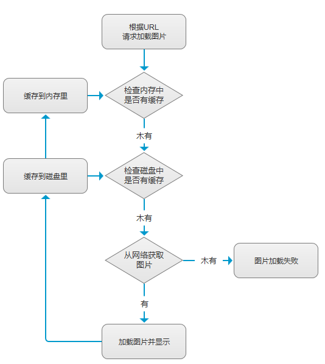


### 4）图片OOM，压缩之类关于Bitmap的概念
以前在入门教程那里写过就不再重复了：

[9.2.1、Bitmap(位图)全解析](../custom/bitmap1.html)

[9.2.2、Bitmap引起的OOM问题](../custom/bitmap2.html)

也可以移步到我的好基友——基神的个人博客查看，解释得更加详细：

Android Bitmap 优化(1) - 图片压缩

Android Bitmap 优化(2) - 图片缓存


## 三、简单的图片加载框架流程图
尽管代码不算复杂，觉得还是有必要画个流程图帮助大家理解一下~

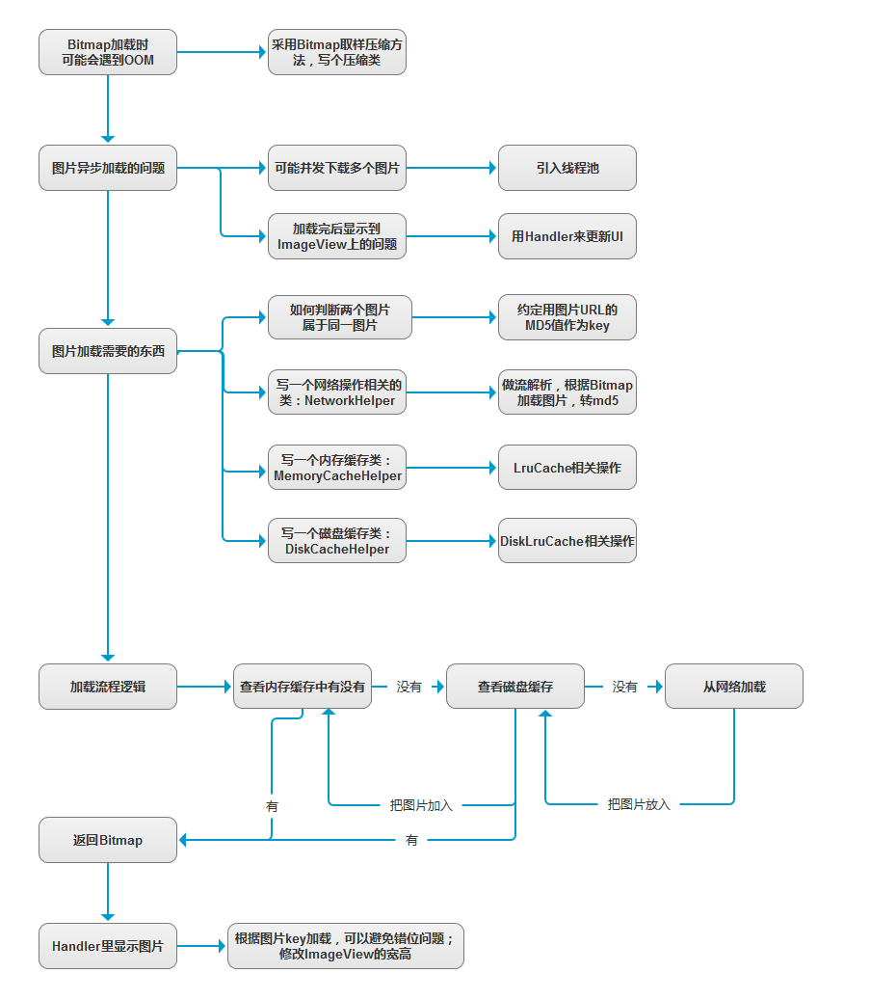


## 四、手撕代码时间
PS：思前想后，还是把贴代码还是放最后吧，只做下代码折叠截图简单 解释一波，具体自己看代码，

①DiskLruCache.java
这个是Google提供的，直接下这个类

https://android.googlesource.com/platform/libcore+/jb-mr2-release/luni/src/main/java/libcore/io/DiskLruCache.java

然后加到你的工程里，自己改下包名就能用了~

②图片压缩类：SisterCompress.java

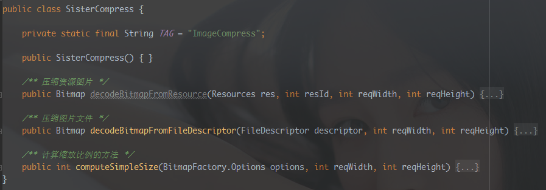

③网络加载协助类：NetworkHelper.java

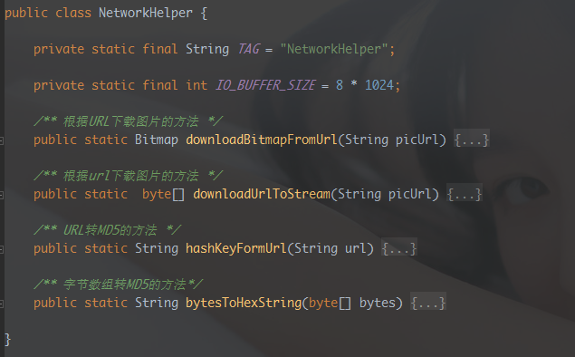

④内存缓存协助类：MemoryCacheHelper.java

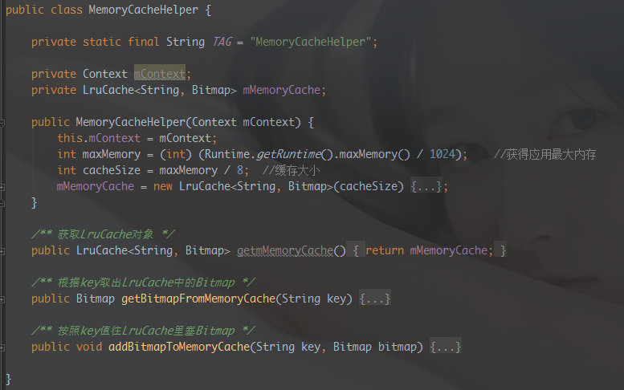

⑤磁盘缓存协助类：DiskCacheHelper.java

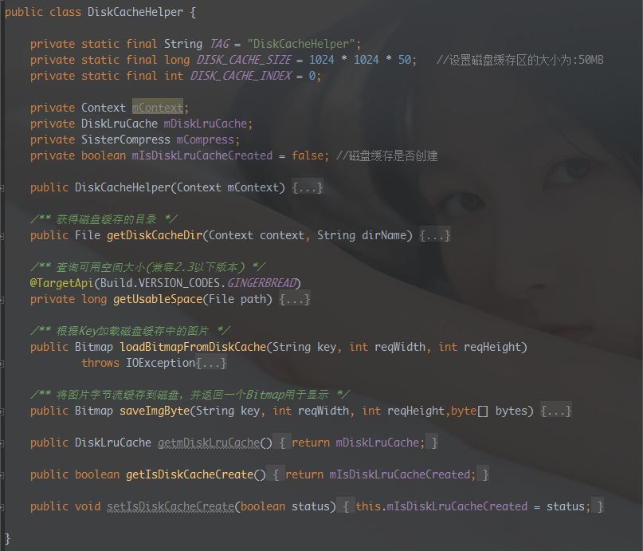

⑥尺寸转换类：SizeUtils.java
PS: 设置ImageView大小用到

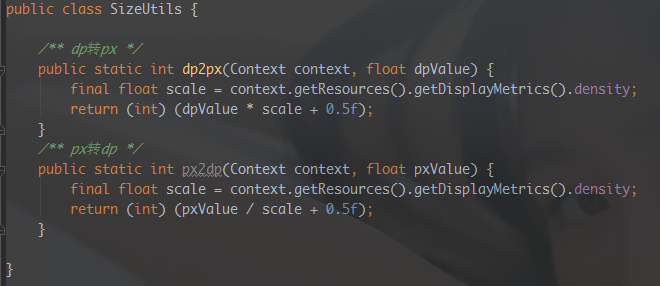

⑦加载结果类：LoaderResult.java
PS：就是异步加载图片后传给Handler的数据集合

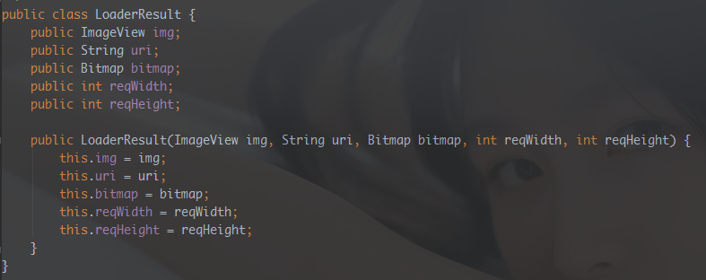

⑧图片加载逻辑控制类：SisterLoader.java

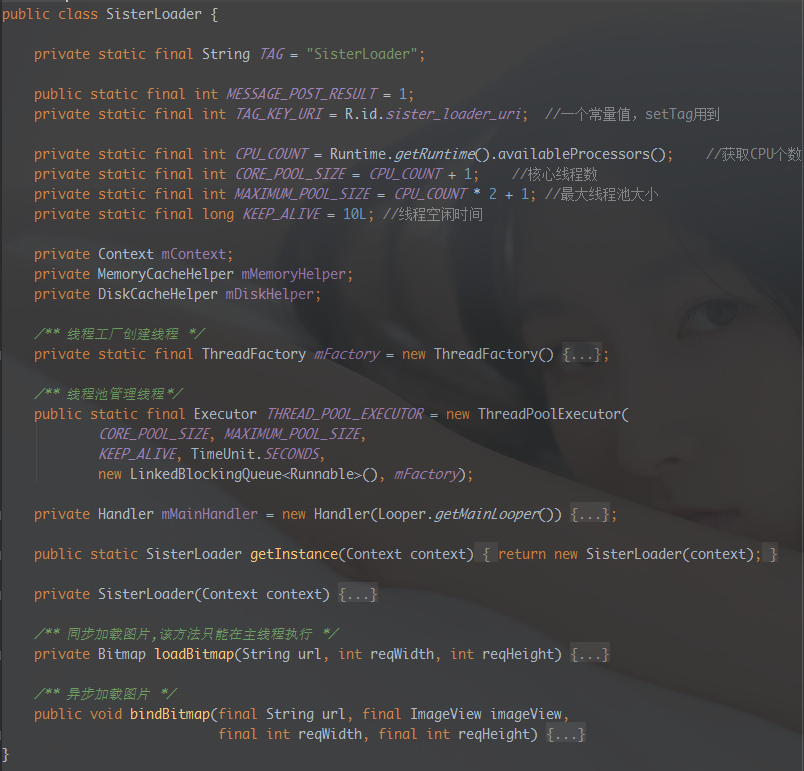

⑨调用图片加载框架：MainActivity.java
```java
private SisterLoader mLoader;
mLoader = SisterLoader.getInstance(MainActivity.this);
mLoader.bindBitmap(data.get(curPos).getUrl(),showImg,400,400);
```


## 五、运行效果图
先有网络加载一次，让应用做好内存和硬盘缓存 然后断开网络，点下一个妹子会加载内存缓存中的图片

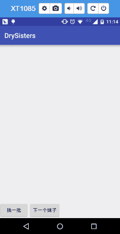

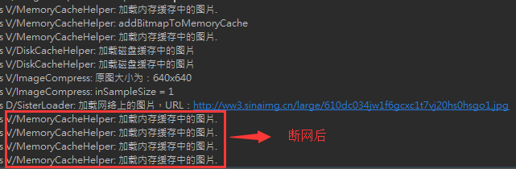


## 六、代码下载
本节代码是切换到新的分支下编写的：sisterloader 代码编写完后，本地直接merge到develop分支，最后推送到Github的！ 命令和上节的一样！

https://github.com/coder-pig/DrySister/tree/develop

欢迎follow，star，觉得有什么想加进来的可以提下issues！