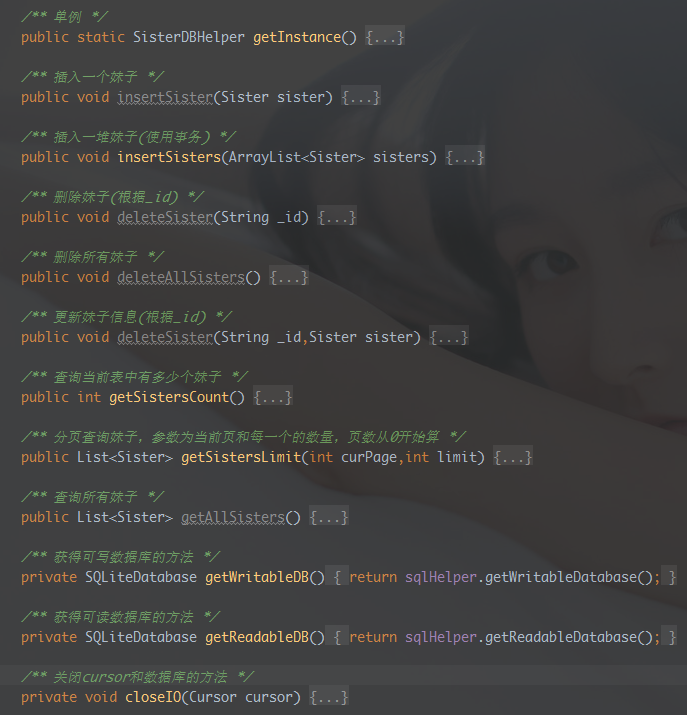

## 一、一些BB
上节我们为DrySister编写了一个异步图片加载缓存框架——SisterLoader(妹子加载器) 成功的从网络加载的图片缓存到了磁盘和内存中，当我们断开网络后，仍然能够查看这些图片， 但是，细心的你可能发现了一个很尴尬的地方，我们在有网的情况下进入APP，获取到图片相关 的信息，比如URL，如果退出了，断网，然后进来，图片就加载不出来了，图片已经缓存了，但是 我们没有图片对应的URL，就显得有些鸡肋了。所以我们需要对后台接口返回的数据进行存储， 当每次加载的时候，把返回的数据信息存储到本地，然后当无网的时候，可以让他加载本地 数据！所以本节我们为DrySister添加SQLite用于存储相关数据。任务都说清楚了，搞起~


## 二、开始编写程序
在develop上开辟一个新的db分支，来完成本节相关代码的编写。

首先，我们添加一个用来判断网络状态的工具类：NetworkUtils.java， 就一个简单的判断网络是否可用的方法~这里我们还需要在AndroidManifest.xml 里加一个权限：android.permission.ACCESSNETWORKSTATE"的权限！
```java
public class NetworkUtils {
    /** 获取网络信息 */
    private static NetworkInfo getActiveNetworkInfo(Context context) {
        ConnectivityManager cm = (ConnectivityManager) context
                .getSystemService(Context.CONNECTIVITY_SERVICE);
        return cm.getActiveNetworkInfo();
    }
    
    /** 判断网络是否可用 */
    public static boolean isAvailable(Context context) {
        NetworkInfo info = getActiveNetworkInfo(context);
        return info != null && info.isAvailable();
    }
}
```

接着定义一个数据库字段常量的类：TableDefine.java， 在里面把数据库名，字段写上：
```java
public class TableDefine {
    public static final String TABLE_FULI = "fuli";
    public static final String COLUMN_ID = "id";
    public static final String COLUMN_FULI_ID = "_id";
    public static final String COLUMN_FULI_CREATEAT = "createAt";
    public static final String COLUMN_FULI_DESC = "desc";
    public static final String COLUMN_FULI_PUBLISHEDAT = "publishedAt";
    public static final String COLUMN_FULI_SOURCE = "source";
    public static final String COLUMN_FULI_TYPE = "type";
    public static final String COLUMN_FULI_URL = "url";
    public static final String COLUMN_FULI_USED = "used";
    public static final String COLUMN_FULI_WHO = "who";
}
```

再接着编写数据库的创建类：SisterOpenHelper.java，在里面完成数据库的创建
```java
public class SisterOpenHelper extends SQLiteOpenHelper{

    private static final String DB_NAME = "sister.db";  //数据库名
    private static final int DB_VERSION = 1;    //数据库版本号

    public SisterOpenHelper(Context context) {
        super(context, DB_NAME, null, DB_VERSION);
    }

    @Override
    public void onCreate(SQLiteDatabase db) {
        String createTableSql = "CREATE TABLE IF NOT EXISTS " + TableDefine.TABLE_FULI + " ("
                + TableDefine.COLUMN_ID + " INTEGER PRIMARY KEY AUTOINCREMENT, "
                + TableDefine.COLUMN_FULI_ID + " TEXT, "
                + TableDefine.COLUMN_FULI_CREATEAT + " TEXT, "
                + TableDefine.COLUMN_FULI_DESC + " TEXT, "
                + TableDefine.COLUMN_FULI_PUBLISHEDAT + " TEXT, "
                + TableDefine.COLUMN_FULI_SOURCE + " TEXT, "
                + TableDefine.COLUMN_FULI_TYPE + " TEXT, "
                + TableDefine.COLUMN_FULI_URL + " TEXT, "
                + TableDefine.COLUMN_FULI_USED + " BOOLEAN, "
                + TableDefine.COLUMN_FULI_WHO + " TEXT"
                + ")";
        db.execSQL(createTableSql);
    }

    @Override
    public void onUpgrade(SQLiteDatabase db, int oldVersion, int newVersion) { }
}
```

再接着，我们需要编写一个数据库的操作类，就是做增删改查，分页查询等操作的类， 这里我们把这个类写成单例的：SisterDBHelper.java，里面的编写的方法有这些：



具体代码：
```java
public class SisterDBHelper {

    private static final String TAG = "SisterDBHelper";

    private static SisterDBHelper dbHelper;
    private SisterOpenHelper sqlHelper;
    private SQLiteDatabase db;

    private SisterDBHelper() {
        sqlHelper = new SisterOpenHelper(DrySisterApp.getContext());
    }

    /** 单例 */
    public static SisterDBHelper getInstance() {
        if(dbHelper == null) {
            synchronized (SisterDBHelper.class) {
                if(dbHelper == null) {
                    dbHelper = new SisterDBHelper();
                }
            }
        }
        return dbHelper;
    }

    /** 插入一个妹子 */
    public void insertSister(Sister sister) {
        db = getWritableDB();
        ContentValues contentValues = new ContentValues();
        contentValues.put(TableDefine.COLUMN_FULI_ID,sister.get_id());
        contentValues.put(TableDefine.COLUMN_FULI_CREATEAT,sister.getCreateAt());
        contentValues.put(TableDefine.COLUMN_FULI_DESC,sister.getDesc());
        contentValues.put(TableDefine.COLUMN_FULI_PUBLISHEDAT,sister.getPublishedAt());
        contentValues.put(TableDefine.COLUMN_FULI_SOURCE,sister.getSource());
        contentValues.put(TableDefine.COLUMN_FULI_TYPE,sister.getType());
        contentValues.put(TableDefine.COLUMN_FULI_URL,sister.getUrl());
        contentValues.put(TableDefine.COLUMN_FULI_USED,sister.getUsed());
        contentValues.put(TableDefine.COLUMN_FULI_WHO,sister.getWho());
        db.insert(TableDefine.TABLE_FULI,null,contentValues);
        closeIO(null);
    }

    /** 插入一堆妹子(使用事务) */
    public void insertSisters(ArrayList<Sister> sisters) {
        db = getWritableDB();
        db.beginTransaction();
        try{
            for (Sister sister: sisters) {
                ContentValues contentValues = new ContentValues();
                contentValues.put(TableDefine.COLUMN_FULI_ID,sister.get_id());
                contentValues.put(TableDefine.COLUMN_FULI_CREATEAT,sister.getCreateAt());
                contentValues.put(TableDefine.COLUMN_FULI_DESC,sister.getDesc());
                contentValues.put(TableDefine.COLUMN_FULI_PUBLISHEDAT,sister.getPublishedAt());
                contentValues.put(TableDefine.COLUMN_FULI_SOURCE,sister.getSource());
                contentValues.put(TableDefine.COLUMN_FULI_TYPE,sister.getType());
                contentValues.put(TableDefine.COLUMN_FULI_URL,sister.getUrl());
                contentValues.put(TableDefine.COLUMN_FULI_USED,sister.getUsed());
                contentValues.put(TableDefine.COLUMN_FULI_WHO,sister.getWho());
                db.insert(TableDefine.TABLE_FULI,null,contentValues);
            }
            db.setTransactionSuccessful();
        } finally {
            if(db != null && db.isOpen()) {
                db.endTransaction();
                closeIO(null);
            }
        }
    }

    /** 删除妹子(根据_id) */
    public void deleteSister(String _id) {
        db = getWritableDB();
        db.delete(TableDefine.TABLE_FULI,"_id =?",new String[]{_id});
        closeIO(null);
    }

    /** 删除所有妹子 */
    public void deleteAllSisters() {
        db = getWritableDB();
        db.delete(TableDefine.TABLE_FULI,null,null);
        closeIO(null);
    }

    /** 更新妹子信息(根据_id) */
    public void deleteSister(String _id,Sister sister) {
        db = getWritableDB();
        ContentValues contentValues = new ContentValues();
        contentValues.put(TableDefine.COLUMN_FULI_ID,sister.get_id());
        contentValues.put(TableDefine.COLUMN_FULI_CREATEAT,sister.getCreateAt());
        contentValues.put(TableDefine.COLUMN_FULI_DESC,sister.getDesc());
        contentValues.put(TableDefine.COLUMN_FULI_PUBLISHEDAT,sister.getPublishedAt());
        contentValues.put(TableDefine.COLUMN_FULI_SOURCE,sister.getSource());
        contentValues.put(TableDefine.COLUMN_FULI_TYPE,sister.getType());
        contentValues.put(TableDefine.COLUMN_FULI_URL,sister.getUrl());
        contentValues.put(TableDefine.COLUMN_FULI_USED,sister.getUsed());
        contentValues.put(TableDefine.COLUMN_FULI_WHO,sister.getWho());
        db.update(TableDefine.TABLE_FULI,contentValues,"_id =?",new String[]{_id});
        closeIO(null);
    }

    /** 查询当前表中有多少个妹子 */
    public int getSistersCount() {
        db = getReadableDB();
        Cursor cursor = db.rawQuery("SELECT COUNT (*) FROM " + TableDefine.TABLE_FULI,null);
        cursor.moveToFirst();
        int count = cursor.getInt(0);
        Log.v(TAG,"count：" + count);
        closeIO(cursor);
        return count;
    }

    /** 分页查询妹子，参数为当前页和每一个的数量，页数从0开始算 */
    public List<Sister> getSistersLimit(int curPage,int limit) {
        db =  getReadableDB();
        List<Sister> sisters = new ArrayList<>();
        String startPos = String.valueOf(curPage * limit);  //数据开始位置
        if(db != null) {
            Cursor cursor = db.query(TableDefine.TABLE_FULI,new String[] {
                    TableDefine.COLUMN_FULI_ID, TableDefine.COLUMN_FULI_CREATEAT,
                    TableDefine.COLUMN_FULI_DESC, TableDefine.COLUMN_FULI_PUBLISHEDAT,
                    TableDefine.COLUMN_FULI_SOURCE, TableDefine.COLUMN_FULI_TYPE,
                    TableDefine.COLUMN_FULI_URL, TableDefine.COLUMN_FULI_USED,
                    TableDefine.COLUMN_FULI_WHO,
            },null,null,null,null,TableDefine.COLUMN_ID,startPos + "," + limit);
            while (cursor.moveToNext()) {
                Sister sister = new Sister();
                sister.set_id(cursor.getString(cursor.getColumnIndex(TableDefine.COLUMN_FULI_ID)));
                sister.setCreateAt(cursor.getString(cursor.getColumnIndex(TableDefine.COLUMN_FULI_CREATEAT)));
                sister.setDesc(cursor.getString(cursor.getColumnIndex(TableDefine.COLUMN_FULI_DESC)));
                sister.setPublishedAt(cursor.getString(cursor.getColumnIndex(TableDefine.COLUMN_FULI_PUBLISHEDAT)));
                sister.setSource(cursor.getString(cursor.getColumnIndex(TableDefine.COLUMN_FULI_SOURCE)));
                sister.setType(cursor.getString(cursor.getColumnIndex(TableDefine.COLUMN_FULI_TYPE)));
                sister.setUrl(cursor.getString(cursor.getColumnIndex(TableDefine.COLUMN_FULI_URL)));
                sister.setUsed(cursor.getInt(cursor.getColumnIndex(TableDefine.COLUMN_FULI_USED)));
                sisters.add(sister);
            }
            closeIO(cursor);
        }
        return sisters;
    }

    /** 查询所有妹子 */
    public List<Sister> getAllSisters() {
        db = getReadableDB();
        List<Sister> sisters = new ArrayList<>();
        Cursor cursor = db.rawQuery("SELECT * FROM "+TableDefine.TABLE_FULI,null);
        cursor.moveToFirst();
        while (cursor.moveToNext()) {
            Sister sister = new Sister();
            sister.set_id(cursor.getString(cursor.getColumnIndex(TableDefine.COLUMN_FULI_ID)));
            sister.setCreateAt(cursor.getString(cursor.getColumnIndex(TableDefine.COLUMN_FULI_CREATEAT)));
            sister.setDesc(cursor.getString(cursor.getColumnIndex(TableDefine.COLUMN_FULI_DESC)));
            sister.setPublishedAt(cursor.getString(cursor.getColumnIndex(TableDefine.COLUMN_FULI_PUBLISHEDAT)));
            sister.setSource(cursor.getString(cursor.getColumnIndex(TableDefine.COLUMN_FULI_SOURCE)));
            sister.setType(cursor.getString(cursor.getColumnIndex(TableDefine.COLUMN_FULI_TYPE)));
            sister.setUrl(cursor.getString(cursor.getColumnIndex(TableDefine.COLUMN_FULI_URL)));
            sister.setUsed(cursor.getInt(cursor.getColumnIndex(TableDefine.COLUMN_FULI_USED)));
            sisters.add(sister);
        }
        closeIO(cursor);
        return sisters;
    }

    /** 获得可写数据库的方法 */
    private SQLiteDatabase getWritableDB() {
        return sqlHelper.getWritableDatabase();
    }

    /** 获得可读数据库的方法 */
    private SQLiteDatabase getReadableDB() {
        return sqlHelper.getReadableDatabase();
    }

    /** 关闭cursor和数据库的方法 */
    private void closeIO(Cursor cursor) {
        if(cursor != null) {
            cursor.close();
        }
        if(db != null) {
            db.close();
        }
    }
}
```

嗯，还是蛮简单的，都是一些SQLite的方法调用而已，接着我们对布局做一下更改， 把activity_main.xml改成下面的代码，就是换成上一个和下一个这样：
```xml
<?xml version="1.0" encoding="utf-8"?>
<RelativeLayout
    xmlns:android="http://schemas.android.com/apk/res/android"
    android:layout_width="match_parent"
    android:layout_height="match_parent">

    <Button
        android:id="@+id/btn_previous"
        android:layout_width="wrap_content"
        android:layout_height="wrap_content"
        android:layout_alignParentBottom="true"
        android:visibility="invisible"
        android:text="上一个"/>

    <Button
        android:id="@+id/btn_next"
        android:layout_width="wrap_content"
        android:layout_height="wrap_content"
        android:layout_alignParentBottom="true"
        android:layout_toRightOf="@id/btn_previous"
        android:text="下一个"/>

    <ImageView
        android:id="@+id/img_show"
        android:layout_width="wrap_content"
        android:layout_height="wrap_content"
        android:layout_above="@+id/btn_previous"/>

</RelativeLayout>
```

最后就是对MainActivity.java的一些逻辑更改了，核心的要点如下：

1. curPos和page的控制以及处理逻辑
2. 根据网络是否可用加载网络还是数据库数据
3. 加载网络数据时存储到数据库需要避免重复插入 等等。

代码实现：
```java
public class MainActivity extends AppCompatActivity implements View.OnClickListener {
    private Button previousBtn;
    private Button nextBtn;
    private ImageView showImg;

    private ArrayList<Sister> data;
    private int curPos = 0; //当前显示的是哪一张
    private int page = 1;   //当前页数
    private PictureLoader loader;
    private SisterApi sisterApi;
    private SisterTask sisterTask;
    private SisterLoader mLoader;
    private SisterDBHelper mDbHelper;

    @Override
    protected void onCreate(Bundle savedInstanceState) {
        super.onCreate(savedInstanceState);
        setContentView(R.layout.activity_main);
        sisterApi = new SisterApi();
        loader = new PictureLoader();
        mLoader = SisterLoader.getInstance(MainActivity.this);
        mDbHelper = SisterDBHelper.getInstance();
        initData();
        initUI();
    }

    private void initData() {
        data = new ArrayList<>();
        sisterTask = new SisterTask();
        sisterTask.execute();
    }

    private void initUI() {
        previousBtn = (Button) findViewById(R.id.btn_previous);
        nextBtn = (Button) findViewById(R.id.btn_next);
        showImg = (ImageView) findViewById(R.id.img_show);

        previousBtn.setOnClickListener(this);
        nextBtn.setOnClickListener(this);
    }

    @Override
    public void onClick(View v) {
        switch (v.getId()) {
            case R.id.btn_previous:
                --curPos;
                if (curPos == 0) {
                    previousBtn.setVisibility(View.INVISIBLE);
                }
                if (curPos == data.size() - 1) {
                    sisterTask = new SisterTask();
                    sisterTask.execute();
                } else if(curPos < data.size()) {
                    mLoader.bindBitmap(data.get(curPos).getUrl(), showImg, 400, 400);
                }
                break;
            case R.id.btn_next:
                previousBtn.setVisibility(View.VISIBLE);
                if(curPos < data.size()) {
                    ++curPos;
                }
                if (curPos > data.size() - 1) {
                    sisterTask = new SisterTask();
                    sisterTask.execute();
                } else if(curPos < data.size()){
                    mLoader.bindBitmap(data.get(curPos).getUrl(), showImg, 400, 400);
                }
                break;
        }
    }

    private class SisterTask extends AsyncTask<Void, Void, ArrayList<Sister>> {

        public SisterTask() {
        }

        @Override
        protected ArrayList<Sister> doInBackground(Void... params) {
            ArrayList<Sister> result = new ArrayList<>();
            if (page < (curPos + 1) / 10 + 1) {
                ++page;
            }
            //判断是否有网络
            if (NetworkUtils.isAvailable(getApplicationContext())) {
                result = sisterApi.fetchSister(10, page);
                //查询数据库里有多少个妹子，避免重复插入
                if(mDbHelper.getSistersCount() / 10 < page) {
                    mDbHelper.insertSisters(result);
                }
            } else {
                result.clear();
                result.addAll(mDbHelper.getSistersLimit(page - 1, 10));
            }
            return result;
        }

        @Override
        protected void onPostExecute(ArrayList<Sister> sisters) {
            super.onPostExecute(sisters);
            data.addAll(sisters);
            if (data.size() > 0 && curPos + 1 < data.size()) {
                mLoader.bindBitmap(data.get(curPos).getUrl(), showImg, 400, 400);
            }
        }

        @Override
        protected void onCancelled() {
            super.onCancelled();
            sisterTask = null;
        }
    }


    @Override
    protected void onDestroy() {
        super.onDestroy();
        if (sisterTask != null) {
            sisterTask.cancel(true);
        }
    }
}
```


## 三、运行效果图
操作步骤：

把项目跑起来后，一直按下一页下一页缓存一堆图片，接着断开网络，进入DrySister， Duang~，神奇的发现，有妹子出现了，按下一页或者上一页也可以切换图片，妈妈再也 不用担心我在没网的时候不可以看DrySister了！

运行截图：


## 四、小结
好的，本节在上节的基础上行添加了SQlite保存后台数据，当无网的时候也可以查看 妹子图片，代码的大的改动如上述，还有一些小改，具体看代码。 最后把db分支的代码合并到develop分支上，然后删除db分支，把更新后的 develop分支推送到Github！


## 五、代码下载：

https://github.com/coder-pig/DrySister/tree/develop 欢迎follow，star，觉得有什么想加进来的可以提下issues！