## 一、一些BB
说来惭愧，DrySister的上一篇距今已经有一年多了，期间有不少小伙伴 都曾私信过我说写得很好，稳什么时候更，我基本都回复说太监了... 具体原因各种各样吧，最近一段时间比较闲，就想把第一版的完结了吧。 之前刚开始写的时候是AS 2.1.2，现在都AS 3.0.1了，本节的内容 依次是：

- Step 1：温习一波之前几节涉及到的东西
- Step 2：代码在AS 3.0.1上跑要做一些调整
- Step 3：编写一个日志类

下节我们来说说签名，混淆，以及发布到应用市场~ 废话不多说，开始本节内容！


## 二、代码回顾
- 第一节：项目搭建与简单实现
1. Git相关的操作
2. 简单的图片加载类(获取网络流->转换成图片->Handler更新UI)

- 第二节：解析后台数据
1. 使用Android自带抠脚Json解析器解析后台返回的Json数据(Json字符串 -> List<Bean>)
2. 使用AsyncTask来做异步网络请求

- 第三节：图片加载优化(写个图片缓存小框架)
1. 图片缓存的基本套路 


2. 使用采样压缩法压缩Bitmap，避免OOM
3. 线程池管理多个图片加载线程
4. Handler更新UI
5. String字符串(这里是URL)转MD5
6. 内存缓存类LruCache的使用
7. 磁盘缓存类DiskLruCache的使用
8. 整个图片异步加载缓存的逻辑设计

- 第四节：添加数据缓存(加入SQLite)
1. 网络状态的判断
2. 自定义SQLiteOpenHelper创建数据库
3. 数据库相关操作：增删改查，事务，分页等

以上就是前面四节的内容，对于Android基础入门中重要的 知识点都进行了运用，如果都掌握了的话，算是勉强Android入门了， 后面的路还长着呢！


## 三、代码调整
AS切换到3.0以后，下述文件的代码需要进行改动，老规矩，切换分支命令走一波： git checkout -b fixcodeas3.0.1，然后开始代码修改：

项目层级的build.gradle：

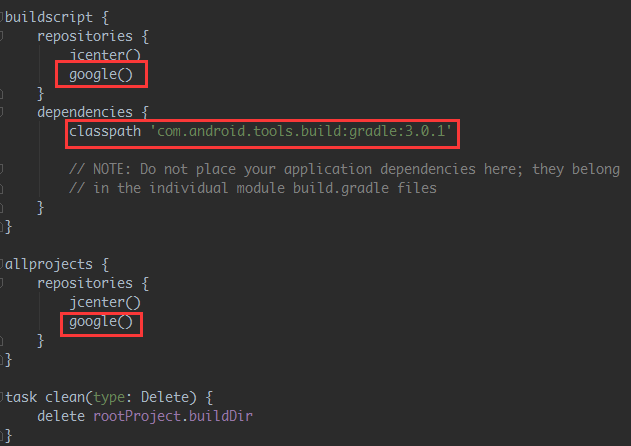

APP层级的build.gradle：

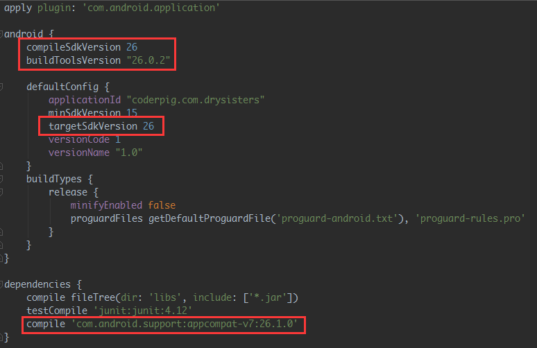

gradle-wrapper.properties：


还有个地方要小改：SisterApi.java，把福利改成：%e7%a6%8f%e5%88%a9 这涉及到了中文转码问题，而HttpUrlConnection无法打开含有中文的链接，需要 对中文部分调用URLEncoder.encode(中文部分,"utf-8");进行转码，记得只是 中文部分，不是整个url！！！转码还需要捕获异常，这里因为只有一个地方要 转码，我就直接用网页版的转码工具来转码了：https://c.runoob.com/front-end/695

转换后的结果：


另外还有一些小改，buildToolsVersion 26以上，findViewById是不用强转的， 点进去方法看就知道了，用了泛型，所以把findViewById都去掉：


最后觉得运行再我的魅蓝E2上效果有点偏差，小调了一下页面布局，让图片宽度满屏 然后高度自适应，这里用到的属性 android:adjustViewBounds = "true"，就是 宽高按比例缩放；还有把上一步下一步的文字放到strings.xml文件中，小调边距：

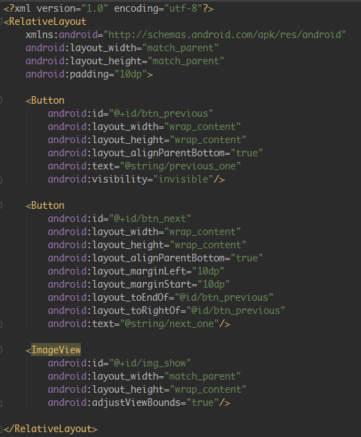

最后再来看我们的项目运行结果：(啧啧，好看的妹子就是养眼)：


然后把这个分支合并到develop分支上，这里我们不用之前merge那种合并套路 而是用rebase来合并，具体过程如下：
```java
git add .
git commit -m "fix code in as3.0"
git checkout develop    # 切换到develop分支
git rebase fix_code_as3.0.1 # 合并分支
git push origin develop # 推送develop到远程分支
git branch -d fix_code_as3.0.1  # 删除合并后的本地分支
```

关于Git还不懂的可以去另一篇文章学习，这里就不多解释了：[小猪的Git使用总结](http://blog.csdn.net/coder_pig/article/details/54346867)


## 四、编写日志工具类与崩溃日志采集类
Log打印日志相信每一位开发者都不会陌生吧，平时调试必不可少， 当应用打包给测试测试时。测试反馈应用crash的时候，我们第一件 想到的事就是让对方提供日志。说到这个打Log，很多童鞋喜欢随手 一个Log.e(xxx,xxx)，什么日志都是Error级别，原因基本是： 红色比较醒目，哈哈！然后直接把变量的值打印处理啊，或在某个 方法里加上，验证方法是否执行了等，正式发布的收记得删还好， 不记得删的话简直是作死。反正之前给上家公司的大佬喷了一顿， 至今记忆犹新！Log的管理非常重要，我们要写的两个工具类如下：

1. debug的时候日志正常打印，release的时候不打印
2. 奔溃日志采集，自己测试或者测试测试倒没什么，崩溃了直接把 手机接你电脑上看看logcat就一清二楚了，但是如果应用装到了用户 手机里，应用崩溃停止运行了，用户可不会把日志发给你，多次崩溃 还可能导致用户卸载你的APP，所以我们需要在APP崩溃的时候把 日志保存起来，当用户连接wifi或再次打开应用时，把这个日志上传 到我们的服务器，我们这里只是写来玩玩的，所以只做本地崩溃日志采集， 一般都是通过集成第三方的统计工具来进行日志采集的，比如友盟，Bugly等。

好的，需求就上面的两点，接着准备开始编写代码，不过在写代码之前 科普关于Log的两点，可能大部分的童鞋都已经知道了，知道的可以直接跳过：

### 1) 快速打印Log
打开设置，依次点击：Live Templates -> AndroidLog把日志打印的都勾上 你还可以自己在下面的Template text里编写模板~

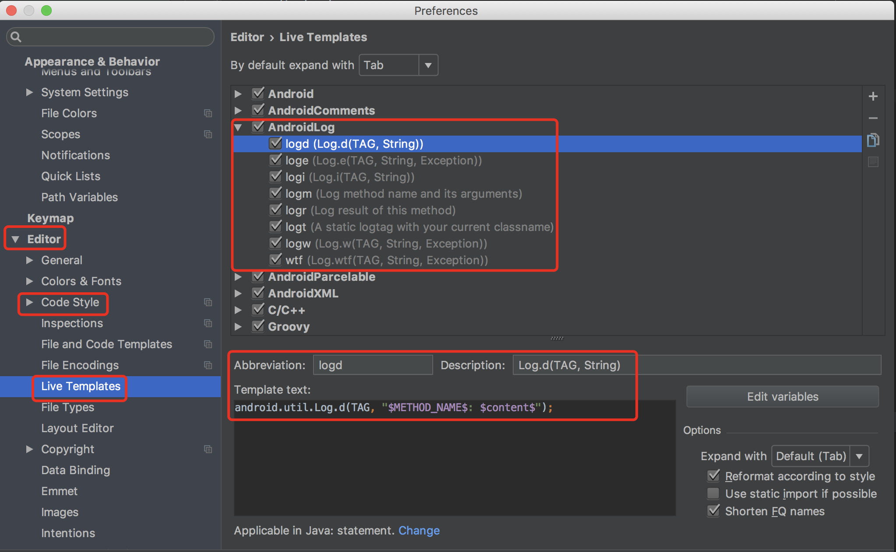

接着随便代码里键入上面的log...一个enter，Log语句就出来了， TAG直接就是你当前的方法名~


2.关于Log的使用科普
1) 快速打印Log打印命令

打开Settings，依次点击：Live Templates -> AndroidLog把日志打印的都勾上 你也可以自己在下面的Template text里编写模板~

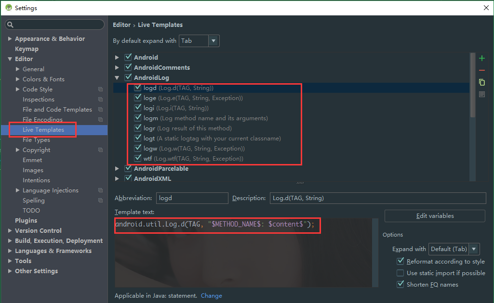

接着随便代码里键入上面的log...一个enter，Log语句就出来了~

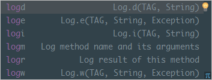


如果你在方法外，键入logt，可以直接生成一个对应类名的TAG：


### 2) Log等级的科普

以前组长开小会的时候曾说过我们调试时直接Log.e的坏习惯， 不同的Log级别应该打印不同的信息：

- Log.v：Verbose(冗长) 开发调试过程中一些详细信息，不该编译进产品，只在开发阶段使用
- Log.d：Debug(调试) 用于调试的信息，编译进产品，运行时关闭。

下面这三种等级进制作为普通调试信息使用，这些等级的Log是应用 出现问题时候的重要分析线索，如果随意使用，会给开发人员分析Bug 带来不必要的困扰。

- Log.i：Info(信息) 例如一些运行时的状态信息，这些状态信息在出现问题的时候能提供帮助。
- Log.w：Warning(警告) 警告应用出现了异常，但不一定会马上出现错误，需要留意
- Log.e：Error(错误) 应用出现了错误，最需要关注解决的！


### 3) 编写日志工具类
老规矩，先开辟分支：buglogcatch 这个就非常简单了，调试时输出，正式版时不输出，利用BuildConfig.Debug 进行判断即可，代码如下：

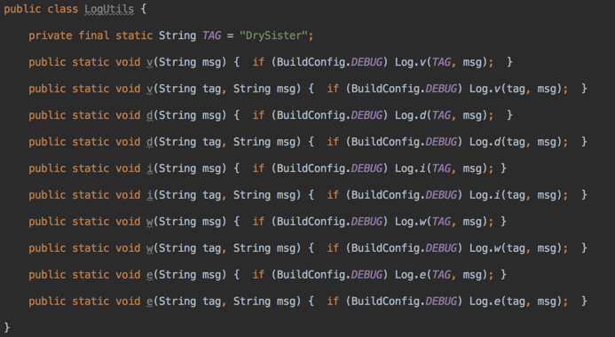

### 4) 编写崩溃日志采集类
崩溃日志采集类依赖于Application与Thread.UncaughtExceptionHandler实现~ 当因为程序因为未捕获的异常即将终止退出时，会使用Thread.UncaughtExceptionHandler 查询UncaughtExceptionHandler的线程，调用uncaughtException方法，将线程 与异常作为参数传递。如果线程没有明确设置UncaughtExceptionHandler，则将 其ThreadGroup作为其UncaughtExceptionHandler，然后丢给默认的未捕获异常 处理程序处理。所以我们只需要实现UncaughtExceptionHandler接口，重写 uncaughtException方法，来实现我们的自定义处理。我们先来捋一捋逻辑清单：

1. 建一个文件夹专门放日志文件：需要判断是存储卡是否可用，然后判断文件 夹是否存在，不存在则新建文件夹；
2. 需要一个把字符串写入文件的方法
3. 崩溃日志的内容组成：当前的时间，应用版本，设备信息，奔溃日志
4. 获取系统默认的UncaughtException处理器，然后判断是否为null，不为空 设置为自定义的UncaughtException，这里我们用单例
5. 最后是应用的重启，设置1s后重新启动应用；

大概逻辑就是上面这些，我们一步步讲，首先是1，2步：

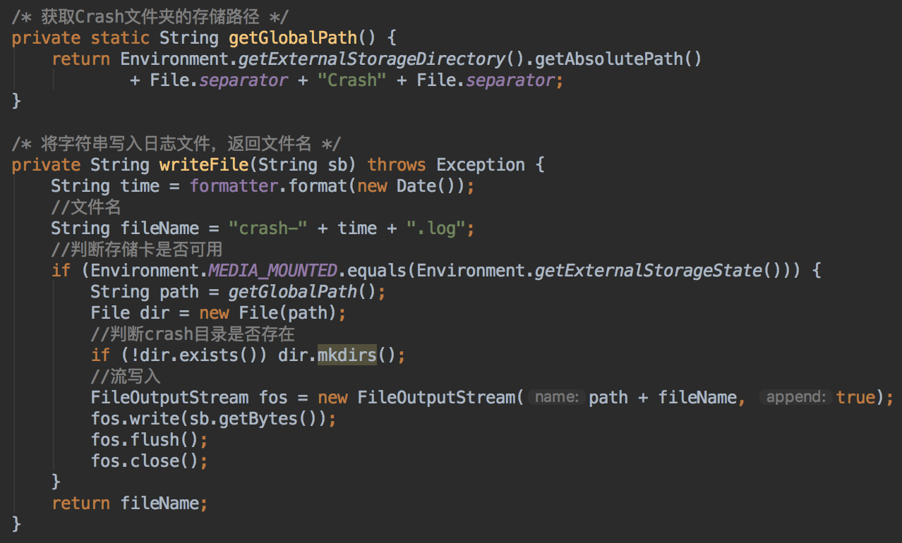

接着是奔溃日志，由几部分组成：先是当前时间


接着是应用版本以及设备信息，这里用一个HashMap来存：

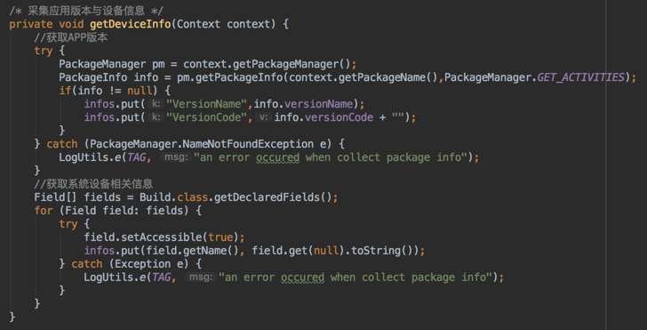

在接着是异常信息，这个就简单啦，直接传异常对象，调printStackTrace即可 最后合到一起就是：

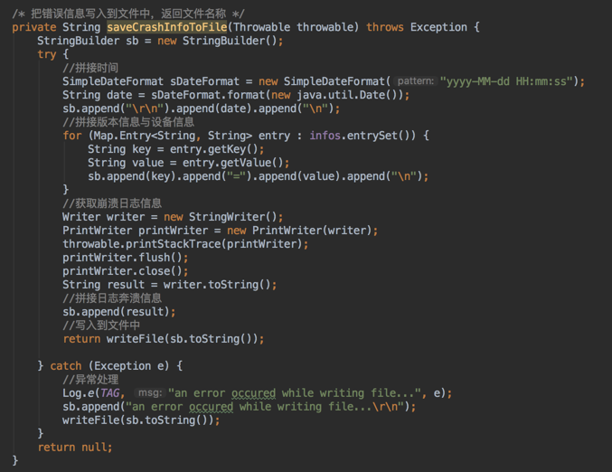

写入文件的也解决了，然后是自定义UncaughtExceptionHandler单例以及默认 UncaughtExceptionHandler处理器的获取，设置为自定义UncaughtExceptionHandler， 还需重写UncaughtException方法


接着我们把自己处理异常的一整套都写到一个方法里，当异常发生了，弹出 一个Toast提示用户应用要重启，还有调用写入日志的方法：

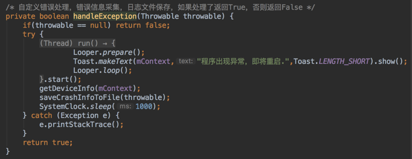

然后重写的UncaughtException方法做下判断，是否通过自定义处理了异常， 以及默认的UncaughtExceptionHandler的是否为空，即:异常处理了没？ 没处理，丢给自定义的UncaughtExceptionHandler，如果处理了，重启应用。


最后加上重启应用的相关代码，大功告成：


到此我们的崩溃日志采集工具类就编写完毕了，要启用他的 话需要在DrySisterApp.java中的onCreate()方法中加上：


弄完想测试下是否生效的话很简单，手动引发崩溃就好了 比如我在下一步的按钮里做除数为0的操作：


应用运行后点击下一步，直接崩溃，打开内置存储根目录看下 有没有Crash的文件夹，打开看到我们日志文件的话，说明成功：


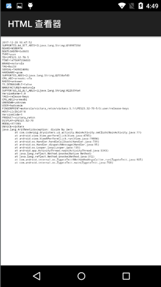

到此完成，把分支合并到develop上，然后推送到远程仓库上：
```java
git add .
git commit -m "add LogUtils and CrashHandler"
git checkout develop    # 切换到develop分支
git rebase bug_log_catch # 合并分支
git push origin develop # 推送develop到远程分支
git branch -d bug_log_catch  # 删除合并后的本地分支
```


## 五、小结
本节先回顾了下之前写的代码，然后因为切换到AS 3.0上的原因 小调整了一下代码，最后还编写了日志工具类以及崩溃日志采集 工具类，麻雀虽小五脏俱全，尽管就是一个小小的图片显示程序， 但是也算囊括了大部分的入门知识，下一节就是第一版的完结篇 了，签名打包，混淆，以及发布到酷安市场了！敬请期待~


## 六、代码下载：

https://github.com/coder-pig/DrySister/tree/develop 欢迎follow，star，觉得有什么想加进来的可以提下issues！