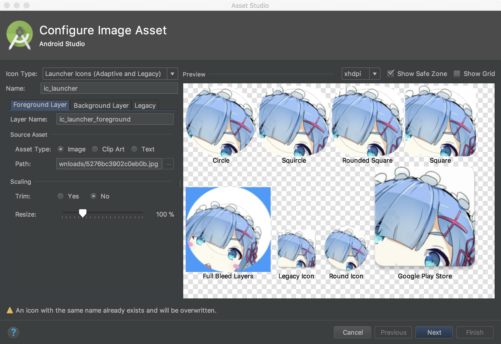
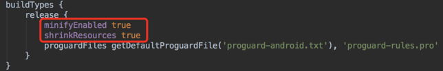
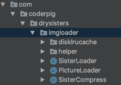
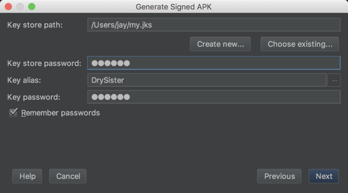
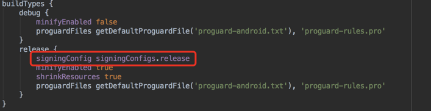
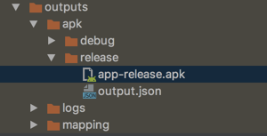
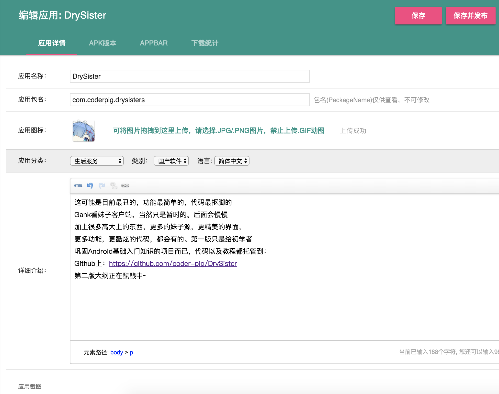
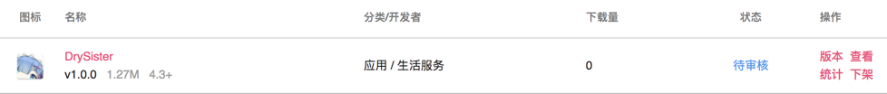

不要问我为什么标题这么长，怎么不写短点，我觉得你是

代码虽然写完了，但是发布的后续操作还是挺多的，如标题， 本节讲述的内容依次是：应用图标的制作，混淆，签名打包APK，Apk瘦身， 以及发布应用到酷安市场。内容较多就不唠叨了，直接开始~

## 一、图标制作
本来想着自己用Sketch做一枚的，摸索了10分钟不到就放弃了... 还是直接利用AS自带的图标生成工具一键生成算了，步骤如下： 右键drawable文件夹 -> new -> Image Asset，选择自己喜欢 的图片做图标，比如我最喜欢的过气女二蕾姆，然后Next，接着 的弹窗无脑下一步就好：



然后AS帮我们生成了一堆文件：


看到这里你可能会黑人问号？？？ 这个mipmap-anydpi-v26文件夹是什么鬼？ 还有为什么每个mipmap文件夹都多了iclauncherforeground 和 iclanucherround

原因是：

Android 8.0(API 26) 引入了自适应的启动器图标，它可以在不同的设备模型 中显示各种形状；其实就是把原本一层的图标分成了两个图层：背景与前景 然后不同的启动器有Mask(译作面具，不过感觉遮罩层更加贴切)然后，不同 的遮罩层能裁剪出不同的图形，比如示例中的圆形：


除了这种玩法外还有支持动画效果，比如两层采用不一样的滑动速度：


网上说Android 8.0可以长按桌面修改图标形状，试了下8.0的模拟器 并没有找到相关选项；有人说是Pixel Launcher，下了好几个版本发现 也没有，猜测应该是亲儿子Pixel系列自带的Launcher才能修改吧。 我用Nova Launcher和8.0的启动器对比也能看出差别：


更多内容可见官网：[Adaptive Icons](https://developer.android.google.cn/guide/practices/ui_guidelines/icon_design_adaptive.html#creating_adaptive_icons_in_xml) 知道个所以然就行，不喜欢的话可以把文件都删掉，只保留一个 ic_launcher.png。


## 二、混淆
在应用发布前，对代码进行混淆处理，可以让我们的代码即使被 反编译，也让其难以阅读。AS自身集成Java的ProGuard作为压缩， 优化和混淆工具，混淆规则文件是：proguard-rules.pro，启用 混淆规则的话修改build.gradle中的minifyEnabled为ture即可开启混淆。 ProGuard除了能混淆代码外，还可以减少应用体积，对字节码级别优化 让我们的APP运行更快！另外，混淆完后会默认在app/build/outputs/mapping/release 下生成mapping.txt混淆规则文件，可以根据这个文件反推回混淆前的代码； 还有有些地方是要避免混淆的，不然APP运行的时候会出错。

限于篇幅就不在此讲解混淆的规则了，有兴趣的可以移步到： [Android混淆从入门到精通](http://www.jianshu.com/p/7436a1a32891) 这里就直接用网上的通用模板了，如果是第三方的话，官方文档一般 都有混淆规则的，复制粘贴下即可，通用模板如下：

```java
#指定压缩级别
-optimizationpasses 5

#不跳过非公共的库的类成员
-dontskipnonpubliclibraryclassmembers

#混淆时采用的算法
-optimizations !code/simplification/arithmetic,!field/*,!class/merging/*

#把混淆类中的方法名也混淆了
-useuniqueclassmembernames

#优化时允许访问并修改有修饰符的类和类的成员
-allowaccessmodification

#将文件来源重命名为“SourceFile”字符串
-renamesourcefileattribute SourceFile
#保留行号
-keepattributes SourceFile,LineNumberTable
#保持泛型
-keepattributes Signature

#保持所有实现 Serializable 接口的类成员
-keepclassmembers class * implements java.io.Serializable {
    static final long serialVersionUID;
    private static final java.io.ObjectStreamField[] serialPersistentFields;
    private void writeObject(java.io.ObjectOutputStream);
    private void readObject(java.io.ObjectInputStream);
    java.lang.Object writeReplace();
    java.lang.Object readResolve();
}

#Fragment不需要在AndroidManifest.xml中注册，需要额外保护下
-keep public class * extends android.support.v4.app.Fragment
-keep public class * extends android.app.Fragment

# 保持测试相关的代码
-dontnote junit.framework.**
-dontnote junit.runner.**
-dontwarn android.test.**
-dontwarn android.support.test.**
-dontwarn org.junit.**
```

然后build.gradle里修改下，启用混淆以及打开压缩：



配置完成后，命令行执行一波./gradlew build即可生成apk。 我们来对比下混淆前后的结果：

|对比内容|混淆前|混淆后| |:-|:-|:-| |APK大小|


|


| |反编译代码|



|


apk体积小了，反编译难度提高了，美滋滋!


## 三、签名打包
应用签名的重要性不言而喻，应用的唯一标志，开发者的身份凭证！ 这样可以防止用户已安装的应用被恶意的第三方覆盖或替换掉，这种 逆向APP后进行二次打包的对于付费App和游戏App非常常见。

关于签名生成打包官方文档已经有详细叙述(可能需要梯子)：

https://developer.android.com/studio/publish/app-signing.html#generate-key
签名生成：


签名生成以后，就是使用签名打包了，打包方式有两种： 一种是手动打包，另一种是通过gradle构建自动打包

手动打包非常简单，也很low：依次点击：Build -> Generate Signed APK



然后选择哪里存放生成的apk：


然后就可以看到生成的apk了：


另一种是gradle命令行构建的，也很简单，图形化的可以看官方 文档，我这里直接贴代码，一般的话签名文件是不会丢到项目里 的，我这里因为是开源的，所以把my.jks也丢项目里了，然后 修改下build.gradle，依次是签名信息




命令行走一波：./gradlew clean build编译运行，编译查看下述 目录app-release.apk是否生成成功：




## 四、APK瘦身
经过混淆签名打包后的apk大小为1.4mb，但是作为一个没有什么图片， 没有采用第三方库的看图应用来说，实在是很差强人意，所以务必需 要对我们的APK瘦身一波。

Android Studio 自带的 APK Analyzer，可以对我们的APK做一个定量分析：


看得出是res占比最多，原因也是我们的图标，就不去把删图片和文件夹了， 只是用工具对图片进行压缩，这里安利个神器：ImageOptim


压缩完再看下apk体积变成了1.3mb，此时再分析下：


感觉没什么太大的变化，但是apk就是减少了0.1mb，图片 资源压缩是apk瘦身最基本的操作。关于其他的优化套路 后面版本再细谈，项目比较小，可优化的潜力很低...


## 五、应用发布
不要问我为什么是酷安市场，搞机的基佬基本都会混酷安的~ 发布我们的应用，然后填写相关描述信息，传应用截图； 接着点APK版本上传我们的APK，这里会对apk包名做校验， 我之前写错一直没发现，后面改了才可以；



上传完要等检测，检测通过就可以提交了


发布后就等审核啦！



等明天管理员审核通过后就可以在酷安上找到我们的App了！

最后把我们develop分支上的代码合并到master上，每次正式版本 的才合并到master，同时打上Tag，打Tag是一种良好的习惯， 等版本线长了你就能体会到这个习惯给你带来的便利了：
```java
git checkout master # 切换到master分支
git rebase develop  # 合并develop分支
git push origin master # 推送到远程master分支
git tag v1.0.0  # 为当前commit打上TAG
git push origin v1.0.0 # 把TAG推送到远程仓库
```


## 六、小结
至此Android入门实战的项目：DrySister的第一版已经完结了， 回顾下一路走来，我们都学习了什么些什么吧？

1. Git的使用，远程仓库，分支管理的套路；
2. HttpUrlConnection请求网络；
3. AsyncTask，Handler的使用；
4. 使用自带抠脚Json解析器解析Json；
5. 图片二级缓存的流程；
6. 使用LruCache和DiskLruCache搭建了简易图片缓存小框架；
7. 原生数据库SQLite：数据库创建，表的增删改查，事务，分页；
8. 如何编写Log工具类，崩溃日志采集类；
9. Apk图标的简易制作
10. Apk混淆
11. Apk签名生成，以及签名打包的两种方式
12. Apk分析工具：APK Analyzer 和图片压缩神器：ImageOptim
13. 发布应用到应用市场。

如果你是一路踏踏实实走来的话，完成完该项目后说明入门 系列的东西掌握了，Android你也算勉强入门了，接下来如何 真正入门，并向进阶的迈进，路还远着呢！

最后感谢各位读者大佬一直以来的支持和陪伴，谢谢~


下一版的大纲正在规划中，敬请期待~

## 七、代码下载：

https://github.com/coder-pig/DrySister/tree/develop 欢迎follow，star，觉得有什么想加进来的可以提下issues！