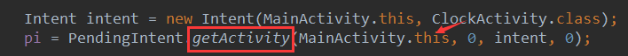

## 一、本节引言：
本节带来的Android中的AlarmManager(闹钟服务)，听名字我们知道可以通过它开发手机闹钟类的APP， 而在文档中的解释是：在特定的时刻为我们广播一个指定的Intent，简单说就是我们自己定一个时间， 然后当到时间时，AlarmManager会为我们广播一个我们设定好的Intent，比如时间到了，可以指向某个 Activity或者Service！另外官方文档中有一些要注意的地方：


另外要注意一点的是，AlarmManager主要是用来在某个时刻运行你的代码的，即时你的APP在那个特定 时间并没有运行！还有，从API 19开始，Alarm的机制都是非准确传递的，操作系统将会转换闹钟 ，来最小化唤醒和电池的使用！某些新的API会支持严格准确的传递，见 setWindow(int, long, long, PendingIntent)和setExact(int, long, PendingIntent)。 targetSdkVersion在API 19之前应用仍将继续使用以前的行为，所有的闹钟在要求准确传递的情况 下都会准确传递。更多详情可见官方API文档：AlarmManager


## 二、Timer类与AlarmManager类区别：
如果你学过J2SE的话，那么你对Timer肯定不会陌生，定时器嘛，一般写定时任务的时候 肯定离不开他，但是在Android里，他却有个短板，不太适合那些需要长时间在后台运行的 定时任务，因为Android设备有自己的休眠策略，当长时间的无操作，设备会自动让CPU进入 休眠状态，这样就可能导致Timer中的定时任务无法正常运行！而AlarmManager则不存在 这种情况，因为他具有唤醒CPU的功能，可以保证每次需要执行特定任务时CPU都能正常工作， 或者说当CPU处于休眠时注册的闹钟会被保留(可以唤醒CPU)，但如果设备被关闭，或者重新 启动的话，闹钟将被清除！(Android手机关机闹钟不响...)


## 三、获得AlarmManager实例对象：
```java
AlarmManager alarmManager = (AlarmManager) getSystemService(ALARM_SERVICE);
```


## 四、相关方法讲解：
- set(int type,long startTime,PendingIntent pi)：一次性闹钟
- setRepeating(int type，long startTime，long intervalTime，PendingIntent pi)： 重复性闹钟,和3有区别,3闹钟间隔时间不固定
- setInexactRepeating（int type，long startTime，long intervalTime,PendingIntent pi）： 重复性闹钟，时间不固定
- cancel(PendingIntent pi)：取消AlarmManager的定时服务
- getNextAlarmClock()：得到下一个闹钟，返回值AlarmManager.AlarmClockInfo
- setAndAllowWhileIdle(int type, long triggerAtMillis, PendingIntent operation) 和set方法类似，这个闹钟运行在系统处于低电模式时有效
- setExact(int type, long triggerAtMillis, PendingIntent operation)： 在规定的时间精确的执行闹钟，比set方法设置的精度更高
- setTime(long millis)：设置系统墙上的时间
- setTimeZone(String timeZone)：设置系统持续的默认时区
- setWindow(int type, long windowStartMillis, long windowLengthMillis, PendingIntent operation)： 设置一个闹钟在给定的时间窗触发。类似于set，该方法允许应用程序精确地控制操作系统调 整闹钟触发时间的程度。

关键参数讲解：

- Type(闹钟类型)： 有五个可选值: AlarmManager.ELAPSED_REALTIME: 闹钟在手机睡眠状态下不可用，该状态下闹钟使用相对时间（相对于系统启动开始），状态值为3; AlarmManager.ELAPSED_REALTIME_WAKEUP 闹钟在睡眠状态下会唤醒系统并执行提示功能，该状态下闹钟也使用相对时间，状态值为2； AlarmManager.RTC 闹钟在睡眠状态下不可用，该状态下闹钟使用绝对时间，即当前系统时间，状态值为1； AlarmManager.RTC_WAKEUP 表示闹钟在睡眠状态下会唤醒系统并执行提示功能，该状态下闹钟使用绝对时间，状态值为0; AlarmManager.POWER_OFF_WAKEUP 表示闹钟在手机关机状态下也能正常进行提示功能，所以是5个状态中用的最多的状态之一，该状态下闹钟也是用绝对时间，状态值为4；不过本状态好像受SDK版本影响，某些版本并不支持；
- startTime：闹钟的第一次执行时间，以毫秒为单位，可以自定义时间，不过一般使用当前时间。 需要注意的是,本属性与第一个属性（type）密切相关,如果第一个参数对应的闹钟使用的是相对时间 （ELAPSED_REALTIME和ELAPSED_REALTIME_WAKEUP），那么本属性就得使用相对时间 （相对于系统启动时间来说）,比如当前时间就表示为:SystemClock.elapsedRealtime()； 如果第一个参数对应的闹钟使用的是绝对时间(RTC、RTC_WAKEUP、POWER_OFF_WAKEUP）, 那么本属性就得使用绝对时间，比如当前时间就表示 为：System.currentTimeMillis()。
- intervalTime：表示两次闹钟执行的间隔时间,也是以毫秒为单位.
- PendingIntent：绑定了闹钟的执行动作，比如发送一个广播、给出提示等等。 PendingIntent是Intent的封装类。需要注意的是，如果是通过启动服务来实现闹钟提 示的话，PendingIntent对象的获取就应该采用Pending.getService (Context c,int i,Intent intent,int j)方法；如果是通过广播来实现闹钟 提示的话，PendingIntent对象的获取就应该采用 PendingIntent.getBroadcast (Context c,int i,Intent intent,int j)方法；如果是采用Activity的方式来实 现闹钟提示的话，PendingIntent对象的获取就应该采用 PendingIntent.getActivity(Context c,int i,Intent intent,int j)方法。 如果这三种方法错用了的话，虽然不会报错，但是看不到闹钟提示效果。


## 五、使用示例：一个简单的定时任务
要说的是，此例子只在Android 4.4以下的系统可行，5.0以上并不可行，后续如果有5.0 以上AlarmManager的解决方案，到时再补上！另外，这里用set方法可能有点不准，如果要 更精确的话可以使用setExtra()方法来设置AlarmManager!

运行效果图：


实现代码：

首先一个简单的布局文件:activity_main.xml，另外在res创建一个raw文件夹，把音频文件丢进去！ 另外创建一个只有外层布局的activity_clock.xml作为闹钟响时Activity的布局！没东西，就不贴了
```xml
<LinearLayout xmlns:android="http://schemas.android.com/apk/res/android"
    android:id="@+id/LinearLayout1"
    android:layout_width="match_parent"
    android:layout_height="match_parent"
    android:orientation="vertical">

    <Button
        android:id="@+id/btn_set"
        android:layout_width="wrap_content"
        android:layout_height="wrap_content"
        android:text="设置闹钟" />

    <Button
        android:id="@+id/btn_cancel"
        android:layout_width="wrap_content"
        android:layout_height="wrap_content"
        android:text="关闭闹钟"
        android:visibility="gone" />

</LinearLayout>
```

接着是MainActivity.java，也很简单：
```java
public class MainActivity extends AppCompatActivity implements View.OnClickListener{

    private Button btn_set;
    private Button btn_cancel;
    private AlarmManager alarmManager;
    private PendingIntent pi;

    @Override
    protected void onCreate(Bundle savedInstanceState) {
        super.onCreate(savedInstanceState);
        setContentView(R.layout.activity_main);
        bindViews();
    }

    private void bindViews() {
        btn_set = (Button) findViewById(R.id.btn_set);
        btn_cancel = (Button) findViewById(R.id.btn_cancel);
        alarmManager = (AlarmManager) getSystemService(ALARM_SERVICE);

        Intent intent = new Intent(MainActivity.this, ClockActivity.class);
        pi = PendingIntent.getActivity(MainActivity.this, 0, intent, 0);

        btn_set.setOnClickListener(this);
        btn_cancel.setOnClickListener(this);

    }


    @Override
    public void onClick(View v) {
        switch (v.getId()){
            case R.id.btn_set:
                Calendar currentTime = Calendar.getInstance();
                new TimePickerDialog(MainActivity.this, 0,
                        new TimePickerDialog.OnTimeSetListener() {
                            @Override
                            public void onTimeSet(TimePicker view,
                                                  int hourOfDay, int minute) {
                                //设置当前时间
                                Calendar c = Calendar.getInstance();
                                c.setTimeInMillis(System.currentTimeMillis());
                                // 根据用户选择的时间来设置Calendar对象
                                c.set(Calendar.HOUR, hourOfDay);
                                c.set(Calendar.MINUTE, minute);
                                // ②设置AlarmManager在Calendar对应的时间启动Activity
                                alarmManager.set(AlarmManager.RTC_WAKEUP, c.getTimeInMillis(), pi);
                                Log.e("HEHE",c.getTimeInMillis()+"");   //这里的时间是一个unix时间戳
                                // 提示闹钟设置完毕:
                                Toast.makeText(MainActivity.this, "闹钟设置完毕~"+ c.getTimeInMillis(),
                                        Toast.LENGTH_SHORT).show();
                            }
                        }, currentTime.get(Calendar.HOUR_OF_DAY), currentTime
                        .get(Calendar.MINUTE), false).show();
                btn_cancel.setVisibility(View.VISIBLE);
                break;
            case R.id.btn_cancel:
                alarmManager.cancel(pi);
                btn_cancel.setVisibility(View.GONE);
                Toast.makeText(MainActivity.this, "闹钟已取消", Toast.LENGTH_SHORT)
                        .show();
                break;
        }
    }
}
```

然后是闹铃页面的ClockActivity.java：
```java
/**
 * Created by Jay on 2015/10/25 0025.
 */
public class ClockActivity extends AppCompatActivity {

    private MediaPlayer mediaPlayer;

    @Override
    public void onCreate(Bundle savedInstanceState) {
        super.onCreate(savedInstanceState);
        setContentView(R.layout.activity_clock);
        mediaPlayer = mediaPlayer.create(this,R.raw.pig);
        mediaPlayer.start();
        //创建一个闹钟提醒的对话框,点击确定关闭铃声与页面
        new AlertDialog.Builder(ClockActivity.this).setTitle("闹钟").setMessage("小猪小猪快起床~")
                .setPositiveButton("关闭闹铃", new DialogInterface.OnClickListener() {
                    @Override
                    public void onClick(DialogInterface dialog, int which) {
                        mediaPlayer.stop();
                        ClockActivity.this.finish();
                    }
                }).show();
    }
}
```

代码非常简单，核心流程如下：

- AlarmManager alarmManager = (AlarmManager) getSystemService(ALARM_SERVICE); 获得系统提供的AlarmManager服务的对象
- Intent设置要启动的组件: Intent intent = new Intent(MainActivity.this, ClockActivity.class);
- PendingIntent对象设置动作,启动的是Activity还是Service,又或者是广播! PendingIntent pi = PendingIntent.getActivity(MainActivity.this, 0, intent, 0);
- 调用AlarmManager的set( )方法设置单次闹钟的闹钟类型,启动时间以及PendingIntent对象! alarmManager.set(AlarmManager.RTC_WAKEUP,c.getTimeInMillis(), pi);

另外假如出现闹铃无效的话，你可以从这些方面入手：

1. 系统版本或者手机，5.0以上基本没戏，小米，自行百度吧~ 
2. ClockActivity有注册没？ 
3. 假如你用的是alarmManager发送广播，广播再激活Activity的话，则需要为Intent设置一个flag： i.setFlags(Intent.FLAG_ACTIVITY_NEW_TASK); 
4. 



这些地方没写错吧~别把getActivity写成了getService等哦~

另外，关于AlarmManager结合后来Service实现定时后台任务的例子，可见： [5.2.2 Service进阶](../component/service2.html)


## 六、代码示例下载：
[AlarmManagerDemo.zip](../img/AlarmManagerDemo.zip)


## 七、本节小结：
好的，本节跟大家讲解了Android中的AlarmManager(闹钟服务)的使用，除了可以像例子那样定制 一个自己的闹钟，也可以结合Service，Thread来完成轮询等，用法多多，还需各位自行探究，嗯 本节就到这里，谢谢~