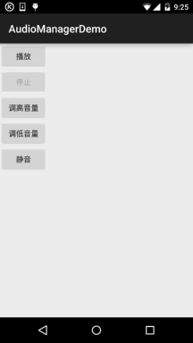

## 一、本节引言：
在多媒体的第一节，我们用SoundPool写了个Duang的示例，小猪点击一个按钮后，突然发出"Duang"的 一声，而且当时的声音很大，吓死宝宝了，好在不是上班时间，上班时间偷偷写博客给经理知道 会作死的~嗯，好的，说到这个声音大小就得介绍下Android为我们提供的(音量大小控制)的API：

AudioManager(音频管理器)了，该类位于Android.Media包下，提供了音量控制与铃声模式相关操作！ 本节我们就来学下这个东东的用法，你可以写一个Demo，一个简单的静音，每次看小电影之前，先 进Demo点下静音，然后，说说而已哈~嗯，话不多说，开始本节内容！

官方API文档：AudioManager


## 二、获得AudioManager对象实例
```java
AudioManager audiomanage = (AudioManager)context.getSystemService(Context.AUDIO_SERVICE);
```


## 三、相关方法详解
常用方法：

- adjustVolume(int direction, int flags)： 控制手机音量,调大或者调小一个单位,根据第一个参数进行判断 AudioManager.ADJUST_LOWER,可调小一个单位; AudioManager.ADJUST_RAISE,可调大一个单位
- adjustStreamVolume(int streamType, int direction, int flags)： 同上,不过可以选择调节的声音类型 
- 1）streamType参数,指定声音类型,有下述几种声音类型: 
`STREAM_ALARM`：手机闹铃 
`STREAM_MUSIC`：手机音乐
`STREAM_RING`：电话铃声 
`STREAM_SYSTEAM`：手机系统
`STREAM_DTMF`：音调 
`STREAM_NOTIFICATION`：系统提示
`STREAM_VOICE_CALL`:语音电话 
- 2）第二个参数和上面那个一样,调大或调小音量的 
- 3）可选的标志位,比如AudioManager.FLAG_SHOW_UI,显示进度条,AudioManager.PLAY_SOUND:播放声音
- setStreamVolume(int streamType, int index, intflags)：直接设置音量大小
- getMode( )：返回当前的音频模式
- setMode( )：设置声音模式 有下述几种模式: MODE_NORMAL(普通), MODE_RINGTONE(铃声), MODE_IN_CALL(打电话)，MODE_IN_COMMUNICATION(通话)
- getRingerMode( )：返回当前的铃声模式
- setRingerMode(int streamType):设置铃声模式 有下述几种模式: 如RINGER_MODE_NORMAL（普通）、RINGER_MODE_SILENT（静音）、RINGER_MODE_VIBRATE（震动）
- getStreamVolume(int streamType)： 获得手机的当前音量,最大值为7,最小值为0,当设置为0的时候,会自动调整为震动模式
- getStreamMaxVolume(int streamType)：获得手机某个声音类型的最大音量值
- setStreamMute(int streamType,boolean state)：将手机某个声音类型设置为静音
- setSpeakerphoneOn(boolean on)：设置是否打开扩音器
- setMicrophoneMute(boolean on)：设置是否让麦克风静音
- isMicrophoneMute()：判断麦克风是否静音或是否打开
- isMusicActive()：判断是否有音乐处于活跃状态
- isWiredHeadsetOn()：判断是否插入了耳机

其他方法：

- abandonAudioFocus(AudioManager.OnAudioFocusChangeListenerl)：放弃音频的焦点
- adjustSuggestedStreamVolume(int,int suggestedStreamType intflags)： 调整最相关的流的音量，或者给定的回退流
- getParameters(String keys)：给音频硬件设置一个varaible数量的参数值
- getVibrateSetting(int vibrateType)：返回是否该用户的振动设置为振动类型
- isBluetoothA2dpOn()：检查是否A2DP蓝牙耳机音频路由是打开或关闭
- isBluetoothScoOn()：检查通信是否使用蓝牙SCO
- loadSoundEffects()：加载声音效果
- playSoundEffect((int effectType, float volume)：播放声音效果
- egisterMediaButtonEventReceiver(ComponentName eventReceiver)： 注册一个组件MEDIA_BUTTON意图的唯一接收机
- requestAudioFocus(AudioManager.OnAudioFocusChangeListener l,int streamType,int durationHint) 请求音频的焦点
- setBluetoothScoOn(boolean on)：要求使用蓝牙SCO耳机进行通讯
-startBluetoothSco/stopBluetoothSco()()：启动/停止蓝牙SCO音频连接
- unloadSoundEffects()：卸载音效


## 四、使用示例
嘿嘿，属性蛮多的，有些还涉及到蓝牙这些东东，这里我们只讲解最常见的一些方法！

遇到一些特殊的没见过的，我们再来查文档！

简单的示例：使用Mediaplayer播放音乐,通过AudioManager调节音量大小与静音！

对了，先在res下创建一个raw的文件夹，往里面丢一个MP3资源文件！

运行效果图：



代码实现：

布局代码activity_main.xml：
```xml
<LinearLayout xmlns:android="http://schemas.android.com/apk/res/android"
    android:id="@+id/LinearLayout1"
    android:layout_width="match_parent"
    android:layout_height="match_parent"
    android:orientation="vertical">

    <Button
        android:id="@+id/btn_start"
        android:layout_width="wrap_content"
        android:layout_height="wrap_content"
        android:text="播放" />

    <Button
        android:id="@+id/btn_stop"
        android:layout_width="wrap_content"
        android:layout_height="wrap_content"
        android:enabled="false"
        android:text="停止" />

    <Button
        android:id="@+id/btn_higher"
        android:layout_width="wrap_content"
        android:layout_height="wrap_content"
        android:text="调高音量" />

    <Button
        android:id="@+id/btn_lower"
        android:layout_width="wrap_content"
        android:layout_height="wrap_content"
        android:text="调低音量" />

    <Button
        android:id="@+id/btn_quite"
        android:layout_width="wrap_content"
        android:layout_height="wrap_content"
        android:text="静音" />

</LinearLayout>
```

`MainActivity.java：`
```java
public class MainActivity extends AppCompatActivity implements View.OnClickListener {

    private Button btn_start;
    private Button btn_stop;
    private Button btn_higher;
    private Button btn_lower;
    private Button btn_quite;
    private MediaPlayer mePlayer;
    private AudioManager aManager;
    //定义一个标志用来标示是否点击了静音按钮
    private int flag = 1;


    @Override
    protected void onCreate(Bundle savedInstanceState) {
        super.onCreate(savedInstanceState);
        setContentView(R.layout.activity_main);
        //获得系统的音频对象
        aManager = (AudioManager) getSystemService(Service.AUDIO_SERVICE);
        //初始化mediaplayer对象,这里播放的是raw文件中的mp3资源
        mePlayer = MediaPlayer.create(MainActivity.this, R.raw.countingstars);
        //设置循环播放:
        mePlayer.setLooping(true);
        bindViews();
    }

    private void bindViews() {
        btn_start = (Button) findViewById(R.id.btn_start);
        btn_stop = (Button) findViewById(R.id.btn_stop);
        btn_higher = (Button) findViewById(R.id.btn_higher);
        btn_lower = (Button) findViewById(R.id.btn_lower);
        btn_quite = (Button) findViewById(R.id.btn_quite);

        btn_start.setOnClickListener(this);
        btn_stop.setOnClickListener(this);
        btn_higher.setOnClickListener(this);
        btn_lower.setOnClickListener(this);
        btn_quite.setOnClickListener(this);
    }

    @Override
    public void onClick(View v) {
        switch (v.getId()) {
            case R.id.btn_start:
                btn_stop.setEnabled(true);
                mePlayer.start();
                btn_start.setEnabled(false);
                break;
            case R.id.btn_stop:
                btn_start.setEnabled(true);
                mePlayer.pause();
                btn_stop.setEnabled(false);
                break;
            case R.id.btn_higher:
                // 指定调节音乐的音频，增大音量，而且显示音量图形示意
                aManager.adjustStreamVolume(AudioManager.STREAM_MUSIC,
                        AudioManager.ADJUST_RAISE, AudioManager.FLAG_SHOW_UI);
                break;
            case R.id.btn_lower:
                // 指定调节音乐的音频，降低音量，只有声音,不显示图形条
                aManager.adjustStreamVolume(AudioManager.STREAM_MUSIC,
                        AudioManager.ADJUST_LOWER, AudioManager.FLAG_PLAY_SOUND);
                break;
            case R.id.btn_quite:
                // 指定调节音乐的音频，根据isChecked确定是否需要静音
                flag *= -1;
                if (flag == -1) {
                    aManager.setStreamMute(AudioManager.STREAM_MUSIC, true);   //API 23过期- -
//                    aManager.adjustStreamVolume(AudioManager.STREAM_MUSIC, AudioManager.ADJUST_MUTE,
//                            AudioManager.FLAG_SHOW_UI);   //23以后的版本用这个
                    btn_quite.setText("取消静音");
                } else {
                    aManager.setStreamMute(AudioManager.STREAM_MUSIC, false);//API 23过期- -
//                    aManager.adjustStreamVolume(AudioManager.STREAM_MUSIC, AudioManager.ADJUST_UNMUTE,
//                            AudioManager.FLAG_SHOW_UI);  //23以后的版本用这个
                    aManager.setMicrophoneMute(false);
                    btn_quite.setText("静音");
                }
                break;
        }
    }
}
```

代码还是非常简单的，另外设置静音的方法setStreamMute()在API 23版本过期， 可以使用另一个方法adjustStreamVolume(int, int, int)，然后第三个属性设置：

ADJUST_MUTE 或 ADJUST_UNMUTE！

对了，还有：

如果adjustStreamVolume()的第三个参数你设置了振动(Vibrator), 需要在AndroidManifest.xml中添加这个权限哦!
```xml
<uses-permission android:name="android.permission.VIBRATE" />
```


## 五、本节小结：
好的，本节给大家演示了AudioManager用于调节音量的一个简单用法，这个类笔者也不常用 到，以后如果有什么新get的技能再加上吧~嘿嘿，静音Demo写好没？要结合实际需求哈~

另外，本周博客可能不会更新得太频繁，本周要把公司的WebSocket库替换掉，有得头痛了~ 好的，就说这么多，谢谢~