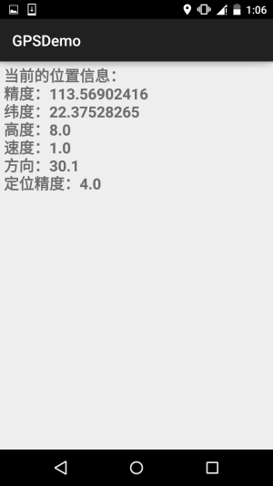
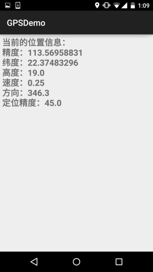
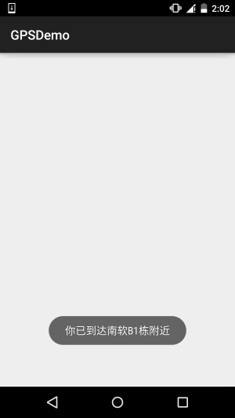

## 一、本节引言：
说到GPS这个名词，相信大家都不陌生，GPS全球定位技术嘛，嗯，Android中定位的方式 一般有这四种：GPS定位，WIFI定准，基站定位，AGPS定位(基站+GPS)；

本系列教程只讲解GPS定位的基本使用！GPS是通过与卫星交互来获取设备当前的经纬度，准确 度较高，但也有一些缺点，最大的缺点就是：室内几乎无法使用...需要收到4颗卫星或以上 信号才能保证GPS的准确定位！但是假如你是在室外，无网络的情况，GPS还是可以用的！

本节我们就来探讨下Android中的GPS的基本用法~


## 二、定位相关的一些API
### 1）LocationManager
官方API文档：LocationManager

这玩意是系统服务来的，不能直接new，需要：
```java
LocationManager lm = (LocationManager)getSystemService(Context.LOCATION_SERVICE);
```

另外用GPS定位别忘了加权限：
```xml
<uses-permission android:name="android.permission.ACCESS_FINE_LOCATION"/>
```

好的，获得了LocationManager对象后，我们可以调用下面这些常用的方法：

- addGpsStatusListener(GpsStatus.Listener listener)：添加一个GPS状态监听器
- addProximityAlert(double latitude, double longitude, float radius, long expiration, PendingIntent intent)： 添加一个临界警告
- getAllProviders()：获取所有的LocationProvider列表
- getBestProvider(Criteria criteria, boolean enabledOnly)：根据指定条件返回最优LocationProvider
- getGpsStatus(GpsStatus status)：获取GPS状态
- getLastKnownLocation(String provider)：根据LocationProvider获得最近一次已知的Location
- getProvider(String name)：根据名称来获得LocationProvider
- getProviders(boolean enabledOnly)：获取所有可用的LocationProvider
- getProviders(Criteria criteria, boolean enabledOnly)：根据指定条件获取满足条件的所有LocationProvider
- isProviderEnabled(String provider)：判断指定名称的LocationProvider是否可用
- removeGpsStatusListener(GpsStatus.Listener listener)：删除GPS状态监听器
- removeProximityAlert(PendingIntent intent)：删除一个临近警告
- requestLocationUpdates(long minTime, float minDistance, Criteria criteria, PendingIntent intent)： 通过制定的LocationProvider周期性地获取定位信息，并通过Intent启动相应的组件
- requestLocationUpdates(String provider, long minTime, float minDistance, LocationListener listener)： 通过制定的LocationProvider周期性地获取定位信息，并触发listener所对应的触发器


### 2）LocationProvider(定位提供者)
官方API文档：LocationProvider

这比是GPS定位组件的抽象表示，调用下述方法可以获取该定位组件的相关信息！

常用的方法如下：

- getAccuracy()：返回LocationProvider精度
- getName()：返回LocationProvider名称
- getPowerRequirement()：获取LocationProvider的电源需求
- hasMonetaryCost()：返回该LocationProvider是收费还是免费的
- meetsCriteria(Criteria criteria)：判断LocationProvider是否满足Criteria条件
- requiresCell()：判断LocationProvider是否需要访问网络基站
- requiresNetwork()：判断LocationProvider是否需要访问网络数据
- requiresSatellite()：判断LocationProvider是否需要访问基于卫星的定位系统
- supportsAltitude()：判断LocationProvider是否支持高度信息
- supportsBearing()：判断LocationProvider是否支持方向信息
- supportsSpeed()：判断是LocationProvider否支持速度信息


### 3）Location(位置信息)
官方API文档：Location

位置信息的抽象类，我们可以调用下述方法获取相关的定位信息！

常用方法如下：

- float getAccuracy()：获得定位信息的精度
- double getAltitude()：获得定位信息的高度
- float getBearing()：获得定位信息的方向
- double getLatitude()：获得定位信息的纬度
- double getLongitude()：获得定位信息的精度
- String getProvider()：获得提供该定位信息的LocationProvider
- float getSpeed()：获得定位信息的速度
- boolean hasAccuracy()：判断该定位信息是否含有精度信息


### 4）Criteria(过滤条件)
官方API文档：Criteria

获取LocationProvider时，可以设置过滤条件，就是通过这个类来设置相关条件的~

常用方法如下：

- setAccuracy(int accuracy)：设置对的精度要求
- setAltitudeRequired(boolean altitudeRequired)：设置是否要求LocationProvider能提供高度的信息
- setBearingRequired(boolean bearingRequired)：设置是否要LocationProvider求能提供方向信息
- setCostAllowed(boolean costAllowed)：设置是否要求LocationProvider能提供方向信息
- setPowerRequirement(int level)：设置要求LocationProvider的耗电量
- setSpeedRequired(boolean speedRequired)：设置是否要求LocationProvider能提供速度信息


## 三、获取LocationProvider的例子
运行效果图：


由图可以看到，当前可用的LocationProvider有三个，分别是：

- passive：被动提供，由其他程序提供
- gps：通过GPS获取定位信息
- network：通过网络获取定位信息

实现代码：

布局文件：activity_main.xml：
```xml
<LinearLayout xmlns:android="http://schemas.android.com/apk/res/android"
    android:layout_width="match_parent"
    android:layout_height="match_parent"
    android:orientation="vertical">

    <Button
        android:id="@+id/btn_one"
        android:layout_width="wrap_content"
        android:layout_height="wrap_content"
        android:text="获得系统所有的LocationProvider" />

    <Button
        android:id="@+id/btn_two"
        android:layout_width="wrap_content"
        android:layout_height="wrap_content"
        android:text="根据条件获取LocationProvider" />

    <Button
        android:id="@+id/btn_three"
        android:layout_width="wrap_content"
        android:layout_height="wrap_content"
        android:text="获取指定的LocationProvider" />

    <TextView
        android:id="@+id/tv_result"
        android:layout_width="match_parent"
        android:layout_height="match_parent"
        android:layout_margin="10dp"
        android:background="#81BB4D"
        android:padding="5dp"
        android:textColor="#FFFFFF"
        android:textSize="20sp"
        android:textStyle="bold" />

</LinearLayout>
```

`MainActivity.java：`
```java
public class MainActivity extends AppCompatActivity implements View.OnClickListener {

    private Button btn_one;
    private Button btn_two;
    private Button btn_three;
    private TextView tv_result;
    private LocationManager lm;
    private List<String> pNames = new ArrayList<String>(); // 存放LocationProvider名称的集合

    @Override
    protected void onCreate(Bundle savedInstanceState) {
        super.onCreate(savedInstanceState);
        setContentView(R.layout.activity_main);
        lm = (LocationManager) getSystemService(Context.LOCATION_SERVICE);
        bindViews();
    }

    private void bindViews() {
        btn_one = (Button) findViewById(R.id.btn_one);
        btn_two = (Button) findViewById(R.id.btn_two);
        btn_three = (Button) findViewById(R.id.btn_three);
        tv_result = (TextView) findViewById(R.id.tv_result);

        btn_one.setOnClickListener(this);
        btn_two.setOnClickListener(this);
        btn_three.setOnClickListener(this);
    }


    @Override
    public void onClick(View v) {
        switch (v.getId()) {
            case R.id.btn_one:
                pNames.clear();
                pNames = lm.getAllProviders();
                tv_result.setText(getProvider());
                break;
            case R.id.btn_two:
                pNames.clear();
                Criteria criteria = new Criteria();
                criteria.setCostAllowed(false);   //免费
                criteria.setAltitudeRequired(true);  //能够提供高度信息
                criteria.setBearingRequired(true);   //能够提供方向信息
                pNames = lm.getProviders(criteria, true);
                tv_result.setText(getProvider());
                break;
            case R.id.btn_three:
                pNames.clear();
                pNames.add(lm.getProvider(LocationManager.GPS_PROVIDER).getName()); //指定名称
                tv_result.setText(getProvider());
                break;
        }
    }

    //遍历数组返回字符串的方法
    private String getProvider(){
        StringBuilder sb = new StringBuilder();
        for (String s : pNames) {
            sb.append(s + "\n");
        }
        return sb.toString();
    }
}
```


## 四、判断GPS是否打开以及打开GPS的两种方式
在我们使用GPS定位前的第一件事应该是去判断GPS是否已经打开或可用，没打开的话我们需要去 打开GPS才能完成定位！这里不考虑AGPS的情况~

### 1）判断GPS是否可用
```java
private boolean isGpsAble(LocationManager lm){
    return lm.isProviderEnabled(android.location.LocationManager.GPS_PROVIDER)?true:false;
}
```


### 2）检测到GPS未打开，打开GPS
方法一：强制打开GPS，Android 5.0后无用....
```java
//强制帮用户打开GPS 5.0以前可用
private void openGPS(Context context){
    Intent gpsIntent = new Intent();
    gpsIntent.setClassName("com.android.settings", "com.android.settings.widget.SettingsAppWidgetProvider");
    gpsIntent.addCategory("android.intent.category.ALTERNATIVE");
    gpsIntent.setData(Uri.parse("custom:3"));
    try {
        PendingIntent.getBroadcast(LocationActivity.this, 0, gpsIntent, 0).send();
    } catch (PendingIntent.CanceledException e) {
        e.printStackTrace();
    }
}
```

方法二：打开GPS位置信息设置页面，让用户自行打开
```java
//打开位置信息设置页面让用户自己设置
private void openGPS2(){
    Intent intent = new Intent(Settings.ACTION_LOCATION_SOURCE_SETTINGS);
    startActivityForResult(intent,0);
}
```


## 五、动态获取位置信息
这个非常简单，调用requestLocationUpdates方法设置一个LocationListener定时检测位置而已！

示例代码如下：

布局:activity_location.xml：
```xml
<?xml version="1.0" encoding="utf-8"?>
<LinearLayout xmlns:android="http://schemas.android.com/apk/res/android"
    android:layout_width="match_parent"
    android:layout_height="match_parent"
    android:orientation="vertical">

    <TextView
        android:id="@+id/tv_show"
        android:layout_width="match_parent"
        android:layout_height="match_parent"
        android:padding="5dp"
        android:textSize="20sp"
        android:textStyle="bold" />

</LinearLayout>
```

`LocationActivity.java：`
```java
/**
 * Created by Jay on 2015/11/20 0020.
 */
public class LocationActivity extends AppCompatActivity {

    private LocationManager lm;
    private TextView tv_show;

    @Override
    public void onCreate(Bundle savedInstanceState) {
        super.onCreate(savedInstanceState);
        setContentView(R.layout.activity_location);
        tv_show = (TextView) findViewById(R.id.tv_show);
        lm = (LocationManager) getSystemService(Context.LOCATION_SERVICE);
        if (!isGpsAble(lm)) {
            Toast.makeText(LocationActivity.this, "请打开GPS~", Toast.LENGTH_SHORT).show();
            openGPS2();
        }
        //从GPS获取最近的定位信息
        Location lc = lm.getLastKnownLocation(LocationManager.GPS_PROVIDER);
        updateShow(lc);
        //设置间隔两秒获得一次GPS定位信息
        lm.requestLocationUpdates(LocationManager.GPS_PROVIDER, 2000, 8, new LocationListener() {
            @Override
            public void onLocationChanged(Location location) {
                // 当GPS定位信息发生改变时，更新定位
                updateShow(location);
            }

            @Override
            public void onStatusChanged(String provider, int status, Bundle extras) {

            }

            @Override
            public void onProviderEnabled(String provider) {
                // 当GPS LocationProvider可用时，更新定位
                updateShow(lm.getLastKnownLocation(provider));
            }

            @Override
            public void onProviderDisabled(String provider) {
                updateShow(null);
            }
        });
    }


    //定义一个更新显示的方法
    private void updateShow(Location location) {
        if (location != null) {
            StringBuilder sb = new StringBuilder();
            sb.append("当前的位置信息：\n");
            sb.append("精度：" + location.getLongitude() + "\n");
            sb.append("纬度：" + location.getLatitude() + "\n");
            sb.append("高度：" + location.getAltitude() + "\n");
            sb.append("速度：" + location.getSpeed() + "\n");
            sb.append("方向：" + location.getBearing() + "\n");
            sb.append("定位精度：" + location.getAccuracy() + "\n");
            tv_show.setText(sb.toString());
        } else tv_show.setText("");
    }


    private boolean isGpsAble(LocationManager lm) {
        return lm.isProviderEnabled(android.location.LocationManager.GPS_PROVIDER) ? true : false;
    }


    //打开设置页面让用户自己设置
    private void openGPS2() {
        Intent intent = new Intent(Settings.ACTION_LOCATION_SOURCE_SETTINGS);
        startActivityForResult(intent, 0);
    }
}
```

好的，非常简单，因为gps需要在室外才能用，于是趁着这个机会小跑出去便利店买了杯奶茶， 顺道截下图~




  

requestLocationUpdates (String provider, long minTime, float minDistance, LocationListener listener)

当时间超过minTime（单位：毫秒），或者位置移动超过minDistance（单位：米），就会调用listener中的方法更新GPS信息，建议这个minTime不小于60000，即1分钟，这样会更加高效而且省电，加入你需要尽可能 实时地更新GPS，可以将minTime和minDistance设置为0

对了，别忘了，你还需要一枚权限：
```xml
<uses-permission android:name="android.permission.ACCESS_FINE_LOCATION" />
```


## 六、临近警告(地理围栏)
嗯，就是固定一个点，当手机与该点的距离少于指定范围时，可以触发对应的处理！ 有点像地理围栏...我们可以调用LocationManager的addProximityAlert方法添加临近警告！ 完整方法如下：

addProximityAlert(double latitude,double longitude,float radius,long expiration,PendingIntent intent)

属性说明：

- latitude：指定固定点的经度
- longitude：指定固定点的纬度
- radius：指定半径长度
- expiration：指定经过多少毫秒后该临近警告就会过期失效，-1表示永不过期
- intent：该参数指定临近该固定点时触发该intent对应的组件

示例代码如下：

`ProximityActivity.java：`
```java
/**
 * Created by Jay on 2015/11/21 0021.
 */
public class ProximityActivity extends AppCompatActivity {
    private LocationManager lm;
    @Override
    public void onCreate(Bundle savedInstanceState) {
        super.onCreate(savedInstanceState);
        setContentView(R.layout.activity_proximity);
        lm = (LocationManager) getSystemService(Context.LOCATION_SERVICE);
        //定义固定点的经纬度
        double longitude = 113.56843;
        double latitude = 22.374937;
        float radius = 10;     //定义半径，米
        Intent intent = new Intent(this, ProximityReceiver.class);
        PendingIntent pi = PendingIntent.getBroadcast(this, -1, intent, 0);
        lm.addProximityAlert(latitude, longitude, radius, -1, pi);
    }
}
```

还需要注册一个广播接收者：ProximityReceiver.java：
```java
/**
 * Created by Jay on 2015/11/21 0021.
 */
public class ProximityReceiver extends BroadcastReceiver{
    @Override
    public void onReceive(Context context, Intent intent) {
        boolean isEnter = intent.getBooleanExtra( LocationManager.KEY_PROXIMITY_ENTERING, false);
        if(isEnter) Toast.makeText(context, "你已到达南软B1栋附近", Toast.LENGTH_LONG).show();
        else Toast.makeText(context, "你已离开南软B1栋附近", Toast.LENGTH_LONG).show();
    }
}
```

别忘了注册：
```xml
<receiver android:name=".ProximityReceiver"/>
```

运行效果图：




PS：好吧，设置了10m，结果我从B1走到D1那边，不止10m了吧...还刚好下雨


## 七、本节示例代码下载
[GPSDemo.zip](../img/GPSDemo.zip)


## 八、本节小结：
好的，本节给大家介绍了Android中GPS定位的一些基本用法，非常简单，内容部分参考的 李刚老师的《Android疯狂讲义》，只是对例子进行了一些修改以及进行了可用性的测试！ 本节就到这里，谢谢~