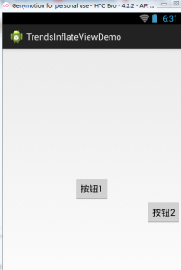
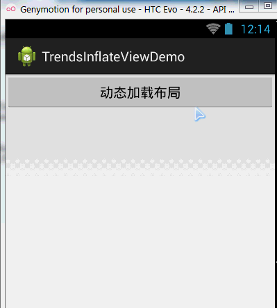

## 一、本节引言：
　本节继续带来的是Android系统服务中的LayoutInflater(布局服务)，说到布局，大家第一时间 可能想起的是写完一个布局的xml，然后调用Activity的setContentView()加载布局，然后把他显示 到屏幕上是吧~其实这个底层走的还是这个LayoutInflater，用的Android内置的Pull解析器来解析 布局。一般在Android动态加载布局或者添加控件用得较多，本节我们就来学习下他在实际开发中 的一些用法~

官方API文档：LayoutInflater


## 二、LayoutInflater的相关介绍
### 1）Layout是什么鬼？
答：一个用于加载布局的系统服务，就是实例化与Layout XML文件对应的View对象，不能直接使用， 需要通过getLayoutInflater( )方法或getSystemService( )方法来获得与当前Context绑定的 LayoutInflater实例!


### 2）LayoutInflater的用法
**①获取LayoutInflater实例的三种方法：**
```java
LayoutInflater inflater1 = LayoutInflater.from(this);  
LayoutInflater inflater2 = getLayoutInflater();  
LayoutInflater inflater3 = (LayoutInflater) getSystemService(LAYOUT_INFLATER_SERVICE); 
```

PS:后面两个其实底层走的都是第一种方法~

**②加载布局的方法：**
```java
public View inflate (int resource, ViewGroup root, boolean attachToRoot) 该方法的三个参数依次为:
```

- ①要加载的布局对应的资源id

- ②为该布局的外部再嵌套一层父布局，如果不需要的话，写null就可以了!

- ③是否为加载的布局文件的最外层套一层root布局，不设置该参数的话， 如果root不为null的话，则默认为true 如果root为null的话，attachToRoot就没有作用了! root不为null，attachToRoot为true的话，会在加载的布局文件最外层嵌套一层root布局; 为false的话，则root失去作用! 简单理解就是：是否为加载的布局添加一个root的外层容器~!

**③通过LayoutInflater.LayoutParams来设置相关的属性:**

比如RelativeLayout还可以通过addRule方法添加规则，就是设置位置：是参考父容器呢？ 还是参考子控件？又或者设置margin等等，这个由你决定~


## 三、纯Java代码加载布局
我们早已习惯了使用XML生成我们需要的布局，但是在一些特定的情况下，我们 需要使用Java代码往我们的布局中动态的添加组件或者布局！

但是不建议大家完全地使用Java代码来编写Android页面布局，首先一点就是代码会多， 一多久容易乱，而且不利于业务的分离，我们还是建议使用xml来完成布局，然后通过 Java代码对里面的组件进行修改，当然有些时候可能需要使用Java动态的来添加组件！

纯Java代码加载布局的流程：
——Step 1：

①创建容器:LinearLayout ly = new LinearLayout(this);

②创建组件:Button btnOne = new Button(this);

——Step 2:

可以为容器或者组件设置相关属性： 比如：LinearLayout，我们可以设置组件的排列方向：ly.setOrientation(LinearLayout.VERTICAL); 而组件也可以：比如Button：btnOne.setText("按钮1"); 关于设置属性的方法可参见Android 的API,通常xml设置的属性只需在前面添加：set即可,比如 setPadding(左,上,右,下);

——Step 3：

将组件或容器添加到容器中，这个时候我们可能需要设置下组件的添加位置，或者设置他的大小： 我们需要用到一个类：LayoutParams，我们可以把它看成布局容器的一个信息包!封装位置与大小 等信息的一个类!先演示下设置大小的方法：(前面的LinearLayout可以根据不同容器进行更改)
```java
LinearLayout.LayoutParams lp1 = new LinearLayout.LayoutParams(  
        LayoutParams.WRAP_CONTENT, LayoutParams.WRAP_CONTENT); 
```

很简单，接着就到这个设置位置了，设置位置的话，通常我们考虑的只是RelativeLayout! 这个时候用到LayoutParams的addRule( )方法!可以添加多个addRule( )哦！ 设置组件在父容器中的位置，

比如设置组件的对其方式:
```java
RelativeLayout rly = new RelativeLayout(this);  
RelativeLayout.LayoutParams lp2 = new RelativeLayout.LayoutParams(  
                LayoutParams.WRAP_CONTENT, LayoutParams.WRAP_CONTENT);  
lp2.addRule(RelativeLayout.ALIGN_PARENT_BOTTOM);  
Button btnOne = new Button(this);  
rly.addView(btnOne, lp2);
```

参照其他组件的对其方式： (有个缺点,就是要为参考组件手动设置一个id，是手动!!!!) 比如:设置btnOne居中后,让BtnTwo位于btnOne的下方以及父容器的右边!
```java
public class MainActivity extends Activity {  
    @Override  
    protected void onCreate(Bundle savedInstanceState) {  
        super.onCreate(savedInstanceState);  
        RelativeLayout rly = new RelativeLayout(this);  
        Button btnOne = new Button(this);  
        btnOne.setText("按钮1");  
        Button btnTwo = new Button(this);  
        btnTwo.setText("按钮2");  
        // 为按钮1设置一个id值  
        btnOne.setId(123);  
        // 设置按钮1的位置,在父容器中居中  
        RelativeLayout.LayoutParams rlp1 = new RelativeLayout.LayoutParams(  
                LayoutParams.WRAP_CONTENT, LayoutParams.WRAP_CONTENT);  
        rlp1.addRule(RelativeLayout.CENTER_IN_PARENT);  
        // 设置按钮2的位置,在按钮1的下方,并且对齐父容器右面  
        RelativeLayout.LayoutParams rlp2 = new RelativeLayout.LayoutParams(  
                LayoutParams.WRAP_CONTENT, LayoutParams.WRAP_CONTENT);  
        rlp2.addRule(RelativeLayout.BELOW, 123);  
        rlp2.addRule(RelativeLayout.ALIGN_PARENT_RIGHT);  
        // 将组件添加到外部容器中  
        rly.addView(btnTwo, rlp2);  
        rly.addView(btnOne, rlp1);  
        // 设置当前视图加载的View即rly  
        setContentView(rly);  
    }  
}  
```

——step 4：

调用setContentView( )方法加载布局对象即可! 另外，如果你想移除某个容器中的View，可以调用容器.removeView(要移除的组件);

运行截图：




## 四、Java代码动态添加控件或xml布局
第二点我们讲解了使用纯Java代码来加载布局，实际当中用得并不多，更多的时候是动态 的添加View控件以及动态的加载XML布局！

### 1）Java代码动态增加View
动态添加组件的写法有两种，区别在于是否需要先setContentView(R.layout.activity_main); 下面演示下两种不同写法添加一个Button的例子：

先写个布局文件先：activity_main.xml：
```xml
<RelativeLayout xmlns:android="http://schemas.android.com/apk/res/android"  
    android:id="@+id/RelativeLayout1"  
    android:layout_width="match_parent"  
    android:layout_height="match_parent" >  
  
    <TextView   
        android:id="@+id/txtTitle"  
        android:layout_width="match_parent"  
        android:layout_height="wrap_content"  
        android:text="我是xml文件加载的布局"/>  
      
</RelativeLayout>  
```

第一种不需要setContentView()加载布局文件先：
```java
public class MainActivity extends Activity {  
    @Override  
    protected void onCreate(Bundle savedInstanceState) {  
        super.onCreate(savedInstanceState);  
        Button btnOne = new Button(this);  
        btnOne.setText("我是动态添加的按钮");  
        RelativeLayout.LayoutParams lp2 = new RelativeLayout.LayoutParams(    
                LayoutParams.WRAP_CONTENT, LayoutParams.WRAP_CONTENT);    
        lp2.addRule(RelativeLayout.CENTER_IN_PARENT);    
        LayoutInflater inflater = LayoutInflater.from(this);  
        RelativeLayout rly = (RelativeLayout) inflater.inflate(  
                R.layout.activity_main, null)  
                .findViewById(R.id.RelativeLayout1);  
        rly.addView(btnOne,lp2);  
        setContentView(rly);  
    }  
} 
```

第二种不需要setContentView()加载布局文件先：
```java
public class MainActivity extends Activity {  
    @Override  
    protected void onCreate(Bundle savedInstanceState) {  
        super.onCreate(savedInstanceState);  
        setContentView(R.layout.activity_main);  
        Button btnOne = new Button(this);  
        btnOne.setText("我是动态添加的按钮");  
        RelativeLayout.LayoutParams lp2 = new RelativeLayout.LayoutParams(    
                LayoutParams.WRAP_CONTENT, LayoutParams.WRAP_CONTENT);    
        lp2.addRule(RelativeLayout.CENTER_IN_PARENT);    
        RelativeLayout rly = (RelativeLayout) findViewById(R.id.RelativeLayout1);  
        rly.addView(btnOne,lp2);  
    }  
} 
```

分析总结：

代码很简单,创建按钮后，我们又创建了一个LayoutParams对象，用来设置Button的大小， 又通过addRule()方法设置了Button的位置!

第一种方法：通过LayoutInflate的inflate()方法加载了activity_main布局，获得了外层容器， 接着addView添加按钮进容器,最后setContentView();

第二种方法：因为我们已经通过setContetView()方法加载了布局，此时我们就可以通过 findViewById找到这个外层容器,接着addView,最后setContentView()即可!

另外,关于这个setContentView( )他设置的视图节点是整个XML的根节点!


### 2）Java代码动态加载xml布局
接下来的话，我们换一个，这次加载的是xml文件!动态地添加xml文件! 先写下主布局文件和动态加载的布局文件：

`activity_main.xml：`
```xml
<RelativeLayout xmlns:android="http://schemas.android.com/apk/res/android"
    android:id="@+id/RelativeLayout1"
    android:layout_width="match_parent"
    android:layout_height="match_parent" >
    <Button
        android:id="@+id/btnLoad"
        android:layout_width="match_parent"
        android:layout_height="wrap_content"
        android:text="动态加载布局"/>
</RelativeLayout>  
```

`inflate.xml：`
```xml
<?xml version="1.0" encoding="utf-8"?>  
<LinearLayout xmlns:android="http://schemas.android.com/apk/res/android"  
    android:layout_width="match_parent"  
    android:layout_height="match_parent"  
    android:gravity="center"  
    android:orientation="vertical"  
    android:id="@+id/ly_inflate" >  
  
    <TextView  
        android:layout_width="wrap_content"  
        android:layout_height="wrap_content"  
        android:text="我是Java代码加载的布局" />  
  
    <Button  
        android:layout_width="wrap_content"  
        android:layout_height="wrap_content"  
        android:text="我是布局里的一个小按钮" />  
  
</LinearLayout> 
```

接着到我们的MainActivity.java在这里动态加载xml布局：
```java
public class MainActivity extends Activity {  
    @Override  
    protected void onCreate(Bundle savedInstanceState) {  
        super.onCreate(savedInstanceState);  
        setContentView(R.layout.activity_main);  
        //获得LayoutInflater对象;  
        final LayoutInflater inflater = LayoutInflater.from(this);    
        //获得外部容器对象  
        final RelativeLayout rly = (RelativeLayout) findViewById(R.id.RelativeLayout1);  
        Button btnLoad = (Button) findViewById(R.id.btnLoad);  
        btnLoad.setOnClickListener(new OnClickListener() {  
            @Override  
            public void onClick(View v) {  
                //加载要添加的布局对象  
                LinearLayout ly = (LinearLayout) inflater.inflate(  
                        R.layout.inflate, null, false).findViewById(  
                        R.id.ly_inflate);  
                //设置加载布局的大小与位置  
                RelativeLayout.LayoutParams lp = new RelativeLayout.LayoutParams(    
                        LayoutParams.WRAP_CONTENT, LayoutParams.WRAP_CONTENT);    
                lp.addRule(RelativeLayout.CENTER_IN_PARENT);    
                rly.addView(ly,lp);  
            }  
        });  
    }  
} 
```

运行截图：



代码分析：

①获取容器对象:
```java
final RelativeLayout rly = (RelativeLayout) findViewById(R.id.RelativeLayout1);
```

②获得Inflater对象,同时加载被添加的布局的xml,通过findViewById找到最外层的根节点
```java
final LayoutInflater inflater = LayoutInflater.from(this);
LinearLayout ly = (LinearLayout) inflater.inflate(R.layout.inflate, null, false)
   .findViewById(R.id.ly_inflate);
```

③为这个容器设置大小与位置信息:
```java
RelativeLayout.LayoutParams lp = new RelativeLayout.LayoutParams(  
               LayoutParams.WRAP_CONTENT, LayoutParams.WRAP_CONTENT);  
       lp.addRule(RelativeLayout.CENTER_IN_PARENT); 
```

④添加到外层容器中:
```java
rly.addView(ly,lp);
```


## 五、LayoutInflater的inflate()方法源码
最后提供下LayoutInflater的inflate()方法的源码吧，有兴趣的可以看看~，其实就是Pull解析而已~
```java
public View inflate(XmlPullParser parser, ViewGroup root, boolean attachToRoot) {    
    synchronized (mConstructorArgs) {    
        final AttributeSet attrs = Xml.asAttributeSet(parser);    
        mConstructorArgs[0] = mContext;    
        View result = root;    
        try {    
            int type;    
            while ((type = parser.next()) != XmlPullParser.START_TAG &&    
                    type != XmlPullParser.END_DOCUMENT) {    
            }    
            if (type != XmlPullParser.START_TAG) {    
                throw new InflateException(parser.getPositionDescription()    
                        + ": No start tag found!");    
            }    
            final String name = parser.getName();    
            if (TAG_MERGE.equals(name)) {    
                if (root == null || !attachToRoot) {    
                    throw new InflateException("merge can be used only with a valid "    
                            + "ViewGroup root and attachToRoot=true");    
                }    
                rInflate(parser, root, attrs);    
            } else {    
                View temp = createViewFromTag(name, attrs);    
                ViewGroup.LayoutParams params = null;    
                if (root != null) {    
                    params = root.generateLayoutParams(attrs);    
                    if (!attachToRoot) {    
                        temp.setLayoutParams(params);    
                    }    
                }    
                rInflate(parser, temp, attrs);    
                if (root != null && attachToRoot) {    
                    root.addView(temp, params);    
                }    
                if (root == null || !attachToRoot) {    
                    result = temp;    
                }    
            }    
        } catch (XmlPullParserException e) {    
            InflateException ex = new InflateException(e.getMessage());    
            ex.initCause(e);    
            throw ex;    
        } catch (IOException e) {    
            InflateException ex = new InflateException(    
                    parser.getPositionDescription()    
                    + ": " + e.getMessage());    
            ex.initCause(e);    
            throw ex;    
        }    
        return result;    
    }    
} 
```


## 六、本节小结：
本节给大家讲解了一下Android中的LayoutInflater(布局服务)，以及动态加载View和控件 相关的东西，相信对初学控件的朋友带来帮助~好的，就说这么多，谢谢~ 