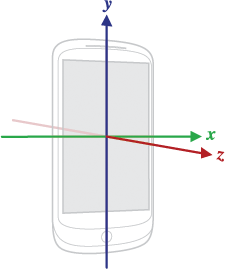
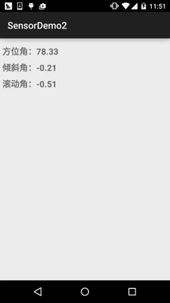
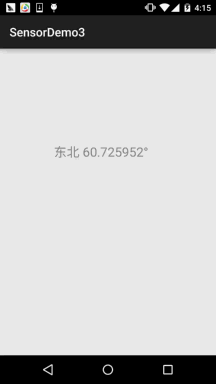

## 一、本节引言：
在上一节中我们中我们对传感器的一些基本概念进行了学习，以及学习了使用传感器的套路， 本节给大家带来的传感器是方向传感器的用法，好的，开始本节内容~


## 二、三维坐标系的概念：
在Android平台中，传感器框架通常是使用一个标准的三维坐标系来表示一个值的。以本节 要讲的方向传感器为例子，确定一个方向也需要一个三维坐标，毕竟我们的设备不可能永远 都是水平端着的吧，安卓给我们返回的方向值就是一个长度为3的flaot数组，包含三个方向 的值！官方API文档中有这样一个图：sensors_overview



如果你看不懂图，那么写下文字解释：

- X轴的方向：沿着屏幕水平方向从左到右，如果手机如果不是是正方形的话，较短的边需要水平 放置，较长的边需要垂直放置。
- Y轴的方向：从屏幕的左下角开始沿着屏幕的的垂直方向指向屏幕的顶端
- Z轴的方向：当水平放置时，指向天空的方向


## 三、方向传感器的三个值
上一节中说了，传感器的回调方法：onSensorChanged中的参数SensorEvent event，event的 值类型是Float[]的，而且最多只有三个元素，而方向传感器则刚好有三个元素，都表示度数！ 对应的含义如下：

- values[0]：方位角，手机绕着Z轴旋转的角度。0表示正北(North)，90表示正东(East)， 180表示正南(South)，270表示正西(West)。假如values[0]的值刚好是这四个值的话， 并且手机沿水平放置的话，那么当前手机的正前方就是这四个方向，可以利用这一点来 写一个指南针！

- values[1]：倾斜角，手机翘起来的程度，当手机绕着x轴倾斜时该值会发生变化。取值 范围是[-180,180]之间。假如把手机放在桌面上，而桌面是完全水平的话，values1的则应该 是0，当然很少桌子是绝对水平的。从手机顶部开始抬起，直到手机沿着x轴旋转180(此时屏幕 乡下水平放在桌面上)。在这个旋转过程中，values[1]的值会从0到-180之间变化，即手机抬起 时，values1的值会逐渐变小，知道等于-180；而加入从手机底部开始抬起，直到手机沿着x轴 旋转180度，此时values[1]的值会从0到180之间变化。我们可以利用value[1]的这个特性结合 value[2]来实现一个平地尺！

- value[2]：滚动角，沿着Y轴的滚动角度，取值范围为：[-90,90]，假设将手机屏幕朝上水平放在 桌面上，这时如果桌面是平的，values2的值应为0。将手机从左侧逐渐抬起，values[2]的值将 逐渐减小，知道垂直于手机放置，此时values[2]的值为-90，从右侧则是0-90；加入在垂直位置 时继续向右或者向左滚动，values[2]的值将会继续在-90到90之间变化！

假如你不是很懂，没事我们写个demo验证下就知道了~


## 四、简单的Demo帮助我们理解这三个值的变化：
运行效果图：



实现代码：

布局代码：activity_main.xml：
```xml
<LinearLayout xmlns:android="http://schemas.android.com/apk/res/android"
    android:layout_width="match_parent"
    android:layout_height="match_parent"
    android:orientation="vertical"
    android:padding="5dp">

    <TextView
        android:id="@+id/tv_value1"
        android:layout_width="wrap_content"
        android:layout_height="wrap_content"
        android:layout_marginTop="10dp"
        android:text="方位角"
        android:textSize="18sp"
        android:textStyle="bold" />

    <TextView
        android:id="@+id/tv_value2"
        android:layout_width="wrap_content"
        android:layout_height="wrap_content"
        android:layout_marginTop="10dp"
        android:text="倾斜角"
        android:textSize="18sp"
        android:textStyle="bold" />

    <TextView
        android:id="@+id/tv_value3"
        android:layout_width="wrap_content"
        android:layout_height="wrap_content"
        android:layout_marginTop="10dp"
        android:text="滚动角"
        android:textSize="18sp"
        android:textStyle="bold" />

</LinearLayout>
```

`MainActivity.java：`
```java
public class MainActivity extends AppCompatActivity implements SensorEventListener {

    private TextView tv_value1;
    private TextView tv_value2;
    private TextView tv_value3;
    private SensorManager sManager;
    private Sensor mSensorOrientation;

    @Override
    protected void onCreate(Bundle savedInstanceState) {
        super.onCreate(savedInstanceState);
        setContentView(R.layout.activity_main);
        sManager = (SensorManager) getSystemService(SENSOR_SERVICE);
        mSensorOrientation = sManager.getDefaultSensor(Sensor.TYPE_ORIENTATION);
        sManager.registerListener(this, mSensorOrientation, SensorManager.SENSOR_DELAY_UI);
        bindViews();
    }

    private void bindViews() {
        tv_value1 = (TextView) findViewById(R.id.tv_value1);
        tv_value2 = (TextView) findViewById(R.id.tv_value2);
        tv_value3 = (TextView) findViewById(R.id.tv_value3);
    }

    @Override
    public void onSensorChanged(SensorEvent event) {
        tv_value1.setText("方位角：" + (float) (Math.round(event.values[0] * 100)) / 100);
        tv_value2.setText("倾斜角：" + (float) (Math.round(event.values[1] * 100)) / 100);
        tv_value3.setText("滚动角：" + (float) (Math.round(event.values[2] * 100)) / 100);
    }

    @Override
    public void onAccuracyChanged(Sensor sensor, int accuracy) {

    }
}
```

代码非常简单~，你想真正体验下这三个值的变化，自己运行下程序转转手机就知道了~


## 五、一个简易版的文字指南针示例
下面我们来写个简单的文字版的指南针来体验体验，当文字显示正南的时候，表示手机 的正前方就是南方！

运行效果图：



代码实现：

自定义View：CompassView.java
```java
/**
 * Created by Jay on 2015/11/14 0014.
 */
public class CompassView extends View implements Runnable{

    private Paint mTextPaint;
    private int sWidth,sHeight;
    private float dec = 0.0f;
    private String msg  = "正北 0°";

    public CompassView(Context context) {
        this(context, null);
    }

    public CompassView(Context context, AttributeSet attrs) {
        super(context, attrs);
        sWidth = ScreenUtil.getScreenW(context);
        sHeight = ScreenUtil.getScreenH(context);
        init();
        new Thread(this).start();
    }


    public CompassView(Context context, AttributeSet attrs, int defStyleAttr) {
        super(context, attrs, defStyleAttr);
    }

    private void init() {

        mTextPaint = new Paint();
        mTextPaint.setColor(Color.GRAY);
        mTextPaint.setTextSize(64);
        mTextPaint.setStyle(Paint.Style.FILL);
    }

    @Override
    protected void onDraw(Canvas canvas) {
        super.onDraw(canvas);
        canvas.drawText(msg, sWidth / 4 , sWidth / 2, mTextPaint);
    }

    // 更新指南针角度
    public void setDegree(float degree)
    {
        // 设置灵敏度
        if(Math.abs(dec - degree) >= 2 )
        {
            dec = degree;
            int range = 22;
            String degreeStr = String.valueOf(dec);

            // 指向正北
            if(dec > 360 - range && dec < 360 + range)
            {
                msg = "正北 " + degreeStr + "°";
            }

            // 指向正东
            if(dec > 90 - range && dec < 90 + range)
            {
                msg = "正东 " + degreeStr + "°";
            }

            // 指向正南
            if(dec > 180 - range && dec < 180 + range)
            {
                msg = "正南 " + degreeStr + "°";
            }

            // 指向正西
            if(dec > 270 - range && dec < 270 + range)
            {
                msg = "正西 " + degreeStr + "°";
            }

            // 指向东北
            if(dec > 45 - range && dec < 45 + range)
            {
                msg = "东北 " + degreeStr + "°";
            }

            // 指向东南
            if(dec > 135 - range && dec < 135 + range)
            {
                msg = "东南 " + degreeStr + "°";
            }

            // 指向西南
            if(dec > 225 - range && dec < 225 + range)
            {
                msg = "西南 " + degreeStr + "°";
            }

            // 指向西北
            if(dec > 315 - range && dec < 315 + range)
            {
                msg = "西北 " + degreeStr + "°";
            }
        }
    }


    @Override
    public void run() {
        while(!Thread.currentThread().isInterrupted())
        {
            try
            {
                Thread.sleep(100);
            }
            catch(InterruptedException e)
            {
                Thread.currentThread().interrupt();
            }
            postInvalidate();
        }
    }
}
```

`MainActivity.java：`
```java
public class MainActivity extends AppCompatActivity implements SensorEventListener {

    private CompassView cView;
    private SensorManager sManager;
    private Sensor mSensorOrientation;

    @Override
    protected void onCreate(Bundle savedInstanceState) {
        super.onCreate(savedInstanceState);
        cView = new CompassView(MainActivity.this);
        sManager = (SensorManager) getSystemService(SENSOR_SERVICE);
        mSensorOrientation = sManager.getDefaultSensor(Sensor.TYPE_ORIENTATION);
        sManager.registerListener(this, mSensorOrientation, SensorManager.SENSOR_DELAY_UI);
        setContentView(cView);
    }


    @Override
    public void onSensorChanged(SensorEvent event) {
        cView.setDegree(event.values[0]);
    }

    @Override
    public void onAccuracyChanged(Sensor sensor, int accuracy) {

    }

    @Override
    protected void onDestroy() {
        super.onDestroy();
        sManager.unregisterListener(this);
    }
}
```

这就是一个很简单的指南针的雏形了，有兴趣的可以自己绘制个罗盘和指针，然后实现一个 好看的指南针~


## 六、本节示例代码下载：
[SensorDemo2.zip](../img/SensorDemo2.zip)

[SensorDemo3.zip](../img/SensorDemo3.zip)


## 七、本节小结：
好的，本节给大家介绍了Android中最常用的方向传感器，以及他的简单用法，以及 写了一个指南针的例子，而完成指南针我们只用到一个values[0]的值，利用其他两个 值我们还可以用来测量某地是否平躺，即制作水平尺，有空的可以写个来玩玩~ 好的，就到这里，谢谢~