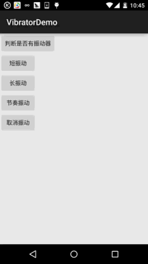

## 一、本节引言：
本节我们介绍的是Vibrator(振动器)，是手机自带的振动器，别去百度直接搜针振动器，因为 你的搜索结果可能是如图所示的神秘的道具，或者其他神秘道具： 

嗯，说回本节介绍的Vibrator，其实就是Android给我们提供的用于机身震动的一个服务！ 比如前面我们的Notification中可以设置震动，当收到推送消息的时候我们可以设置震动 提醒，游戏必备，比如"打飞机"的游戏，当你的飞机给人打爆的时候，会长震动！

下面我们就来写个简单的例子，来熟悉下这个Vibrator的用法！

官方API文档：Vibrator


## 二、获得Vibrator实例:
```java
Vibrator vb = (Vibrator)getSystemService(Service.VIBRATOR_SERVICE);
```


## 三、可以使用的相关方法：
- abstract void cancel()：关闭或者停止振动器
- abstract boolean hasVibrator()：判断硬件是否有振动器
- void vibrate(long milliseconds)：控制手机振动为milliseconds毫秒
- void vibrate(long[] pattern,int repeat):指定手机以pattern指定的模式振动! 比如:pattern为new int[200,400,600,800],就是让他在200,400,600,800这个时间交替启动与关闭振动器! 而第二个则是重复次数,如果是-1的只振动一次,如果是0的话则一直振动 还有其他两个方法用得不多~ 对了，使用振动器还需要在AndroidManifest.xml中添加下述权限： `<uses-permission android:name="android.permission.VIBRATE"/>`


## 四、使用示例：设置频率不同的震动器：
对于Vibrator用的最广泛的莫过于所谓的手机按摩器类的app，在app市场一搜，一堆，笔者随便下了 几个下来瞅瞅，都是大同小异的，这点小玩意竟然有8W多的下载量...好吧，好像也不算多， 不过普遍功能都是切换振动频率来完成，而所谓的按摩效果，是否真的有效就不得而知了, 那么接下来我们就来实现一个简单的按摩器吧! 核心其实就是：vibrate()中的数组的参数,根据自己需求写一个数组就可以了! 下述代码需要在真机上进行测试！

运行效果图：



实现代码：

简单的布局文件，五个按钮：activity_main.xml：
```xml
<LinearLayout xmlns:android="http://schemas.android.com/apk/res/android"
    android:layout_width="match_parent"
    android:layout_height="match_parent"
    android:orientation="vertical">
    
    <Button
        android:id="@+id/btn_hasVibrator"
        android:layout_width="wrap_content"
        android:layout_height="wrap_content"
        android:text="判断是否有振动器" />


    <Button
        android:id="@+id/btn_short"
        android:layout_width="wrap_content"
        android:layout_height="wrap_content"
        android:text="短振动" />

    <Button
        android:id="@+id/btn_long"
        android:layout_width="wrap_content"
        android:layout_height="wrap_content"
        android:text="长振动" />

    <Button
        android:id="@+id/btn_rhythm"
        android:layout_width="wrap_content"
        android:layout_height="wrap_content"
        android:text="节奏振动" />

    <Button
        android:id="@+id/btn_cancle"
        android:layout_width="wrap_content"
        android:layout_height="wrap_content"
        android:text="取消振动" />
</LinearLayout>
```

接着是MainActivity.java部分：
```java
public class MainActivity extends AppCompatActivity implements View.OnClickListener {

    private Button btn_hasVibrator;
    private Button btn_short;
    private Button btn_long;
    private Button btn_rhythm;
    private Button btn_cancle;
    private Vibrator myVibrator;
    private Context mContext;

    @Override
    protected void onCreate(Bundle savedInstanceState) {
        super.onCreate(savedInstanceState);
        setContentView(R.layout.activity_main);
        //获得系统的Vibrator实例:
        myVibrator = (Vibrator) getSystemService(Service.VIBRATOR_SERVICE);
        mContext = MainActivity.this;
        bindViews();
    }

    private void bindViews() {
        btn_hasVibrator = (Button) findViewById(R.id.btn_hasVibrator);
        btn_short = (Button) findViewById(R.id.btn_short);
        btn_long = (Button) findViewById(R.id.btn_long);
        btn_rhythm = (Button) findViewById(R.id.btn_rhythm);
        btn_cancle = (Button) findViewById(R.id.btn_cancle);

        btn_hasVibrator.setOnClickListener(this);
        btn_short.setOnClickListener(this);
        btn_long.setOnClickListener(this);
        btn_rhythm.setOnClickListener(this);
        btn_cancle.setOnClickListener(this);
    }


    @Override
    public void onClick(View v) {
        switch (v.getId()) {
            case R.id.btn_hasVibrator:
                Toast.makeText(mContext, myVibrator.hasVibrator() ? "当前设备有振动器" : "当前设备无振动器",
                        Toast.LENGTH_SHORT).show();
                break;
            case R.id.btn_short:
                myVibrator.cancel();
                myVibrator.vibrate(new long[]{100, 200, 100, 200}, 0);
                Toast.makeText(mContext, "短振动", Toast.LENGTH_SHORT).show();
                break;
            case R.id.btn_long:
                myVibrator.cancel();
                myVibrator.vibrate(new long[]{100, 100, 100, 1000}, 0);
                Toast.makeText(mContext, "长振动", Toast.LENGTH_SHORT).show();
                break;
            case R.id.btn_rhythm:
                myVibrator.cancel();
                myVibrator.vibrate(new long[]{500, 100, 500, 100, 500, 100}, 0);
                Toast.makeText(mContext, "节奏振动", Toast.LENGTH_SHORT).show();
                break;
            case R.id.btn_cancle:
                myVibrator.cancel();
                Toast.makeText(mContext, "取消振动", Toast.LENGTH_SHORT).show();
        }
    }
}
```

对了，别漏了振动器权限哦！
```xml
<uses-permission android:name="android.permission.VIBRATE"/>
```


## 五、示例代码下载：
[VibratorDemo.zip](../img/VibratorDemo.zip)


## 六、本节小结：
好的，本节我们学习了Vibrator(振动器)的基本使用，代码非常简单，还不赶紧加入到 你的APP中，让你的应用HI起来~，嗯，就说这么多，谢谢，天色不早，小猪还是赶紧回家吧！ 毕竟我还是个黄花闺仔！万一湿身了就不好了~