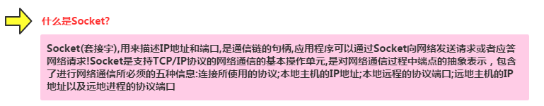

## 一、本节引言：
上一节的概念课枯燥无味是吧，不过总有点收获是吧，本节开始我们来研究基于TCP协议的Socket 通信，先来了解下Socket的概念，以及Socket通信的模型，实现Socket的步骤，以及作为Socket服务 端与客户端的两位各做要做什么事情！好的，我们由浅入深来扣这个Socket吧！


## 二、什么是Socket？




## 三、Socket通信模型：


Socket通信实现步骤解析：

- `Step 1`：创建ServerSocket和Socket

- `Step 2`：打开连接到的Socket的输入/输出流

- `Step 3`：按照协议对Socket进行读/写操作

- `Step 4`：关闭输入输出流，以及Socket

好的，我们接下来写一个简单的例子，开启服务端后，客户端点击按钮然后链接服务端， 并向服务端发送一串字符串，表示通过Socket链接上服务器~


## 四、Socket服务端的编写：
服务端要做的事有这些：

- `Step 1`：创建ServerSocket对象，绑定监听的端口

- `Step 2`：调用accept()方法监听客户端的请求

- `Step 3`：连接建立后，通过输入流读取客户端发送的请求信息

- `Step 4`：通过输出流向客户端发送响应信息

- `Step 5`：关闭相关资源

代码实现：

直接在Eclipse下创建一个Java项目，然后把Java代码贴进去即可！
```java
public class SocketServer {
    public static void main(String[] args) throws IOException {
        //1.创建一个服务器端Socket，即ServerSocket，指定绑定的端口，并监听此端口
        ServerSocket serverSocket = new ServerSocket(12345);
        InetAddress address = InetAddress.getLocalHost();
        String ip = address.getHostAddress();
        Socket socket = null;
        //2.调用accept()等待客户端连接
        System.out.println("~~~服务端已就绪，等待客户端接入~，服务端ip地址: " + ip);
        socket = serverSocket.accept();
        //3.连接后获取输入流，读取客户端信息
        InputStream is=null;
        InputStreamReader isr=null;
        BufferedReader br=null;
        OutputStream os=null;
        PrintWriter pw=null;
        is = socket.getInputStream();     //获取输入流
        isr = new InputStreamReader(is,"UTF-8");
        br = new BufferedReader(isr);
        String info = null;
        while((info=br.readLine())!=null){//循环读取客户端的信息
            System.out.println("客户端发送过来的信息" + info);
        }
        socket.shutdownInput();//关闭输入流
        socket.close();
    }
}
```

然后我们把代码run起来，控制台会打印：


好的，接下来到Android客户端了！


## 五、Socket客户端的编写：
客户端要做的事有这些：

- `Step 1`：创建Socket对象，指明需要链接的服务器的地址和端号

- `Step 2`：链接建立后，通过输出流向服务器发送请求信息

- `Step 3`：通过输出流获取服务器响应的信息

- `Step 4`：关闭相关资源

代码实现：

`MainActivity.java：`
```java
public class MainActivity extends AppCompatActivity implements View.OnClickListener {

    @Override
    protected void onCreate(Bundle savedInstanceState) {
        super.onCreate(savedInstanceState);
        setContentView(R.layout.activity_main);
        Button btn_accept = (Button) findViewById(R.id.btn_accept);
        btn_accept.setOnClickListener(this);
    }

    @Override
    public void onClick(View v) {
        new Thread() {
            @Override
            public void run() {
                try {
                    acceptServer();
                } catch (IOException e) {
                    e.printStackTrace();
                }
            }
        }.start();
    }

    private void acceptServer() throws IOException {
        //1.创建客户端Socket，指定服务器地址和端口
        Socket socket = new Socket("172.16.2.54", 12345);
        //2.获取输出流，向服务器端发送信息
        OutputStream os = socket.getOutputStream();//字节输出流
        PrintWriter pw = new PrintWriter(os);//将输出流包装为打印流
        //获取客户端的IP地址
        InetAddress address = InetAddress.getLocalHost();
        String ip = address.getHostAddress();
        pw.write("客户端：~" + ip + "~ 接入服务器！！");
        pw.flush();
        socket.shutdownOutput();//关闭输出流
        socket.close();
    }
}
```

因为Android不允许在主线程(UI线程)中做网络操作，所以这里需要我们自己 另开一个线程来连接Socket！

运行结果：

点击按钮后，服务端控制台打印：


## 六、增强版案例：小猪简易聊天室
只是点击个按钮，然后服务器返回一串信息，肯定是很无趣的是吧，接下来我们来 搭建一个超简单的聊天室，我们需要用到线程池，存储Socket链接的集合，我们还需要 字节写一个线程，具体的我们在代码中来体会！

实现的效果图：

先把我们的服务端跑起来：


接着把我们的程序分别跑到两台模拟器上：


接下来我们来写代码：

首先是服务端，就是将读写socket的操作放到自定义线程当中，创建ServerSocket后，循环 调用accept方法，当有新客户端接入，将socket加入集合当中，同时在线程池新建一个线程！

另外，在读取信息的方法中，对输入字符串进行判断，如果为bye字符串，将socket从集合中 移除，然后close掉！

`Server.java：`
```java
public class Server {
    //定义相关的参数,端口,存储Socket连接的集合,ServerSocket对象
    //以及线程池
    private static final int PORT = 12345;
    private List<Socket> mList = new ArrayList<Socket>();
    private ServerSocket server = null;
    private ExecutorService myExecutorService = null;
    
    
    public static void main(String[] args) {
        new Server();
    }

    public Server()
    {
        try
        {
            server = new ServerSocket(PORT);
            //创建线程池
            myExecutorService = Executors.newCachedThreadPool();
            System.out.println("服务端运行中...\n");
            Socket client = null;
            while(true)
            {
                client = server.accept();
                mList.add(client);
                myExecutorService.execute(new Service(client));
            }
            
        }catch(Exception e){e.printStackTrace();}
    }
    
    class Service implements Runnable
    {
        private Socket socket;
        private BufferedReader in = null;
        private String msg = "";
        
        public Service(Socket socket) {
            this.socket = socket;
            try
            {
                in = new BufferedReader(new InputStreamReader(socket.getInputStream()));
                 msg = "用户:" +this.socket.getInetAddress() + "~加入了聊天室"  
                            +"当前在线人数:" +mList.size();  
                this.sendmsg();
            }catch(IOException e){e.printStackTrace();}
        }
        
        
        
        @Override
        public void run() {
            try{
                while(true)
                {
                    if((msg = in.readLine()) != null)
                    {
                        if(msg.equals("bye"))
                        {
                            System.out.println("~~~~~~~~~~~~~");
                            mList.remove(socket);
                            in.close();
                            msg = "用户:" + socket.getInetAddress()  
                                    + "退出:" +"当前在线人数:"+mList.size();  
                            socket.close();  
                            this.sendmsg();  
                            break;
                        }else{
                            msg = socket.getInetAddress() + "   说: " + msg;  
                            this.sendmsg(); 
                        }
                    }
                }
            }catch(Exception e){e.printStackTrace();}
        }
        
        //为连接上服务端的每个客户端发送信息
        public void sendmsg()
        {
            System.out.println(msg);
            int num = mList.size();
            for(int index = 0;index < num;index++)
            {
                Socket mSocket = mList.get(index);  
                PrintWriter pout = null;  
                try {  
                    pout = new PrintWriter(new BufferedWriter(  
                            new OutputStreamWriter(mSocket.getOutputStream(),"UTF-8")),true);  
                    pout.println(msg);  
                }catch (IOException e) {e.printStackTrace();}  
            }
        }
        
    }
}
```

接着到客户端，客户端的难点在于要另外开辟线程的问题，因为Android不允许直接在 主线程中做网络操作，而且不允许在主线程外的线程操作UI，这里的做法是自己新建 一个线程，以及通过Hanlder来更新UI，实际开发不建议直接这样做！！！

布局文件:activity_main.xml：
```xml
<LinearLayout xmlns:android="http://schemas.android.com/apk/res/android"
    android:layout_width="match_parent"
    android:layout_height="match_parent"
    android:orientation="vertical" >

    <TextView
        android:layout_width="wrap_content"
        android:layout_height="wrap_content"
        android:text="小猪简易聊天室" />
    <TextView
        android:id="@+id/txtshow"
        android:layout_width="match_parent"
        android:layout_height="wrap_content"
        />
    <EditText
        android:id="@+id/editsend"
        android:layout_width="match_parent"
        android:layout_height="wrap_content"
        />
    <Button
        android:id="@+id/btnsend"
        android:layout_width="match_parent"
        android:layout_height="wrap_content"
        android:text="发送"
        />
</LinearLayout>
```

`MainActivity.java：`
```java
public class MainActivity extends AppCompatActivity implements Runnable {

    //定义相关变量,完成初始化
    private TextView txtshow;
    private EditText editsend;
    private Button btnsend;
    private static final String HOST = "172.16.2.54";
    private static final int PORT = 12345;
    private Socket socket = null;
    private BufferedReader in = null;
    private PrintWriter out = null;
    private String content = "";
    private StringBuilder sb = null;

    //定义一个handler对象,用来刷新界面
    public Handler handler = new Handler() {
        public void handleMessage(Message msg) {
            if (msg.what == 0x123) {
                sb.append(content);
                txtshow.setText(sb.toString());
            }
        }

        ;
    };


    @Override
    protected void onCreate(Bundle savedInstanceState) {
        super.onCreate(savedInstanceState);
        setContentView(R.layout.activity_main);
        sb = new StringBuilder();
        txtshow = (TextView) findViewById(R.id.txtshow);
        editsend = (EditText) findViewById(R.id.editsend);
        btnsend = (Button) findViewById(R.id.btnsend);

        //当程序一开始运行的时候就实例化Socket对象,与服务端进行连接,获取输入输出流
        //因为4.0以后不能再主线程中进行网络操作,所以需要另外开辟一个线程
        new Thread() {

            public void run() {
                try {
                    socket = new Socket(HOST, PORT);
                    in = new BufferedReader(new InputStreamReader(socket.getInputStream(), "UTF-8"));
                    out = new PrintWriter(new BufferedWriter(new OutputStreamWriter(
                            socket.getOutputStream())), true);
                } catch (IOException e) {
                    e.printStackTrace();
                }
            }
        }.start();

        //为发送按钮设置点击事件
        btnsend.setOnClickListener(new View.OnClickListener() {

            @Override
            public void onClick(View v) {
                String msg = editsend.getText().toString();
                if (socket.isConnected()) {
                    if (!socket.isOutputShutdown()) {
                        out.println(msg);
                    }
                }
            }
        });
        new Thread(MainActivity.this).start();
    }

    //重写run方法,在该方法中输入流的读取
    @Override
    public void run() {
        try {
            while (true) {
                if (socket.isConnected()) {
                    if (!socket.isInputShutdown()) {
                        if ((content = in.readLine()) != null) {
                            content += "\n";
                            handler.sendEmptyMessage(0x123);
                        }
                    }
                }
            }
        } catch (Exception e) {
            e.printStackTrace();
        }
    }
}
```


## 七、本节小结：
好的，本节给大家讲解了基于TCP的Socket通信，文中介绍了Socket通信的模型，实现了 一个简单的Socket通信例子，以及写了一个增强版的实例：小猪聊天室，相信会对刚涉及 Socket编程的你带来便利~，谢谢~