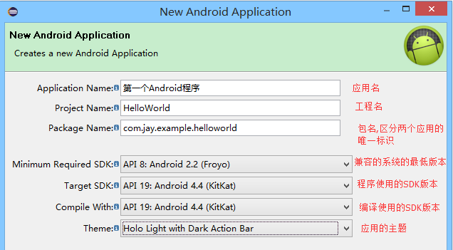
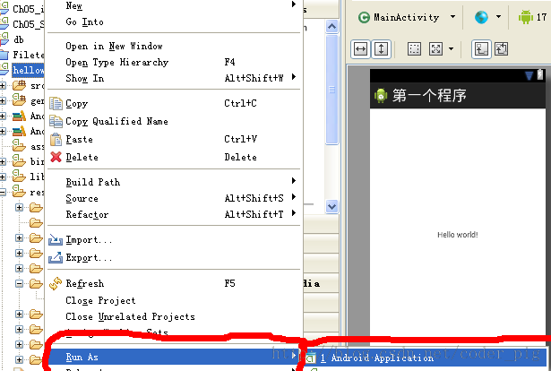
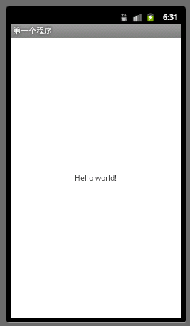
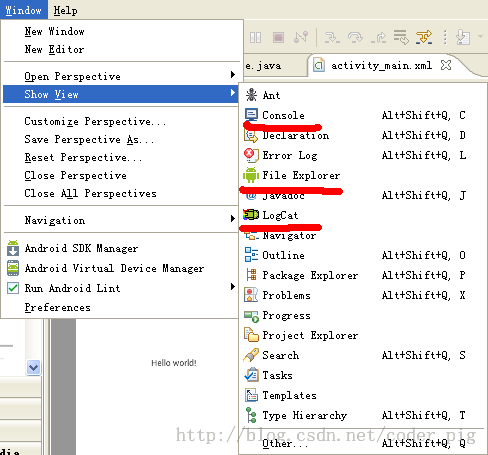

## 一、前言
这里我们有两条路可以选，直接使用封装好的用于开发Android的ADT Bundle，或者自己进行配置 因为谷歌已经放弃了ADT的更新，官网上也取消的下载链接，这里提供谷歌放弃更新前最新版本的 ADT Bundle供大家下载！

## 二、直接使用打包好的Eclipse
- **32位版：** [adt-bundle-windows-x86-20140702.zip（百度网盘）](http://pan.baidu.com/s/1bnKMfIf) 
- **64位版：** [adt-bundle-windows-x86_64-20140702.zip(Google 地址)](https://dl.google.com/android/adt/adt-bundle-windows-x86_64-20140702.zip) 

下载解压，然后直接跳到4.来创建一个Helloworld工程！

## 三、自己配置Eclipse + ADT + SDK
- Eclipse可自行到Eclipse官网下载： [Eclipse官方下载](http://www.eclipse.org/downloads/) 
- 而SDK和ADT可以到AndroidDevTools处下载： [AndroidDevTools官网](http://www.androiddevtools.cn/) 

这里给我们提供了很多Android开发相关的工具，而且不用科学上网，必备开发网站！务必Mark！ 不同版本配置间可能会有一些问题！笔者用的是旧版本的(很旧)，有需要的也可以下载： 
- Eclipse： [eclipse-jee-helios-win32.zip](http://pan.baidu.com/s/1dDIiDWH) 
- ADT：[ADT-15.0.0.zip](http://pan.baidu.com/s/1gd5Tsht) 
- SDK：[android-sdk-windows.rar](http://pan.baidu.com/s/1kTokluR) 

搭建流程：  
**1.解压Eclipse：** 
到解压的文件夹中找到eclipse.exe运行，运行后设置工程代码的存放位置(工作空间) 

**2.ADT配置：**
依次点击菜单栏：help -> Install new software -> Add -> Local... ->选中下载加压后的ADT的文件夹 ->accept -> 重启Eclipse ->看菜单栏是否出现Android小图标如果出现表示安装完成 PS:期间可能出现一个waring,直接忽视~ 

**3.SDK解压配置：**
依次点击菜单栏：windows -> Rreferences -> Android ->选中解压的SDK包 -> OK ->打开重新验证 

**4.创建AVD(安卓模拟器)：**
依次点击菜单栏：手机小图标 -> New -> 选定系统版本 -> Skin屏幕分辨率 ->设置下SD卡大小 -> 完成 -> start即可！ PS:第一次启动AVD的话可能很慢，需要等等~

## 四、第一个程序HelloWorld工程创建与运行
1.New -> Android App Project 如果找不到,可以去Other -> android找到，也是一样的：  

2.然后依次输入工程信息： 新建工程填写的信息 

3.运行创建好的程序  

4.从模拟器上看到运行效果： 

## 五、项目的目录结构分析
先来看下我们的工程目录图： 

工程目录结构 接下来我们需要知道的部分：
**src目录：**包含App所需的全部程序代码文件，我们大多数时候都是在这里编写我们的Java代码的

**gen目录：**只关注R.java文件，它是由ADT自动产生的，里面定义了一个R类，可以看作一个id(资源编号)的字典，包含了用户界面，图形，字符串等资源的id，而我们平时使用资源也是通过R文件来调用的，同时编译器也会看这个资源列表，没有用到的资源不会被编译进去，可以为App节省空间

**assets目录：**存放资源，而且不会再R.java文件下生成资源id，需要使用AssetsManager类进行访问

**libs目录：**存放一些jar包，比如v4,v7的兼容包，又或者是第三方的一些包

**res资源目录：**存放资源的，drawable：存放图片资源；layout：存放界面的布局文件，都是XML文件； values：包含使用XML格式的参数的描述文件，如string.xml字符串，color.xml颜色，style.xml风格样式等

**AndroidManifest.xml配置文件：**系统的控制文件，用于告诉Android系统App所包含的一些基本信息，比如组件，资源，以及需要的权限，以及兼容的最低版本的SDK等

## 六、几个常用的视图
点击菜单栏上的:Windows -> show view打开对应的视图即可：

点击other,下述是Android中一些常用的视图:

其实主要的还是Logcat的使用，因为和Java不同，我们的App运行在虚拟机上，而我们的控制台却并不会显示相关信息，只有安装状态而已，所以我们会在Logcat上查看程序运行的日志信息：

## 七、本节小结
本节我们学习了使用Eclipse搭建我们的Android开发环境，懒人版和动手搭建版，两者都可以； 接着我们又介绍了下Eclipse开发Android项目的目录结构的一些信息，在下一节中我们将深入HelloWorld工程，了解其中的代码！