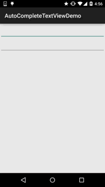

## 一、本节引言：
本节继续来学习Adapter类的控件，这次带来的是AutoCompleteTextView(自动完成文本框)， 相信细心的你发现了，和Adapter搭边的控件，都可以自己定义item的样式，是吧！ 或者说每个Item的布局~想怎么玩就怎么玩~嗯，话不多说，开始本节内容~ 对了贴下官方API：AutoCompleteTextView


## 二、相关属性：
- `android:completionHint`：设置下拉菜单中的提示标题
- `android:completionHintView`：定义提示视图中显示下拉菜单
- `android:completionThreshold`：指定用户至少输入多少个字符才会显示提示
- `android:dropDownAnchor`：设置下拉菜单的定位"锚点"组件，如果没有指定改属性， 将使用该TextView作为定位"锚点"组件
- `android:dropDownHeight`：设置下拉菜单的高度
- `android:dropDownWidth`：设置下拉菜单的宽度
- `android:dropDownHorizontalOffset`：指定下拉菜单与文本之间的水平间距
- `android:dropDownVerticalOffset`：指定下拉菜单与文本之间的竖直间距
- `android:dropDownSelector`：设置下拉菜单点击效果
- `android:popupBackground`：设置下拉菜单的背景

另外其实还有个`MultiAutoCompleteTextView`(多提示项的自动完成文本框) 和这个AutoCompleteTextView作用差不多，属性也一样，具体区别在哪里， 我们在下面的代码中来体验~另外这两个都是全词匹配的，比如，小猪猪： 你输入小->会提示小猪猪，但是输入猪猪->却不会提示小猪猪！


## 三、代码示例：
运行效果图：



实现代码：

这里的话就不自定义布局了，直接用ArrayAdapter来实现吧！

布局文件：`activity_main.xml：`
```xml
<LinearLayout xmlns:android="http://schemas.android.com/apk/res/android"
    xmlns:tools="http://schemas.android.com/tools"
    android:layout_width="match_parent"
    android:layout_height="match_parent"
    android:orientation="vertical"
    tools:context=".MainActivity">

    <AutoCompleteTextView
        android:id="@+id/atv_content"
        android:layout_width="match_parent"
        android:layout_height="48dp"
        android:completionHint="请输入搜索内容"
        android:completionThreshold="1"
        android:dropDownHorizontalOffset="5dp" />

    <MultiAutoCompleteTextView
        android:id="@+id/matv_content"
        android:layout_width="match_parent"
        android:layout_height="48dp"
        android:completionThreshold="1"
        android:dropDownHorizontalOffset="5dp"
        android:text="" />
    
</LinearLayout>
```

`MainActivity.java：`
```java
public class MainActivity extends AppCompatActivity {

    private AutoCompleteTextView atv_content;
    private MultiAutoCompleteTextView matv_content;

    private static final String[] data = new String[]{
            "小猪猪", "小狗狗", "小鸡鸡", "小猫猫", "小咪咪"
    };


    @Override
    protected void onCreate(Bundle savedInstanceState) {
        super.onCreate(savedInstanceState);
        setContentView(R.layout.activity_main);
        atv_content = (AutoCompleteTextView) findViewById(R.id.atv_content);
        matv_content = (MultiAutoCompleteTextView) findViewById(R.id.matv_content);


        ArrayAdapter<String> adapter = new ArrayAdapter<String>(MainActivity.
                this, android.R.layout.simple_dropdown_item_1line, data);
        atv_content.setAdapter(adapter);

        ArrayAdapter<String> adapter2 = new ArrayAdapter<String>(getApplicationContext(), android.R.layout.simple_dropdown_item_1line, data);
        matv_content.setAdapter(adapter);
        matv_content.setTokenizer(new MultiAutoCompleteTextView.CommaTokenizer());
    }
}
```

部分代码分析：

- `android:completionThreshold="1"`：这里我们设置了输入一个字就显示提示
- `android:completionHint="请输入搜索内容"`：这是框框底部显示的文字，如果觉得丑 可以android:completionHintView设置一个View!
- `android:dropDownHorizontalOffset="5dp"`：设置了水平边距为5dp
- `matv_content.setTokenizer(new MultiAutoCompleteTextView.CommaTokenizer())`; setTokenizer是为其设置分隔符


## 四、示例代码下载：
[AutoCompleteTextViewDemo.zip](../img/AutoCompleteTextViewDemo.zip)


## 五、本节小结：
本节给大家介绍了AutoCompleteTextView(自动完成文本框)，非常简单~ 大家可根据实际开发需求自行拓展~好的，就说这么多，谢谢~