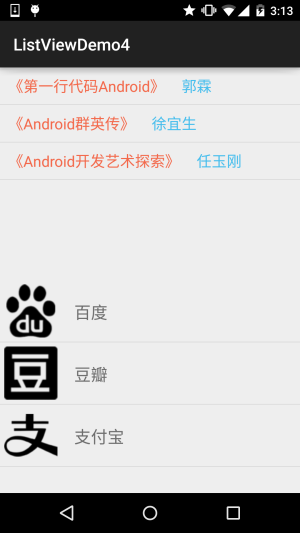

## 一、本节引言：
如题，本节给大家带来的是构建一个可复用的自定义BaseAdapter，我们每每涉及到ListView GridView等其他的Adapter控件，都需要自己另外写一个BaseAdapter类，这样显得非常麻烦， 又比如，我们想在一个界面显示两个ListView的话，我们也是需要写两个BaseAdapter... 这，程序员都是喜欢偷懒的哈，这节我们就来写一个可复用的自定义BaseAdapter类~


## 二、我们一点点开始改：
首先我们把上节写的自定义BaseAdapter贴下，等下我们就要对他进行升级改造
```java
/**
 * Created by Jay on 2015/9/21 0021.
 */
public class MyAdapter extends BaseAdapter {

    private Context mContext;
    private LinkedList<Data> mData;

    public MyAdapter() {
    }

    public MyAdapter(LinkedList<Data> mData, Context mContext) {
        this.mData = mData;
        this.mContext = mContext;
    }

    @Override
    public int getCount() {
        return mData.size();
    }

    @Override
    public Object getItem(int position) {
        return null;
    }

    @Override
    public long getItemId(int position) {
        return position;
    }

    @Override
    public View getView(int position, View convertView, ViewGroup parent) {
        ViewHolder holder = null;
        if (convertView == null) {
            convertView = LayoutInflater.from(mContext).inflate(R.layout.item_list, parent, false);
            holder = new ViewHolder();
            holder.img_icon = (ImageView) convertView.findViewById(R.id.img_icon);
            holder.txt_content = (TextView) convertView.findViewById(R.id.txt_content);
            convertView.setTag(holder);
        } else {
            holder = (ViewHolder) convertView.getTag();
        }
        holder.img_icon.setImageResource(mData.get(position).getImgId());
        holder.txt_content.setText(mData.get(position).getContent());
        return convertView;
    }

    //添加一个元素
    public void add(Data data) {
        if (mData == null) {
            mData = new LinkedList<>();
        }
        mData.add(data);
        notifyDataSetChanged();
    }

    //往特定位置，添加一个元素
    public void add(int position,Data data){
        if (mData == null) {
            mData = new LinkedList<>();
        }
        mData.add(position, data);
        notifyDataSetChanged();
    }

    public void remove(Data data) {
        if(mData != null) {
            mData.remove(data);
        }
        notifyDataSetChanged();
    }

    public void remove(int position) {
        if(mData != null) {
            mData.remove(position);
        }
        notifyDataSetChanged();
    }

    public void clear() {
        if(mData != null) {
            mData.clear();
        }
        notifyDataSetChanged();
    }

    private class ViewHolder {
        ImageView img_icon;
        TextView txt_content;
    }

}
```


### 升级1：将Entity设置成泛型
好的，毕竟我们传递过来的Entitiy实体类可能千奇百怪，比如有Person，Book，Wether等，所以我们 将Entity设置成泛型，修改后的代码如下：
```java
public class MyAdapter<T> extends BaseAdapter {

    private Context mContext;
    private LinkedList<T> mData;

    public MyAdapter() {
    }

    public MyAdapter(LinkedList<T> mData, Context mContext) {
        this.mData = mData;
        this.mContext = mContext;
    }

    @Override
    public int getCount() {
        return mData.size();
    }

    @Override
    public Object getItem(int position) {
        return null;
    }

    @Override
    public long getItemId(int position) {
        return position;
    }

    @Override
    public View getView(int position, View convertView, ViewGroup parent) {
        ViewHolder holder = null;
        if (convertView == null) {
            convertView = LayoutInflater.from(mContext).inflate(R.layout.item_list, parent, false);
            holder = new ViewHolder();
            holder.img_icon = (ImageView) convertView.findViewById(R.id.img_icon);
            holder.txt_content = (TextView) convertView.findViewById(R.id.txt_content);
            convertView.setTag(holder);
        } else {
            holder = (ViewHolder) convertView.getTag();
        }
        holder.img_icon.setImageResource(mData.get(position).getImgId());
        holder.txt_content.setText(mData.get(position).getContent());
        return convertView;
    }

    //添加一个元素
    public void add(T data) {
        if (mData == null) {
            mData = new LinkedList<>();
        }
        mData.add(data);
        notifyDataSetChanged();
    }

    //往特定位置，添加一个元素
    public void add(int position,T data){
        if (mData == null) {
            mData = new LinkedList<>();
        }
        mData.add(position, data);
        notifyDataSetChanged();
    }

    public void remove(T data) {
        if(mData != null) {
            mData.remove(data);
        }
        notifyDataSetChanged();
    }

    public void remove(int position) {
        if(mData != null) {
            mData.remove(position);
        }
        notifyDataSetChanged();
    }

    public void clear() {
        if(mData != null) {
            mData.clear();
        }
        notifyDataSetChanged();
    }

    private class ViewHolder {
        ImageView img_icon;
        TextView txt_content;
    }

}
```

好的，上面我们做的事仅仅是将Data类型换成了泛型T！


### 升级2：ViewHolder类的升级改造：
我们先来看看前面的ViewHolder干了什么？ 

答：findViewById，设置控件状态； 下面我们想在完成这个基础上，将getView()方法大部分的逻辑写到ViewHolder类里， 这个ViewHolder要做的事：

- 定义一个查找控件的方法，我们的思路是通过暴露公共的方法，调用方法时传递过来 控件id，以及设置的内容，比如TextView设置文本： public ViewHolder setText(int id, CharSequence text){文本设置}
- 将convertView复用部分搬到这里，那就需要传递一个context对象了，我们把需要获取 的部分都写到构造方法中！
- 写一堆设置方法(public)，比如设置文字大小颜色，图片背景等！

好的，接下来我们就来一步步改造我们的ViewHolder类


#### 1）相关参数与构造方法：
```java
public static class ViewHolder {

    private SparseArray<View> mViews;   //存储ListView 的 item中的View
    private View item;                  //存放convertView
    private int position;               //游标
    private Context context;            //Context上下文

    //构造方法，完成相关初始化
    private ViewHolder(Context context, ViewGroup parent, int layoutRes) {
        mViews = new SparseArray<>();
        this.context = context;
        View convertView = LayoutInflater.from(context).inflate(layoutRes, parent,false);
        convertView.setTag(this);
        item = convertView;
    }

    ImageView img_icon;
    TextView txt_content;
}
```

#### 2）绑定ViewHolder与Item
在上面的基础上我们再添加一个绑定的方法

```java
//绑定ViewHolder与item
public static ViewHolder bind(Context context, View convertView, ViewGroup parent,
                              int layoutRes, int position) {
    ViewHolder holder;
    if(convertView == null) {
        holder = new ViewHolder(context, parent, layoutRes);
    } else {
        holder = (ViewHolder) convertView.getTag();
        holder.item = convertView;
    }
    holder.position = position;
    return holder;
}
```

#### 3）根据id获取集合中保存的控件
```java
public <T extends View> T getView(int id) {
    T t = (T) mViews.get(id);
    if(t == null) {
        t = (T) item.findViewById(id);
        mViews.put(id, t);
    }
    return t;
}
```

#### 4) 接着我们再定义一堆暴露出来的方法
```java
/**
 * 获取当前条目
 */
public View getItemView() {
    return item;
}

/**
 * 获取条目位置
 */
public int getItemPosition() {
    return position;
}

/**
 * 设置文字
 */
public ViewHolder setText(int id, CharSequence text) {
    View view = getView(id);
    if(view instanceof TextView) {
        ((TextView) view).setText(text);
    }
    return this;
}

/**
 * 设置图片
 */
public ViewHolder setImageResource(int id, int drawableRes) {
    View view = getView(id);
    if(view instanceof ImageView) {
        ((ImageView) view).setImageResource(drawableRes);
    } else {
        view.setBackgroundResource(drawableRes);
    }
    return this;
}


/**
 * 设置点击监听
 */
public ViewHolder setOnClickListener(int id, View.OnClickListener listener) {
    getView(id).setOnClickListener(listener);
    return this;
}

/**
 * 设置可见
 */
public ViewHolder setVisibility(int id, int visible) {
    getView(id).setVisibility(visible);
    return this;
}

/**
 * 设置标签
 */
public ViewHolder setTag(int id, Object obj) {
    getView(id).setTag(obj);
    return this;
}
```

//其他方法可自行扩展
好的，ViewHolder的改造升级完成~


### 升级3：定义一个抽象方法，完成ViewHolder与Data数据集的绑定
```java
public abstract void bindView(ViewHolder holder, T obj);
```

我们创建新的BaseAdapter的时候，实现这个方法就好，另外，别忘了把我们自定义 的BaseAdapter改成abstact抽象的！


### 升级4：修改getView()部分的内容
```java
@Override
public View getView(int position, View convertView, ViewGroup parent) {
    ViewHolder holder = ViewHolder.bind(parent.getContext(), convertView, parent, mLayoutRes
            , position);
    bindView(holder,getItem(position));
    return holder.getItemView();
}
```


## 三、升级完毕，我们写代码来体验下：
我们要实现的效果图：



就是上面有两个列表，布局不一样，但是我只使用一个BaseAdapter类来完成上述效果！

关键代码如下：
```java
MainActivity.java：

public class MainActivity extends AppCompatActivity {

    private Context mContext;
    private ListView list_book;
    private ListView list_app;

    private MyAdapter<App> myAdapter1 = null;
    private MyAdapter<Book> myAdapter2 = null;
    private List<App> mData1 = null;
    private List<Book> mData2 = null;

    @Override
    protected void onCreate(Bundle savedInstanceState) {
        super.onCreate(savedInstanceState);
        setContentView(R.layout.activity_main);
        mContext = MainActivity.this;
        init();

    }

    private void init() {

        list_book = (ListView) findViewById(R.id.list_book);
        list_app = (ListView) findViewById(R.id.list_app);

        //数据初始化
        mData1 = new ArrayList<App>();
        mData1.add(new App(R.mipmap.iv_icon_baidu,"百度"));
        mData1.add(new App(R.mipmap.iv_icon_douban,"豆瓣"));
        mData1.add(new App(R.mipmap.iv_icon_zhifubao,"支付宝"));

        mData2 = new ArrayList<Book>();
        mData2.add(new Book("《第一行代码Android》","郭霖"));
        mData2.add(new Book("《Android群英传》","徐宜生"));
        mData2.add(new Book("《Android开发艺术探索》","任玉刚"));

        //Adapter初始化
        myAdapter1 = new MyAdapter<App>((ArrayList)mData1,R.layout.item_one) {
            @Override
            public void bindView(ViewHolder holder, App obj) {
                holder.setImageResource(R.id.img_icon,obj.getaIcon());
                holder.setText(R.id.txt_aname,obj.getaName());
            }
        };
        myAdapter2 = new MyAdapter<Book>((ArrayList)mData2,R.layout.item_two) {
            @Override
            public void bindView(ViewHolder holder, Book obj) {
                holder.setText(R.id.txt_bname,obj.getbName());
                holder.setText(R.id.txt_bauthor,obj.getbAuthor());
            }
        };

        //ListView设置下Adapter：
        list_book.setAdapter(myAdapter2);
        list_app.setAdapter(myAdapter1);
    }
}
```

我们写的可复用的BaseAdapter的使用就如上面所述~


## 四、代码示例下载：
[ListViewDemo4.zip](../img/ListViewDemo4.zip)

贴下最后写好的MyAdapter类吧，可根据自己的需求进行扩展：

```java
MyAdapter.java：

/**
 * Created by Jay on 2015/9/22 0022.
 */
public abstract class MyAdapter<T> extends BaseAdapter {

    private ArrayList<T> mData;
    private int mLayoutRes;           //布局id


    public MyAdapter() {
    }

    public MyAdapter(ArrayList<T> mData, int mLayoutRes) {
        this.mData = mData;
        this.mLayoutRes = mLayoutRes;
    }

    @Override
    public int getCount() {
        return mData != null ? mData.size() : 0;
    }

    @Override
    public T getItem(int position) {
        return mData.get(position);
    }

    @Override
    public long getItemId(int position) {
        return position;
    }

    @Override
    public View getView(int position, View convertView, ViewGroup parent) {
        ViewHolder holder = ViewHolder.bind(parent.getContext(), convertView, parent, mLayoutRes
                , position);
        bindView(holder, getItem(position));
        return holder.getItemView();
    }

    public abstract void bindView(ViewHolder holder, T obj);

    //添加一个元素
    public void add(T data) {
        if (mData == null) {
            mData = new ArrayList<>();
        }
        mData.add(data);
        notifyDataSetChanged();
    }

    //往特定位置，添加一个元素
    public void add(int position, T data) {
        if (mData == null) {
            mData = new ArrayList<>();
        }
        mData.add(position, data);
        notifyDataSetChanged();
    }

    public void remove(T data) {
        if (mData != null) {
            mData.remove(data);
        }
        notifyDataSetChanged();
    }

    public void remove(int position) {
        if (mData != null) {
            mData.remove(position);
        }
        notifyDataSetChanged();
    }

    public void clear() {
        if (mData != null) {
            mData.clear();
        }
        notifyDataSetChanged();
    }


    public static class ViewHolder {

        private SparseArray<View> mViews;   //存储ListView 的 item中的View
        private View item;                  //存放convertView
        private int position;               //游标
        private Context context;            //Context上下文

        //构造方法，完成相关初始化
        private ViewHolder(Context context, ViewGroup parent, int layoutRes) {
            mViews = new SparseArray<>();
            this.context = context;
            View convertView = LayoutInflater.from(context).inflate(layoutRes, parent, false);
            convertView.setTag(this);
            item = convertView;
        }

        //绑定ViewHolder与item
        public static ViewHolder bind(Context context, View convertView, ViewGroup parent,
                                      int layoutRes, int position) {
            ViewHolder holder;
            if (convertView == null) {
                holder = new ViewHolder(context, parent, layoutRes);
            } else {
                holder = (ViewHolder) convertView.getTag();
                holder.item = convertView;
            }
            holder.position = position;
            return holder;
        }

        @SuppressWarnings("unchecked")
        public <T extends View> T getView(int id) {
            T t = (T) mViews.get(id);
            if (t == null) {
                t = (T) item.findViewById(id);
                mViews.put(id, t);
            }
            return t;
        }


        /**
         * 获取当前条目
         */
        public View getItemView() {
            return item;
        }

        /**
         * 获取条目位置
         */
        public int getItemPosition() {
            return position;
        }

        /**
         * 设置文字
         */
        public ViewHolder setText(int id, CharSequence text) {
            View view = getView(id);
            if (view instanceof TextView) {
                ((TextView) view).setText(text);
            }
            return this;
        }

        /**
         * 设置图片
         */
        public ViewHolder setImageResource(int id, int drawableRes) {
            View view = getView(id);
            if (view instanceof ImageView) {
                ((ImageView) view).setImageResource(drawableRes);
            } else {
                view.setBackgroundResource(drawableRes);
            }
            return this;
        }


        /**
         * 设置点击监听
         */
        public ViewHolder setOnClickListener(int id, View.OnClickListener listener) {
            getView(id).setOnClickListener(listener);
            return this;
        }

        /**
         * 设置可见
         */
        public ViewHolder setVisibility(int id, int visible) {
            getView(id).setVisibility(visible);
            return this;
        }

        /**
         * 设置标签
         */
        public ViewHolder setTag(int id, Object obj) {
            getView(id).setTag(obj);
            return this;
        }
        //其他方法可自行扩展
    }
}
```


## 五、本节小结：
本节给大家介绍了如何来实现一个可供复用的BaseAdapter，当然大家可以在这个的基础上根据 自己的需求进行修改，比如通过异步设置网络图片等~该代码是参考鸿洋大神的视频写的： 视频链接：Android-打造万能适配器 另外，实际编写中遇到一些问题，非常感谢Berial(B神)的耐心点拨~ ありがとうございます~