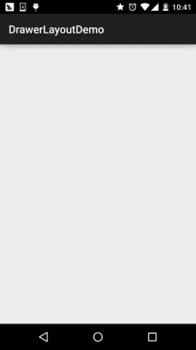
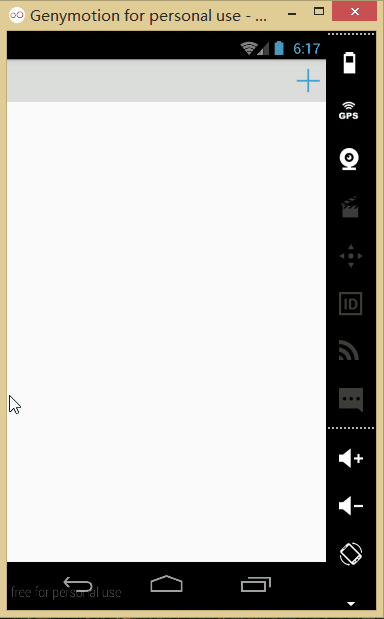

## 一、本节引言：
本节给大家带来基础UI控件部分的最后一个控件：`DrawerLayout`，官方给我们提供的一个侧滑菜单 控件，和上一节的ViewPager一样，3.0以后引入，低版本使用它，需要v4兼容包，说到侧滑，相信 很多人都用过github上的SlidingMenu，不过好像有两个版本，一个是单独的，另一个需要依赖另一 个开源项目：ActionBarSherlock；既然Google为我们提供了这个控件，为何不用咧，而且在 Material Design设计规范中，随处可见的很多侧滑菜单的动画效果，大都可以通过Toolbar + DrawerLayout来实现~，本节我们就来探究下这个DrawerLayout的一个基本用法~还有人喜欢把他 称为抽屉控件~官方文档：DrawerLayout


## 二、使用的注意事项
- 1.主内容视图一定要是DrawerLayout的第一个子视图
- 2.主内容视图宽度和高度需要match_parent
- 3.必须显示指定侧滑视图的android:`layout_gravity`属性 android:layout_gravity = "start"时，从左向右滑出菜单 android:layout_gravity = "end"时，从右向左滑出菜单 不推荐使用left和right!!!
- 侧滑视图的宽度以dp为单位，不建议超过320dp(为了总能看到一些主内容视图)
- 设置侧滑事件：mDrawerLayout.setDrawerListener(DrawerLayout.DrawerListener);
- 要说一点：可以结合Actionbar使用当用户点击Actionbar上的应用图标，弹出侧滑菜单！ 这里就要通过ActionBarDrawerToggle，它是DrawerLayout.DrawerListener的具体实现类， 我们可以重写ActionBarDrawerToggle的onDrawerOpened()和onDrawerClosed()以监听抽屉拉出 或隐藏事件！但是这里我们不讲，因为5.0后我们使用的是Toolbar！有兴趣的可以自行查阅相关 文档！


## 三、使用代码示例
### 示例1：单个侧滑菜单的实现
运行效果图：



实现关键代码：

首先是我们的主布局，注意：最外层要是DrawerLayout哦！！！！

`activity_main.xml：`
```xml
<android.support.v4.widget.DrawerLayout xmlns:android="http://schemas.android.com/apk/res/android"
    android:id="@+id/drawer_layout"
    android:layout_width="match_parent"
    android:layout_height="match_parent">

    <FrameLayout
        android:id="@+id/ly_content"
        android:layout_width="match_parent"
        android:layout_height="match_parent" />

    <ListView
        android:id="@+id/list_left_drawer"
        android:layout_width="180dp"
        android:layout_height="match_parent"
        android:layout_gravity="start"
        android:background="#080808"
        android:choiceMode="singleChoice"
        android:divider="#FFFFFF"
        android:dividerHeight="1dp" />

</android.support.v4.widget.DrawerLayout>
```

接着ListView的布局代码和domain类：Item比较简单，就不给出了，直接上中间Fragment的 布局以及代码吧！另外Adapter直接复用我们之前写的那个可复用的MyAdapter！

`fg_content.xml：`
```xml
<?xml version="1.0" encoding="utf-8"?>
<RelativeLayout xmlns:android="http://schemas.android.com/apk/res/android"
    android:layout_width="match_parent"
    android:layout_height="match_parent"
    android:orientation="vertical">

    <TextView
        android:id="@+id/tv_content"
        android:layout_width="wrap_content"
        android:layout_height="wrap_content"
        android:layout_centerInParent="true"
        android:textSize="25sp" />

</RelativeLayout>
```

`ContentFragment.java：`
```java
/**
 * Created by Jay on 2015/10/8 0008.
 */
public class ContentFragment extends Fragment {

    private TextView tv_content;

    @Override
    public View onCreateView(LayoutInflater inflater, ViewGroup container, Bundle savedInstanceState) {
        View view = inflater.inflate(R.layout.fg_content, container, false);
        tv_content = (TextView) view.findViewById(R.id.tv_content);
        String text = getArguments().getString("text");
        tv_content.setText(text);
        return view;
    }
}   
```

最后是我们的Activity类

`MainActivity.java：`
```java
public class MainActivity extends AppCompatActivity implements AdapterView.OnItemClickListener{

    private DrawerLayout drawer_layout;
    private ListView list_left_drawer;
    private ArrayList<Item> menuLists;
    private MyAdapter<Item> myAdapter = null;


    @Override
    protected void onCreate(Bundle savedInstanceState) {
        super.onCreate(savedInstanceState);
        setContentView(R.layout.activity_main);

        drawer_layout = (DrawerLayout) findViewById(R.id.drawer_layout);
        list_left_drawer = (ListView) findViewById(R.id.list_left_drawer);

        menuLists = new ArrayList<Item>();
        menuLists.add(new Item(R.mipmap.iv_menu_realtime,"实时信息"));
        menuLists.add(new Item(R.mipmap.iv_menu_alert,"提醒通知"));
        menuLists.add(new Item(R.mipmap.iv_menu_trace,"活动路线"));
        menuLists.add(new Item(R.mipmap.iv_menu_settings,"相关设置"));
        myAdapter = new MyAdapter<Item>(menuLists,R.layout.item_list) {
            @Override
            public void bindView(ViewHolder holder, Item obj) {
                holder.setImageResource(R.id.img_icon,obj.getIconId());
                holder.setText(R.id.txt_content, obj.getIconName());
            }
        };
        list_left_drawer.setAdapter(myAdapter);
        list_left_drawer.setOnItemClickListener(this);
    }


    @Override
    public void onItemClick(AdapterView<?> parent, View view, int position, long id) {
        ContentFragment contentFragment = new ContentFragment();
        Bundle args = new Bundle();
        args.putString("text", menuLists.get(position).getIconName());
        contentFragment.setArguments(args);
        FragmentManager fm = getSupportFragmentManager();
        fm.beginTransaction().replace(R.id.ly_content,contentFragment).commit();
        drawer_layout.closeDrawer(list_left_drawer);
    }
}
```

代码很简单，就不多说了~


### 示例2.左右两个侧滑菜单的实现
嗯，不知道你有没有发现，从上面的DrawerLayout的布局，我们大概可以猜到，DrawerLayout 最多由三个部分组成，中间的内容部分，左边的侧滑菜单部分，右边的侧滑菜单部分组成！ 下面我们来写一个带有两个侧滑菜单的示例！

运行效果图：



代码实现：

首先我们创建两个Fragment以及对应的布局，他们分别是左右侧滑菜单！

`左边Fragment：`

布局：`fg_left.xml`，这里就用了一个图片而已，点击后弹出一个新的Activity； 当然你可以根据自己的需求进行扩展！
```xml
<?xml version="1.0" encoding="utf-8"?>
<LinearLayout xmlns:android="http://schemas.android.com/apk/res/android"
    android:orientation="vertical" android:layout_width="match_parent"
    android:layout_height="match_parent">

    <ImageView
        android:id="@+id/img_bg"
        android:layout_width="match_parent"
        android:layout_height="match_parent"
        android:background="@mipmap/bg_menu_left"/>

</LinearLayout>
```

对应的`LeftFragment.java`：
```java
/**
 * Created by Jay on 2015/10/9 0009.
 */
public class LeftFragment extends Fragment{

    private DrawerLayout drawer_layout;

    @Override
    public View onCreateView(LayoutInflater inflater, ViewGroup container, Bundle savedInstanceState) {
        View view = inflater.inflate(R.layout.fg_left, container, false);
        ImageView img_bg = (ImageView) view.findViewById(R.id.img_bg);
        img_bg.setOnClickListener(new View.OnClickListener() {
            @Override
            public void onClick(View v) {
                getActivity().startActivity(new Intent(getActivity(),OtherActivity.class));
                drawer_layout.closeDrawer(Gravity.START);
            }
        });
        return view;
    }

    //暴露给Activity，用于传入DrawerLayout，因为点击后想关掉DrawerLayout
    public void setDrawerLayout(DrawerLayout drawer_layout){
        this.drawer_layout = drawer_layout;
    }
}
```

右面的Fragment：

布局就三个按钮，点击后替换中间部分的Fragment，布局`fg_right.xml`代码如下：
```xml
<?xml version="1.0" encoding="utf-8"?>
<LinearLayout xmlns:android="http://schemas.android.com/apk/res/android"
    android:layout_width="match_parent"
    android:layout_height="match_parent"
    android:background="#2F9AF2"
    android:gravity="center"
    android:orientation="vertical">

    <Button
        android:id="@+id/btn_one"
        android:layout_width="wrap_content"
        android:layout_height="wrap_content"
        android:text="菜单项一" />

    <Button
        android:id="@+id/btn_two"
        android:layout_width="wrap_content"
        android:layout_height="wrap_content"
        android:text="菜单项二" />

    <Button
        android:id="@+id/btn_three"
        android:layout_width="wrap_content"
        android:layout_height="wrap_content"
        android:text="菜单项三" />

</LinearLayout>
```

然后对应的是`RightFragment.java`：
```java
/**
 * Created by Jay on 2015/10/9 0009.
 */
public class RightFragment extends Fragment implements View.OnClickListener{

    private DrawerLayout drawer_layout;
    private FragmentManager fManager;

    @Override
    public View onCreateView(LayoutInflater inflater, ViewGroup container, Bundle savedInstanceState) {
        View view = inflater.inflate(R.layout.fg_right, container, false);
        view.findViewById(R.id.btn_one).setOnClickListener(this);
        view.findViewById(R.id.btn_two).setOnClickListener(this);
        view.findViewById(R.id.btn_three).setOnClickListener(this);
        fManager = getActivity().getSupportFragmentManager();
        return view;
    }

    @Override
    public void onClick(View v) {
        switch (v.getId()){
            case R.id.btn_one:
                ContentFragment cFragment1 = new ContentFragment("1.点击了右侧菜单项一",R.color.blue);
                fManager.beginTransaction().replace(R.id.fly_content,cFragment1).commit();
                drawer_layout.closeDrawer(Gravity.END);
                break;
            case R.id.btn_two:
                ContentFragment cFragment2 = new ContentFragment("2.点击了右侧菜单项二",R.color.red);
                fManager.beginTransaction().replace(R.id.fly_content,cFragment2).commit();
                drawer_layout.closeDrawer(Gravity.END);
                break;
            case R.id.btn_three:
                ContentFragment cFragment3 = new ContentFragment("3.点击了右侧菜单项三",R.color.yellow);
                fManager.beginTransaction().replace(R.id.fly_content,cFragment3).commit();
                drawer_layout.closeDrawer(Gravity.END);
                break;
        }
    }

    public void setDrawerLayout(DrawerLayout drawer_layout){
        this.drawer_layout = drawer_layout;
    }
}
```

另外还有一个中间部分填充的ContentFragment，布局：`fg_content.xml`如下：
```xml
<?xml version="1.0" encoding="utf-8"?>
<RelativeLayout xmlns:android="http://schemas.android.com/apk/res/android"
    android:layout_width="match_parent"
    android:layout_height="match_parent"
    android:orientation="vertical">

    <TextView
        android:id="@+id/tv_content"
        android:layout_width="wrap_content"
        android:layout_height="wrap_content"
        android:layout_centerInParent="true"
        android:textSize="25sp" />

</RelativeLayout>
```

`ContentFragment.java：`
```java
public class ContentFragment extends Fragment {

    private TextView tv_content;
    private String strContent;
    private int bgColor;

    public ContentFragment(String strContent,int bgColor) {
        this.strContent = strContent;
        this.bgColor = bgColor;
    }

    @Override
    public View onCreateView(LayoutInflater inflater, ViewGroup container, Bundle savedInstanceState) {
        View view = inflater.inflate(R.layout.fg_content, container, false);
        view.setBackgroundColor(getResources().getColor(bgColor));
        tv_content = (TextView) view.findViewById(R.id.tv_content);
        tv_content.setText(strContent);
        return view;
    }
}
```

编写好以后，就到我们的Activity的布局了以及Activity的代码了： 在此之前我们还需要些一个顶部条形栏的布局：

`view_topbar.xml`：
```xml
<?xml version="1.0" encoding="utf-8"?>
<RelativeLayout xmlns:android="http://schemas.android.com/apk/res/android"
    android:layout_width="match_parent"
    android:layout_height="wrap_content"
    android:background="#DCDEDB">

    <Button
        android:id="@+id/btn_right"
        android:layout_width="40dp"
        android:layout_height="40dp"
        android:layout_centerVertical="true"
        android:layout_alignParentRight="true"
        android:background="@drawable/btn_selctor"/>

</RelativeLayout>
```

然后是`activity_main.xml`：
```xml
<android.support.v4.widget.DrawerLayout xmlns:android="http://schemas.android.com/apk/res/android"
    xmlns:tools="http://schemas.android.com/tools"
    android:id="@+id/drawer_layout"
    android:layout_width="match_parent"
    android:layout_height="match_parent">

    <LinearLayout
        android:layout_width="match_parent"
        android:layout_height="match_parent"
        android:orientation="vertical">

        <include
            android:id="@+id/topbar"
            layout="@layout/view_topbar"
            android:layout_width="wrap_content"
            android:layout_height="48dp" />

        <FrameLayout
            android:id="@+id/fly_content"
            android:layout_width="match_parent"
            android:layout_height="match_parent" />

    </LinearLayout>

    <fragment
        android:id="@+id/fg_left_menu"
        android:name="jay.com.drawerlayoutdemo2.LeftFragment"
        android:layout_width="300dp"
        android:layout_height="match_parent"
        android:layout_gravity="start"
        android:tag="LEFT"
        tools:layout="@layout/fg_left" />

    <fragment
        android:id="@+id/fg_right_menu"
        android:name="jay.com.drawerlayoutdemo2.RightFragment"
        android:layout_width="100dp"
        android:layout_height="match_parent"
        android:layout_gravity="end"
        android:tag="RIGHT"
        tools:layout="@layout/fg_right" />

</android.support.v4.widget.DrawerLayout>  
```

最后是`MainActivity.java`：
```java
public class MainActivity extends AppCompatActivity implements View.OnClickListener {

    private DrawerLayout drawer_layout;
    private FrameLayout fly_content;
    private View topbar;
    private Button btn_right;
    private RightFragment fg_right_menu;
    private LeftFragment fg_left_menu;
    private FragmentManager fManager;

    @Override
    protected void onCreate(Bundle savedInstanceState) {
        super.onCreate(savedInstanceState);
        setContentView(R.layout.activity_main);
        fManager = getSupportFragmentManager();
        fg_right_menu = (RightFragment) fManager.findFragmentById(R.id.fg_right_menu);
        fg_left_menu = (LeftFragment) fManager.findFragmentById(R.id.fg_left_menu);
        initViews();
    }

    private void initViews() {
        drawer_layout = (DrawerLayout) findViewById(R.id.drawer_layout);
        fly_content = (FrameLayout) findViewById(R.id.fly_content);
        topbar = findViewById(R.id.topbar);
        btn_right = (Button) topbar.findViewById(R.id.btn_right);
        btn_right.setOnClickListener(this);

        //设置右面的侧滑菜单只能通过编程来打开
        drawer_layout.setDrawerLockMode(DrawerLayout.LOCK_MODE_LOCKED_CLOSED,
                Gravity.END);

        drawer_layout.setDrawerListener(new DrawerLayout.DrawerListener() {
            @Override
            public void onDrawerSlide(View view, float v) {

            }

            @Override
            public void onDrawerOpened(View view) {

            }

            @Override
            public void onDrawerClosed(View view) {
                drawer_layout.setDrawerLockMode(
                        DrawerLayout.LOCK_MODE_LOCKED_CLOSED, Gravity.END);
            }

            @Override
            public void onDrawerStateChanged(int i) {

            }
        });

        fg_right_menu.setDrawerLayout(drawer_layout);
        fg_left_menu.setDrawerLayout(drawer_layout);
    }

    @Override
    public void onClick(View v) {
        drawer_layout.openDrawer(Gravity.RIGHT);
        drawer_layout.setDrawerLockMode(DrawerLayout.LOCK_MODE_UNLOCKED,
                Gravity.END);    //解除锁定
    }
}
```

好的，至此就大功告成了~，呼呼，下面说下看代码时可能会有的疑惑：

1. drawer_layout.openDrawer(Gravity.END);
这句是设置打开的哪个菜单START代表左边，END代表右边

2. drawer_layout.setDrawerLockMode(DrawerLayout.LOCK_MODE_LOCKED_CLOSED,Gravity.END); 锁定右面的侧滑菜单，不能通过手势关闭或者打开，只能通过代码打开！即调用openDrawer方法！ 接着 drawer_layout.setDrawerLockMode(DrawerLayout.LOCK_MODE_UNLOCKED,Gravity.END); 解除锁定状态，即可以通过手势关闭侧滑菜单 最后在drawer关闭的时候调用： drawer_layout.setDrawerLockMode(DrawerLayout.LOCK_MODE_LOCKED_CLOSED, Gravity.END); 再次锁定右边的侧滑菜单！

3. 布局代码中的Tag属性的作用？ 答：这里没用到，在重写DrawerListener的onDrawerSlide方法时，我们可以通过他的第一个 参数drawerView，调用drawerView.getTag().equals("START")判断触发菜单事件的是哪个 菜单！然后可以进行对应的操作！


## 四、代码示例下载
[DrawerLayoutDemo.zip](../img/DrawerLayoutDemo.zip)

[DrawerLayoutDemo2.zip](../img/DrawerLayoutDemo2.zip)


## 五、本节小结：
好的，本节给大家介绍了官方的侧滑控件DrawerLayout的基本用法，使用起来非常的方便！ 当然这里仅仅是简单的使用演示，另外看到弘扬大神写过一篇： [Android DrawerLayout 高仿QQ5.2双向侧滑菜单](http://blog.csdn.net/lmj623565791/article/details/41531475) 有兴趣可以看看，如果看完本节的内容，相信你看起来不会怎么吃力~好的！

本节就到这里，跟UI控件这一章说拜拜了~下一章我们开始绘图与动画了， 为我们进阶部分的自定义控件系列打基础！