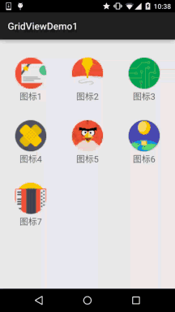

## 一、本节引言：
本节给大家介绍的是第二个Adapter类的控件——GridView(网格视图)，见名知义，ListView是列表， GridView就是显示网格！他和ListView一样是AbsListView的子类！很多东西和ListView都是相通的， 本节我们就来学习他的基本用法~


## 二、相关属性：
下面是GridView中的一些属性：

- `android:columnWidth`：设置列的宽度
- `android:gravity`：组件对其方式
- `android:horizontalSpacing`：水平方向每个单元格的间距
- `android:verticalSpacing`：垂直方向每个单元格的间距
- `android:numColumns`：设置列数
- `android:stretchMode`：设置拉伸模式，可选值如下： `none`：不拉伸；`spacingWidth`：拉伸元素间的间隔空隙`columnWidth`：仅仅拉伸表格元素自身 `spacingWidthUniform`：既拉元素间距又拉伸他们之间的间隔空袭


## 三、使用示例：
下面通过一个简单的例子来熟悉这个控件的使用： (这里用的Adapter我们直接用之2.5.0中教大家写的可复用的BaseAdapter~)

实现的效果图：



代码实现：

首先是GridView 的 Item的布局：`item_grid_icon.xml`:
```xml
<?xml version="1.0" encoding="utf-8"?>
<RelativeLayout xmlns:android="http://schemas.android.com/apk/res/android"
    android:layout_width="match_parent"
    android:layout_height="match_parent"
    android:padding="5dp">

    <ImageView
        android:id="@+id/img_icon"
        android:layout_width="64dp"
        android:layout_height="64dp"
        android:layout_centerInParent="true"
        android:src="@mipmap/iv_icon_1" />

    <TextView
        android:id="@+id/txt_icon"
        android:layout_width="wrap_content"
        android:layout_height="wrap_content"
        android:layout_below="@id/img_icon"
        android:layout_centerHorizontal="true"
        android:layout_marginTop="30dp"
        android:text="呵呵"
        android:textSize="18sp" />
        
</RelativeLayout>
```

接着我们写个entity实体类：Icon.java：
```java
/**
 * Created by Jay on 2015/9/24 0024.
 */
public class Icon {
    private int iId;
    private String iName;

    public Icon() {
    }

    public Icon(int iId, String iName) {
        this.iId = iId;
        this.iName = iName;
    }

    public int getiId() {
        return iId;
    }

    public String getiName() {
        return iName;
    }

    public void setiId(int iId) {
        this.iId = iId;
    }

    public void setiName(String iName) {
        this.iName = iName;
    }
}
```

最后是MainActivity的布局以及Java代码
`activity_main.xml：`
```xml
<RelativeLayout xmlns:android="http://schemas.android.com/apk/res/android"
    xmlns:tools="http://schemas.android.com/tools"
    android:layout_width="match_parent"
    android:layout_height="match_parent"
    android:padding="5dp"
    tools:context=".MainActivity">
    
    <!--numColumns设置每行显示多少个-->
    <GridView
        android:id="@+id/grid_photo"
        android:layout_width="match_parent"
        android:layout_height="match_parent"
        android:numColumns="3" />

</RelativeLayout>
```

`MainActivity.java：`
```java
public class MainActivity extends AppCompatActivity {

    private Context mContext;
    private GridView grid_photo;
    private BaseAdapter mAdapter = null;
    private ArrayList<Icon> mData = null;

    @Override
    protected void onCreate(Bundle savedInstanceState) {
        super.onCreate(savedInstanceState);
        setContentView(R.layout.activity_main);
        mContext = MainActivity.this;
        grid_photo = (GridView) findViewById(R.id.grid_photo);

        mData = new ArrayList<Icon>();
        mData.add(new Icon(R.mipmap.iv_icon_1, "图标1"));
        mData.add(new Icon(R.mipmap.iv_icon_2, "图标2"));
        mData.add(new Icon(R.mipmap.iv_icon_3, "图标3"));
        mData.add(new Icon(R.mipmap.iv_icon_4, "图标4"));
        mData.add(new Icon(R.mipmap.iv_icon_5, "图标5"));
        mData.add(new Icon(R.mipmap.iv_icon_6, "图标6"));
        mData.add(new Icon(R.mipmap.iv_icon_7, "图标7"));

        mAdapter = new MyAdapter<Icon>(mData, R.layout.item_grid_icon) {
            @Override
            public void bindView(ViewHolder holder, Icon obj) {
                holder.setImageResource(R.id.img_icon, obj.getiId());
                holder.setText(R.id.txt_icon, obj.getiName());
            }
        };

        grid_photo.setAdapter(mAdapter);

        grid_photo.setOnItemClickListener(new AdapterView.OnItemClickListener() {
            @Override
            public void onItemClick(AdapterView<?> parent, View view, int position, long id) {
                Toast.makeText(mContext, "你点击了~" + position + "~项", Toast.LENGTH_SHORT).show();
            }
        });

    }
}
```

嗯，代码非常简单~


## 四、示例代码下载：
[GridViewDemo1.zip](../img/GridViewDemo1.zip)


## 五、本节小结：
本节给大家介绍了第二个需要使用Adapter的UI控件——网格视图GridView，用法很简单~ 大家可以根据自己的需求进行扩展，比如用GridView显示手机相册~嗯，就说这么多， 谢谢~