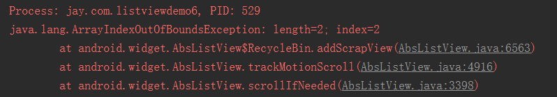

## 一、本节引言：
本节是ListView这个小节的最后一节，给大家带来的是ListView多布局Item的实现， 何为ListView Item多布局，打个比方，QQ这种聊天列表：


假如他是用一个ListView做的，那么一个ListView上不就有两种不同的Item咯！ 一左一右，嘿嘿，本节就来教大家如何实现ListView的多布局！


## 二、要点讲解：
重写getItemViewType()方法对应View是哪个类别，以及getViewTypeCount()方法iew返回 总共多少个类别！然后再getView那里调用getItemViewType获得对应类别，再加载对应的View！


## 三、代码实现：
这里的话直接用上一节的两个布局，然后另外写一个Adapter重写要点中的几个几个地方：

`MutiLayoutAdapter.java：`
```java
/**
 * Created by Jay on 2015/9/23 0023.
 */
public class MutiLayoutAdapter extends BaseAdapter{

    //定义两个类别标志
    private static final int TYPE_BOOK = 0;
    private static final int TYPE_APP = 1;
    private Context mContext;
    private ArrayList<Object> mData = null;


    public MutiLayoutAdapter(Context mContext,ArrayList<Object> mData) {
        this.mContext = mContext;
        this.mData = mData;
    }

    @Override
    public int getCount() {
        return mData.size();
    }

    @Override
    public Object getItem(int position) {
        return mData.get(position);
    }

    @Override
    public long getItemId(int position) {
        return position;
    }

    //多布局的核心，通过这个判断类别
    @Override
    public int getItemViewType(int position) {
        if (mData.get(position) instanceof App) {
            return TYPE_APP;
        } else if (mData.get(position) instanceof Book) {
            return TYPE_BOOK;
        } else {
            return super.getItemViewType(position);
        }
    }

    //类别数目
    @Override
    public int getViewTypeCount() {
        return 2;
    }


    @Override
    public View getView(int position, View convertView, ViewGroup parent) {
        int type = getItemViewType(position);
        ViewHolder1 holder1 = null;
        ViewHolder2 holder2 = null;
        if(convertView == null){
           switch (type){
               case TYPE_APP:
                   holder1 = new ViewHolder1();
                   convertView = LayoutInflater.from(mContext).inflate(R.layout.item_one, parent, false);
                   holder1.img_icon = (ImageView) convertView.findViewById(R.id.img_icon);
                   holder1.txt_aname = (TextView) convertView.findViewById(R.id.txt_aname);
                   convertView.setTag(R.id.Tag_APP,holder1);
                   break;
               case TYPE_BOOK:
                   holder2 = new ViewHolder2();
                   convertView = LayoutInflater.from(mContext).inflate(R.layout.item_two, parent, false);
                   holder2.txt_bname = (TextView) convertView.findViewById(R.id.txt_bname);
                   holder2.txt_bauthor = (TextView) convertView.findViewById(R.id.txt_bauthor);
                   convertView.setTag(R.id.Tag_Book,holder2);
                   break;
           }
        }else{
            switch (type){
                case TYPE_APP:
                    holder1 = (ViewHolder1) convertView.getTag(R.id.Tag_APP);
                    break;
                case TYPE_BOOK:
                    holder2 = (ViewHolder2) convertView.getTag(R.id.Tag_Book);
                    break;
            }
        }

        Object obj = mData.get(position);
        //设置下控件的值
        switch (type){
            case TYPE_APP:
                App app = (App) obj;
                if(app != null){
                    holder1.img_icon.setImageResource(app.getaIcon());
                    holder1.txt_aname.setText(app.getaName());
                }
                break;
            case TYPE_BOOK:
                Book book = (Book) obj;
                if(book != null){
                    holder2.txt_bname.setText(book.getbName());
                    holder2.txt_bauthor.setText(book.getbAuthor());
                }
                break;
        }
        return convertView;
    }


    //两个不同的ViewHolder
    private static class ViewHolder1{
        ImageView img_icon;
        TextView txt_aname;
    }

    private static class ViewHolder2{
        TextView txt_bname;
        TextView txt_bauthor;
    }
}
```

这里有个地方要注意的，convertView.setTag(R.id.Tag_APP,holder1);我们平时都直接 setTag(Object)的，这个是setTag的重载方法，参数是一个唯一的key以及后面的一个对象！ 唯一！！！我一开始直接把TYPE_BOOK作为第一个参数，然后就报下面这个错误：


`The key must be an application-specific resource id` 就是前面这个要唯一，定义一个final类型的int变量和硬编码一个值的方式都是行不通的 这里的做法是直接在strings.xml中添加：
```xml
<item name="Tag_APP" type="id"></item>
<item name="Tag_Book" type="id"></item>
```

当然你也可以在res/values/下另外创建一个ids.xml文件，把上面这段代码贴上去！ 除了这个还有一个要注意的地方，就是这个区分类别的标志要从0开始算，不然会报下面 这样的错误：


```java
MainActivity.java：

public class MainActivity extends AppCompatActivity {

    private static final int TYPE_BOOK = 0;
    private static final int TYPE_APP = 1;
    private ListView list_content;
    private ArrayList<Object> mData = null;
    private MutiLayoutAdapter myAdapter = null;

    @Override
    protected void onCreate(Bundle savedInstanceState) {
        super.onCreate(savedInstanceState);
        setContentView(R.layout.activity_main);

        //数据准备：
        mData = new ArrayList<Object>();
        for(int i = 0;i < 20;i++){
            switch ((int)(Math.random() * 2)){
                case TYPE_BOOK:
                    mData.add(new Book("《第一行代码》","郭霖"));
                    break;
                case TYPE_APP:
                    mData.add(new App(R.mipmap.iv_icon_baidu,"百度"));
                    break;
            }
        }

        list_content = (ListView) findViewById(R.id.list_content);
        myAdapter = new MutiLayoutAdapter(MainActivity.this,mData);
        list_content.setAdapter(myAdapter);
    }
}
```

上面随机生成0和1，0就往集合中添加一个Book的对象，1的话就添加一个App的对象！


## 四、代码下载：
[ListViewDemo6.zip](../img/ListViewDemo6.zip)


## 五、本节小结：
好的，本节给大家讲解了ListView Item多布局的实现，就是两个方法的重写， 然后getView()做下判断，设置不同的布局而已~代码非常简单~

关于ListView的知识就告一段落吧，当然ListView的知识并不止这些， 异步加载，优化等等，这些我们都会在进阶部分进行学习~就说这么多，谢谢~