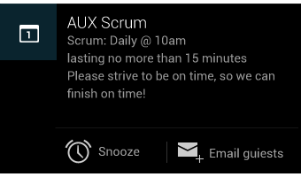
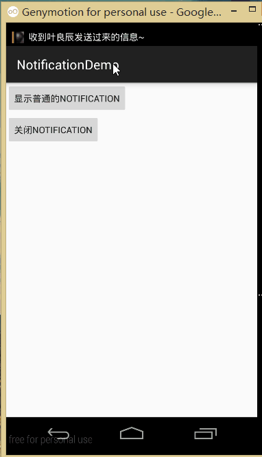

## 一、本节引言：
本节带来的是Android中用于在状态栏显示通知信息的控件：Notification，相信大部分 学Android都对他都很熟悉，而网上很多关于Notification的使用教程都是基于2.x的，而 现在普遍的Android设备基本都在4.x以上，甚至是5.0以上的都有；他们各自的Notification 都是不一样的！而本节给大家讲解的是基于4.x以上的Notification，而5.0以上的Notification 我们会在进阶教程的Android 5.0新特性的章节进行讲解~

官方文档对Notification的一些介绍：

**设计思想**：[Notifications in Android 4.4 and Lower](http://developer.android.com/design/patterns/notifications_k.html)

**译文**：[通知](http://adchs.github.io/patterns/notifications.html)

**API文档**：[Notification](http://developer.android.com/reference/android/app/Notification.html)

访问上述网站，可能需要梯子哦~


## 二、设计文档部分解读
### 1）Notification的基本布局


上面的组成元素依次是：

- `Icon/Photo`：大图标
- `Title/Name`：标题
- `Message`：内容信息
- `Timestamp`：通知时间，默认是系统发出通知的时间，也可以通过setWhen()来设置
- `Secondary Icon`：小图标
- `内容文字`，在小图标的左手边的一个文字


### 2）扩展布局
在 Jelly Bean 中你可以为通知提供更多事件的细节。你可以通过扩展布局显示消息的前几行或者图片的预览。这样用户可以看多更多的内容 - 有时甚至可以看到整个消息。用户可以通过 pinch-zoom 或者双手指滑动来打开扩展布局。Android 为单条消息提供了两种扩展布局 (文字和图像) 供你开发应用时使用。




关于其他一些设计的东西，就不一一提及了，有兴趣的自行查看上面提供的API文档，知道下 这个Notification在4.x以上的版本可以多种多样就好！我们更多的时候关注的是 如何写代码使用这个东西，下面我们就来学习下Notification的用法！


## 三、Notification的基本使用流程
状态通知栏主要涉及到2个类：Notification 和NotificationManager

`Notification`：通知信息类，它里面对应了通知栏的各个属性

`NotificationManager`：是状态栏通知的管理类，负责发通知、清除通知等操作。

使用的基本流程：

- `Step 1`. 获得NotificationManager对象： NotificationManager mNManager = (NotificationManager) getSystemService(NOTIFICATION_SERVICE);
- `Step 2`. 创建一个通知栏的Builder构造类： Notification.Builder mBuilder = new Notification.Builder(this);
- `Step 3`. 对Builder进行相关的设置，比如标题，内容，图标，动作等！
- `Step 4`. 调用Builder的build()方法为notification赋值
- `Step 5`. 调用NotificationManager的notify()方法发送通知！
- `PS`:另外我们还可以调用NotificationManager的cancel()方法取消通知


## 四、设置相关的一些方法：
Notification.Builder mBuilder = new Notification.Builder(this);

后再调用下述的相关的方法进行设置：(官方API文档：Notification.Builder) 常用的方法如下：

- `setContentTitle(CharSequence)`：设置标题
- `setContentText(CharSequence)`：设置内容
- `setSubText(CharSequence)`：设置内容下面一小行的文字
- `setTicker(CharSequence)`：设置收到通知时在顶部显示的文字信息
- `setWhen(long)`：设置通知时间，一般设置的是收到通知时的System.currentTimeMillis()
- `setSmallIcon(int)`：设置右下角的小图标，在接收到通知的时候顶部也会显示这个小图标
- `setLargeIcon(Bitmap)`：设置左边的大图标
- `setAutoCancel(boolean)`：用户点击Notification面板后是否让通知取消(默认不取消)
- `setDefaults(int)`：向通知添加声音、闪灯和振动效果的最简单、 使用默认（defaults）属性，可以组合多个属性，
`Notification.DEFAULT_VIBRATE`(添加默认震动提醒)；
`Notification.DEFAULT_SOUND`(添加默认声音提醒)；
`Notification.DEFAULT_LIGHTS`(添加默认三色灯提醒)
`Notification.DEFAULT_ALL`(添加默认以上3种全部提醒)
- `setVibrate(long[])`：设置振动方式，比如：
`setVibrate(new long[] {0,300,500,700})`;延迟0ms，然后振动300ms，在延迟500ms， 接着再振动700ms，关于Vibrate用法后面会讲解！
- `setLights(int argb, int onMs, int offMs)`：设置三色灯，参数依次是：灯光颜色， 亮持续时间，暗的时间，不是所有颜色都可以，这跟设备有关，有些手机还不带三色灯； 另外，还需要为Notification设置flags为Notification.FLAG_SHOW_LIGHTS才支持三色灯提醒！
- `setSound(Uri)`：设置接收到通知时的铃声，可以用系统的，也可以自己设置，例子如下:
.setDefaults(Notification.DEFAULT_SOUND) //获取默认铃声
.setSound(Uri.parse("file:///sdcard/xx/xx.mp3")) //获取自定义铃声
.setSound(Uri.withAppendedPath(Audio.Media.INTERNAL_CONTENT_URI, "5")) //获取Android多媒体库内的铃声

- `setOngoing(boolean)`：设置为ture，表示它为一个正在进行的通知。他们通常是用来表示 一个后台任务,用户积极参与(如播放音乐)或以某种方式正在等待,因此占用设备(如一个文件下载, 同步操作,主动网络连接)

- `setProgress(int,int,boolean)`：设置带进度条的通知 参数依次为：进度条最大数值，当前进度，进度是否不确定 如果为确定的进度条：调用setProgress(max, progress, false)来设置通知， 在更新进度的时候在此发起通知更新progress，并且在下载完成后要移除进度条 ，通过调用setProgress(0, 0, false)既可。如果为不确定（持续活动）的进度条， 这是在处理进度无法准确获知时显示活动正在持续，所以调用setProgress(0, 0, true) ，操作结束时，调用setProgress(0, 0, false)并更新通知以移除指示条
- `setContentIntent(PendingIntent)`：PendingIntent和Intent略有不同，它可以设置执行次数， 主要用于远程服务通信、闹铃、通知、启动器、短信中，在一般情况下用的比较少。比如这里通过 Pending启动Activity：getActivity(Context, int, Intent, int)，当然还可以启动Service或者Broadcast PendingIntent的位标识符(第四个参数)：
`FLAG_ONE_SHOT` 表示返回的PendingIntent仅能执行一次，执行完后自动取消
`FLAG_NO_CREATE` 表示如果描述的PendingIntent不存在，并不创建相应的PendingIntent，而是返回NULL
`FLAG_CANCEL_CURRENT` 表示相应的PendingIntent已经存在，则取消前者，然后创建新的PendingIntent， 这个有利于数据保持为最新的，可以用于即时通信的通信场景
`FLAG_UPDATE_CURRENT` 表示更新的PendingIntent

使用示例：
```java
//点击后跳转Activity
Intent intent = new Intent(context,XXX.class);  
PendingIntent pendingIntent = PendingIntent.getActivity(context, 0, intent, 0);  
mBuilder.setContentIntent(pendingIntent)  
```

- `setPriority(int)`：设置优先级：

|优先级	|用户                                                                                                                                                                                                   |
|-------|---------------------------------------------------------------------------------|
|MAX	|重要而紧急的通知，通知用户这个事件是时间上紧迫的或者需要立即处理的。                                                                           |
|HIGH	|高优先级用于重要的通信内容，例如短消息或者聊天，这些都是对用户来说比较有兴趣的。                                                     |
|DEFAULT|默认优先级用于没有特殊优先级分类的通知。                                                                                                                                |
|LOW	|低优先级可以通知用户但又不是很紧急的事件。                                                                                                                            |
|MIN	|用于后台消息 (例如天气或者位置信息)。最低优先级通知将只在状态栏显示图标，只有用户下拉通知抽屉才能看到内容。  |

对应属性：Notification.PRIORITY_HIGH...


## 五、代码示例：最常见的Notification：
下面我们来写一个最简单的例子来体验下Notification的用法：

运行效果图：



关键代码：

这里直接贴MainActivity.java的代码：
```java
public class MainActivity extends AppCompatActivity implements View.OnClickListener {

    private Context mContext;
    private NotificationManager mNManager;
    private Notification notify1;
    Bitmap LargeBitmap = null;
    private static final int NOTIFYID_1 = 1;

    private Button btn_show_normal;
    private Button btn_close_normal;


    @Override
    protected void onCreate(Bundle savedInstanceState) {
        super.onCreate(savedInstanceState);
        setContentView(R.layout.activity_main);
        mContext = MainActivity.this;
        //创建大图标的Bitmap
        LargeBitmap = BitmapFactory.decodeResource(getResources(), R.mipmap.iv_lc_icon);
        mNManager = (NotificationManager) getSystemService(NOTIFICATION_SERVICE);
        bindView();

    }


    private void bindView() {
        btn_show_normal = (Button) findViewById(R.id.btn_show_normal);
        btn_close_normal = (Button) findViewById(R.id.btn_close_normal);
        btn_show_normal.setOnClickListener(this);
        btn_close_normal.setOnClickListener(this);
    }


    @Override
    public void onClick(View v) {
        switch (v.getId()) {
            case R.id.btn_show_normal:
                //定义一个PendingIntent点击Notification后启动一个Activity
                Intent it = new Intent(mContext, OtherActivity.class);
                PendingIntent pit = PendingIntent.getActivity(mContext, 0, it, 0);

                //设置图片,通知标题,发送时间,提示方式等属性
                Notification.Builder mBuilder = new Notification.Builder(this);
                mBuilder.setContentTitle("叶良辰")                        //标题
                        .setContentText("我有一百种方法让你呆不下去~")      //内容
                        .setSubText("——记住我叫叶良辰")                    //内容下面的一小段文字
                        .setTicker("收到叶良辰发送过来的信息~")             //收到信息后状态栏显示的文字信息
                        .setWhen(System.currentTimeMillis())           //设置通知时间
                        .setSmallIcon(R.mipmap.ic_lol_icon)            //设置小图标
                        .setLargeIcon(LargeBitmap)                     //设置大图标
                        .setDefaults(Notification.DEFAULT_LIGHTS | Notification.DEFAULT_VIBRATE)    //设置默认的三色灯与振动器
                        .setSound(Uri.parse("android.resource://" + getPackageName() + "/" + R.raw.biaobiao))  //设置自定义的提示音
                        .setAutoCancel(true)                           //设置点击后取消Notification
                        .setContentIntent(pit);                        //设置PendingIntent
                notify1 = mBuilder.build();
                mNManager.notify(NOTIFYID_1, notify1);
                break;

            case R.id.btn_close_normal:
                //除了可以根据ID来取消Notification外,还可以调用cancelAll();关闭该应用产生的所有通知
                mNManager.cancel(NOTIFYID_1);                          //取消Notification
                break;

        }
    }
}
```

注释很详细，就不一一细讲了~


## 六、代码示例下载：
[NotificationDemo.zip](../img/NotificationDemo.zip)


## 七、本节小结：
好的，本节给大家介绍了Notification在4.x版本的基本用法，非常简单是吧~
当然你也可以自定义Notification有兴趣的可以自己查阅相关资料，这里就不慢慢 研究了~对了，本节部分内容参考的下述blog，贴下链接，大家也可以去看下： [Android 通知栏Notification的整合 全面学习 （一个DEMO让你完全了解它）](http://blog.csdn.net/vipzjyno1/article/details/25248021) 写得蛮详细的~本节就到这里，谢谢~