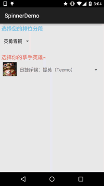

## 一、本节引言：
本来本节是想给大家介绍一个Gallery(画廊)的一个控件的，后来想想还是算了，因为 在Android 4.1后就已经被弃用了，尽管我们可以通过兼容不来使用Gallery，不过想想 还是算了，因为Gallery在每次切换图片的时候，都需要重新创建视图，这样无疑会造成 很大资源浪费！我们可以通过其他方法来实现Gallery效果，比如通过HorizontalScrollView 来实现水平滚动效果，或者编写一个水平方向的ListView~有兴趣自己谷歌！

本节学习的是一个叫做Spinner的Adapter控件！ 应用场景：当我们的app需要用户输入数据时，除了让用户自己打字以外，还有一种比较贴心的设计: 列出一组选项让用户从中挑选，从而方便了我们的用户！ 话不多说，开始学习Spinner的基本用法~


## 二、相关属性
- `android:dropDownHorizontalOffset`：设置列表框的水平偏移距离
- `android:dropDownVerticalOffset`：设置列表框的水平竖直距离
- `android:dropDownSelector`：列表框被选中时的背景
- `android:dropDownWidth`：设置下拉列表框的宽度
- `android:gravity`：设置里面组件的对其方式
- `android:popupBackground`：设置列表框的背景
- `android:prompt`：设置对话框模式的列表框的提示信息(标题)，只能够引用string.xml 中的资源id,而不能直接写字符串
- `android:spinnerMode`：列表框的模式，有两个可选值： `dialog`：对话框风格的窗口 `dropdown`：下拉菜单风格的窗口(默认)
- 可选属性：`android:entries`：使用数组资源设置下拉列表框的列表项目


## 三、使用示例：
对了，Spinner会默认选中第一个值，就是默认调用spinner.setSection(0), 你可以通过这个设置默认的选中值，另外，会触发一次OnItemSelectedListener 事件，暂时没找到解决方法，下面折衷的处理是：添加一个boolean值，然后设置 为false，在onItemSelected时进行判断，false说明是默认触发的，不做任何操作 将boolean值设置为true；true的话则正常触发事件！ 示例中写了两个不同的Spinner，从数据源，列表框风格等进行对比~ 接下来我们来看下

效果图：



代码实现：

这里依然使用的我们前面的可复用BaseAdapter：

第一个Spinner的数据源编写：

在`res/values`下编写一个：`myarrays.xml`的文件，内容如下：
```xml
<?xml version="1.0" encoding="utf-8"?>
<resources>
    <string-array name="data">
        <item>英勇青铜</item>
        <item>不屈白银</item>
        <item>荣耀黄金</item>
        <item>华贵铂金</item>
        <item>璀璨钻石</item>
        <item>超凡大师</item>
        <item>最强王者</item>
    </string-array>
</resources>
```

接着是第二个Spinner的布局：`item_spin_hero.xml`：
```xml
<?xml version="1.0" encoding="utf-8"?>
<LinearLayout xmlns:android="http://schemas.android.com/apk/res/android"
    android:layout_width="match_parent"
    android:layout_height="match_parent"
    android:orientation="horizontal"
    android:padding="5dp">

    <ImageView
        android:id="@+id/img_icon"
        android:layout_width="48dp"
        android:layout_height="48dp"
        android:src="@mipmap/iv_lol_icon1" />

    <TextView
        android:id="@+id/txt_name"
        android:layout_width="wrap_content"
        android:layout_height="wrap_content"
        android:layout_marginLeft="10dp"
        android:layout_marginTop="15dp"
        android:text="德玛西亚"
        android:textSize="16sp" />

</LinearLayout>
```

再接着编写一个Entitiy实体类：`Hero.java`：
```java
/**
 * Created by Jay on 2015/9/24 0024.
 */
public class Hero {

    private int hIcon;
    private String hName;

    public Hero() {
    }

    public Hero(int hIcon, String hName) {
        this.hIcon = hIcon;
        this.hName = hName;
    }

    public int gethIcon() {
        return hIcon;
    }

    public String gethName() {
        return hName;
    }

    public void sethIcon(int hIcon) {
        this.hIcon = hIcon;
    }

    public void sethName(String hName) {
        this.hName = hName;
    }
}
```

最后是MainActivity的布局与Java代码部分：

布局文件：`activity_main.xml`：
```xml
<LinearLayout xmlns:android="http://schemas.android.com/apk/res/android"
    xmlns:tools="http://schemas.android.com/tools"
    android:layout_width="match_parent"
    android:layout_height="match_parent"
    android:orientation="vertical"
    android:padding="5dp"
    tools:context=".MainActivity">
    
    <TextView
        android:layout_width="wrap_content"
        android:layout_height="wrap_content"
        android:text="选择您的排位分段"
        android:textColor="#44BDED"
        android:textSize="18sp" />

    <Spinner
        android:id="@+id/spin_one"
        android:layout_width="100dp"
        android:layout_height="64dp"
        android:entries="@array/data"
        android:prompt="@string/spin_title"
        android:spinnerMode="dialog" />

    <TextView
        android:layout_width="wrap_content"
        android:layout_height="wrap_content"
        android:layout_marginTop="10dp"
        android:text="选择你的拿手英雄~"
        android:textColor="#F5684A"
        android:textSize="18sp" />

    <Spinner
        android:id="@+id/spin_two"
        android:layout_width="wrap_content"
        android:layout_height="64dp" />

</LinearLayout>
```

`MainActivity.java：`
```java
public class MainActivity extends AppCompatActivity implements AdapterView.OnItemSelectedListener {

    private Spinner spin_one;
    private Spinner spin_two;
    private Context mContext;
    //判断是否为刚进去时触发onItemSelected的标志
    private boolean one_selected = false;
    private boolean two_selected = false;
    private ArrayList<Hero> mData = null;
    private BaseAdapter myAdadpter = null;

    @Override
    protected void onCreate(Bundle savedInstanceState) {
        super.onCreate(savedInstanceState);
        setContentView(R.layout.activity_main);
        mContext = MainActivity.this;
        mData = new ArrayList<Hero>();
        bindViews();
    }


    private void bindViews() {
        spin_one = (Spinner) findViewById(R.id.spin_one);
        spin_two = (Spinner) findViewById(R.id.spin_two);

        mData.add(new Hero(R.mipmap.iv_lol_icon1,"迅捷斥候：提莫（Teemo）"));
        mData.add(new Hero(R.mipmap.iv_lol_icon2,"诺克萨斯之手：德莱厄斯（Darius）"));
        mData.add(new Hero(R.mipmap.iv_lol_icon3,"无极剑圣：易（Yi）"));
        mData.add(new Hero(R.mipmap.iv_lol_icon4,"德莱厄斯：德莱文（Draven）"));
        mData.add(new Hero(R.mipmap.iv_lol_icon5,"德邦总管：赵信（XinZhao）"));
        mData.add(new Hero(R.mipmap.iv_lol_icon6,"狂战士：奥拉夫（Olaf）"));

        myAdadpter = new MyAdapter<Hero>(mData,R.layout.item_spin_hero) {
            @Override
            public void bindView(ViewHolder holder, Hero obj) {
                holder.setImageResource(R.id.img_icon,obj.gethIcon());
                holder.setText(R.id.txt_name, obj.gethName());
            }
        };
        spin_two.setAdapter(myAdadpter);
        spin_one.setOnItemSelectedListener(this);
        spin_two.setOnItemSelectedListener(this);

    }


    @Override
    public void onItemSelected(AdapterView<?> parent, View view, int position, long id) {
        switch (parent.getId()){
            case R.id.spin_one:
                if(one_selected){
                    Toast.makeText(mContext,"您的分段是~：" + parent.getItemAtPosition(position).toString(),
                            Toast.LENGTH_SHORT).show();
                }else one_selected = true;
                break;
            case R.id.spin_two:
                if(two_selected){
                    TextView txt_name = (TextView) view.findViewById(R.id.txt_name);
                    Toast.makeText(mContext,"您选择的英雄是~：" + txt_name.getText().toString(),
                            Toast.LENGTH_SHORT).show();
                }else two_selected = true;
                break;
        }
    }

    @Override
    public void onNothingSelected(AdapterView<?> parent) {

    }
}
```

另外关于Spinner的OnItemSelectedListener，以及如何获得选中项的值，就自己看上面的 代码啦~


## 四、代码示例下载：
[SpinnerDemo.zip](../img/SpinnerDemo.zip)


## 五、本节小结
好的，本节给大家介绍了Spinner(下拉选项框)的使用，例子还是蛮有趣的，哈哈~！ 别问我哪个区什么段位，我可是人机小王子，可惜一直在青铜分段苦苦挣扎~ 你知道为什么的，好吧，本节就到这里~