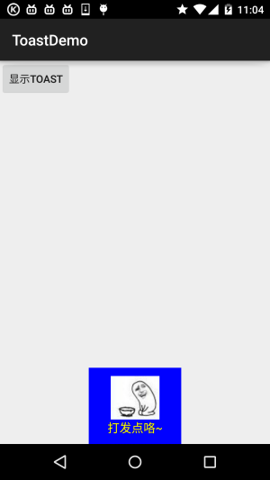
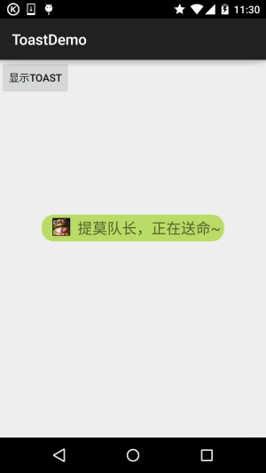

## 一、本节引言：
好的，终于学习完Adapter类相关的一些控件，当然除了讲解的那几个，还有其他很多的 相关的控件，就不慢慢讲解了~有需要的自行查阅文档，查看相关的用法，本节带来的是： Android用于提示信息的一个控件——Toast(吐司)！Toast是一种很方便的消息提示框,会在 屏幕中显示一个消息提示框,没任何按钮,也不会获得焦点一段时间过后自动消失！ 非常常用！本节我们就来学习Toast的使用！


## 二、直接调用Toast类的makeText()方法创建
这是我们用的最多的一种形式了！比如点击一个按钮，然后弹出Toast，用法： `Toast.makeText(MainActivity.this, "提示的内容", Toast.LENGTH_LONG).show()`; 第一个是上下文对象！第二个是显示的内容！第三个是显示的时间，只有LONG和SHORT两种 会生效，即使你定义了其他的值，最后调用的还是这两个！

另外Toast是非常常用的，我们可以把这些公共的部分抽取出来，写到一个方法里！ 需要显示Toast的时候直接调用这个方法就可以显示Toast，这样方便很多！ 示例如下：

```java
void midToast(String str, int showTime){
    Toast toast = Toast.makeText(global_context, str, showTime);            
    toast.setGravity(Gravity.CENTER_VERTICAL|Gravity.CENTER_HORIZONTAL , 0, 0);  //设置显示位置
    TextView v = (TextView) toast.getView().findViewById(android.R.id.message);
    v.setTextColor(Color.YELLOW);     //设置字体颜色
    toast.show();   
}
```

上面这个抽取出来的方法，我们发现我们可以调用setGravity设置Toast显示的位置以及 通过findViewById(android.R.id.message)获得显示的文本，然后进行颜色、大小等设置！


## 三、通过构造方法来定制Toast：
上面定制了文本，以及显示位置，下面我们写两个简单的例子：

### 1.定义一个带有图片的Toast
效果图：



关键代码：
```java
private void midToast(String str, int showTime){
    Toast toast = Toast.makeText(mContext, str, showTime);
    toast.setGravity(Gravity.CENTER_HORIZONTAL|Gravity.BOTTOM , 0, 0);  //设置显示位置
    LinearLayout layout = (LinearLayout) toast.getView();
    layout.setBackgroundColor(Color.BLUE);
    ImageView image = new ImageView(this);
    image.setImageResource(R.mipmap.ic_icon_qitao);
    layout.addView(image, 0);
    TextView v = (TextView) toast.getView().findViewById(android.R.id.message);
    v.setTextColor(Color.YELLOW);     //设置字体颜色
    toast.show();
}
```


### 2.Toast完全自定义
如果上面的那种还满足不了你的话，那么你完全可以自己写一个Toast的布局，然后显示出来； 但是时间我们依旧控制不了！

运行效果图：



关键代码：
```java
private void midToast(String str, int showTime){
    LayoutInflater inflater = getLayoutInflater();
    View view = inflater.inflate(R.layout.view_toast_custom,
            (ViewGroup) findViewById(R.id.lly_toast));
    ImageView img_logo = (ImageView) view.findViewById(R.id.img_logo);
    TextView tv_msg = (TextView) view.findViewById(R.id.tv_msg);
    tv_msg.setText(str);
    Toast toast = new Toast(mContext);
    toast.setGravity(Gravity.CENTER, 0, 0);
    toast.setDuration(Toast.LENGTH_LONG);
    toast.setView(view);
    toast.show();
}
```

还有自定义Toast的布局以及圆角背景：

圆角背景：`bg_toast.xml：`
```xml
<?xml version="1.0" encoding="utf-8"?>
<shape xmlns:android="http://schemas.android.com/apk/res/android">
    <!-- 设置透明背景色 -->
    <solid android:color="#BADB66" />
    <!-- 设置一个黑色边框 -->
    <stroke
        android:width="1px"
        android:color="#FFFFFF" />
    <!-- 设置四个圆角的半径 -->
    <corners
        android:bottomLeftRadius="50px"
        android:bottomRightRadius="50px"
        android:topLeftRadius="50px"
        android:topRightRadius="50px" />
    <!-- 设置一下边距,让空间大一点 -->
    <padding
        android:bottom="5dp"
        android:left="5dp"
        android:right="5dp"
        android:top="5dp" />
</shape>  
```

布局文件：`view_toast_custom.xml：`
```xml
<?xml version="1.0" encoding="utf-8"?>
<LinearLayout xmlns:android="http://schemas.android.com/apk/res/android"
    android:id="@+id/lly_toast"
    android:layout_width="match_parent"
    android:layout_height="match_parent"
    android:background="@drawable/bg_toast"
    android:orientation="horizontal">

    <ImageView
        android:id="@+id/img_logo"
        android:layout_width="24dp"
        android:layout_height="24dp"
        android:layout_marginLeft="10dp"
        android:src="@mipmap/iv_lol_icon1" />

    <TextView
        android:id="@+id/tv_msg"
        android:layout_width="match_parent"
        android:layout_height="wrap_content"
        android:layout_marginLeft="10dp"
        android:textSize="20sp" />

</LinearLayout>
```

非常简单，嘿嘿~


## 四、示例代码下载
[ToastDemo.zip](../img/ToastDemo.zip)


## 五、本节小结：
好的，本节给大家讲解了Toast的基本使用，以及如何自定义Toast，非常简单，大家可以在实际开发中对自己的Toast进行定制~